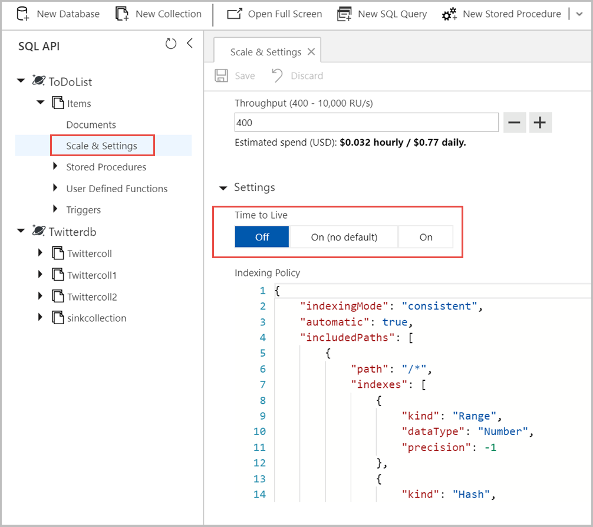

# Configure time to live in Azure Cosmos DB

In Azure Cosmos DB, you can choose to configure Time to Live (TTL) at the container level, or you can override it at an item level after setting for the container. You can configure TTL for a container by using Azure portal or the language-specific SDKs. Item level TTL overrides can be configured by using the SDKs.

## Enable time to live on a container using Azure portal

Use the following steps to enable time to live on a container with no expiration. Enable this to allow TTL to be overridden at the item level. You can also set the TTL by entering a non-zero value for seconds.

1. Sign in to the [Azure portal](https://portal.azure.com/).

2. Create a new Azure Cosmos account or select an existing account.

3. Open the **Data Explorer** pane.

4. Select an existing container, expand it and modify the following values:

   * Open the **Scale & Settings** window.
   * Under **Setting** find, **Time to Live**.
   * Select **On (no default)** or select **On** and set a TTL value
   * Click **Save** to save the changes.

   

* When DefaultTimeToLive is null then your Time to Live is Off
* When DefaultTimeToLive is -1 then your Time to Live setting is On (No default)
* When DefaultTimeToLive has any other Int value (except 0) your Time to Live setting is On

## Enable time to live on a container using Azure CLI or PowerShell

To create or enable TTL on a container see,

* [Create a container with TTL using Azure CLI](manage-with-cli.md#create-a-container-with-ttl)
* [Create a container with TTL using PowerShell](manage-with-powershell.md#create-container-unique-key-ttl)

## Enable time to live on a container using SDK

### <a id="dotnet-enable-noexpiry"></a> .NET SDK

# [.NET SDK V2](#tab/dotnetv2)

.NET SDK V2 (Microsoft.Azure.DocumentDB)

```csharp
// Create a new container with TTL enabled and without any expiration value
DocumentCollection collectionDefinition = new DocumentCollection();
collectionDefinition.Id = "myContainer";
collectionDefinition.PartitionKey.Paths.Add("/myPartitionKey");
collectionDefinition.DefaultTimeToLive = -1; //(never expire by default)

DocumentCollection ttlEnabledCollection = await client.CreateDocumentCollectionAsync(
    UriFactory.CreateDatabaseUri("myDatabaseName"),
    collectionDefinition);
```

# [.NET SDK V3](#tab/dotnetv3)

.NET SDK V3 (Microsoft.Azure.Cosmos)

```csharp
// Create a new container with TTL enabled and without any expiration value
await client.GetDatabase("database").CreateContainerAsync(new ContainerProperties
{
    Id = "container",
    PartitionKeyPath = "/myPartitionKey",
    DefaultTimeToLive = -1 //(never expire by default)
});
```
---

### <a id="java-enable-noexpiry"></a> Java SDK

# [Java SDK V4](#tab/javav4)

Java SDK V4 (Maven com.azure::azure-cosmos)

```java
CosmosAsyncContainer container;

// Create a new container with TTL enabled and without any expiration value
CosmosContainerProperties containerProperties = new CosmosContainerProperties("myContainer", "/myPartitionKey");
containerProperties.setDefaultTimeToLiveInSeconds(-1);
container = database.createContainerIfNotExists(containerProperties, 400).block().getContainer();
```

# [Java SDK V3](#tab/javav3)

Java SDK V3 (Maven com.microsoft.azure::azure-cosmos)

```java
CosmosContainer container;

// Create a new container with TTL enabled and without any expiration value
CosmosContainerProperties containerProperties = new CosmosContainerProperties("myContainer", "/myPartitionKey");
containerProperties.defaultTimeToLive(-1);
container = database.createContainerIfNotExists(containerProperties, 400).block().container();
```
---

## Set time to live on a container using SDK

To set the time to live on a container, you need to provide a non-zero positive number that indicates the time period in seconds. Based on the configured TTL value, all items in the container after the last modified timestamp of the item `_ts` are deleted.

### <a id="dotnet-enable-withexpiry"></a> .NET SDK

# [.NET SDK V2](#tab/dotnetv2)

.NET SDK V2 (Microsoft.Azure.DocumentDB)

```csharp
// Create a new container with TTL enabled and a 90 day expiration
DocumentCollection collectionDefinition = new DocumentCollection();
collectionDefinition.Id = "myContainer";
collectionDefinition.PartitionKey.Paths.Add("/myPartitionKey");
collectionDefinition.DefaultTimeToLive = 90 * 60 * 60 * 24 // expire all documents after 90 days

DocumentCollection ttlEnabledCollection = await client.CreateDocumentCollectionAsync(
    UriFactory.CreateDatabaseUri("myDatabaseName"),
    collectionDefinition;
```

# [.NET SDK V3](#tab/dotnetv3)

.NET SDK V3 (Microsoft.Azure.Cosmos)

```csharp
// Create a new container with TTL enabled and a 90 day expiration
await client.GetDatabase("database").CreateContainerAsync(new ContainerProperties
{
    Id = "container",
    PartitionKeyPath = "/myPartitionKey",
    DefaultTimeToLive = 90 * 60 * 60 * 24; // expire all documents after 90 days
});
```
---

### <a id="java-enable-defaultexpiry"></a> Java SDK

# [Java SDK V4](#tab/javav4)

Java SDK V4 (Maven com.azure::azure-cosmos)

```java
CosmosAsyncContainer container;

// Create a new container with TTL enabled with default expiration value
CosmosContainerProperties containerProperties = new CosmosContainerProperties("myContainer", "/myPartitionKey");
containerProperties.setDefaultTimeToLiveInSeconds(90 * 60 * 60 * 24);
container = database.createContainerIfNotExists(containerProperties, 400).block().getContainer();
```

# [Java SDK V3](#tab/javav3)

Java SDK V3 (Maven com.microsoft.azure::azure-cosmos)

```java
CosmosContainer container;

// Create a new container with TTL enabled with default expiration value
CosmosContainerProperties containerProperties = new CosmosContainerProperties("myContainer", "/myPartitionKey");
containerProperties.defaultTimeToLive(90 * 60 * 60 * 24);
container = database.createContainerIfNotExists(containerProperties, 400).block().container();
```
---

### <a id="nodejs-enable-withexpiry"></a>NodeJS SDK

```javascript
const containerDefinition = {
          id: "sample container1",
        };

async function createcontainerWithTTL(db: Database, containerDefinition: ContainerDefinition, collId: any, defaultTtl: number) {
      containerDefinition.id = collId;
      containerDefinition.defaultTtl = defaultTtl;
      await db.containers.create(containerDefinition);
}
```

## Set time to live on an item

In addition to setting a default time to live on a container, you can set a time to live for an item. Setting time to live at the item level will override the default TTL of the item in that container.

* To set the TTL on an item, you need to provide a non-zero positive number, which indicates the period, in seconds, to expire the item after the last modified timestamp of the item `_ts`.

* If the item doesn't have a TTL field, then by default, the TTL set to the container will apply to the item.

* If TTL is disabled at the container level, the TTL field on the item will be ignored until TTL is re-enabled on the container.

### <a id="portal-set-ttl-item"></a>Azure portal

Use the following steps to enable time to live on an item:

1. Sign in to the [Azure portal](https://portal.azure.com/).

2. Create a new Azure Cosmos account or select an existing account.

3. Open the **Data Explorer** pane.

4. Select an existing container, expand it and modify the following values:

   * Open the **Scale & Settings** window.
   * Under **Setting** find, **Time to Live**.
   * Select **On (no default)** or select **On** and set a TTL value. 
   * Click **Save** to save the changes.

5. Next navigate to the item for which you want to set time to live, add the `ttl` property and select **Update**. 

   ```json
   {
    "id": "1",
    "_rid": "Jic9ANWdO-EFAAAAAAAAAA==",
    "_self": "dbs/Jic9AA==/colls/Jic9ANWdO-E=/docs/Jic9ANWdO-EFAAAAAAAAAA==/",
    "_etag": "\"0d00b23f-0000-0000-0000-5c7712e80000\"",
    "_attachments": "attachments/",
    "ttl": 10,
    "_ts": 1551307496
   }
   ```

### <a id="dotnet-set-ttl-item"></a>.NET SDK (any)

```csharp
// Include a property that serializes to "ttl" in JSON
public class SalesOrder
{
    [JsonProperty(PropertyName = "id")]
    public string Id { get; set; }
    [JsonProperty(PropertyName="cid")]
    public string CustomerId { get; set; }
    // used to set expiration policy
    [JsonProperty(PropertyName = "ttl", NullValueHandling = NullValueHandling.Ignore)]
    public int? ttl { get; set; }

    //...
}
// Set the value to the expiration in seconds
SalesOrder salesOrder = new SalesOrder
{
    Id = "SO05",
    CustomerId = "CO18009186470",
    ttl = 60 * 60 * 24 * 30;  // Expire sales orders in 30 days
};
```

### <a id="nodejs-set-ttl-item"></a>NodeJS SDK

```javascript
const itemDefinition = {
          id: "doc",
          name: "sample Item",
          key: "value",
          ttl: 2
        };
```

### <a id="java-set-ttl-item"></a> Java SDK

# [Java SDK V4](#tab/javav4)

Java SDK V4 (Maven com.azure::azure-cosmos)

```java
// Include a property that serializes to "ttl" in JSON
public class SalesOrder
{
    private String id;
    private String customerId;
    private Integer ttl;

    public SalesOrder(String id, String customerId, Integer ttl) {
        this.id = id;
        this.customerId = customerId;
        this.ttl = ttl;
    }

    public String getId() {return this.id;}
    public void setId(String new_id) {this.id = new_id;}
    public String getCustomerId() {return this.customerId;}
    public void setCustomerId(String new_cid) {this.customerId = new_cid;}
    public Integer getTtl() {return this.ttl;}
    public void setTtl(Integer new_ttl) {this.ttl = new_ttl;}

    //...
}

// Set the value to the expiration in seconds
SalesOrder salesOrder = new SalesOrder(
    "SO05",
    "CO18009186470",
    60 * 60 * 24 * 30  // Expire sales orders in 30 days
);

```

# [Java SDK V3](#tab/javav3)

Java SDK V3 (Maven com.microsoft.azure::azure-cosmos)

```java
// Include a property that serializes to "ttl" in JSON
public class SalesOrder
{
    private String id;
    private String customerId;
    private Integer ttl;

    public SalesOrder(String id, String customerId, Integer ttl) {
        this.id = id;
        this.customerId = customerId;
        this.ttl = ttl;
    }

    public String id() {return this.id;}
    public void id(String new_id) {this.id = new_id;}
    public String customerId() {return this.customerId;}
    public void customerId(String new_cid) {this.customerId = new_cid;}
    public Integer ttl() {return this.ttl;}
    public void ttl(Integer new_ttl) {this.ttl = new_ttl;}

    //...
}

// Set the value to the expiration in seconds
SalesOrder salesOrder = new SalesOrder(
    "SO05",
    "CO18009186470",
    60 * 60 * 24 * 30  // Expire sales orders in 30 days
);

```
---

## Reset time to live

You can reset the time to live on an item by performing a write or update operation on the item. The write or update operation will set the `_ts` to the current time, and the TTL for the item to expire  will begin again. If you wish to change the TTL of an item, you can update the field just as you update any other field.

### <a id="dotnet-extend-ttl-item"></a> .NET SDK

# [.NET SDK V2](#tab/dotnetv2)

.NET SDK V2 (Microsoft.Azure.DocumentDB)

```csharp
// This examples leverages the Sales Order class above.
// Read a document, update its TTL, save it.
response = await client.ReadDocumentAsync(
    "/dbs/salesdb/colls/orders/docs/SO05"),
    new RequestOptions { PartitionKey = new PartitionKey("CO18009186470") });

Document readDocument = response.Resource;
readDocument.ttl = 60 * 30 * 30; // update time to live
response = await client.ReplaceDocumentAsync(readDocument);
```

# [.NET SDK V3](#tab/dotnetv3)

.NET SDK V3 (Microsoft.Azure.Cosmos)

```csharp
// This examples leverages the Sales Order class above.
// Read a document, update its TTL, save it.
ItemResponse<SalesOrder> itemResponse = await client.GetContainer("database", "container").ReadItemAsync<SalesOrder>("SO05", new PartitionKey("CO18009186470"));

itemResponse.Resource.ttl = 60 * 30 * 30; // update time to live
await client.GetContainer("database", "container").ReplaceItemAsync(itemResponse.Resource, "SO05");
```
---

### <a id="java-enable-modifyitemexpiry"></a> Java SDK

# [Java SDK V4](#tab/javav4)

Java SDK V4 (Maven com.azure::azure-cosmos)

```java
// This examples leverages the Sales Order class above.
// Read a document, update its TTL, save it.
CosmosAsyncItemResponse<SalesOrder> itemResponse = container.readItem("SO05", new PartitionKey("CO18009186470"), SalesOrder.class)
        .flatMap(readResponse -> {
            SalesOrder salesOrder = readResponse.getItem();
            salesOrder.setTtl(60 * 30 * 30);
            return container.createItem(salesOrder);
}).block();
```

# [Java SDK V3](#tab/javav3)

SDK V3 (Maven com.microsoft.azure::azure-cosmos)

```java
// This examples leverages the Sales Order class above.
// Read a document, update its TTL, save it.
container.getItem("SO05", new PartitionKey("CO18009186470")).read()
        .flatMap(readResponse -> {
            SalesOrder salesOrder = null;
            try {
                salesOrder = readResponse.properties().getObject(SalesOrder.class);
            } catch (Exception err) {

            }
            salesOrder.ttl(60 * 30 * 30);
            return container.createItem(salesOrder);
}).block();
```
---

## Turn off time to live

If time to live has been set on an item and you no longer want that item to expire, then you can get the item, remove the TTL field, and replace the item on the server. When the TTL field is removed from the item, the default TTL value assigned to the container is applied to the item. Set the TTL value to -1 to prevent an item from expiring and to not inherit the TTL value from the container.

### <a id="dotnet-turn-off-ttl-item"></a> .NET SDK

# [.NET SDK V2](#tab/dotnetv2)

.NET SDK V2 (Microsoft.Azure.DocumentDB)

```csharp
// This examples leverages the Sales Order class above.
// Read a document, turn off its override TTL, save it.
response = await client.ReadDocumentAsync(
    "/dbs/salesdb/colls/orders/docs/SO05"),
    new RequestOptions { PartitionKey = new PartitionKey("CO18009186470") });

Document readDocument = response.Resource;
readDocument.ttl = null; // inherit the default TTL of the container

response = await client.ReplaceDocumentAsync(readDocument);
```

# [.NET SDK V3](#tab/dotnetv3)

.NET SDK V3 (Microsoft.Azure.Cosmos)

```csharp
// This examples leverages the Sales Order class above.
// Read a document, turn off its override TTL, save it.
ItemResponse<SalesOrder> itemResponse = await client.GetContainer("database", "container").ReadItemAsync<SalesOrder>("SO05", new PartitionKey("CO18009186470"));

itemResponse.Resource.ttl = null; // inherit the default TTL of the container
await client.GetContainer("database", "container").ReplaceItemAsync(itemResponse.Resource, "SO05");
```
---

### <a id="java-enable-itemdefaultexpiry"></a> Java SDK

# [Java SDK V4](#tab/javav4)

Java SDK V4 (Maven com.azure::azure-cosmos)

```java
// This examples leverages the Sales Order class above.
// Read a document, update its TTL, save it.
CosmosAsyncItemResponse<SalesOrder> itemResponse = container.readItem("SO05", new PartitionKey("CO18009186470"), SalesOrder.class)
        .flatMap(readResponse -> {
            SalesOrder salesOrder = readResponse.getItem();
            salesOrder.setTtl(null);
            return container.createItem(salesOrder);
}).block();
```

# [Java SDK V3](#tab/javav3)

Java SDK V3 (Maven com.microsoft.azure::azure-cosmos)

```java
// This examples leverages the Sales Order class above.
// Read a document, update its TTL, save it.
container.getItem("SO05", new PartitionKey("CO18009186470")).read()
        .flatMap(readResponse -> {
            SalesOrder salesOrder = null;
            try {
                salesOrder = readResponse.properties().getObject(SalesOrder.class);
            } catch (Exception err) {

            }
            salesOrder.ttl(null);
            return container.createItem(salesOrder);
}).block();
```
---

## Disable time to live

To disable time to live on a container and stop the background process from checking for expired items, the `DefaultTimeToLive` property on the container should be deleted. Deleting this property is different from setting it to -1. When you set it to -1, new items added to the container will live forever, however you can override this value on specific items in the container. When you remove the TTL property from the container the items will never expire, even if there are they have explicitly overridden the previous default TTL value.

### <a id="dotnet-disable-ttl"></a> .NET SDK

# [.NET SDK V2](#tab/dotnetv2)

.NET SDK V2 (Microsoft.Azure.DocumentDB)

```csharp
// Get the container, update DefaultTimeToLive to null
DocumentCollection collection = await client.ReadDocumentCollectionAsync("/dbs/salesdb/colls/orders");
// Disable TTL
collection.DefaultTimeToLive = null;
await client.ReplaceDocumentCollectionAsync(collection);
```

# [.NET SDK V3](#tab/dotnetv3)

.NET SDK V3 (Microsoft.Azure.Cosmos)

```csharp
// Get the container, update DefaultTimeToLive to null
ContainerResponse containerResponse = await client.GetContainer("database", "container").ReadContainerAsync();
// Disable TTL
containerResponse.Resource.DefaultTimeToLive = null;
await client.GetContainer("database", "container").ReplaceContainerAsync(containerResponse.Resource);
```
---

### <a id="java-enable-disableexpiry"></a> Java SDK

# [Java SDK V4](#tab/javav4)

Java SDK V4 (Maven com.azure::azure-cosmos)

```java
CosmosContainerProperties containerProperties = new CosmosContainerProperties("myContainer", "/myPartitionKey");
// Disable TTL
containerProperties.setDefaultTimeToLiveInSeconds(null);
// Update container settings
container.replace(containerProperties).block();
```

# [Java SDK V3](#tab/javav3)

Java SDK V3 (Maven com.microsoft.azure::azure-cosmos)

```java
CosmosContainer container;

// Create a new container with TTL enabled and without any expiration value
CosmosContainerProperties containerProperties = new CosmosContainerProperties("myContainer", "/myPartitionKey");
// Disable TTL
containerProperties.defaultTimeToLive(null);
// Update container settings
container = database.createContainerIfNotExists(containerProperties, 400).block().container();
```
---

## Next steps

Learn more about time to live in the following article:

* [Time to live](time-to-live.md)
