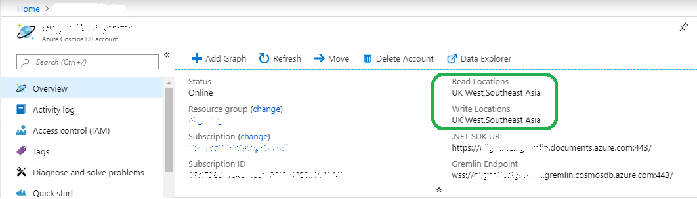

# Regional endpoints for Azure Cosmos DB Graph account
Azure Cosmos DB Graph database is [globally distributed](distribute-data-globally.md) so applications can use multiple read endpoints. Applications that need write access in multiple locations should enable [multi-master](how-to-multi-master.md) capability.

Reasons to choose more than one region:
1. **Horizontal read scalability** - as application load increases it may be prudent to route read traffic to different Azure regions.
2. **Lower latency** - you can reduce network latency overhead of each traversal by routing read and write traffic to the nearest Azure region.

**Data residency** requirement is achieved by setting Azure Resource Manager policy on Cosmos DB account. Customer can limit regions into which Cosmos DB replicates data.

## Traffic routing

Cosmos DB Graph database engine is running in multiple regions, each of which contains multiple clusters. Each cluster has hundreds of machines. Cosmos DB Graph account DNS CNAME *accountname.gremlin.cosmos.azure.com* resolves to DNS A record of a cluster. A single IP address of a load-balancer hides internal cluster topology.

A regional DNS CNAME record is created for every region of Cosmos DB Graph account. Format of regional endpoint is *accountname-region.gremlin.cosmos.azure.com*. Region segment of regional endpoint is obtained by removing all spaces from [Azure region](https://azure.microsoft.com/global-infrastructure/regions) name. For example, `"East US 2"` region for `"contoso"` global database account would have a DNS CNAME *contoso-eastus2.gremlin.cosmos.azure.com*

TinkerPop Gremlin client is designed to work with a single server. Application can use global writable DNS CNAME for read and write traffic. Region-aware applications should use regional endpoint for read traffic. Use regional endpoint for write traffic only if specific region is configured to accept writes. 

> [!NOTE]
> Cosmos DB Graph engine can accept write operation in read region by proxying traffic to write region. It is not recommended to send writes into read-only region as it increases traversal latency and is subject to restrictions in the future.

Global database account CNAME always points to a valid write region. During server-side failover of write region, Cosmos DB updates global database account CNAME to point to new region. If application can't handle traffic rerouting after failover, it should use global database account DNS CNAME.

> [!NOTE]
> Cosmos DB does not route traffic based on geographic proximity of the caller. It is up to each application to select the right region according to unique application needs.

## Portal endpoint discovery

The easiest way to get the list of regions for Azure Cosmos DB Graph account is overview blade in Azure portal. It will work for applications that do not change regions often, or have a way to update the list via application configuration.



Example below demonstrates general principles of accessing regional Gremlin endpoint. Application should consider number of regions to send the traffic to and number of corresponding Gremlin clients to instantiate.

```csharp
// Example value: Central US, West US and UK West. This can be found in the overview blade of you Azure Cosmos DB Gremlin Account. 
// Look for Write Locations in the overview blade. You can click to copy and paste.
string[] gremlinAccountRegions = new string[] {"Central US", "West US" ,"UK West"};
string gremlinAccountName = "PUT-COSMOSDB-ACCOUNT-NAME-HERE";
string gremlinAccountKey = "PUT-ACCOUNT-KEY-HERE";
string databaseName = "PUT-DATABASE-NAME-HERE";
string graphName = "PUT-GRAPH-NAME-HERE";

foreach (string gremlinAccountRegion in gremlinAccountRegions)
{
  // Convert preferred read location to the form "[acountname]-[region].gremlin.cosmos.azure.com".
  string regionalGremlinEndPoint = $"{gremlinAccountName}-{gremlinAccountRegion.ToLowerInvariant().Replace(" ", string.Empty)}.gremlin.cosmos.azure.com";

  GremlinServer regionalGremlinServer = new GremlinServer(
    hostname: regionalGremlinEndPoint, 
    port: 443,
    enableSsl: true,
    username: "/dbs/" + databaseName + "/colls/" + graphName,
    password: gremlinAccountKey);

  GremlinClient regionalGremlinClient = new GremlinClient(
    gremlinServer: regionalGremlinServer,
    graphSONReader: new GraphSON2Reader(),
    graphSONWriter: new GraphSON2Writer(),
    mimeType: GremlinClient.GraphSON2MimeType);
}
```

## SDK endpoint discovery

Application can use [Azure Cosmos DB SDK](sql-api-sdk-dotnet.md) to discover read and write locations for Graph account. These locations can change at any time through manual reconfiguration on the server side or automatic failover.

TinkerPop Gremlin SDK doesn't have an API to discover Cosmos DB Graph database account regions. Applications that need runtime endpoint discovery need to host 2 separate SDKs in the process space.

```csharp
// Depending on the version and the language of the SDK (.NET vs Java vs Python)
// the API to get readLocations and writeLocations may vary.
IDocumentClient documentClient = new DocumentClient(
    new Uri(cosmosUrl),
    cosmosPrimaryKey,
    connectionPolicy,
    consistencyLevel);

DatabaseAccount databaseAccount = await cosmosClient.GetDatabaseAccountAsync();

IEnumerable<DatabaseAccountLocation> writeLocations = databaseAccount.WritableLocations;
IEnumerable<DatabaseAccountLocation> readLocations = databaseAccount.ReadableLocations;

// Pick write or read locations to construct regional endpoints for.
foreach (string location in readLocations)
{
  // Convert preferred read location to the form "[acountname]-[region].gremlin.cosmos.azure.com".
  string regionalGremlinEndPoint = location
    .Replace("http:\/\/", string.Empty)
    .Replace("documents.azure.com:443/", "gremlin.cosmos.azure.com");
  
  // Use code from the previous sample to instantiate Gremlin client.
}
```

## Next steps
* [How to manage database accounts control](how-to-manage-database-account.md) in Azure Cosmos DB
* [High availability](high-availability.md) in Azure Cosmos DB
* [Global distribution with Azure Cosmos DB - under the hood](global-dist-under-the-hood.md)
* [Azure CLI Samples](cli-samples.md) for Azure Cosmos DB
