# How to import data into Azure Cosmos DB for the DocumentDB API?

This tutorial provides instructions on using the Azure Cosmos DB: DocumentDB API Data Migration tool, which can import data from various sources, including JSON files, CSV files, SQL, MongoDB, Azure Table storage, Amazon DynamoDB and Azure Cosmos DB DocumentDB API collections into collections for use with Azure Cosmos DB and the DocumentDB API. The Data Migration tool can also be used when migrating from a single partition collection to a multi-partition collection for the DocumentDB API.

The Data Migration tool only works when importing data into Azure Cosmos DB for use with the DocumentDB API. Importing data for use with the Table API or Graph API is not supported at this time. 

To import data for use with the MongoDB API, see [Azure Cosmos DB: How to migrate data for the MongoDB API?](mongodb-migrate.md).

This tutorial covers the following tasks:

> [!div class="checklist"]
> * Installing the Data Migration tool
> * Importing data from different data sources
> * Exporting from Azure Cosmos DB to JSON

## Prerequisites
Before following the instructions in this article, ensure that you have the following installed:

* [Microsoft .NET Framework 4.51](https://www.microsoft.com/download/developer-tools.aspx) or higher.

## Overview of the Data Migration tool
The Data Migration tool is an open source solution that imports data to Azure Cosmos DB from a variety of sources, including:

* JSON files
* MongoDB
* SQL Server
* CSV files
* Azure Table storage
* Amazon DynamoDB
* HBase
* Azure Cosmos DB collections

While the import tool includes a graphical user interface (dtui.exe), it can also be driven from the command line (dt.exe). In fact, there is an option to output the associated command after setting up an import through the UI. Tabular source data (e.g. SQL Server or CSV files) can be transformed such that hierarchical relationships (subdocuments) can be created during import. Keep reading to learn more about source options, sample command lines to import from each source, target options, and viewing import results.

## Install the Data Migration tool
The migration tool source code is available on GitHub in [this repository](https://github.com/azure/azure-documentdb-datamigrationtool) and a compiled version is available from [Microsoft Download Center](http://www.microsoft.com/downloads/details.aspx?FamilyID=cda7703a-2774-4c07-adcc-ad02ddc1a44d). You may either compile the solution or simply download and extract the compiled version to a directory of your choice. Then run either:

* **Dtui.exe**: Graphical interface version of the tool
* **Dt.exe**: Command-line version of the tool

## Import data

Once you've installed the tool, it's time to import your data. What kind of data do you want to import?

* [JSON files](#JSON)
* [MongoDB](#MongoDB)
* [MongoDB Export files](#MongoDBExport)
* [SQL Server](#SQL)
* [CSV files](#CSV)
* [Azure Table storage](#AzureTableSource)
* [Amazon DynamoDB](#DynamoDBSource)
* [Blob](#BlobImport)
* [Azure Cosmos DB collections](#DocumentDBSource)
* [HBase](#HBaseSource)
* [Azure Cosmos DB bulk import](#DocumentDBBulkImport)
* [Azure Cosmos DB sequential record import](#DocumentDSeqTarget)

## To import JSON files
The JSON file source importer option allows you to import one or more single document JSON files or JSON files that each contain an array of JSON documents. When adding folders that contain JSON files to import, you have the option of recursively searching for files in subfolders.

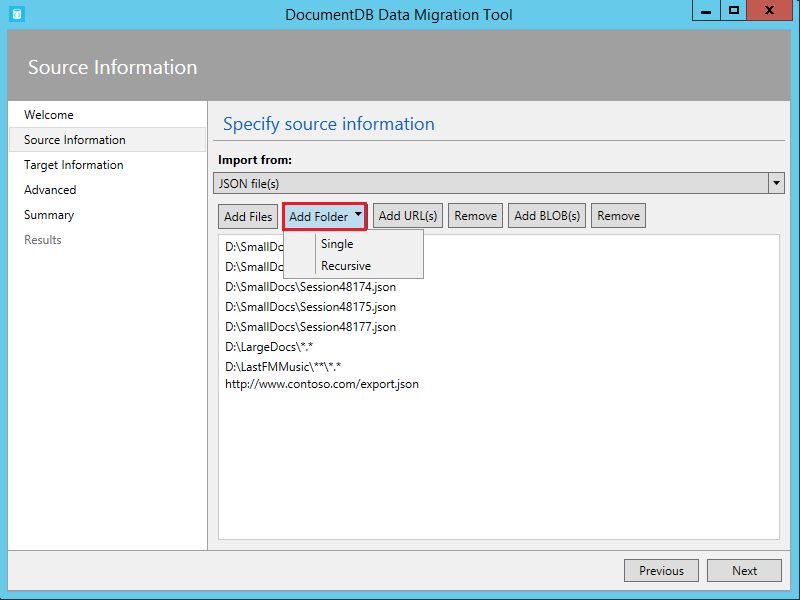

Here are some command line samples to import JSON files:

    #Import a single JSON file
    dt.exe /s:JsonFile /s.Files:.\Sessions.json /t:CosmosDBBulk /t.ConnectionString:"AccountEndpoint=<CosmosDB Endpoint>;AccountKey=<CosmosDB Key>;Database=<CosmosDB Database>;" /t.Collection:Sessions /t.CollectionThroughput:2500

    #Import a directory of JSON files
    dt.exe /s:JsonFile /s.Files:C:\TESessions\*.json /t:CosmosDBBulk /t.ConnectionString:" AccountEndpoint=<CosmosDB Endpoint>;AccountKey=<CosmosDB Key>;Database=<CosmosDB Database>;" /t.Collection:Sessions /t.CollectionThroughput:2500

    #Import a directory (including sub-directories) of JSON files
    dt.exe /s:JsonFile /s.Files:C:\LastFMMusic\**\*.json /t:CosmosDBBulk /t.ConnectionString:" AccountEndpoint=<CosmosDB Endpoint>;AccountKey=<CosmosDB Key>;Database=<CosmosDB Database>;" /t.Collection:Music /t.CollectionThroughput:2500

    #Import a directory (single), directory (recursive), and individual JSON files
    dt.exe /s:JsonFile /s.Files:C:\Tweets\*.*;C:\LargeDocs\**\*.*;C:\TESessions\Session48172.json;C:\TESessions\Session48173.json;C:\TESessions\Session48174.json;C:\TESessions\Session48175.json;C:\TESessions\Session48177.json /t:CosmosDBBulk /t.ConnectionString:"AccountEndpoint=<CosmosDB Endpoint>;AccountKey=<CosmosDB Key>;Database=<CosmosDB Database>;" /t.Collection:subs /t.CollectionThroughput:2500

    #Import a single JSON file and partition the data across 4 collections
    dt.exe /s:JsonFile /s.Files:D:\\CompanyData\\Companies.json /t:CosmosDBBulk /t.ConnectionString:"AccountEndpoint=<CosmosDB Endpoint>;AccountKey=<CosmosDB Key>;Database=<CosmosDB Database>;" /t.Collection:comp[1-4] /t.PartitionKey:name /t.CollectionThroughput:2500

## To import from MongoDB

> [!IMPORTANT]
> If you are importing to an Azure Cosmos DB account with Support for MongoDB, follow these [instructions](mongodb-migrate.md).
> 
> 

The MongoDB source importer option allows you to import from an individual MongoDB collection and optionally filter documents using a query and/or modify the document structure by using a projection.  

The connection string is in the standard MongoDB format:

    mongodb://<dbuser>:<dbpassword>@<host>:<port>/<database>

> [!NOTE]
> Use the Verify command to ensure that the MongoDB instance specified in the connection string field can be accessed.
> 
> 

Enter the name of the collection from which data will be imported. You may optionally specify or provide a file for a query (e.g. {pop: {$gt:5000}} ) and/or projection (e.g. {loc:0} ) to both filter and shape the data to be imported.

Here are some command line samples to import from MongoDB:

    #Import all documents from a MongoDB collection
    dt.exe /s:MongoDB /s.ConnectionString:mongodb://<dbuser>:<dbpassword>@<host>:<port>/<database> /s.Collection:zips /t:CosmosDBBulk /t.ConnectionString:"AccountEndpoint=<CosmosDB Endpoint>;AccountKey=<CosmosDB Key>;Database=<CosmosDB Database>;" /t.Collection:BulkZips /t.IdField:_id /t.CollectionThroughput:2500

    #Import documents from a MongoDB collection which match the query and exclude the loc field
    dt.exe /s:MongoDB /s.ConnectionString:mongodb://<dbuser>:<dbpassword>@<host>:<port>/<database> /s.Collection:zips /s.Query:{pop:{$gt:50000}} /s.Projection:{loc:0} /t:CosmosDBBulk /t.ConnectionString:"AccountEndpoint=<CosmosDB Endpoint>;AccountKey=<CosmosDB Key>;Database=<CosmosDB Database>;" /t.Collection:BulkZipsTransform /t.IdField:_id/t.CollectionThroughput:2500

## To import MongoDB export files

> [!IMPORTANT]
> If you are importing to an Azure Cosmos DB account with support for MongoDB, follow these [instructions](mongodb-migrate.md).
> 
> 

The MongoDB export JSON file source importer option allows you to import one or more JSON files produced from the mongoexport utility.  

When adding folders that contain MongoDB export JSON files for import, you have the option of recursively searching for files in subfolders.

Here is a command line sample to import from MongoDB export JSON files:

    dt.exe /s:MongoDBExport /s.Files:D:\mongoemployees.json /t:CosmosDBBulk /t.ConnectionString:"AccountEndpoint=<CosmosDB Endpoint>;AccountKey=<CosmosDB Key>;Database=<CosmosDB Database>;" /t.Collection:employees /t.IdField:_id /t.Dates:Epoch /t.CollectionThroughput:2500

## To import from SQL Server
The SQL source importer option allows you to import from an individual SQL Server database and optionally filter the records to be imported using a query. In addition, you can modify the document structure by specifying a nesting separator (more on that in a moment).  

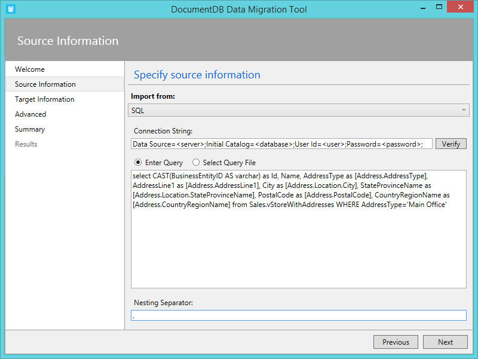

The format of the connection string is the standard SQL connection string format.

> [!NOTE]
> Use the Verify command to ensure that the SQL Server instance specified in the connection string field can be accessed.
> 
> 

The nesting separator property is used to create hierarchical relationships (sub-documents) during import. Consider the following SQL query:

*select CAST(BusinessEntityID AS varchar) as Id, Name, AddressType as [Address.AddressType], AddressLine1 as [Address.AddressLine1], City as [Address.Location.City], StateProvinceName as [Address.Location.StateProvinceName], PostalCode as [Address.PostalCode], CountryRegionName as [Address.CountryRegionName] from Sales.vStoreWithAddresses WHERE AddressType='Main Office'*

Which returns the following (partial) results:

Note the aliases such as Address.AddressType and Address.Location.StateProvinceName. By specifying a nesting separator of ‘.’, the import tool creates Address and Address.Location subdocuments during the import. Here is an example of a resulting document in Azure Cosmos DB:

*{
  "id": "956",
  "Name": "Finer Sales and Service",
  "Address": {
    "AddressType": "Main Office",
    "AddressLine1": "#500-75 O'Connor Street",
    "Location": {
      "City": "Ottawa",
      "StateProvinceName": "Ontario"
    },
    "PostalCode": "K4B 1S2",
    "CountryRegionName": "Canada"
  }
}*

Here are some command line samples to import from SQL Server:

    #Import records from SQL which match a query
    dt.exe /s:SQL /s.ConnectionString:"Data Source=<server>;Initial Catalog=AdventureWorks;User Id=advworks;Password=<password>;" /s.Query:"select CAST(BusinessEntityID AS varchar) as Id, * from Sales.vStoreWithAddresses WHERE AddressType='Main Office'" /t:CosmosDBBulk /t.ConnectionString:" AccountEndpoint=<CosmosDB Endpoint>;AccountKey=<CosmosDB Key>;Database=<CosmosDB Database>;" /t.Collection:Stores /t.IdField:Id /t.CollectionThroughput:2500

    #Import records from sql which match a query and create hierarchical relationships
    dt.exe /s:SQL /s.ConnectionString:"Data Source=<server>;Initial Catalog=AdventureWorks;User Id=advworks;Password=<password>;" /s.Query:"select CAST(BusinessEntityID AS varchar) as Id, Name, AddressType as [Address.AddressType], AddressLine1 as [Address.AddressLine1], City as [Address.Location.City], StateProvinceName as [Address.Location.StateProvinceName], PostalCode as [Address.PostalCode], CountryRegionName as [Address.CountryRegionName] from Sales.vStoreWithAddresses WHERE AddressType='Main Office'" /s.NestingSeparator:. /t:CosmosDBBulk /t.ConnectionString:" AccountEndpoint=<CosmosDB Endpoint>;AccountKey=<CosmosDB Key>;Database=<CosmosDB Database>;" /t.Collection:StoresSub /t.IdField:Id /t.CollectionThroughput:2500

## To import CSV files and convert CSV to JSON
The CSV file source importer option enables you to import one or more CSV files. When adding folders that contain CSV files for import, you have the option of recursively searching for files in subfolders.

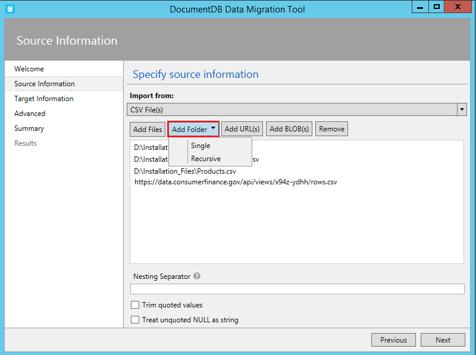

Similar to the SQL source, the nesting separator property may be used to create hierarchical relationships (sub-documents) during import. Consider the following CSV header row and data rows:

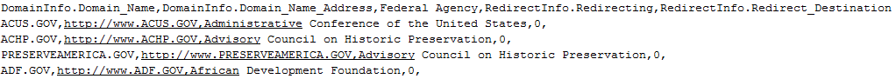

Note the aliases such as DomainInfo.Domain_Name and RedirectInfo.Redirecting. By specifying a nesting separator of ‘.’, the import tool will create DomainInfo and RedirectInfo subdocuments during the import. Here is an example of a resulting document in Azure Cosmos DB:

*{
  "DomainInfo": {
    "Domain_Name": "ACUS.GOV",
    "Domain_Name_Address": "http://www.ACUS.GOV"
  },
  "Federal Agency": "Administrative Conference of the United States",
  "RedirectInfo": {
    "Redirecting": "0",
    "Redirect_Destination": ""
  },
  "id": "9cc565c5-ebcd-1c03-ebd3-cc3e2ecd814d"
}*

The import tool will attempt to infer type information for unquoted values in CSV files (quoted values are always treated as strings).  Types are identified in the following order: number, datetime, boolean.  

There are two other things to note about CSV import:

1. By default, unquoted values are always trimmed for tabs and spaces, while quoted values are preserved as-is. This behavior can be overridden with the Trim quoted values checkbox or the /s.TrimQuoted command line option.
2. By default, an unquoted null is treated as a null value. This behavior can be overridden (i.e. treat an unquoted null as a “null” string) with the Treat unquoted NULL as string checkbox or the /s.NoUnquotedNulls command line option.

Here is a command line sample for CSV import:

    dt.exe /s:CsvFile /s.Files:.\Employees.csv /t:CosmosDBBulk /t.ConnectionString:"AccountEndpoint=<CosmosDB Endpoint>;AccountKey=<CosmosDB Key>;Database=<CosmosDB Database>;" /t.Collection:Employees /t.IdField:EntityID /t.CollectionThroughput:2500

## To import from Azure Table storage
The Azure Table storage source importer option allows you to import from an individual Azure Table storage table and optionally filter the table entities to be imported. Note that you cannot use the Data Migration tool to import Azure Table storage data into Azure Cosmos DB for use with the Table API. Only importing to Azure Cosmos DB for use with the DocumentDB API is supported at this time.

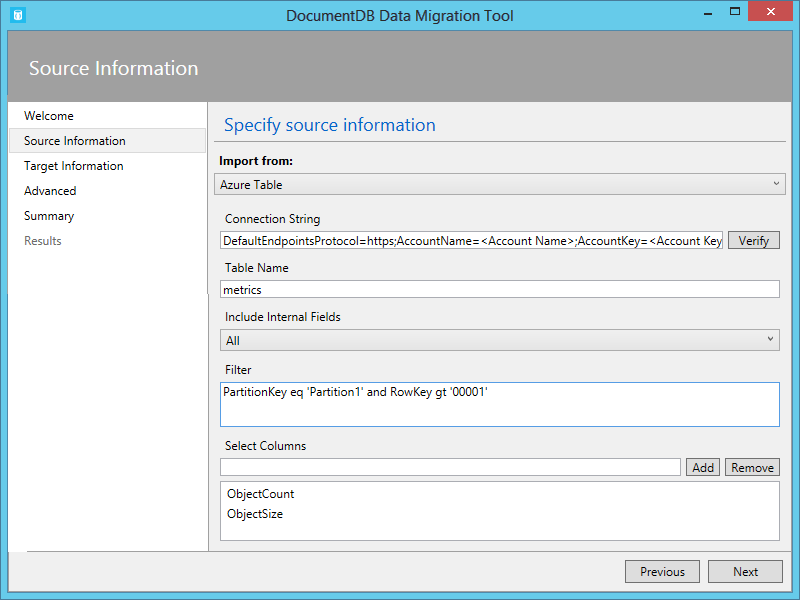

The format of the Azure Table storage connection string is:

    DefaultEndpointsProtocol=<protocol>;AccountName=<Account Name>;AccountKey=<Account Key>;

> [!NOTE]
> Use the Verify command to ensure that the Azure Table storage instance specified in the connection string field can be accessed.
> 
> 

Enter the name of the Azure table from which data will be imported. You may optionally specify a [filter](https://msdn.microsoft.com/library/azure/ff683669.aspx).

The Azure Table storage source importer option has the following additional options:

1. Include Internal Fields
   1. All - Include all internal fields (PartitionKey, RowKey, and Timestamp)
   2. None - Exclude all internal fields
   3. RowKey - Only include the RowKey field
2. Select Columns
   1. Azure Table storage filters do not support projections. If you want to only import specific Azure Table entity properties, add them to the Select Columns list. All other entity properties will be ignored.

Here is a command line sample to import from Azure Table storage:

    dt.exe /s:AzureTable /s.ConnectionString:"DefaultEndpointsProtocol=https;AccountName=<Account Name>;AccountKey=<Account Key>" /s.Table:metrics /s.InternalFields:All /s.Filter:"PartitionKey eq 'Partition1' and RowKey gt '00001'" /s.Projection:ObjectCount;ObjectSize  /t:CosmosDBBulk /t.ConnectionString:" AccountEndpoint=<CosmosDB Endpoint>;AccountKey=<CosmosDB Key>;Database=<CosmosDB Database>;" /t.Collection:metrics /t.CollectionThroughput:2500

## To import from Amazon DynamoDB
The Amazon DynamoDB source importer option allows you to import from an individual Amazon DynamoDB table and optionally filter the entities to be imported. Several templates are provided so that setting up an import is as easy as possible.

The format of the Amazon DynamoDB connection string is:

    ServiceURL=<Service Address>;AccessKey=<Access Key>;SecretKey=<Secret Key>;

> [!NOTE]
> Use the Verify command to ensure that the Amazon DynamoDB instance specified in the connection string field can be accessed.
> 
> 

Here is a command line sample to import from Amazon DynamoDB:

    dt.exe /s:DynamoDB /s.ConnectionString:ServiceURL=https://dynamodb.us-east-1.amazonaws.com;AccessKey=<accessKey>;SecretKey=<secretKey> /s.Request:"{   """TableName""": """ProductCatalog""" }" /t:DocumentDBBulk /t.ConnectionString:"AccountEndpoint=<Azure Cosmos DB Endpoint>;AccountKey=<Azure Cosmos DB Key>;Database=<Azure Cosmos DB Database>;" /t.Collection:catalogCollection /t.CollectionThroughput:2500

## To import files from Azure Blob storage
The JSON file, MongoDB export file, and CSV file source importer options allow you to import one or more files from Azure Blob storage. After specifying a Blob container URL and Account Key, simply provide a regular expression to select the file(s) to import.

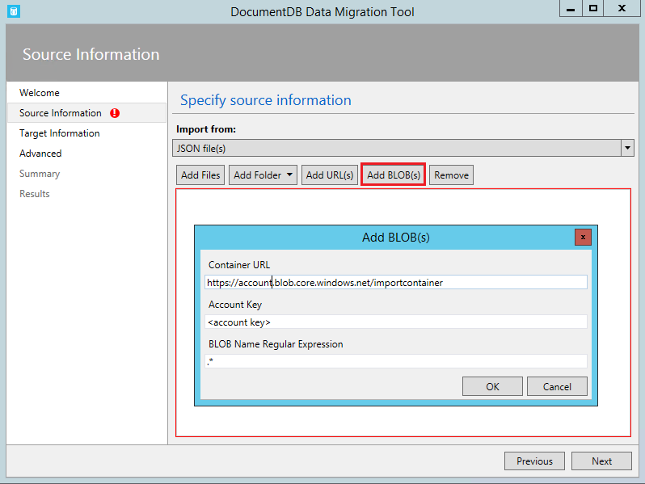

Here is command line sample to import JSON files from Azure Blob storage:

    dt.exe /s:JsonFile /s.Files:"blobs://<account key>@account.blob.core.windows.net:443/importcontainer/.*" /t:CosmosDBBulk /t.ConnectionString:"AccountEndpoint=<CosmosDB Endpoint>;AccountKey=<CosmosDB Key>;Database=<CosmosDB Database>;" /t.Collection:doctest

## To import from an Azure Cosmos DB DocumentDB API collection
The Azure Cosmos DB source importer option allows you to import data from one or more Azure Cosmos DB collections and optionally filter documents using a query.  

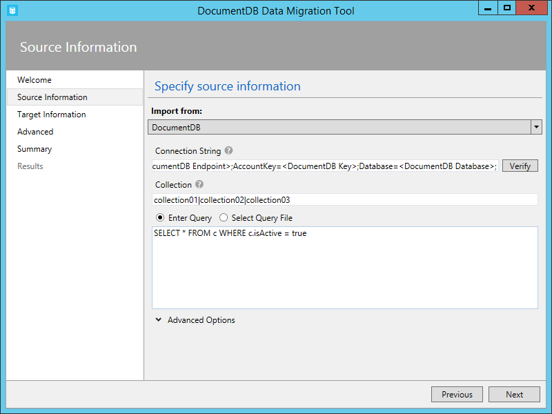

The format of the Azure Cosmos DB connection string is:

    AccountEndpoint=<CosmosDB Endpoint>;AccountKey=<CosmosDB Key>;Database=<CosmosDB Database>;

The Azure Cosmos DB account connection string can be retrieved from the Keys blade of the Azure portal, as described in [How to manage an Azure Cosmos DB account](manage-account.md), however the name of the database needs to be appended to the connection string in the following format:

    Database=<CosmosDB Database>;

> [!NOTE]
> Use the Verify command to ensure that the Azure Cosmos DB instance specified in the connection string field can be accessed.
> 
> 

To import from a single Azure Cosmos DB collection, enter the name of the collection from which data will be imported. To import from multiple Azure Cosmos DB collections, provide a regular expression to match one or more collection names (e.g. collection01 | collection02 | collection03). You may optionally specify, or provide a file for, a query to both filter and shape the data to be imported.

> [!NOTE]
> Since the collection field accepts regular expressions, if you are importing from a single collection whose name contains regular expression characters, then those characters must be escaped accordingly.
> 
> 

The Azure Cosmos DB source importer option has the following advanced options:

1. Include Internal Fields: Specifies whether or not to include Azure Cosmos DB document system properties in the export (e.g. _rid, _ts).
2. Number of Retries on Failure: Specifies the number of times to retry the connection to Azure Cosmos DB in case of transient failures (e.g. network connectivity interruption).
3. Retry Interval: Specifies how long to wait between retrying the connection to Azure Cosmos DB in case of transient failures (e.g. network connectivity interruption).
4. Connection Mode: Specifies the connection mode to use with Azure Cosmos DB. The available choices are DirectTcp, DirectHttps, and Gateway. The direct connection modes are faster, while the gateway mode is more firewall friendly as it only uses port 443.

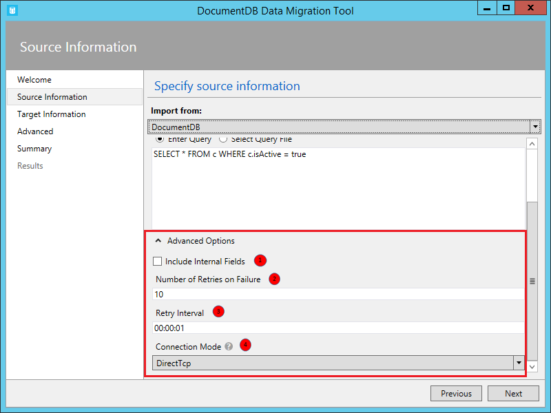

> [!TIP]
> The import tool defaults to connection mode DirectTcp. If you experience firewall issues, switch to connection mode Gateway, as it only requires port 443.
> 
> 

Here are some command line samples to import from Azure Cosmos DB:

    #Migrate data from one Azure Cosmos DB collection to another Azure Cosmos DB collections
    dt.exe /s:CosmosDB /s.ConnectionString:"AccountEndpoint=<CosmosDB Endpoint>;AccountKey=<CosmosDB Key>;Database=<CosmosDB Database>;" /s.Collection:TEColl /t:CosmosDBBulk /t.ConnectionString:" AccountEndpoint=<CosmosDB Endpoint>;AccountKey=<CosmosDB Key>;Database=<CosmosDB Database>;" /t.Collection:TESessions /t.CollectionThroughput:2500

    #Migrate data from multiple Azure Cosmos DB collections to a single Azure Cosmos DB collection
    dt.exe /s:CosmosDB /s.ConnectionString:"AccountEndpoint=<CosmosDB Endpoint>;AccountKey=<CosmosDB Key>;Database=<CosmosDB Database>;" /s.Collection:comp1|comp2|comp3|comp4 /t:CosmosDBBulk /t.ConnectionString:"AccountEndpoint=<CosmosDB Endpoint>;AccountKey=<CosmosDB Key>;Database=<CosmosDB Database>;" /t.Collection:singleCollection /t.CollectionThroughput:2500

    #Export an Azure Cosmos DB collection to a JSON file
    dt.exe /s:CosmosDB /s.ConnectionString:"AccountEndpoint=<CosmosDB Endpoint>;AccountKey=<CosmosDB Key>;Database=<CosmosDB Database>;" /s.Collection:StoresSub /t:JsonFile /t.File:StoresExport.json /t.Overwrite /t.CollectionThroughput:2500

> [!TIP]
> The Azure Cosmos DB Data Import Tool also supports import of data from the [Azure Cosmos DB Emulator](local-emulator.md). When importing data from a local emulator, set the endpoint to `https://localhost:<port>`. 
> 
> 

## To import from HBase
The HBase source importer option allows you to import data from an HBase table and optionally filter the data. Several templates are provided so that setting up an import is as easy as possible.

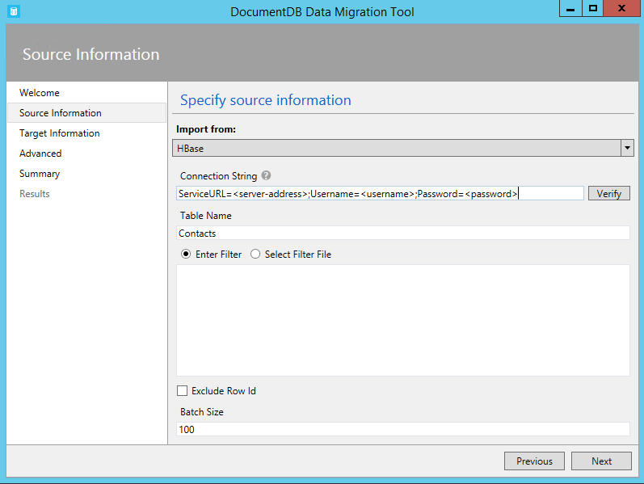

The format of the HBase Stargate connection string is:

    ServiceURL=<server-address>;Username=<username>;Password=<password>

> [!NOTE]
> Use the Verify command to ensure that the HBase instance specified in the connection string field can be accessed.
> 
> 

Here is a command line sample to import from HBase:

    dt.exe /s:HBase /s.ConnectionString:ServiceURL=<server-address>;Username=<username>;Password=<password> /s.Table:Contacts /t:CosmosDBBulk /t.ConnectionString:"AccountEndpoint=<CosmosDB Endpoint>;AccountKey=<CosmosDB Key>;Database=<CosmosDB Database>;" /t.Collection:hbaseimport

## To import to the DocumentDB API (Bulk Import)
The Azure Cosmos DB Bulk importer allows you to import from any of the available source options, using an Azure Cosmos DB stored procedure for efficiency. The tool supports import to one single-partitioned Azure Cosmos DB collection, as well as sharded import whereby data is partitioned across multiple single-partitioned Azure Cosmos DB collections. For more information about partitioning data, see [Partitioning and scaling in Azure Cosmos DB](partition-data.md). The tool will create, execute, and then delete the stored procedure from the target collection(s).  

The format of the Azure Cosmos DB connection string is:

    AccountEndpoint=<CosmosDB Endpoint>;AccountKey=<CosmosDB Key>;Database=<CosmosDB Database>;

The Azure Cosmos DB account connection string can be retrieved from the Keys blade of the Azure portal, as described in [How to manage an Azure Cosmos DB account](manage-account.md), however the name of the database needs to be appended to the connection string in the following format:

    Database=<CosmosDB Database>;

> [!NOTE]
> Use the Verify command to ensure that the Azure Cosmos DB instance specified in the connection string field can be accessed.
> 
> 

To import to a single collection, enter the name of the collection to which data will be imported and click the Add button. To import to multiple collections, either enter each collection name individually or use the following syntax to specify multiple collections: *collection_prefix*[start index - end index]. When specifying multiple collections via the aforementioned syntax, keep the following in mind:

1. Only integer range name patterns are supported. For example, specifying collection[0-3] will produce the following collections: collection0, collection1, collection2, collection3.
2. You can use an abbreviated syntax: collection[3] will emit same set of collections mentioned in step 1.
3. More than one substitution can be provided. For example, collection[0-1] [0-9] will generate 20 collection names with leading zeros (collection01, ..02, ..03).

Once the collection name(s) have been specified, choose the desired throughput of the collection(s) (400 RUs to 10,000 RUs). For best import performance, choose a higher throughput. For more information about performance levels, see [Performance levels in Azure Cosmos DB](performance-levels.md).

> [!NOTE]
> The performance throughput setting only applies to collection creation. If the specified collection already exists, its throughput will not be modified.
> 
> 

When importing to multiple collections, the import tool supports hash based sharding. In this scenario, specify the document property you wish to use as the Partition Key (if Partition Key is left blank, documents will be sharded randomly across the target collections).

You may optionally specify which field in the import source should be used as the Azure Cosmos DB document id property during the import (note that if documents do not contain this property, then the import tool will generate a GUID as the id property value).

There are a number of advanced options available during import. First, while the tool includes a default bulk import stored procedure (BulkInsert.js), you may choose to specify your own import stored procedure:

 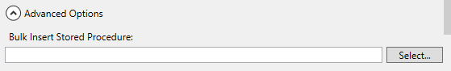

Additionally, when importing date types (e.g. from SQL Server or MongoDB), you can choose between three import options:

 

* String: Persist as a string value
* Epoch: Persist as an Epoch number value
* Both: Persist both string and Epoch number values. This option will create a subdocument, for example:
  "date_joined": {
  "Value": "2013-10-21T21:17:25.2410000Z",
  "Epoch": 1382390245
  }

The Azure Cosmos DB Bulk importer has the following additional advanced options:

1. Batch Size: The tool defaults to a batch size of 50.  If the documents to be imported are large, consider lowering the batch size. Conversely, if the documents to be imported are small, consider raising the batch size.
2. Max Script Size (bytes): The tool defaults to a max script size of 512KB
3. Disable Automatic Id Generation: If every document to be imported contains an id field, then selecting this option can increase performance. Documents missing a unique id field will not be imported.
4. Update Existing Documents: The tool defaults to not replacing existing documents with id conflicts. Selecting this option will allow overwriting existing documents with matching ids. This feature is useful for scheduled data migrations that update existing documents.
5. Number of Retries on Failure: Specifies the number of times to retry the connection to Azure Cosmos DB in case of transient failures (e.g. network connectivity interruption).
6. Retry Interval: Specifies how long to wait between retrying the connection to Azure Cosmos DB in case of transient failures (e.g. network connectivity interruption).
7. Connection Mode: Specifies the connection mode to use with Azure Cosmos DB. The available choices are DirectTcp, DirectHttps, and Gateway. The direct connection modes are faster, while the gateway mode is more firewall friendly as it only uses port 443.

> [!TIP]
> The import tool defaults to connection mode DirectTcp. If you experience firewall issues, switch to connection mode Gateway, as it only requires port 443.
> 
> 

## To import to the DocumentDB API (Sequential Record Import)
The Azure Cosmos DB sequential record importer allows you to import from any of the available source options on a record by record basis. You might choose this option if you’re importing to an existing collection that has reached its quota of stored procedures. The tool supports import to a single (both single-partition and multi-partition) Azure Cosmos DB collection, as well as sharded import whereby data is partitioned across multiple single-partition and/or multi-partition Azure Cosmos DB collections. For more information about partitioning data, see [Partitioning and scaling in Azure Cosmos DB](partition-data.md).

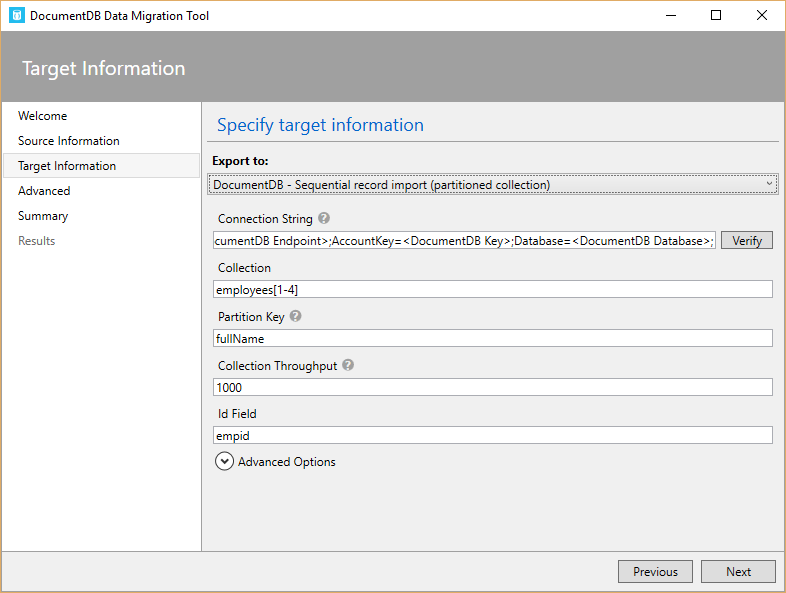

The format of the Azure Cosmos DB connection string is:

    AccountEndpoint=<CosmosDB Endpoint>;AccountKey=<CosmosDB Key>;Database=<CosmosDB Database>;

The Azure Cosmos DB account connection string can be retrieved from the Keys blade of the Azure portal, as described in [How to manage an Azure Cosmos DB account](manage-account.md), however the name of the database needs to be appended to the connection string in the following format:

    Database=<Azure Cosmos DB Database>;

> [!NOTE]
> Use the Verify command to ensure that the Azure Cosmos DB instance specified in the connection string field can be accessed.
> 
> 

To import to a single collection, enter the name of the collection to which data will be imported and click the Add button. To import to multiple collections, either enter each collection name individually or use the following syntax to specify multiple collections: *collection_prefix*[start index - end index]. When specifying multiple collections via the aforementioned syntax, keep the following in mind:

1. Only integer range name patterns are supported. For example, specifying collection[0-3] will produce the following collections: collection0, collection1, collection2, collection3.
2. You can use an abbreviated syntax: collection[3] will emit same set of collections mentioned in step 1.
3. More than one substitution can be provided. For example, collection[0-1] [0-9] will generate 20 collection names with leading zeros (collection01, ..02, ..03).

Once the collection name(s) have been specified, choose the desired throughput of the collection(s) (400 RUs to 250,000 RUs). For best import performance, choose a higher throughput. For more information about performance levels, see [Performance levels in Azure Cosmos DB](performance-levels.md). Any import to collections with throughput >10,000 RUs will require a partition key. If you choose to have more than 250,000 RUs, you will need to file a request in the portal to have your account increased.

> [!NOTE]
> The throughput setting only applies to collection creation. If the specified collection already exists, its throughput will not be modified.
> 
> 

When importing to multiple collections, the import tool supports hash based sharding. In this scenario, specify the document property you wish to use as the Partition Key (if Partition Key is left blank, documents will be sharded randomly across the target collections).

You may optionally specify which field in the import source should be used as the Azure Cosmos DB document id property during the import (note that if documents do not contain this property, then the import tool will generate a GUID as the id property value).

There are a number of advanced options available during import. First, when importing date types (e.g. from SQL Server or MongoDB), you can choose between three import options:

 

* String: Persist as a string value
* Epoch: Persist as an Epoch number value
* Both: Persist both string and Epoch number values. This option will create a subdocument, for example:
  "date_joined": {
  "Value": "2013-10-21T21:17:25.2410000Z",
  "Epoch": 1382390245
  }

The Azure Cosmos DB - Sequential record importer has the following additional advanced options:

1. Number of Parallel Requests: The tool defaults to 2 parallel requests. If the documents to be imported are small, consider raising the number of parallel requests. Note that if this number is raised too much, the import may experience throttling.
2. Disable Automatic Id Generation: If every document to be imported contains an id field, then selecting this option can increase performance. Documents missing a unique id field will not be imported.
3. Update Existing Documents: The tool defaults to not replacing existing documents with id conflicts. Selecting this option will allow overwriting existing documents with matching ids. This feature is useful for scheduled data migrations that update existing documents.
4. Number of Retries on Failure: Specifies the number of times to retry the connection to Azure Cosmos DB in case of transient failures (e.g. network connectivity interruption).
5. Retry Interval: Specifies how long to wait between retrying the connection to Azure Cosmos DB in case of transient failures (e.g. network connectivity interruption).
6. Connection Mode: Specifies the connection mode to use with Azure Cosmos DB. The available choices are DirectTcp, DirectHttps, and Gateway. The direct connection modes are faster, while the gateway mode is more firewall friendly as it only uses port 443.

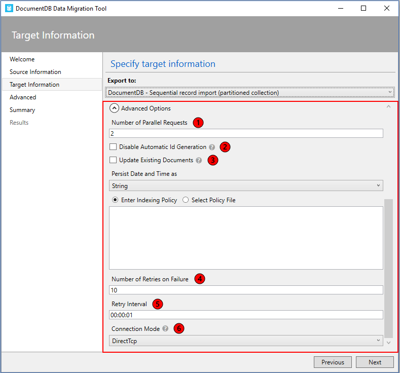

> [!TIP]
> The import tool defaults to connection mode DirectTcp. If you experience firewall issues, switch to connection mode Gateway, as it only requires port 443.
> 
> 

## Specify an indexing policy when creating Azure Cosmos DB collections
When you allow the migration tool to create collections during import, you can specify the indexing policy of the collections. In the advanced options section of the Azure Cosmos DB Bulk import and Azure Cosmos DB Sequential record options, navigate to the Indexing Policy section.

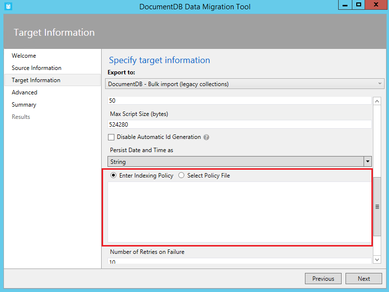

Using the Indexing Policy advanced option, you can select an indexing policy file, manually enter an indexing policy, or select from a set of default templates (by right clicking in the indexing policy textbox).

The policy templates the tool provides are:

* Default. This policy is best when you’re performing equality queries against strings and using ORDER BY, range, and equality queries for numbers. This policy has a lower index storage overhead than Range.
* Range. This policy is best you’re using ORDER BY, range and equality queries on both numbers and strings. This policy has a higher index storage overhead than Default or Hash.

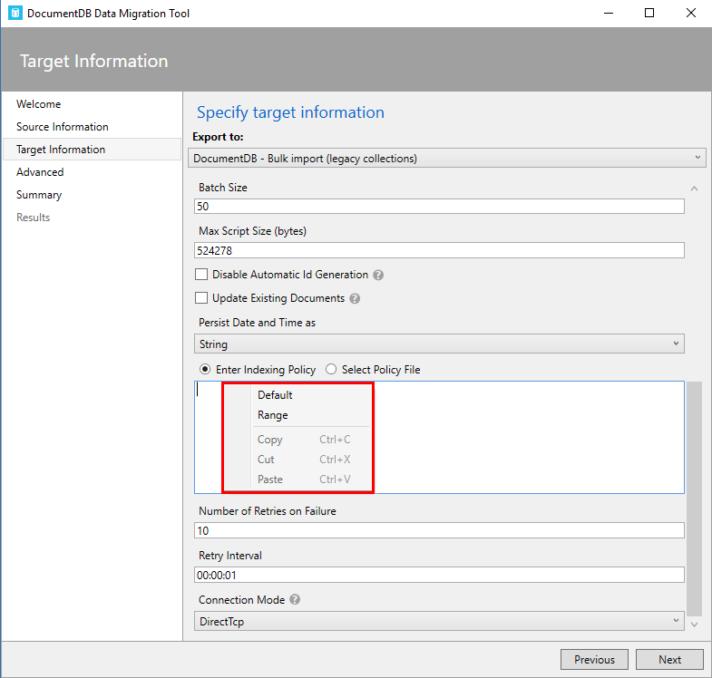

> [!NOTE]
> If you do not specify an indexing policy, then the default policy will be applied. For more information about indexing policies, see [Azure Cosmos DB indexing policies](indexing-policies.md).
> 
> 

## Export to JSON file
The Azure Cosmos DB JSON exporter allows you to export any of the available source options to a JSON file that contains an array of JSON documents. The tool will handle the export for you, or you can choose to view the resulting migration command and run the command yourself. The resulting JSON file may be stored locally or in Azure Blob storage.

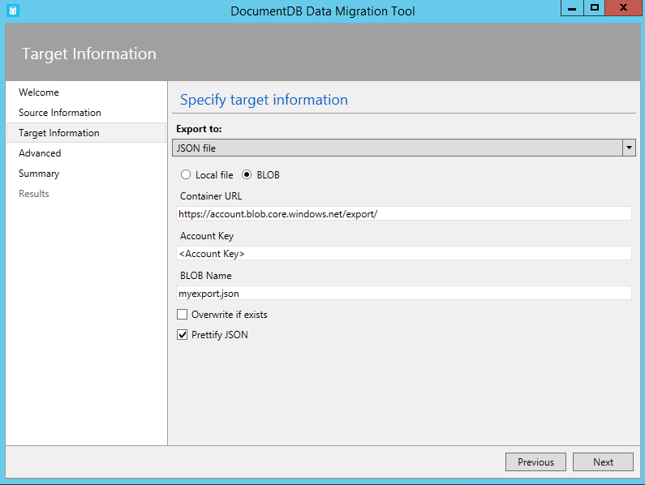

You may optionally choose to prettify the resulting JSON, which will increase the size of the resulting document while making the contents more human readable.

    Standard JSON export
    [{"id":"Sample","Title":"About Paris","Language":{"Name":"English"},"Author":{"Name":"Don","Location":{"City":"Paris","Country":"France"}},"Content":"Don's document in Azure Cosmos DB is a valid JSON document as defined by the JSON spec.","PageViews":10000,"Topics":[{"Title":"History of Paris"},{"Title":"Places to see in Paris"}]}]

    Prettified JSON export
    [
     {
    "id": "Sample",
    "Title": "About Paris",
    "Language": {
      "Name": "English"
    },
    "Author": {
      "Name": "Don",
      "Location": {
        "City": "Paris",
        "Country": "France"
      }
    },
    "Content": "Don's document in Azure Cosmos DB is a valid JSON document as defined by the JSON spec.",
    "PageViews": 10000,
    "Topics": [
      {
        "Title": "History of Paris"
      },
      {
        "Title": "Places to see in Paris"
      }
    ]
    }]

## Advanced configuration
In the Advanced configuration screen, specify the location of the log file to which you would like any errors written. The following rules apply to this page:

1. If a file name is not provided, then all errors will be returned on the Results page.
2. If a file name is provided without a directory, then the file will be created (or overwritten) in the current environment directory.
3. If you select an existing file, then the file will be overwritten, there is no append option.

Then, choose whether to log all, critical, or no error messages. Finally, decide how frequently the on screen transfer message will be updated with its progress.

    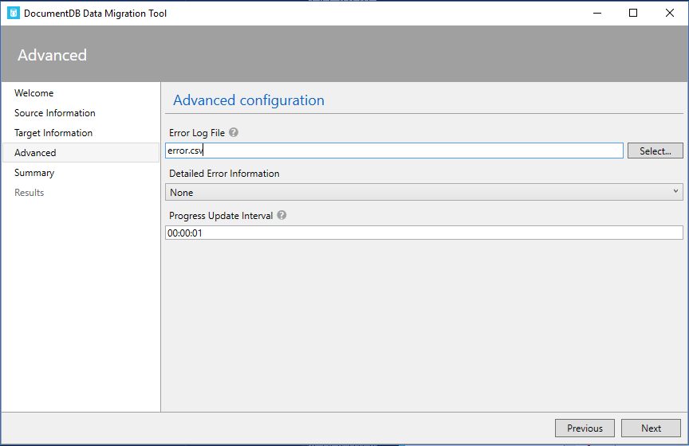

## Confirm import settings and view command line
1. After specifying source information, target information, and advanced configuration, review the migration summary and, optionally, view/copy the resulting migration command (copying the command is useful to automate import operations):
   
    
   
    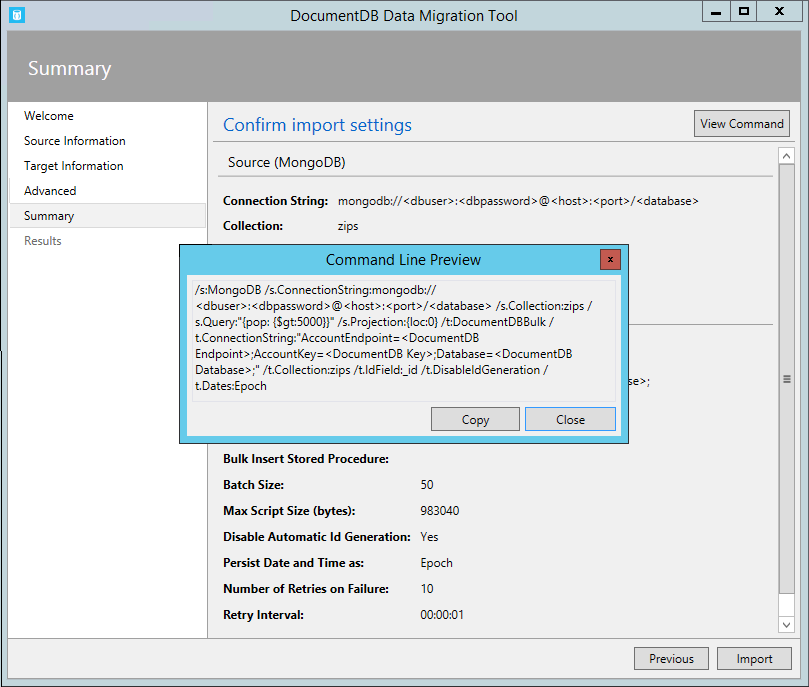
2. Once you’re satisfied with your source and target options, click **Import**. The elapsed time, transferred count, and failure information (if you didn't provide a file name in the Advanced configuration) will update as the import is in process. Once complete, you can export the results (e.g. to deal with any import failures).
   
    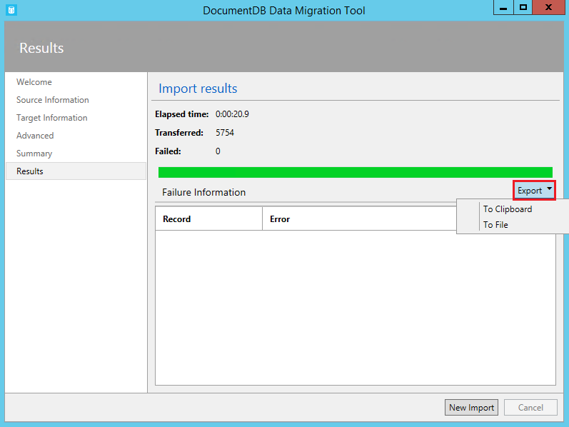
3. You may also start a new import, either keeping the existing settings (e.g. connection string information, source and target choice, etc.) or resetting all values.
   
    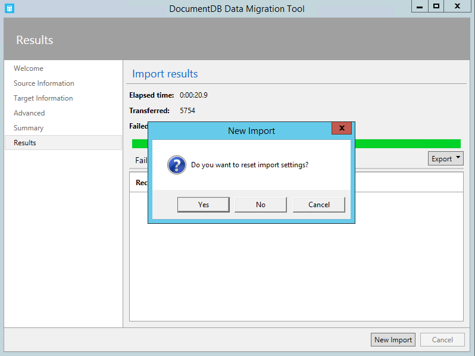

## Next steps

In this tutorial, you've done the following:

> [!div class="checklist"]
> * Installed the Data Migration tool
> * Imported data from different data sources
> * Exported from Azure Cosmos DB to JSON

You can now proceed to the next tutorial and learn how to query data using Azure Cosmos DB. 

> [!div class="nextstepaction"]
>[How to query data?](../cosmos-db/tutorial-query-documentdb.md)
