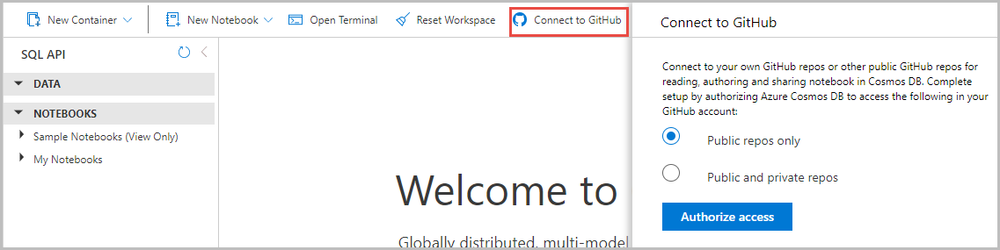
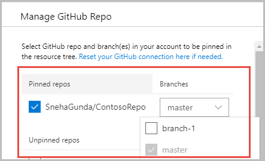
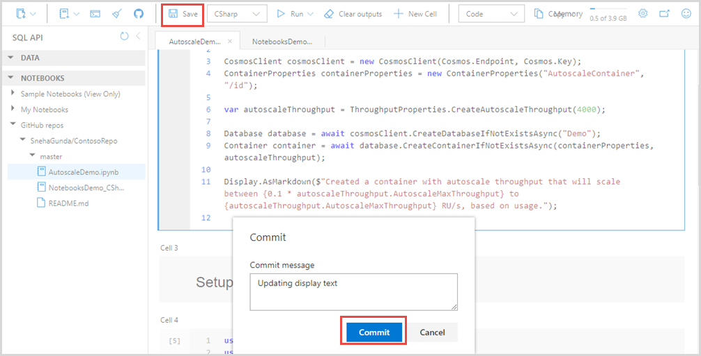

# Import notebooks from a GitHub repo into Azure Cosmos DB

After you [enable notebook support](enable-notebooks.md) for your Azure Cosmos accounts, you can create new notebooks, upload new notebooks from your local computer, or import the existing notebooks from your GitHub accounts. This article shows how to connect your notebooks workspace to GitHub and import the notebooks from a GitHub repo to your Azure Cosmos account. After importing, you can run them, make changes, and save the changes back to GitHub.

## Get notebooks from GitHub

You can connect to your own GitHub repositories or other public GitHub repositories to read, author, and share notebooks in Azure Cosmos DB. Use the following steps to connect to a GitHub account:

1. Sign into [Azure portal](https://portal.azure.com/) and navigate to your Azure Cosmos account.

1. Open the **Data Explorer** tab. This tab will show all your existing databases, containers, and notebooks.

1. Select the **Connect to GitHub** menu item.

1. A tab opens where you can choose to connect to **Public repos** only or **Public and private repos**.  After choosing the required option, select **Authorize access**. Authorization is required for Azure Cosmos DB to access the repositories in your GitHub account.

   

1. You are redirected to "github.com" web page where you can confirm the authorization. Select the **Authorize AzureCosmosDBNotebooks** button and enter your GitHub account password in the prompt.

1. After the authorization is successful, it takes you back to your Azure Cosmos account. You can then see all the public/private repos from your GitHub account. You can select a repo from the list available or add a repo directly by using its URL.

1. Once you select the required repo, the repo entry moves from the **Unpinned repos** section to **Pinned repos** section. If needed, you can also choose a specific branch of that repo to import the notebooks from.

   

1. Select **OK** to complete the import operation. All the notebooks available in the selected branch of your repo are imported into your Azure Cosmos account.

After you integrate with a GitHub account, only you can see the list of repositories and notebooks in your Azure Cosmos account. This statement is true even if multiple users log into the Azure Cosmos DB account and add their own accounts. In other words, multiple users can use the same Azure Cosmos account to connect the notebook workspace to GitHub. However, each user only sees the list of repositories and notebooks they have imported. The notebooks imported by others are not visible to you.

To disconnect your GitHub account from the notebooks workspace, open the **Data Explorer** tab, select `…` next to **GitHub repos** and select **Disconnect from GitHub**.

## Edit a notebook and push changes to GitHub

You can edit an existing notebook or add a new notebook to the repo and save the changes back to GitHub.

After you edit an existing notebook, select **Save**. A dialog box opens where you can enter the commit message for the changes you have made. Select **Commit** and the notebook in GitHub is updated. You can validate the updates by signing into your GitHub account, and verifying the commit history.

In the regular GitHub flow after committing the changes, you will typically push changes to a remote. However, in this case the commit option serves the purpose of “staging, committing, and pushing” your updates to GitHub.

## Next steps

* Learn about the benefits of [Azure Cosmos DB Jupyter notebooks.](cosmosdb-jupyter-notebooks.md)

