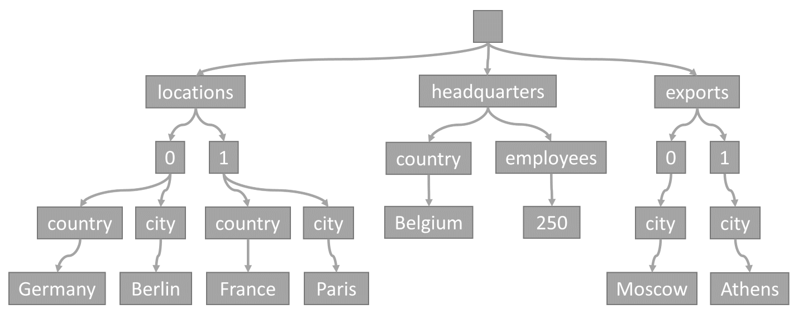

# Indexing in Azure Cosmos DB - Overview

Azure Cosmos DB is a schema-agnostic database that allows you to iterate on your application without having to deal with schema or index management. By default, Azure Cosmos DB automatically indexes every property for all items in your [container](databases-containers-items.md#azure-cosmos-containers) without having to define any schema or configure secondary indexes.

The goal of this article is to explain how Azure Cosmos DB indexes data and how it uses indexes to improve query performance. It is recommended to go through this section before exploring how to customize [indexing policies](index-policy.md).

## From items to trees

Every time an item is stored in a container, its content is projected as a JSON document, then converted into a tree representation. What that means is that every property of that item gets represented as a node in a tree. A pseudo root node is created as a parent to all the first-level properties of the item. The leaf nodes contain the actual scalar values carried by an item.

As an example, consider this item:

    {
        "locations": [
            { "country": "Germany", "city": "Berlin" },
            { "country": "France", "city": "Paris" }
        ],
        "headquarters": { "country": "Belgium", "employees": 250 },
        "exports": [
            { "city": "Moscow" },
            { "city": "Athens" }
        ]
    }

It would be represented by the following tree:



Note how arrays are encoded in the tree: every entry in an array gets an intermediate node labeled with the index of that entry within the array (0, 1 etc.).

## From trees to property paths

The reason why Azure Cosmos DB transforms items into trees is because it allows properties to be referenced by their paths within those trees. To get the path for a property, we can traverse the tree from the root node to that property, and concatenate the labels of each traversed node.

Here are the paths for each property from the example item described above:

    /locations/0/country: "Germany"
    /locations/0/city: "Berlin"
    /locations/1/country: "France"
    /locations/1/city: "Paris"
    /headquarters/country: "Belgium"
    /headquarters/employees: 250
    /exports/0/city: "Moscow"
    /exports/1/city: "Athens"

When an item is written, Azure Cosmos DB effectively indexes each property's path and its corresponding value.

## Index kinds

Azure Cosmos DB currently supports two kinds of indexes:

The **range** index kind is used for:

- Equality queries: 

   ```sql SELECT * FROM container c WHERE c.property = 'value'```

- Range queries: 

   ```sql SELECT * FROM container c WHERE c.property > 'value'``` (works for `>`, `<`, `>=`, `<=`, `!=`)

- `ORDER BY` queries:

   ```sql SELECT * FROM container c ORDER BY c.property```

- `JOIN` queries: 

   ```sql SELECT child FROM container c JOIN child IN c.properties WHERE child = 'value'```

Range indexes can be used on scalar values (string or number).

The **spatial** index kind is used for:

- Geospatial distance queries: 

   ```sql SELECT * FROM container c WHERE ST_DISTANCE(c.property, { "type": "Point", "coordinates": [0.0, 10.0] }) < 40```

- Geospatial within queries: 

   ```sql SELECT * FROM container c WHERE ST_WITHIN(c.property, {"type": "Point", "coordinates": [0.0, 10.0] } })```

Spatial indexes can be used on correctly formatted [GeoJSON](geospatial.md) objects. Points, LineStrings and Polygons are currently supported.

The **composite** index kind is used for:

- `ORDER BY` queries on multiple properties: 

   ```sql SELECT * FROM container c ORDER BY c.firstName, c.lastName```

## Querying with indexes

The paths extracted when indexing data make it easy to lookup the index when processing a query. By matching the `WHERE` clause of a query with the list of indexed paths, it is possible to identify the items that match the query predicate very quickly.

For example, consider the following query: `SELECT location FROM location IN company.locations WHERE location.country = 'France'`. The query predicate (filtering on items, where any location has "France" as its country) would match the path highlighted in red below:


> [!NOTE]
> An `ORDER BY` clause that orders by a single property *always* needs a range index and will fail if the path it references doesn't have one. Similarly, a multi `ORDER BY` query *always* needs a composite index.

## Next steps

Read more about indexing in the following articles:

- [Indexing policy](index-policy.md)
- [How to manage indexing policy](how-to-manage-indexing-policy.md)
