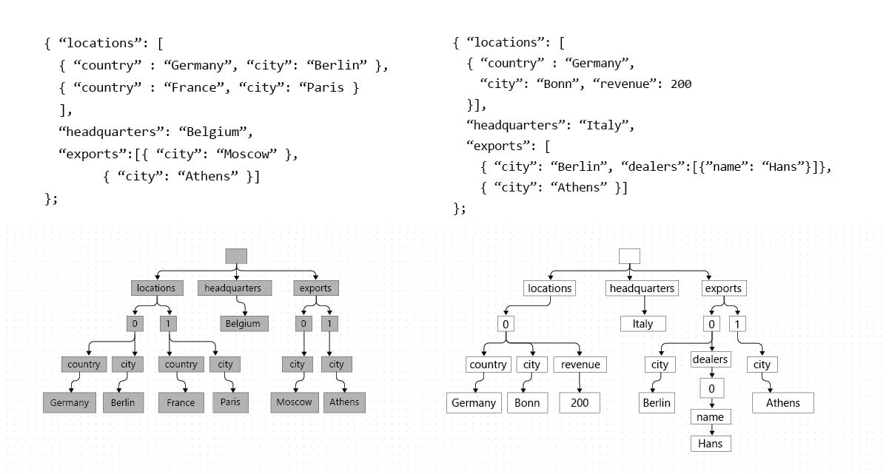
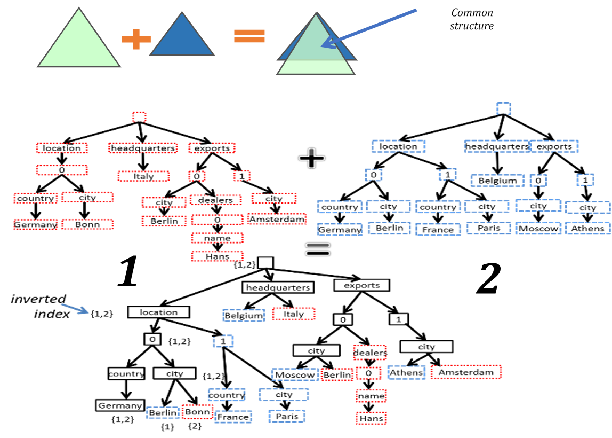
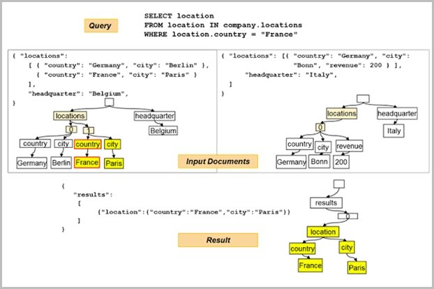
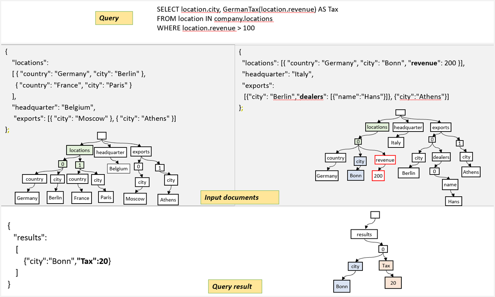

# Indexing in Azure Cosmos DB

Azure Cosmos DB is a schema-agnostic database and allows you to iterate on your application quickly without having to deal with schema or index management. By default, Azure Cosmos DB automatically indexes all items in your container without requiring schema or secondary indexes from developers.

## Items as trees

By projecting items in a container as JSON documents and representing them as trees, Azure Cosmos DB normalizes both the structure and the instance values across items into the unifying concept of a **dynamically encoded path structure**. In this representation, each label in a JSON document, which includes both the property names and their values becomes a node of the tree. The leaves of the tree contain actual values and the intermediate nodes contain the schema information. The following image represents the trees created for two items(1 and 2) in a container:

A pseudo root node is created as a parent to the actual nodes corresponding to the labels in the document underneath. The nested data structures drive the hierarchy in the tree. Intermediate artificial nodes labeled with numeric values (for example, 0, 1, ...) are employed for representing enumerations, and array indices.

## Index paths

Azure Cosmos DB projects items as JSON documents and index as trees. You can then tune to the policies for paths within the tree. You can choose to include or exclude paths from indexing. This can offer improved write performance and lower the index storage for scenarios where the query patterns are known ahead. to learn more, see [Index Paths](index-paths.md).

## Indexing: Under the hood

Azure Cosmos database applies automatic indexing to the data, where every path in a tree is indexed unless you configure to exclude certain paths.

Azure Cosmos database employs inverted index data structure to store the information of each item and to facilitate efficient representation for querying. The index tree is a document that is constructed with the union of all of the trees representing individual items in the container. The index tree grows over time as new items are added or existing items are updated in the container. Unlike relational database indexing, Azure Cosmos DB doesn't restart the indexing from scratch as new fields are introduced, new items are added to the existing structure. 

Each node of the index tree is an index entry containing the label and position values, called the term, and the ids of the items, called the postings. The postings in the curly brackets (for example {1,2}) in the inverted index figure correspond to the items such as Document1 and Document2 containing the given label value. An important implication of treating both the schema labels and instance values uniformly is that everything is packed inside a large index. An instance value that is still in the leaves is not repeated, it can be in different roles across items, with different schema labels, but it is the same value. The following image shows inverted indexing for different items:

> [!NOTE]
> The inverted index may appear similar to the indexing structures used in a search engine in the information retrieval domain. With this method, Azure Cosmos DB allows you to search your database for any item regardless of its schema structure.

For the normalized path, the index encodes the forward path all the way from the root to the value, along with the type information of the value. The path and the value are encoded to provide various types of indexing such as range, spatial kinds. The value encoding is designed to provide unique value or a composition of a set of paths.

## Querying with indexes

The inverted index allows a query to identify the documents that match the query predicate quickly. By treating both the schema and instance values uniformly in terms of paths, the inverted index is also a tree. Thus, the index and the results can be serialized to a valid JSON document and returned as documents themselves as they are returned in the tree representation. This method enables recursing over the results for additional querying. The following image illustrates an example of indexing in a point query:  

For a range query, GermanTax is a user-defined function executed as part of query processing. The user-defined function is any registered, Javascript function that can provide rich programming logic integrated into the query. The following image illustrates an example of indexing in a range query:

## Next steps

Read more about indexing in the following articles:

- [Indexing policy](index-policy.md)
- [Index types](index-types.md)
- [Index paths](index-paths.md)
- [How to manage indexing policy](how-to-manage-indexing-policy.md)