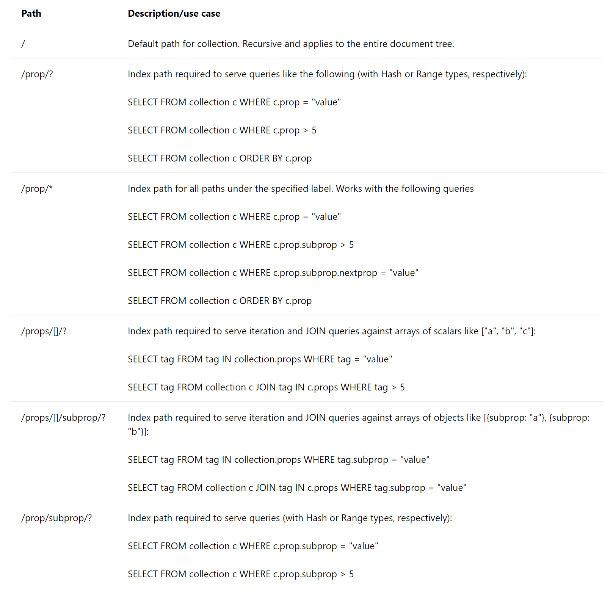

# Index paths in Azure Cosmos DB

Index paths start with the root (`/`) and typically end with the `?` wildcard operator. This pattern denotes that there are multiple possible values for the prefix. For example, to serve SELECT * FROM Families F WHERE F.familyName = "Andersen", you must include an index path for `/familyName/?` in the container’s index policy.

Index paths can also use the `*` wildcard operator to specify the behavior for paths recursively under the prefix. For example, `/payload/*` can be used to exclude everything under the payload property from indexing.

Here are the common patterns for specifying index paths:

When you set custom index paths, you're required to specify the default indexing rule for the entire item, denoted by the special path `/*`.

### Next steps

- [Overview of indexing](TBD)
- [Indexing policy](TBD)
- [Modifying indexing policy](TBD)
- [Index types](TBD)
- [Opt in and opt out of indexing](TBD)
- [Changes to the indexing policy specification](TBD)
- [Indexing Examples](TBD)
