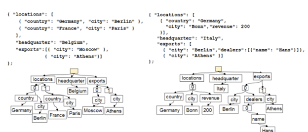

# Indexing in Azure Cosmos DB

Cosmos DB is a schema-agnostic database and allows you to iterate your app quickly without having to deal with schema or index management. By default, Cosmos DB automatically indexes all items in your container without requiring schema or secondary indexes from developers.

## Items as trees

By projecting items in a container as JSON documents and representing them as trees, Cosmos DB normalizes both the structure and the instance values across items into the unifying concept of a **dynamically encoded path structure**. In this representation, each label in a JSON document, including both the property names and their values, becomes a node of the tree. The leaves contain actual values and the intermediate nodes the schema information.

The figure above shows the trees created for an item 1 and 2 in a container. A (pseudo) root node is created to parent the rest of the (actual) nodes corresponding to the labels in the document underneath. The nested data structures drive the hierarchy in the tree. Intermediate artificial nodes labeled with numeric values (e.g., 0, 1, ...) are employed for representing enumerations, array indices.

## Index paths

Cosmos DB projects items as JSON documents and the index as trees. You can then tune to policies for paths within the tree. Within the items, you can choose the paths to include or exclude from indexing. This can offer improved write performance and lower index storage for scenarios in which the query patterns are known beforehand. See [Index Paths](index-paths.md).

## Indexing: Under the hood

Cosmos DB applies automatic indexing, where every path in a tree is indexed (unless you configure it to exclude certain paths).

Cosmos DB employs inverted index data structure to store the information of each item and to facilitate efficient representation for querying. The index tree is a document which is constructed out of the union of all of the trees representing individual items within the container. The index tree grows over time as new items get added or updated to the container. In contrast to relational database indexing, there is no need for restarting indexing from scratch as new fields are introduced.

Each node of the index tree is an index entry containing the label and position values, called the term, and the ids of the items, called the postings. The postings in the curly brackets (e.g. {1,2}) in the inverted index figure correspond to the items (e.g., Document1 and Document2) containing the given label value. An important implication of treating both the schema labels and instance values uniformly is that everything is packed inside a big index. An instance value (still in the leaves) is not repeated, it can be in different roles across items, with different schema labels, but it is the same value.

> [!Note]
> The inverted index may appear similar to the indexing structures used in a search engine in the information retrieval domain. In that sense, Cosmos DB allows you to search your database for anything added to it regardless of its schema structure.

For the normalized path, the index encodes the forward path all the way from the root till the value, along with the type information of the value. The path and the value are encoded to provide various types of indexing such as range, spatial kinds. The value encoding is designed to provide unique value or a composition of a set of paths.

## Querying with indexes

You can query the containers using queries. The below figures illustrate point querying and range querying. The inverted index allows the query to identify the documents that match the query predicate quickly. By treating both the schema and instance values uniformly in terms of paths, the inverted index is also a tree. Thus, the index and the results can be serialized to a valid JSON document and returned as documents themselves as they are returned in the tree representation. This enables recursing over these results for additional querying.

For the second query, a range query, GermanTax is a user defined function executed as part of query processing. The user defined function is any apriori, registered, Javascript function that can provide rich programming logic integrated into the query.

## Next steps

Read more about indexing in the following articles:

- [Indexing policy](indexing-policy.md)
- [Index types](index-types.md)
- [Index paths](index-paths.md)
- [How to manage indexing policy](how-to-manage-indexing-policy.md)