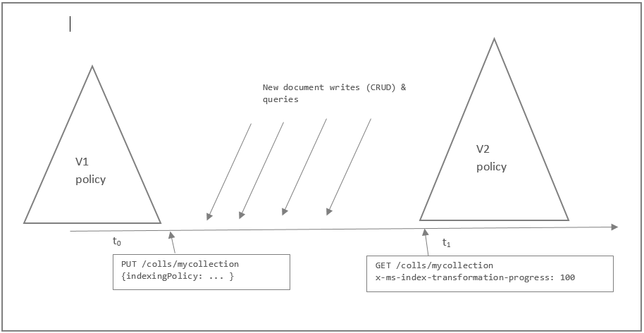

# How does Azure Cosmos DB index data?

By default, all Azure Cosmos DB data is indexed. Although many customers are happy to let Azure Cosmos DB automatically handle all aspects of indexing, you can specify a custom *indexing policy* for collections during creation in Azure Cosmos DB. Indexing policies in Azure Cosmos DB are more flexible and powerful than secondary indexes that are offered in other database platforms. In Azure Cosmos DB, you can design and customize the shape of the index without sacrificing schema flexibility. 

To learn how indexing works in Azure Cosmos DB, it's important to understand that when you manage indexing policy, you can make fine-grained trade-offs between index storage overhead, write and query throughput, and query consistency.  

In the following video, Azure Cosmos DB Program Manager Andrew Liu demonstrates the Azure Cosmos DB automatic indexing capabilities, and how to tune and configure the indexing policy on your Azure Cosmos DB container. 

>[!VIDEO https://www.youtube.com/embed/uFu2D-GscG0]

In this article, we take a close look at Azure Cosmos DB indexing policies, at how to customize indexing policy, and associated trade-offs. 

After reading this article, you'll be able to answer the following questions:

* How can I override the properties to include or exclude from indexing?
* How can I configure the index for eventual updates?
* How can I configure indexing to perform ORDER BY or range queries?
* How do I make changes to a collection’s indexing policy?
* How do I compare storage and performance of different indexing policies?

## <a id="Indexing"></a> Cosmos DB indexing

The purpose of database indexes is to serve queries in their various forms and shapes with minimum resource consumption (like CPU and input/output) while providing good throughput and low latency. Often, the choice of the right index for querying a database requires much planning and experimentation. This approach poses a challenge for schema-less databases where the data doesn’t conform to a strict schema and evolves rapidly. 

Therefore, when we designed the Cosmos DB indexing subsystem, we set the following goals:

* Index documents without requiring schema: The indexing subsystem does not require any schema information or make any assumptions about schema of the documents.  

* Support for efficient, rich hierarchical, and relational queries: The index supports the Cosmos DB query language efficiently, including support for hierarchical and relational projections.  

* Support for consistent queries in face of a sustained volume of writes: For high write throughput workloads with consistent queries, the index is updated incrementally, efficiently, and online in the face of a sustained volume of writes. The consistent index update is crucial to serve the queries at the consistency level in which the user configured the document service.  

* Support for multi-tenancy: Given the reservation-based model for resource governance across tenants, index updates are performed within the budget of system resources (CPU, memory, and input/output operations per second) allocated per replica.  

* Storage efficiency: For cost effectiveness, the on-disk storage overhead of the index is bounded and predictable. This is crucial because Cosmos DB allows the developer to make cost-based tradeoffs between index overhead in relation to the query performance.  

## Customize the indexing policy of a collection <a id="CustomizingIndexingPolicy"></a>  
You can customize the trade-offs between storage, write and query performance, and query consistency by overriding the default indexing policy on an Azure Cosmos DB collection. You can configure the following aspects:

* **Include or exclude documents and paths to and from the index**. You can exclude or include specific documents in the index when you insert or replace the documents in the collection. You can also include or exclude specific JSON properties, also called *paths*, to be indexed across documents that are included in an index. Paths include wildcard patterns.
* **Configure various index types**. For each included path, you can specify the type of index the path requires for a collection. You can specify the type of index based on the path's data, the expected query workload, and numeric/string "precision."
* **Configure index update modes**. Azure Cosmos DB supports three indexing modes: Consistent, Lazy, and None. You can configure the indexing modes via the indexing policy on an Azure Cosmos DB collection. 

The following Microsoft .NET code snippet shows how to set a custom indexing policy when you create a collection. In this example, we set the policy with a Range index for strings and numbers at the maximum precision. You can use this policy to execute ORDER BY queries against strings.

    DocumentCollection collection = new DocumentCollection { Id = "myCollection" };

    collection.IndexingPolicy = new IndexingPolicy(new RangeIndex(DataType.String) { Precision = -1 });
    collection.IndexingPolicy.IndexingMode = IndexingMode.Consistent;

    await client.CreateDocumentCollectionAsync(UriFactory.CreateDatabaseUri("db"), collection);   


> [!NOTE]
> The JSON schema for indexing policy changed with the release of REST API version 2015-06-03. With that release, the JSON schema for indexing policy supports Range indexes against strings. .NET SDK 1.2.0 and Java, Python, and Node.js SDKs 1.1.0 support the new policy schema. Earlier versions of the SDK use the REST API version 2015-04-08. They support the earlier schema for indexing policy.
> 
> By default, Azure Cosmos DB indexes all string properties within documents consistently with a Hash index. It indexes all numeric properties within documents consistently with a Range index.  
> 
> 

### Customize the indexing policy in the portal

You can change the indexing policy of a collection in the Azure portal: 

1. In the portal, go to your Azure Cosmos DB account, and then select your collection. 
2. In the left navigation menu, select **Settings**, and then select **Indexing Policy**. 
3. Under **Indexing Policy**, change your indexing policy, and then select **OK**. 

### Database indexing modes <a id="indexing-modes"></a>  
Azure Cosmos DB supports three indexing modes that you can configure via the indexing policy on an Azure Cosmos DB collection: Consistent, Lazy, and None.

**Consistent**: If an Azure Cosmos DB collection’s policy is Consistent, the queries on a specific Azure Cosmos DB collection follow the same consistency level as specified for the point-reads (strong, bounded-staleness, session, or eventual). The index is updated synchronously as part of the document update (insert, replace, update, and delete a document in an Azure Cosmos DB collection).

Consistent indexing supports consistent queries at the cost of a possible reduction in write throughput. This reduction is a function of the unique paths that need to be indexed and the "consistency level." Consistent indexing mode is designed for "write quickly, query immediately" workloads.

**Lazy**:  The index is updated asynchronously when an Azure Cosmos DB collection is quiescent, that is, when the collection’s throughput capacity is not fully utilized to serve user requests.  Note that you might get inconsistent results because data is ingested and indexed slowly. This means that your COUNT queries or specific query results might not be consistent or repeatable at  given time. 

The index is generally in catch-up mode with ingested data. With Lazy indexing, time to live (TTL) changes result in the index being dropped and re-created. This makes the COUNT and query results inconsistent for a period of time. Most Azure Cosmos DB accounts should use the Consistent indexing mode.

**None**: A collection that has a None index mode has no index associated with it. This is commonly used if Azure Cosmos DB is used as a key-value storage, and documents are accessed only by their ID property. 

> [!NOTE]
> Configuring the indexing policy with as None has the side effect of dropping any existing index. Use this if your access patterns require only ID or self-link.
> 
> 

The following table shows the consistency for queries based on the indexing mode (Consistent and Lazy) configured for the collection and the consistency level specified for the query request. This applies to queries made by using any interface: REST API, SDKs, or from within stored procedures and triggers. 

|Consistency|Indexing mode: Consistent|Indexing mode: Lazy|
|---|---|---|
|Strong|Strong|Eventual|
|Bounded staleness|Bounded staleness|Eventual|
|Session|Session|Eventual|
|Eventual|Eventual|Eventual|

Azure Cosmos DB returns an error for queries made on collections that have a None indexing mode. Queries can still be executed as scans via the explicit **x-ms-documentdb-enable-scan** header in the REST API or the **EnableScanInQuery** request option by using the .NET SDK. Some query features, like ORDER BY, are not supported as scans with **EnableScanInQuery**.

The following table shows the consistency for queries based on the indexing mode (Consistent, Lazy, and None) when **EnableScanInQuery** is specified.

|Consistency|Indexing Mode: Consistent|Indexing Mode: Lazy|Indexing Mode: None|
|---|---|---|---|
|Strong|Strong|Eventual|Strong|
|Bounded staleness|Bounded staleness|Eventual|Bounded staleness|
|Session|Session|Eventual|Session|
|Eventual|Eventual|Eventual|Eventual|

The following code sample show how create an Azure Cosmos DB collection by using the .NET SDK with Consistent indexing on all document insertions.

     // Default collection creates a Hash index for all string fields and a Range index for all numeric    
     // fields. Hash indexes are compact and offer efficient performance for equality queries.

     var collection = new DocumentCollection { Id ="defaultCollection" };

     collection.IndexingPolicy.IndexingMode = IndexingMode.Consistent;

     collection = await client.CreateDocumentCollectionAsync(UriFactory.CreateDatabaseUri("mydb"), collection);


### Index paths
Azure Cosmos DB models JSON documents and the index as trees. You can tune to policies for paths within the tree. Within documents, you can choose the paths to include or exclude from indexing. This can offer improved write performance and lower index storage for scenarios in which the query patterns are known beforehand.

Index paths start with the root (/) and typically end with the ? wildcard operator. This denotes that there are multiple possible values for the prefix. For example, to serve SELECT * FROM Families F WHERE F.familyName = "Andersen", you must include an index path for /familyName/? in the collection’s index policy.

Index paths can also use the \* wildcard operator to specify the behavior for paths recursively under the prefix. For example, /payload/* can be used to exclude everything under the payload property from indexing.

Here are the common patterns for specifying index paths:

| Path                | Description/use case                                                                                                                                                                                                                                                                                         |
| ------------------- | ------------------------------------------------------------------------------------------------------------------------------------------------------------------------------------------------------------------------------------------------------------------------------------------------------------ |
| /                   | Default path for collection. Recursive and applies to the entire document tree.                                                                                                                                                                                                                                   |
| /prop/?             | Index path required to serve queries like the following (with Hash or Range types, respectively):<br><br>SELECT FROM collection c WHERE c.prop = "value"<br><br>SELECT FROM collection c WHERE c.prop > 5<br><br>SELECT FROM collection c ORDER BY c.prop                                                                       |
| /prop/*             | Index path for all paths under the specified label. Works with the following queries<br><br>SELECT FROM collection c WHERE c.prop = "value"<br><br>SELECT FROM collection c WHERE c.prop.subprop > 5<br><br>SELECT FROM collection c WHERE c.prop.subprop.nextprop = "value"<br><br>SELECT FROM collection c ORDER BY c.prop         |
| /props/[]/?         | Index path required to serve iteration and JOIN queries against arrays of scalars like ["a", "b", "c"]:<br><br>SELECT tag FROM tag IN collection.props WHERE tag = "value"<br><br>SELECT tag FROM collection c JOIN tag IN c.props WHERE tag > 5                                                                         |
| /props/[]/subprop/? | Index path required to serve iteration and JOIN queries against arrays of objects like [{subprop: "a"}, {subprop: "b"}]:<br><br>SELECT tag FROM tag IN collection.props WHERE tag.subprop = "value"<br><br>SELECT tag FROM collection c JOIN tag IN c.props WHERE tag.subprop = "value"                                  |
| /prop/subprop/?     | Index path required to serve queries (with Hash or Range types, respectively):<br><br>SELECT FROM collection c WHERE c.prop.subprop = "value"<br><br>SELECT FROM collection c WHERE c.prop.subprop > 5                                                                                                                    |

> [!NOTE]
> When you set custom index paths, you are required to specify the default indexing rule for the entire document tree, which is denoted by the special path "/*". 
> 
> 

The following example configures a specific path with Range index and a custom precision value of 20 bytes:

```
    var collection = new DocumentCollection { Id = "rangeSinglePathCollection" };    

    collection.IndexingPolicy.IncludedPaths.Add(
        new IncludedPath { 
            Path = "/Title/?", 
            Indexes = new Collection<Index> { 
                new RangeIndex(DataType.String) { Precision = 20 } } 
            });

    // Default for everything else
    collection.IndexingPolicy.IncludedPaths.Add(
        new IncludedPath { 
            Path = "/*" ,
            Indexes = new Collection<Index> {
                new HashIndex(DataType.String) { Precision = 3 }, 
                new RangeIndex(DataType.Number) { Precision = -1 } 
            }
        });

    collection = await client.CreateDocumentCollectionAsync(UriFactory.CreateDatabaseUri("db"), pathRange);
```

When a path is added for indexing, both numbers and strings within those paths are indexed. So even though you define indexing for strings only, Azure Cosmos DB adds default definition for numbers as well. In other words, Azure Cosmos DB has the ability for path exclusion from indexing policy, but not type exclusion from a specific path. Following is an example, note that only one index is specified for both paths (Path =  "/*" and Path =  "/\"attr1\"/?") but the Number datatype is also added to the result.

```
var indices = new[]{
                new IncludedPath  {
                    Indexes = new Collection<Index>
                    {
                        new RangeIndex(DataType.String) { Precision = 3 }// <- note: only 1 index specified
                    },
                    Path =  "/*"
                },
                new IncludedPath  {
                    Indexes = new Collection<Index>
                    {
                        new RangeIndex(DataType.String) { Precision = 3 } // <- note: only 1 index specified
                    },
                    Path =  "/\"attr1\"/?"
                }
            };...

            foreach (var index in indices)
            {
                documentCollection.IndexingPolicy.IncludedPaths.Add(index);
            }
```

Result of index creation:

```json
{
    "indexingMode": "consistent",
    "automatic": true,
    "includedPaths": [
        {
            "path": "/*",
            "indexes": [
                {
                    "kind": "Range",
                    "dataType": "String",
                    "precision": 3
                },
                {
                    "kind": "Range",
                    "dataType": "Number",
                    "precision": -1
                }
            ]
        },
        {
            "path": "/\"attr\"/?",
            "indexes": [
                {
                    "kind": "Range",
                    "dataType": "String",
                    "precision": 3
                },
                {
                    "kind": "Range",
                    "dataType": "Number",
                    "precision": -1
                }
            ]
        }
    ],
}
```

### Index data types, kinds, and precisions
You have multiple options when you configure the indexing policy for a path. You can specify one or more indexing definitions for every path:

* **Data type**: String, Number, Point, Polygon, or LineString (can contain only one entry per data type per path).
* **Index kind**: Hash (equality queries), Range (equality, range or ORDER BY queries), or Spatial (spatial queries) .
* **Precision**: For a Hash index, this varies from 1 to 8 for both strings and numbers. The default is 3. For a Range index, this value can be -1 (maximum precision). It can vary from between 1 and 100 (maximum precision) for string or number values.

#### Index kind
Azure Cosmos DB supports Hash index and Range index kinds for every path that can be configured for String or Number data types, or both.

* **Hash** supports efficient equality and JOIN queries. For most use cases, Hash indexes don't need a higher precision than the default value of 3 bytes. The data type can be String or Number.
* **Range** supports efficient equality queries, range queries (using >, <, >=, <=, !=), and ORDER BY queries. ORDER By queries by default also require maximum index precision (-1). The data type can be String or Number.

Azure Cosmos DB also supports the Spatial index kind for every path that can be specified for the Point, Polygon, or LineString data types. The value at the specified path must be a valid GeoJSON fragment like `{"type": "Point", "coordinates": [0.0, 10.0]}`.

* **Spatial** supports efficient spatial (within and distance) queries. The data type can be Point, Polygon, or LineString.

> [!NOTE]
> Azure Cosmos DB supports automatic indexing of Point, Polygon, and LineString data types.
> 
> 

Here are the supported index kinds and examples of queries that they can be used to serve:

| Index kind | Description/use case                                                                                                                                                                                                                                                                                                                                                                                                              |
| ---------- | --------------------------------------------------------------------------------------------------------------------------------------------------------------------------------------------------------------------------------------------------------------------------------------------------------------------------------------------------------------------------------------------------------------------------------- |
| Hash       | Hash over /prop/? (or /) can be used to serve the following queries efficiently:<br><br>SELECT FROM collection c WHERE c.prop = "value"<br><br>Hash over /props/[]/? (or / or /props/) can be used to serve the following queries efficiently:<br><br>SELECT tag FROM collection c JOIN tag IN c.props WHERE tag = 5                                                                                                                       |
| Range      | Range over /prop/? (or /) can be used to serve the following queries efficiently:<br><br>SELECT FROM collection c WHERE c.prop = "value"<br><br>SELECT FROM collection c WHERE c.prop > 5<br><br>SELECT FROM collection c ORDER BY c.prop                                                                                                                                                                                                              |
| Spatial     | Range over /prop/? (or /) can be used to serve the following queries efficiently:<br><br>SELECT FROM collection c<br><br>WHERE ST_DISTANCE(c.prop, {"type": "Point", "coordinates": [0.0, 10.0]}) < 40<br><br>SELECT FROM collection c WHERE ST_WITHIN(c.prop, {"type": "Polygon", ... }) --with indexing on points enabled<br><br>SELECT FROM collection c WHERE ST_WITHIN({"type": "Point", ... }, c.prop) --with indexing on polygons enabled              |

By default, an error is returned for queries with range operators such as >= if there is no Range index (of any precision) to signal that a scan might be necessary to serve the query. Range queries can be performed without a Range index by using the **x-ms-documentdb-enable-scan** header in the REST API or the **EnableScanInQuery** request option by using the .NET SDK. If there are any other filters in the query that Azure Cosmos DB can use the index to filter against, no error is returned.

The same rules apply for spatial queries. By default, an error is returned for spatial queries if there is no spatial index, and there are no other filters that can be served from the index. They can be performed as a scan by using **x-ms-documentdb-enable-scan** or **EnableScanInQuery**.

#### Index precision
You can use index precision to make trade-offs between index storage overhead and query performance. 
For numbers, we recommend using the default precision configuration of -1 (maximum). Because numbers are 8 bytes in JSON, this is equivalent to a configuration of 8 bytes. Choosing a lower value for precision, such as 1 through 7, means that values within some ranges map to the same index entry. Therefore, you reduce index storage space, but query execution might have to process more documents. Consequently, it consumes more throughput in request units.

Index precision configuration has more practical application with string ranges. Because strings can be any arbitrary length, the choice of the index precision might affect the performance of string range queries. It also might affect the amount of index storage space that's required. String Range indexes can be configured with 1 through 100 or -1 (maximum). If you want to perform ORDER BY queries against string properties, you must specify a precision of -1 for the corresponding paths.

Spatial indexes always use the default index precision for all types (Point, LineString, and Polygon). The default index precision for spatial indexes can't be overridden. 

The following example shows how to increase the precision for Range indexes in a collection by using the .NET SDK. 

**Create a collection with a custom index precision**

    var rangeDefault = new DocumentCollection { Id = "rangeCollection" };

    // Override the default policy for strings to Range indexing and "max" (-1) precision
    rangeDefault.IndexingPolicy = new IndexingPolicy(new RangeIndex(DataType.String) { Precision = -1 });

    await client.CreateDocumentCollectionAsync(UriFactory.CreateDatabaseUri("db"), rangeDefault);   


> [!NOTE]
> Azure Cosmos DB returns an error when a query uses ORDER BY but doesn't have a Range index against the queried path with the maximum precision. 
> 
> 

Similarly, you can completely exclude paths from indexing. The next example shows how to exclude an entire section of the documents (a *subtree*) from indexing by using the \* wildcard operator.

    var excluded = new DocumentCollection { Id = "excludedPathCollection" };
    excluded.IndexingPolicy.IncludedPaths.Add(new IncludedPath { Path = "/*" });
    excluded.IndexingPolicy.ExcludedPaths.Add(new ExcludedPath { Path = "/nonIndexedContent/*" });

    await client.CreateDocumentCollectionAsync(UriFactory.CreateDatabaseUri("db"), excluded);


## Opt in and opt out of indexing
You can choose whether you want the collection to automatically index all documents. By default, all documents are automatically indexed, but you can turn off automatic indexing. When indexing is turned off, documents can be accessed only through their self-links or by queries by using the document ID.

With automatic indexing turned off, you can still selectively add only specific documents to the index. Conversely, you can leave automatic indexing on and selectively choose to exclude specific documents. Indexing on/off configurations are useful when you have only a subset of documents that needs to be queried.

The following sample shows how to include a document explicitly by using the [SQL API .NET SDK](https://docs.microsoft.com/azure/cosmos-db/sql-api-sdk-dotnet) and the [RequestOptions.IndexingDirective](http://msdn.microsoft.com/library/microsoft.azure.documents.client.requestoptions.indexingdirective.aspx) property.

    // If you want to override the default collection behavior to either
    // exclude (or include) a document in indexing,
    // use the RequestOptions.IndexingDirective property.
    client.CreateDocumentAsync(UriFactory.CreateDocumentCollectionUri("db", "coll"),
        new { id = "AndersenFamily", isRegistered = true },
        new RequestOptions { IndexingDirective = IndexingDirective.Include });

## Modify the indexing policy of a collection
In Azure Cosmos DB, you can make changes to the indexing policy of a collection on the fly. A change in indexing policy on an Azure Cosmos DB collection can lead to a change in the shape of the index. The change affects the paths that can be indexed, their precision, and the consistency model of the index itself. A change in indexing policy effectively requires a transformation of the old index into a new index. 

**Online index transformations**



Index transformations are made online. This means that the documents indexed per the old policy are efficiently transformed per the new policy *without affecting the write availability or the provisioned throughput* of the collection. The consistency of read and write operations made by using the REST API, SDKs, or from within stored procedures and triggers is not affected during index transformation. 

Changing indexing policy is an asynchronous process and the time to complete the operation depends on the number of documents, provisioned RUs, and size of documents. While re-indexing is in progress, your query may not return all matching results if the query uses the index that is being modified and queries will not return any errors/failures. While re-indexing is in progress, queries are eventually consistent regardless of the indexing mode configuration(Consistent or Lazy). After the index transformation is complete, you will continue to see consistent results. This also applies to queries from all interfaces: REST API, SDKs, and from within stored procedures and triggers. Just like with Lazy indexing, index transformation is performed asynchronously in the background on the replicas by using the spare resources that are available for a specific replica. 

Index transformations are also made in place. Azure Cosmos DB doesn't maintain two copies of the index and swap out the old index with the new one. This means that no additional disk space is required or consumed in your collections while index transformations occur.

When you change indexing policy, changes are applied to move from the old index to the new primarily based on the indexing mode configurations. Indexing mode configurations play a larger role than other values like included/excluded paths, index kinds, and precisions. 

If your old and new policies both use Consistent indexing, Azure Cosmos DB performs an online index transformation. You can't apply another indexing policy change that has Consistent indexing mode while the transformation is in progress. However, you can move to Lazy or None indexing mode while a transformation is in progress: 

* When you move to Lazy, the index policy change is effective immediately. Azure Cosmos DB starts re-creating the index asynchronously. 
* When you move to None, the index is dropped immediately. Moving to None is useful when you want to cancel an in-progress transformation, and start fresh with a different indexing policy. 

The following code snippet shows how to modify a collection's indexing policy from Consistent indexing mode to Lazy indexing mode. If you’re using the .NET SDK, you can kick off an indexing policy change by using the new **ReplaceDocumentCollectionAsync** method.

**Modify indexing policy from Consistent to Lazy**

    // Switch to Lazy indexing mode.
    Console.WriteLine("Changing from Default to Lazy IndexingMode.");

    collection.IndexingPolicy.IndexingMode = IndexingMode.Lazy;

    await client.ReplaceDocumentCollectionAsync(collection);

**Track progress of index transformation**

You can track the percentage progress of the index transformation to a Consistent index by using the **IndexTransformationProgress** response property from a **ReadDocumentCollectionAsync** call. Other SDKs, and the REST API, support equivalent properties and methods for making indexing policy changes. You can check the progress of an index transformation to a Consistent index by calling  **ReadDocumentCollectionAsync**: 

    long smallWaitTimeMilliseconds = 1000;
    long progress = 0;

    while (progress < 100)
    {
        ResourceResponse<DocumentCollection> collectionReadResponse = await client.ReadDocumentCollectionAsync(
            UriFactory.CreateDocumentCollectionUri("db", "coll"));

        progress = collectionReadResponse.IndexTransformationProgress;

        await Task.Delay(TimeSpan.FromMilliseconds(smallWaitTimeMilliseconds));
    }

> [!NOTE]
> * The **IndexTransformationProgress** property is applicable only when transforming to a Consistent index. Use the **ResourceResponse.LazyIndexingProgress** property for tracking transformations to a Lazy index.
> * The **IndexTransformationProgress** and the **LazyIndexingProgress** properties are populated only for a non-partitioned collection, that is, a collection that is created without a partition key.
>

You can drop the index for a collection by moving to the None indexing mode. This might be a useful operational tool if you want to cancel an in-progress transformation, and then immediately start a new one.

**Drop the index for a collection**

    // Switch to Lazy indexing mode.
    Console.WriteLine("Dropping index by changing to the None IndexingMode.");

    collection.IndexingPolicy.IndexingMode = IndexingMode.None;

    await client.ReplaceDocumentCollectionAsync(collection);

When would you make indexing policy changes to your Azure Cosmos DB collections? The following are the most common use cases:

* Serve consistent results during normal operation, but fall back to Lazy indexing mode during bulk data imports.
* Start using new indexing features on your current Azure Cosmos DB collections. For example, you can use geospatial querying, which requires the Spatial index kind, or ORDER BY/string range queries, which require the string Range index kind.
* Hand-select the properties to be indexed, and change them over time.
* Tune indexing precision to improve query performance or to reduce storage consumed.

> [!NOTE]
> To modify indexing policy by using **ReplaceDocumentCollectionAsync**, you must use version 1.3.0 or a later version of the .NET SDK.
> 
> For index transformation to successfully finish, ensure that there is sufficient free storage space available on the collection. If the collection reaches its storage quota, the index transformation is paused. Index transformation automatically resumes when storage space is available, for example, if you delete some documents.
> 
> 

## Performance tuning
The SQL APIs provide information about performance metrics, such as the index storage used and the throughput cost (request units) for every operation. You can use this information to compare various indexing policies, and for performance tuning.

To check the storage quota and usage of a collection, run a **HEAD** or **GET** request against the collection resource. Then, inspect the **x-ms-request-quota** and the **x-ms-request-usage** headers. In the .NET SDK, the [DocumentSizeQuota](http://msdn.microsoft.com/library/dn850325.aspx) and [DocumentSizeUsage](http://msdn.microsoft.com/library/azure/dn850324.aspx) properties in [ResourceResponse<T\>](http://msdn.microsoft.com/library/dn799209.aspx) contain these corresponding values.

     // Measure the document size usage (which includes the index size) against   
     // different policies.
     ResourceResponse<DocumentCollection> collectionInfo = await client.ReadDocumentCollectionAsync(UriFactory.CreateDocumentCollectionUri("db", "coll"));  
     Console.WriteLine("Document size quota: {0}, usage: {1}", collectionInfo.DocumentQuota, collectionInfo.DocumentUsage);


To measure the overhead of indexing on each write operation (create, update, or delete), inspect the **x-ms-request-charge** header (or the equivalent [RequestCharge](http://msdn.microsoft.com/library/dn799099.aspx) property in [ResourceResponse<T\>](http://msdn.microsoft.com/library/dn799209.aspx) in the .NET SDK) to measure the number of request units that are consumed by these operations.

     // Measure the performance (request units) of writes.     
     ResourceResponse<Document> response = await client.CreateDocumentAsync(UriFactory.CreateDocumentCollectionUri("db", "coll"), myDocument);              
     Console.WriteLine("Insert of document consumed {0} request units", response.RequestCharge);

     // Measure the performance (request units) of queries.    
     IDocumentQuery<dynamic> queryable =  client.CreateDocumentQuery(UriFactory.CreateDocumentCollectionUri("db", "coll"), queryString).AsDocumentQuery();

     double totalRequestCharge = 0;
     while (queryable.HasMoreResults)
     {
        FeedResponse<dynamic> queryResponse = await queryable.ExecuteNextAsync<dynamic>(); 
        Console.WriteLine("Query batch consumed {0} request units",queryResponse.RequestCharge);
        totalRequestCharge += queryResponse.RequestCharge;
     }

     Console.WriteLine("Query consumed {0} request units in total", totalRequestCharge);

## Changes to the indexing policy specification
A change in the schema for indexing policy was introduced July 7, 2015, with REST API version 2015-06-03. The corresponding classes in the SDK versions have new implementations to match the schema. 

The following changes were implemented in the JSON specification:

* Indexing policy supports Range indexes for strings.
* Each path can have multiple index definitions. It can have one for each data type.
* Indexing precision supports 1 through 8 for numbers, 1 through 100 for strings, and -1 (maximum precision).
* Path segments don't require a double quotation to escape each path. For example, you can add a path for **/title/?** instead of **/"title"/?**.
* The root path that represents "all paths" can be represented as **/\*** (in addition to **/**).

If you have code that provisions collections with a custom indexing policy written with version 1.1.0 of the .NET SDK or an earlier version, to move to SDK version 1.2.0, you must change your application code to handle these changes. If you don't have code that configures indexing policy, or if you plan to continue using an earlier version of the SDK, no changes are required.

For a practical comparison, here's an example of a custom indexing policy written by using REST API version 2015-06-03, followed by the same indexing policy written by using the earlier REST API version 2015-04-08.

**Current indexing policy JSON (REST API version 2015-06-03)**

    {
       "automatic":true,
       "indexingMode":"Consistent",
       "includedPaths":[
          {
             "path":"/*",
             "indexes":[
                {
                   "kind":"Hash",
                   "dataType":"String",
                   "precision":3
                },
                {
                   "kind":"Hash",
                   "dataType":"Number",
                   "precision":7
                }
             ]
          }
       ],
       "ExcludedPaths":[
          {
             "path":"/nonIndexedContent/*"
          }
       ]
    }


**Earlier indexing policy JSON (REST API version 2015-04-08)**

    {
       "automatic":true,
       "indexingMode":"Consistent",
       "IncludedPaths":[
          {
             "IndexType":"Hash",
             "Path":"/",
             "NumericPrecision":7,
             "StringPrecision":3
          }
       ],
       "ExcludedPaths":[
          "/\"nonIndexedContent\"/*"
       ]
    }


## Next steps
For index policy management samples and to learn more about the Azure Cosmos DB query language, see the following links:

* [SQL API .NET index management code samples](https://github.com/Azure/azure-documentdb-net/blob/master/samples/code-samples/IndexManagement/Program.cs)
* [SQL API REST collection operations](https://msdn.microsoft.com/library/azure/dn782195.aspx)
* [Query with SQL](sql-api-sql-query.md)

