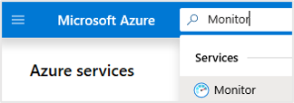
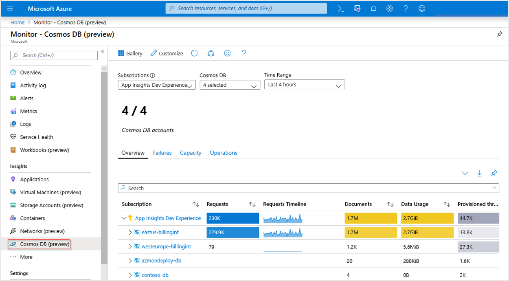
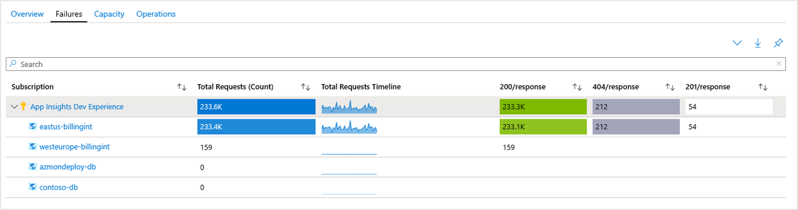
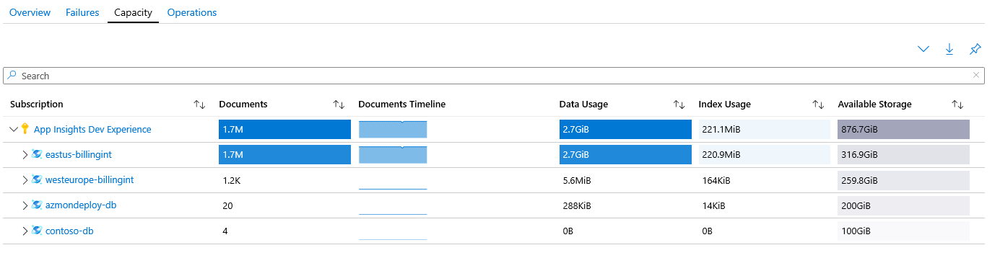
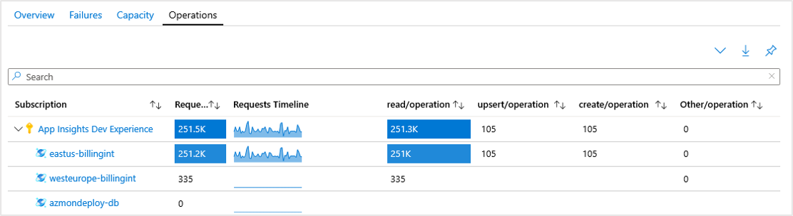
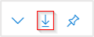
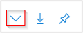
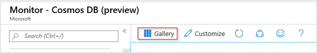

# Explore Azure Monitor Azure Cosmos DB insights

Azure Cosmos DB insights provides a view of the overall performance, failures, capacity, and operational health of all your Azure Cosmos DB resources in a unified interactive experience. This article helps you understand the benefits of this new monitoring experience, and how you can modify and adapt the experience to fit the unique needs of your organization.

## Introduction

Before you begin, you should understand how information is presented and visualized.

It delivers:

* **At-scale perspective** of your Azure Cosmos DB resources across all your subscriptions in a single location. You can selectively scope to only the subscriptions and resources that you're interested in evaluating.
* **Drill-down analysis** of a particular Azure Cosmos DB resource. You can diagnose issues or perform detailed analysis by using the categories of utilization, failures, capacity, and operations. Selecting any one of the options provides an in-depth view of the relevant Azure Cosmos DB metrics.
* **Customizable** experience built on top of Azure Monitor workbook templates. You can change what metrics are displayed, modify or set thresholds that align with your limits, and then save into a custom workbook. Charts in the workbooks can then be pinned to Azure dashboards.

This feature doesn't require you to enable or configure anything. These Azure Cosmos DB metrics are collected by default.

>[!NOTE]
>There's no charge to access this feature. You'll only be charged for the Azure Monitor essential features you configure or enable, as described on the [Azure Monitor pricing details](https://azure.microsoft.com/pricing/details/monitor/) page.

## View utilization and performance metrics for Azure Cosmos DB

To view the utilization and performance of your storage accounts across all your subscriptions:

1. Sign in to the [Azure portal](https://portal.azure.com).

1. Search for **Monitor** and select **Monitor**.

    

1. Select **Azure Cosmos DB**.

    

### Overview

On the **Overview** page, the table displays interactive Azure Cosmos DB metrics. You can filter the results based on the options you select from the following dropdown lists:

* **Subscriptions**: Only subscriptions that have an Azure Cosmos DB resource are listed.
* **Azure Cosmos DB**: You can select all, a subset, or a single Azure Cosmos DB resource.
* **Time Range**: By default, the last four hours of information are displayed based on the corresponding selections made.

The counter tile under the dropdown lists rolls up the total number of Azure Cosmos DB resources that are in the selected subscriptions. Conditional color-coding or heatmaps for columns in the workbook report transaction metrics. The deepest color has the highest value. A lighter color is based on the lowest values.

Select a dropdown arrow next to one of the Azure Cosmos DB resources to reveal a breakdown of the performance metrics at the individual database container level.

Select the Azure Cosmos DB resource name highlighted in blue to go to the default **Overview** for the associated Azure Cosmos DB account.

### Failures

Select the **Failures** tab to open the **Failures** portion of the workbook template. It shows you the total requests with the distribution of responses that make up those requests:

| Code |  Description       | 
|-----------|:--------------------|
| `200 OK`	| One of the following REST operations were successful:  - GET on a resource.   - PUT on a resource.   - POST on a resource.   - POST on a stored procedure resource to execute the stored procedure.|
| `201 Created` | A POST operation to create a resource is successful. |
| `404 Not Found` | The operation is attempting to act on a resource that no longer exists. For example, the resource might have already been deleted. |

For a full list of status codes, see [HTTP status codes for Azure Cosmos DB](/rest/api/cosmos-db/http-status-codes-for-cosmosdb).

### Capacity

Select the **Capacity** tab to open the **Capacity** portion of the workbook template. It shows you:
- How many documents you have. 
- Your document growth over time.
- Data usage.
- Total amount of available storage that you have left.

This information helps you to identify potential storage and data utilization issues.

As with the Overview workbook, selecting the dropdown next to an Azure Cosmos DB resource in the **Subscription** column reveals a breakdown by the individual containers that make up the database.

### Operations

Select the **Operations** tab to open the **Operations** portion of the workbook template. You can see your requests broken down by the type of requests made.

In the following example, you see that `eastus-billingint` is predominantly receiving read requests, but with a few upsert and create requests. You can also see that `westeurope-billingint` is read-only from a request perspective, at least over the past four hours that the workbook is currently scoped to via its time range parameter.

## View from an Azure Cosmos DB resource

1. Search for or select any of your existing Azure Cosmos DB accounts.

   :::image type="content" source="./media/insights-overview/cosmosdb-search.png" alt-text="Screenshot that shows searching for Azure Cosmos DB." border="true":::

1. After you've moved to your Azure Cosmos DB account, in the **Monitoring** section, select **Insights (preview)** or **Workbooks**. Now you can perform further analysis on throughput, requests, storage, availability, latency, system, and account management.

   :::image type="content" source="./media/insights-overview/cosmosdb-overview.png" alt-text="Screenshot that shows the Azure Cosmos DB Insights Overview page." border="true":::

### Time range

By default, the **Time Range** field displays data from the last 24 hours. You can modify the time range to display data anywhere from the last 5 minutes to the last 7 days. The time range selector also includes a **Custom** mode. Enter the start/end dates to view a custom time frame based on available data for the selected account.

:::image type="content" source="./media/insights-overview/cosmosdb-time-range.png" alt-text="Screenshot that shows the Azure Cosmos DB Time Range." border="true":::

### Insights overview

The **Overview** tab provides the most common metrics for the selected Azure Cosmos DB account, including:

* Total Requests
* Failed Requests (429s)
* Normalized RU Consumption (max)
* Data & Index Usage
* Azure Cosmos DB Account Metrics by Collection

**Total Requests**: This graph provides a view of the total requests for the account broken down by status code. The units at the bottom of the graph are a sum of the total requests for the period.

:::image type="content" source="./media/insights-overview/cosmosdb-total-requests.png" alt-text="Screenshot that shows the Azure Cosmos DB Total Requests graph." border="true":::

**Failed Requests (429s)**: This graph provides a view of failed requests with a status code of 429. The units at the bottom of the graph are a sum of the total failed requests for the period.

:::image type="content" source="./media/insights-overview/cosmosdb-429.png" alt-text="Screenshot that shows the Azure Cosmos DB Failed Requests graph." border="true":::

**Normalized RU Consumption (max)**: This graph provides the maximum percentage between 0% and 100% of Normalized RU Consumption units for the specified period.

:::image type="content" source="./media/insights-overview/cosmosdb-normalized-ru.png" alt-text="Screenshot that shows the Azure Cosmos DB Normalized RU Consumption graph." border="true":::

## Pin, export, and expand

You can pin any one of the metric sections to an [Azure dashboard](../azure-portal/azure-portal-dashboards.md) by selecting the pushpin in the upper-right corner of the section.

To export your data into the Excel format, select the down arrow to the left of the pushpin.

To expand or collapse all dropdown views in the workbook, select the expand arrow to the left of the down arrow.

## Customize Azure Cosmos DB insights

This experience is built on top of Azure Monitor workbook templates. You can use **Customize** > **Edit** > **Save** to modify and save a copy of your modified version into a custom workbook.

Workbooks are saved within a resource group. The **My Reports** section is private to you. The **Shared Reports** section is accessible to everyone with access to the resource group. After you save the custom workbook, you must go to the workbook gallery to start it.

## Troubleshooting

For troubleshooting guidance, see [Troubleshooting workbook-based insights](../azure-monitor/insights/troubleshoot-workbooks.md).

## Next steps

* Configure [metric alerts](../azure-monitor/alerts/alerts-metric.md) and [Service Health notifications](../service-health/alerts-activity-log-service-notifications-portal.md) to set up automated alerting to aid in detecting issues.
* For more information on how the scenario workbooks are designed and how to author new and customize existing reports, see [Create interactive reports with Azure Monitor workbooks](../azure-monitor/visualize/workbooks-overview.md).
