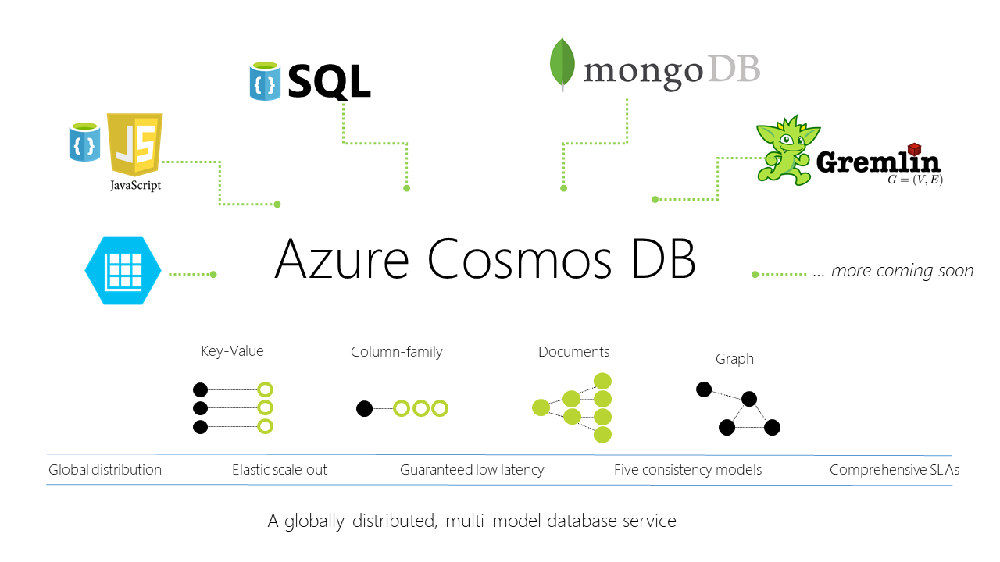

# Introduction to Azure Cosmos DB

Azure Cosmos DB is Microsoft’s globally distributed database service. The service is designed to allow you to elastically and independently scale throughput and storage across any number of geographical regions. Cosmos DB is the first globally distributed database service in the market today to offer comprehensive [service level agreements](https://azure.microsoft.com/support/legal/sla/documentdb/v1_1/) (SLAs) encompassing throughput, latency, availability, and consistency. 

 

The Cosmos DB project started in 2011 as "Project Florence" to address developer pain-points that are faced by large Internet-scale applications inside Microsoft. Cosmos DB was made generally available to external developers in 2015 in the form of [Azure DocumentDB](https://azure.microsoft.com/blog/documentdb-moving-to-general-availability/). The service is used ubiquitously internally within Microsoft, and is one of the fastest-growing services in Azure. As one of the foundational services of Azure, Cosmos DB gets installed in every [Azure region](https://azure.microsoft.com/regions) by default. 

Cosmos DB contains a write optimized, resource governed, schema-agnostic database engine capable of natively supporting multiple data models (key-value, documents, graphs and columnar) and many APIs for data access including [MongoDB](../documentdb/documentdb-protocol-mongodb.md), [DocumentDB SQL](../documentdb/documentdb-introduction.md), [Gremlin](graph-introduction.md), and [Azure Tables](table-introduction.md) natively, and in an extensible manner. 

## Key capabilities
As a globally distributed database service, Azure Cosmos DB provides the following capabilities that help you build scalable, globally distributed, highly responsive applications:

* **Elastically scale throughput and storage** based on demand, globally. Azure Cosmos DB can be scaled to any configured throughput within five seconds at the 99th percentile. Storage scales [transparently and automatically](../documentdb/documentdb-partition-data.md).

* **Build highly responsive and mission-critical applications**. Azure Cosmos DB delivers predictable and guaranteed end-to-end low read/write latencies at the 99th percentile. 

* **Ensure "always on" availability**. The service offers 99.99% availability within a single region, and can be deployed to [any number of regions](https://azure.microsoft.com/regions) for higher availability. Azure Cosmos DB let you [simulate a failure](../documentdb/documentdb-regional-failovers.md) of one or more regions associated with your database with zero-data loss guarantees. This helps you validate the end-to-end availability properties of your application. 

* **Enable developers to write correct globally distributed applications**. Writing large globally distributed applications against an "eventually consistent" database results in an application code that is hard to reason about, is brittle, and rife with correctness bugs. Azure Cosmos DB offers an [intuitive and predictable programming model](../documentdb/documentdb-consistency-levels.md) around data consistency. 

* **Offer stringent financially backed [comprehensive SLAs](https://azure.microsoft.com/support/legal/sla/documentdb/v1_1/)** for all of the capabilities we've covered so far like availability, latency, throughput, and consistency. 

* **Relieve developers from the burden of database schema/index management and versioning**. Keeping database schema and indexes in-sync with an application’s schema is especially painful for globally distributed applications. 

* **Natively support multiple data models and popular APIs for accessing data**. Azure Cosmos DB supports multiple data models (key-value, documents, graphs and columnar) and many APIs for data access natively, and in an extensible manner. 

* **Operate at a low cost** to pass on [savings to you](https://aka.ms/documentdb-tco-paper). 

Azure Cosmos DB provides the best capabilities of relational and non-relational databases.

| Capabilities | Relational DBs	| Non-relational (NoSQL) DBs | 	Azure Cosmos DB |
| --- | --- | --- | --- |
| Global distribution | x | x | ✓ (Turn-key, 30+ regions, multi-homing) |
| Horizontal scale | x | ✓ | ✓ (Independently storage and throughput) | 
| Latency guarantees | x | ✓ | ✓ (<10 ms for reads, <15 ms for writes at p99) | 
| High availability | x | ✓ | ✓ (Always on, PACELC tradeoffs, automatic & manual failover) |
| Data model + API | Relational + SQL | Multi-model + OSS API | Multi-model + SQL + OSS API (more coming soon) |
| SLAs | ✓ | x | ✓ (Comprehensive SLAs latency, throughput, consistency, availability) |

## Multi-model, multi-API database service
 Cosmos DB natively supports multiple data models including documents, key-value, graph, and column-family. The core content-model of Cosmos DB’s database engine is based on atom-record-sequence (ARS). Atoms consist of a small set of primitive types like string, bool, and number. Records are structs composed of these types. Sequences are arrays consisting of atoms, records, or sequences. 

 
 
 The database engine can efficiently translate and project different data models onto the ARS-based data model. The core data model of Cosmos DB is natively accessible from dynamically typed programming languages and can be exposed as-is as JSON. The design also enables natively supporting popular database APIs for data access and query. Cosmos DB’s database engine currently supports [DocumentDB SQL](../documentdb/documentdb-introduction.md), [MongoDB](../documentdb/documentdb-protocol-mongodb.md), [Azure Tables](table-introduction.md), and [Gremlin](graph-introduction.md). We intend to extend it to support other popular database APIs as well. You can continue to build their applications using popular OSS APIs and get all the benefits of a battle-tested and fully managed, globally distributed database service. 

 ## Horizontal scaling of storage and throughput
 All the data within a Cosmos DB container (for example, collection, table, graph) is horizontally partitioned and transparently managed by resource partitions. A resource partition is a consistent and highly available container of data partitioned by a [customer specified partition-key](../documentdb/documentdb-partition-data.md). It provides a single system image for a set of resources it manages and is a fundamental unit of scalability and distribution. Cosmos DB is designed to let you elastically scale throughput based on the application traffic patterns across different geographical regions to support fluctuating workloads varying both by geography and time. The service manages the partitions transparently without compromising the availability, consistency, latency, or throughput of a Cosmos DB container.  
 
 

You can elastically scale throughput of an Azure Cosmos DB container by programmatically [provisioning RU/s](../documentdb/documentdb-request-units.md) throughput. Internally, the service transparently manages resource partitions to deliver the throughput on a given container. Cosmos DB ensures that the throughput is available for use across all the regions associated with the container. The new throughput is effective within five seconds of the change in the configured throughput value. 

You can provision throughput on a Cosmos DB container at both, per-second and at per-minute granularities. The provisioned throughput at per-minute granularity is used to manage unexpected spikes in the workload occurring at a per-second granularity. 

## Global distribution
Azure Cosmos DB containers are distributed along two dimensions: within a given region, all resources are horizontally partitioned using resource partitions (local distribution). Each resource partition is also replicated across geographical regions (global distribution). 

 

When your storage and throughput needs to be scaled, Cosmos DB transparently performs partition management operations across all the regions. Independent of the scale, distribution, or failures, Cosmos DB continues to provide a single system image of the globally distributed resources. 

Global distribution of resources in Cosmos DB is [turn-key](../documentdb/documentdb-distribute-data-globally.md). At any time with a few button clicks (or programmatically with a single API call), you can associate any number of geographical regions with your database account. 

Regardless of the amount of data or the number of regions, Cosmos DB guarantees each newly associated region to start processing client requests under an hour at the 99th percentile. This is done by parallelizing the seeding and copying data from all the source resource partitions to the newly associated region. Customers can also remove an existing region or take a region that was previously associated with their database account offline.

### Transparent multi-homing and 99.99% high availability
You can dynamically associate "priorities" to the regions associated with your Azure Cosmos DB database account. Priorities are used to direct the requests to specific regions in the event of regional failures. In an unlikely event of a regional disaster, Cosmos DB automatically failovers in the order of priority.

To test the end-to-end availability of the application, you can [manually trigger failover](../documentdb/documentdb-regional-failovers.md) (rate limited to two operations within an hour). Cosmos DB guarantees zero data loss during manual regional failovers. In case a regional disaster occurs, Cosmos DB guarantees an upper-bound on data loss during the system-initiated automatic failover. You do not have to redeploy your application after a regional failover, and availability SLAs are maintained by Azure Cosmos DB. 

For this scenario, Cosmos DB allows you to interact with resources using either logical (region-agnostic) or physical (region-specific) endpoints. The former ensures that the application can transparently be multi-homed in case of failover. The latter provides fine-grained control to the application to redirect reads and writes to specific regions. Cosmos DB guarantees 99.99% availability SLA for every database account. The availability guarantees are agnostic of the scale (provisioned throughput and storage), number of regions, or geographical distance between regions associated with a given database. 

### Low latency guarantees at the 99th percentile
As part of its SLAs, Cosmos DB guarantees end-to-end low latency at the 99th percentile to its customers. For a typical 1-KB item, Cosmos DB guarantees end-to-end latency of reads under 10 ms and indexed writes under 15 ms at the 99th percentile, within the same Azure region. The median latencies are significantly lower (under 5 ms).  With an upper bound of request processing on every database transaction, Cosmos DB allows clients to clearly distinguish between transactions with high latency vs. a database being unavailable. 

### Multiple, well-defined consistency models
Commercial distributed databases fall into two categories: databases that do not offer well-defined, provable consistency choices at all, and databases which offer two extreme programmability choices (strong vs. eventual consistency). The former burdens application developers with minutia of their replication protocols and expects them to make difficult tradeoffs between consistency, availability, latency, and throughput. The latter puts a pressure to choose one of the two extremes. Despite the abundance of research and proposals for more than 50 consistency models, the distributed database community has not been able to commercialize consistency levels beyond strong and eventual consistency. 

Cosmos DB allows you to choose between [five well-defined consistency models](../documentdb/documentdb-consistency-levels.md) along the consistency spectrum – strong, bounded staleness, [session](http://dl.acm.org/citation.cfm?id=383631), consistent prefix, and eventual. 

The following table illustrates the specific guarantees each consistency level provides.
 
**Consistency Levels and guarantees**

| Consistency Level	| Guarantees |
| --- | --- |
| Strong | Linearizability |
| Bounded Staleness	| Consistent Prefix. Reads lag behind writes by k prefixes or t interval |
| Session	| Consistent Prefix. Monotonic reads, monotonic writes, read-your-writes, write-follows-reads |
| Consistent Prefix	| Updates returned are some prefix of all the updates, with no gaps |
| Eventual	| Out of order reads |

You can configure the default consistency level on your Cosmos DB account (and later override the consistency on a specific read request). Internally, the default consistency level applies to data within the partition sets which may be span regions. 

## Next steps
Already have an Azure account? Then you can get started with Azure Cosmos DB in the [Azure portal](https://portal.azure.com/) with one of our quickstarts:

* [Get started with Azure Cosmos DB's DocumentDB API](create-documentdb-dotnet.md)
* [Get started with Azure Cosmos DB's MongoDB API](create-mongodb-nodejs.md)
* [Get started with Azure Cosmos DB's Graph API](create-graph-gremlin-console.md)
* [Get started with Azure Cosmos DB's Table API](create-table-dotnet.md)

Don't have an Azure account? You can:

* Sign up for an [Azure free trial](https://azure.microsoft.com/free/), which gives you 30 days and $200 to try all the Azure services. 
* If you have an MSDN subscription, you are eligible for [$150 in free Azure credits per month](https://azure.microsoft.com/pricing/member-offers/msdn-benefits-details/) to use on any Azure service. 
* Download the [Azure Cosmos DB Emulator](../documentdb/documentdb-nosql-local-emulator.md) to develop your application locally.