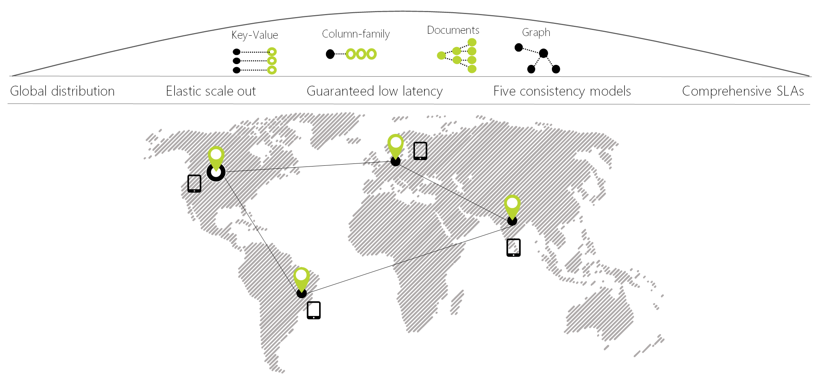

# Welcome to Azure Cosmos DB

Today’s applications are required to be highly responsive and always online. To achieve low latency and high availability, instances of these applications need to be deployed in datacenters that are close to their users. Applications need to respond in real time to large changes in usage at peak hours, store ever increasing volumes of data, and make this data available to users in milliseconds.

Azure Cosmos DB is Microsoft's globally distributed, multi-model database service. With a click of a button, Cosmos DB enables you to elastically and independently scale throughput and storage across any number of Azure regions worldwide. You can elastically scale throughput and storage, and take advantage of fast, single-digit-millisecond data access using your favorite API including SQL, MongoDB, Cassandra, Tables, or Gremlin. Cosmos DB provides comprehensive [service level agreements](https://aka.ms/acdbsla) (SLAs) for throughput, latency, availability, and consistency guarantees, something no other database service offers.

You can [Try Azure Cosmos DB for Free](https://azure.microsoft.com/try/cosmosdb/) without an Azure subscription, free of charge and commitments.

> [!div class="nextstepaction"]
> [Try Azure Cosmos DB for Free](https://azure.microsoft.com/try/cosmosdb/)

## Key Benefits

### Turnkey global distribution

Cosmos DB enables you to build highly responsive and highly available applications worldwide. Cosmos DB transparently replicates your data wherever your users are, so your users can interact with a replica of the data that is closest to them.

Cosmos DB allows you to add or remove any of the Azure regions to your Cosmos account at any time, with a click of a button. Cosmos DB will seamlessly replicate your data to all the regions associated with your Cosmos account while your application continues to be highly available, thanks to the *multi-homing* capabilities of the service. For more information, see the [global distribution](distribute-data-globally.md) article.

### Always On

By virtue of deep integration with Azure infrastructure and [transparent multi-master replication](global-dist-under-the-hood.md), Cosmos DB provides [99.999% high availability](high-availability.md) for both reads and writes. Cosmos DB also provides you with the ability to programmatically (or via Portal) invoke the regional failover of your Cosmos account. This capability helps ensure that your application is designed to failover in the case of regional disaster.

### Elastic scalability of throughput and storage, worldwide

Designed with transparent horizontal partitioning and multi-master replication, Cosmos DB offers unprecedented elastic scalability for your writes and reads, all around the globe. You can elastically scale up from thousands to hundreds of millions of requests/sec around the globe, with a single API call and pay only for the throughput (and storage) you need. This capability helps you to deal with unexpected spikes in your workloads without having to over-provision for the peak. For more information, see [partitioning in Cosmos DB](partitioning-overview.md), [provisioned throughput on containers and databases](set-throughput.md), and [scaling provisioned throughput globally](scaling-throughput.md).

### Guaranteed low latency at 99th percentile, worldwide

Using Cosmos DB, you can build highly responsive, planet scale applications. With its novel multi-master replication protocol and latch-free and [write-optimized database engine](index-policy.md), Cosmos DB guarantees less than 10-ms latencies for both, reads (indexed) and writes at the 99th percentile, all around the world. This capability enables sustained ingestion of data and blazing-fast queries for highly responsive apps.

### Precisely defined, multiple consistency choices

When building globally distributed applications in Cosmos DB, you no longer have to make extreme [tradeoffs between consistency, availability, latency, and throughput](consistency-levels-tradeoffs.md). Cosmos DB’s multi-master replication protocol is carefully designed to offer [five well-defined consistency choices](consistency-levels.md) - *strong*, *bounded staleness*, *session*, *consistent prefix*, and *eventual* — for an intuitive programming model with low latency and high availability for your globally distributed application.

### No schema or index management

Keeping database schema and indexes in-sync with an application’s schema is especially painful for globally distributed apps. With Cosmos DB, you do not need to deal with schema or index management. The database engine is fully schema-agnostic.  Since no schema and index management is required, you also don’t have to worry about application downtime while migrating schemas. Cosmos DB [automatically indexes all data](index-policy.md) and serves queries fast.

### Battle tested database service

Cosmos DB is a foundational service in Azure. For nearly a decade, Cosmos DB has been used by many of Microsoft’s products for mission critical applications at global scale, including Skype, Xbox, Office 365, Azure, and many others. Today, Cosmos DB is one of the fastest growing services on Azure, used by many external customers and mission-critical applications that require elastic scale, turnkey global distribution, multi-master replication for low latency and high availability of both reads and writes.

### Ubiquitous regional presence

Cosmos DB is available in all Azure regions worldwide, including 54+ regions in public cloud, [Azure China 21Vianet](https://www.azure.cn/en-us/), Azure Germany, Azure Government, and Azure Government for Department of Defense (DoD). See [Cosmos DB’s regional presence](regional-presence.md).

### Secure by default and enterprise ready

Cosmos DB is certified for a [wide array of compliance standards](compliance.md). Additionally, all data in Cosmos DB is encrypted at rest and in motion. Cosmos DB provides row level authorization and adheres to strict security standards.

### Significant TCO savings

Since Cosmos DB is a fully managed service, you no longer need to manage and operate complex multi datacenter deployments and upgrades of your database software, pay for the support, licensing, or operations or have to provision your database for the peak workload. For more information, see [Optimize cost with Cosmos DB](total-cost-ownership.md).

### Industry leading comprehensive SLAs

Cosmos DB is the first and only service to offer [industry-leading comprehensive SLAs](https://azure.microsoft.com/support/legal/sla/cosmos-db/) encompassing 99.999% high availability, read and write latency at the 99th percentile, guaranteed throughput, and consistency.

### Globally distributed operational analytics with Spark

You can run [Spark](spark-connector.md) directly on data stored in Cosmos DB. This capability allows you to do low-latency, operational analytics at global scale without impacting transactional workloads operating directly against Cosmos DB. For more information, see [Globally distributed operational analytics](lambda-architecture.md).

### Develop applications on Cosmos DB using popular NoSQL APIs

Cosmos DB offers a choice of APIs to work with your data stored in your Cosmos database. By default, [you can use SQL](how-to-sql-query.md) (a core API) for querying your Cosmos database. Cosmos DB also implements APIs for [Cassandra](cassandra-introduction.md), [MongoDB](mongodb-introduction.md), [Gremlin](graph-introduction.md) and [Azure Table Storage](table-introduction.md). You can point client drivers (and tools) for the commonly used NoSQL (e.g., MongoDB, Cassandra, Gremlin) directly to your Cosmos database. By supporting the wire protocols of commonly used NoSQL APIs, Cosmos DB allows you to:

* Easily migrate your application to Cosmos DB while preserving significant portions of your application logic.
* Keep your application portable and continue to remain cloud vendor-agnostic.
* Get a fully-managed cloud service with industry leading, financially backed SLAs for the common NoSQL APIs. 
* Elastically scale the provisioned throughput and storage for your databases based on your need and pay only for the throughput and storage you need. This leads to significant cost savings.

## Solutions that benefit from Azure Cosmos DB

Any [web, mobile, gaming, and IoT application](use-cases.md) that needs to handle massive amounts of data, reads, and writes at a [global scale](distribute-data-globally.md) with near-real response times for a variety of data will benefit from Cosmos DB's [guaranteed high availability](https://azure.microsoft.com/support/legal/sla/cosmos-db/), high throughput, low latency, and tunable consistency. Learn about how Azure Cosmos DB can be used to build [IoT and telematics](use-cases.md#iot-and-telematics), [retail and marketing](use-cases.md#retail-and-marketing), [gaming](use-cases.md#gaming) and [web and mobile applications](use-cases.md#web-and-mobile-applications).

## Next steps

Read more about Cosmos DB's core concepts [turnkey global distribution](distribute-data-globally.md) and [partitioning](partitioning-overview.md) and [provisioned throughput](request-units.md).

Get started with Azure Cosmos DB with one of our quickstarts:

* [Get started with Azure Cosmos DB SQL API](create-sql-api-dotnet.md)
* [Get started with Azure Cosmos DB's API for MongoDB](create-mongodb-nodejs.md)
* [Get started with Azure Cosmos DB Cassandra API](create-cassandra-dotnet.md)
* [Get started with Azure Cosmos DB Gremlin API](create-graph-dotnet.md)
* [Get started with Azure Cosmos DB Table API](create-table-dotnet.md)

> [!div class="nextstepaction"]
> [Try Azure Cosmos DB for free](https://azure.microsoft.com/try/cosmosdb/)
