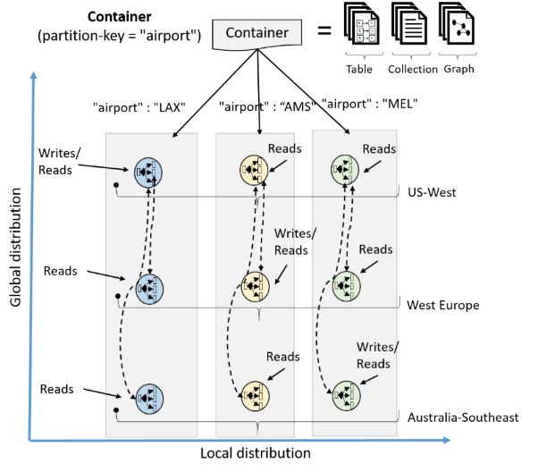
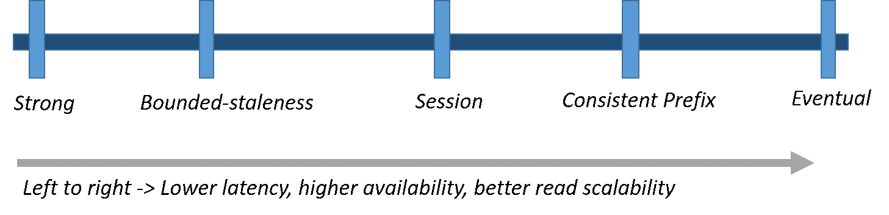

# Welcome to Azure Cosmos DB

Azure Cosmos DB is Microsoft's globally distributed, multi-model database. With the click of a button, Azure Cosmos DB enables you to elastically and independently scale throughput and storage across any number of Azure's geographic regions. It offers throughput, latency, availability, and consistency guarantees with comprehensive [service level agreements](https://aka.ms/acdbsla) (SLAs), something no other database service can offer.

Azure Cosmos DB contains a write optimized, resource governed, schema-agnostic database engine that natively supports multiple data models: key-value, documents, graphs, and columnar. It also supports many APIs for accessing data including [MongoDB](mongodb-introduction.md), [DocumentDB SQL](documentdb-introduction.md), [Gremlin](graph-introduction.md) (preview), and [Azure Tables](table-introduction.md) (preview), in an extensible manner. 

Azure Cosmos DB started in late 2010 to address developer pain-points that are faced by large scale applications inside Microsoft. Since building globally distributed applications is not a problem unique to just to Microsoft, we made the service available externally to all Azure Developers in the form of Azure DocumentDB. Azure Cosmos DB is the next big leap in the evolution of DocumentDB and we are now making it available for you to use. As a part of this release of Azure Cosmos DB, DocumentDB customers (with their data) are automatically Azure Cosmos DB customers. The transition is seamless and they now have access to a broader range of new capabilities offered by Azure Cosmos DB. 

## Capability comparison

Azure Cosmos DB provides the best capabilities of relational and non-relational databases.

| Capabilities | Relational DBs	| Non-relational (NoSQL) DBs | 	Azure Cosmos DB |
| --- | --- | --- | --- |
| Global distribution | x | x | ✓ Turnkey, 30+ regions, multi-homing |
| Horizontal scale | x | ✓ | ✓ Independently scale storage and throughput | 
| Latency guarantees | x | ✓ | ✓ <10 ms for reads, <15 ms for writes at p99 | 
| High availability | x | ✓ | ✓ Always on, PACELC tradeoffs, automatic & manual failover |
| Data model + API | Relational + SQL | Multi-model + OSS API | Multi-model + SQL + OSS API (more coming soon) |
| SLAs | ✓ | x | ✓ Comprehensive SLAs for latency, throughput, consistency, availability |

## Key capabilities
As a globally distributed database service, Azure Cosmos DB provides the following capabilities to help you build scalable, globally distributed, highly responsive applications:

* [**Turnkey global distribution**](#global-distribution)
    * Your application is instantly available to your users, everywhere. Now your data can be too.
    * Don't worry about hardware, adding nodes, VMs or cores. Just point and click, and your data is there. 

* [**Multiple data models and popular APIs for accessing and querying data**](#data-models)
    * Support for multiple data models including key-value, document, graph, and columnar.
    * Extensible APIs for Node.js, Java, .NET, .NET Core, Python, and MongoDB.
    * SQL and Gremlin for queries. 

* [**Elastically scale throughput and storage on demand, worldwide**](#horizontal-scale)
    * Easily scale throughput at [second](request-units.md) and [minute](https://aka.ms/acdbrupm) granularities, and change it anytime you want. 
    * Scale storage [transparently and automatically](partition-data.md) to cover your size requirements now and forever.

* [**Build highly responsive and mission-critical applications**](#low-latency) 
    * Get access to your data with single digit millisecond latencies at the 99th percentile, anywhere in the world. 

* [**Ensure "always on" availability**](#high-availability)
    * 99.99% availability within a single region.
    * Deploy to any number of [Azure regions](https://azure.microsoft.com/regions) for higher availability.
    * [Simulate a failure](regional-failover.md) of one or more regions with zero-data loss guarantees. 

* [**Write globally distributed applications, the right way**](#consistency)
    * [Five consistency models](consistency-levels.md) models offer strong SQL-like consistency to NoSQL-like eventual consistency, and every thing in between. 
  
* [**Money back guarantees**](#sla) 
    * Your data gets there fast, or your money back. 
    * [Service level agreements](https://aka.ms/acdbsla) for availability, latency, throughput, and consistency. 

* [**No database schema/index management**](#schema-free)
    * Stop worrying about keeping your database schema and indexes in-sync with your application’s schema. We're schema-free. 

* [**Low cost of ownership**](#tco)
    * Five to ten times [more cost effective](https://aka.ms/documentdb-tco-paper) than a non-managed solution.
    * Three times cheaper than DynamoDB.

## Global distribution
Azure Cosmos DB containers are distributed along two dimensions: 

1. Within a given region, all resources are horizontally partitioned using resource partitions (local distribution). 
2. Each resource partition is also replicated across geographical regions (global distribution). 

 

When your storage and throughput needs to be scaled, Cosmos DB transparently performs partition management operations across all the regions. Independent of the scale, distribution, or failures, Cosmos DB continues to provide a single system image of the globally distributed resources. 

Global distribution of resources in Cosmos DB is [turn-key](distribute-data-globally.md). At any time with a few button clicks (or programmatically with a single API call), you can associate any number of geographical regions with your database account. 

Regardless of the amount of data or the number of regions, Cosmos DB guarantees each newly associated region to start processing client requests under an hour at the 99th percentile. This is done by parallelizing the seeding and copying data from all the source resource partitions to the newly associated region. Customers can also remove an existing region or take a region that was previously associated with their database account offline.

## Multi-model, multi-API support
 Azure Cosmos DB natively supports multiple data models including documents, key-value, graph, and column-family. The core content-model of Cosmos DB’s database engine is based on atom-record-sequence (ARS). Atoms consist of a small set of primitive types like string, bool, and number. Records are structs composed of these types. Sequences are arrays consisting of atoms, records, or sequences. 
 
 The database engine can efficiently translate and project different data models onto the ARS-based data model. The core data model of Cosmos DB is natively accessible from dynamically typed programming languages and can be exposed as-is as JSON. 
 
 The service also supports popular database APIs for data access and querying. Cosmos DB’s database engine currently supports [DocumentDB SQL](documentdb-introduction.md), [MongoDB](mongodb-introduction.md), [Azure Tables](table-introduction.md) (preview), and [Gremlin](graph-introduction.md) (preview). You can continue to build applications using popular OSS APIs and get all the benefits of a battle-tested and fully managed, globally distributed database service. 

## Horizontal scaling of storage and throughput
All the data within a Cosmos DB container (for example, a document collection, table, or graph) is horizontally partitioned and transparently managed by resource partitions. A resource partition is a consistent and highly available container of data partitioned by a [customer specified partition-key](partition-data.md). It provides a single system image for a set of resources it manages and is a fundamental unit of scalability and distribution. Cosmos DB is designed to let you elastically scale throughput based on the application traffic patterns across different geographical regions to support fluctuating workloads varying both by geography and time. The service manages the partitions transparently without compromising the availability, consistency, latency, or throughput of a Cosmos DB container.  
 
 

You can elastically scale throughput of an Azure Cosmos DB container by programmatically provisioning throughput using [request units per second (RU/s)](request-units.md). Internally, the service transparently manages resource partitions to deliver the throughput on a given container. Cosmos DB ensures that the throughput is available for use across all the regions associated with the container. The new throughput is effective within five seconds of the change in the configured throughput value. 

You can provision throughput on a Cosmos DB container at both per-second and [per-minute (RU/m)](request-units-per-minute.md) granularities. The provisioned throughput at per-minute granularity is used to manage unexpected spikes in the workload occurring at a per-second granularity. 

## Low latency guarantees at the 99th percentile
As part of its SLAs, Cosmos DB guarantees end-to-end low latency at the 99th percentile to its customers. For a typical 1-KB item, Cosmos DB guarantees end-to-end latency of reads under 10 ms and indexed writes under 15 ms at the 99th percentile, within the same Azure region. The median latencies are significantly lower (under 5 ms).  With an upper bound of request processing on every database transaction, Cosmos DB allows clients to clearly distinguish between transactions with high latency vs. a database being unavailable.

## Transparent multi-homing and 99.99% high availability
You can dynamically associate "priorities" to the regions associated with your Azure Cosmos DB database account. Priorities are used to direct the requests to specific regions in the event of regional failures. In an unlikely event of a regional disaster, Cosmos DB automatically failovers in the order of priority.

To test the end-to-end availability of the application, you can [manually trigger failover](regional-failover.md) (rate limited to two operations within an hour). Cosmos DB guarantees zero data loss during manual regional failovers. In case a regional disaster occurs, Cosmos DB guarantees an upper-bound on data loss during the system-initiated automatic failover. You do not have to redeploy your application after a regional failover, and availability SLAs are maintained by Azure Cosmos DB. 

For this scenario, Cosmos DB allows you to interact with resources using either logical (region-agnostic) or physical (region-specific) endpoints. The former ensures that the application can transparently be multi-homed in case of failover. The latter provides fine-grained control to the application to redirect reads and writes to specific regions. Cosmos DB guarantees 99.99% availability SLA for every database account. The availability guarantees are agnostic of the scale (provisioned throughput and storage), number of regions, or geographical distance between regions associated with a given database. 

## Multiple, well-defined consistency models
Commercial distributed databases fall into two categories: databases that do not offer well-defined, provable consistency choices at all, and databases which offer two extreme programmability choices (strong vs. eventual consistency). The former burdens application developers with minutia of their replication protocols and expects them to make difficult tradeoffs between consistency, availability, latency, and throughput. The latter puts a pressure to choose one of the two extremes. Despite the abundance of research and proposals for more than 50 consistency models, the distributed database community has not been able to commercialize consistency levels beyond strong and eventual consistency. 

Cosmos DB allows you to choose between [five well-defined consistency models](consistency-levels.md) along the consistency spectrum – strong, bounded staleness, [session](http://dl.acm.org/citation.cfm?id=383631), consistent prefix, and eventual. 

The following table illustrates the specific guarantees each consistency level provides.
 
**Consistency Levels and guarantees**

| Consistency Level	| Guarantees |
| --- | --- |
| Strong | Linearizability |
| Bounded Staleness	| Consistent Prefix. Reads lag behind writes by k prefixes or t interval |
| Session	| Consistent Prefix. Monotonic reads, monotonic writes, read-your-writes, write-follows-reads |
| Consistent Prefix	| Updates returned are some prefix of all the updates, with no gaps |
| Eventual	| Out of order reads |

You can configure the default consistency level on your Cosmos DB account (and later override the consistency on a specific read request). Internally, the default consistency level applies to data within the partition sets which may be span regions. 

## Guaranteed service level agreements

Cosmos DB is the first managed database service to offer 99.99% [SLA guarantees](https://aka.ms/acdbsla) for availability, throughput, low latency, and consistency.
* Availability: 99.99% uptime availability SLA for each of the data and control plane operations.
* Throughput: 99.99% of requests complete successfully 
* Latency: 99.99% of <10 ms latencies at the 99th percentile
* Consistency: 100% of read requests will meet the consistency guarantee for the consistency level requested by you.

## Schema-free

Both relational and NoSQL databases force you to deal with schema & index management, versioning and migration – all of this is extremely challenging in a globally distributed setup. But don’t worry -- Cosmos DB makes this problem go away! With Cosmos DB, you do not have to manage schemas and indexes, deal with schema versioning or worry about application downtime while migrating schemas. Cosmos DB’s database engine is fully schema-agnostic – it automatically indexes all the data it ingests without requiring any schema or indexes and serves blazing fast queries. 

## Low cost of ownership

 When all total cost of ownership (TCO) considerations taken into account, managed cloud services like Azure Cosmos DB can be five to ten times more cost effective than their OSS counter-parts running on-premises or virtual machines. And Azure Cosmos DB is up to two to three times cheaper than DynamoDB for high volume workloads. Learn more in the [TCO whitepaper](https://aka.ms/documentdb-tco-paper). 

## Next steps
Get started with Azure Cosmos DB with one of our quickstarts:

* [Get started with Azure Cosmos DB's DocumentDB API](create-documentdb-dotnet.md)
* [Get started with Azure Cosmos DB's MongoDB API](create-mongodb-nodejs.md)
* [Get started with Azure Cosmos DB's Graph API](create-graph-dotnet.md)
* [Get started with Azure Cosmos DB's Table API](create-table-dotnet.md)
