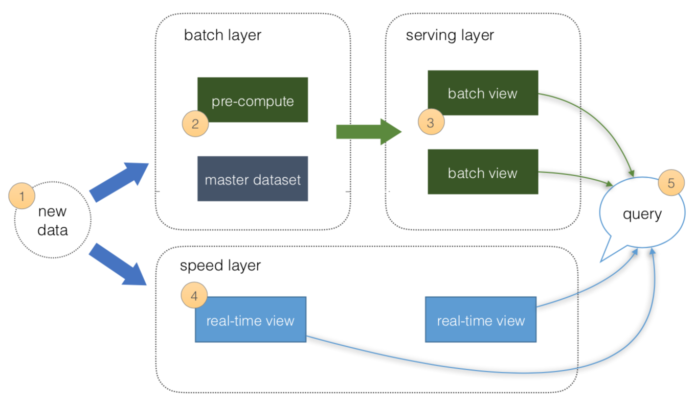
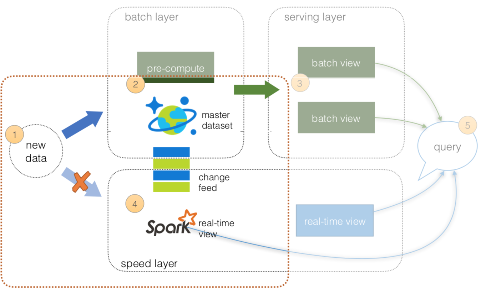
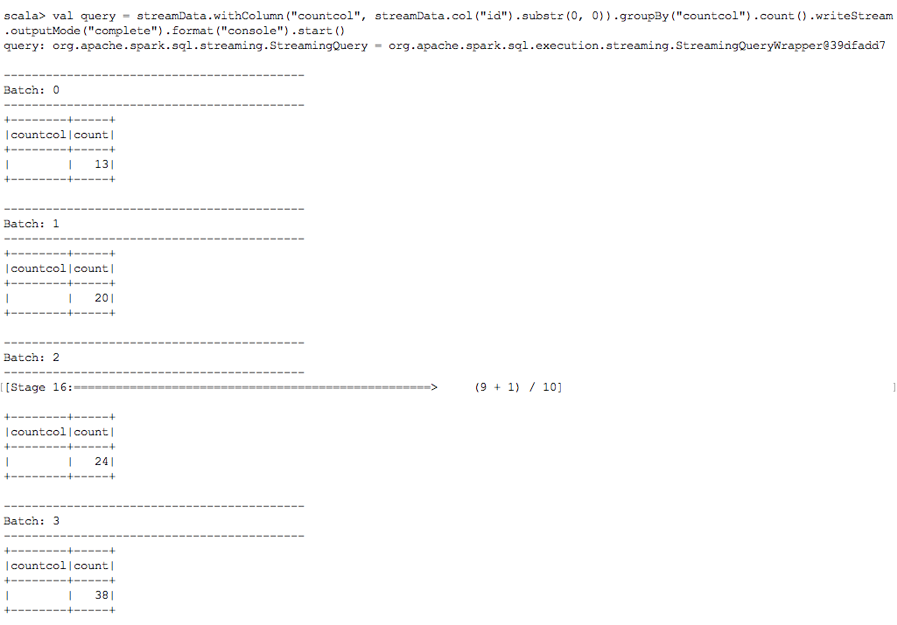
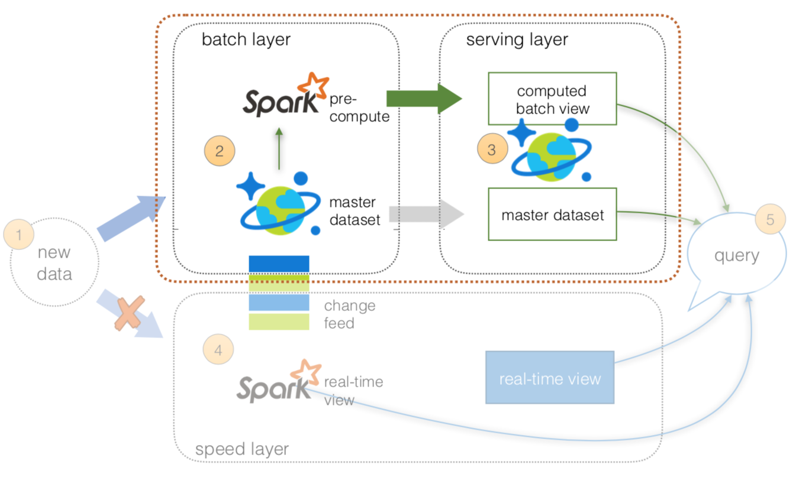
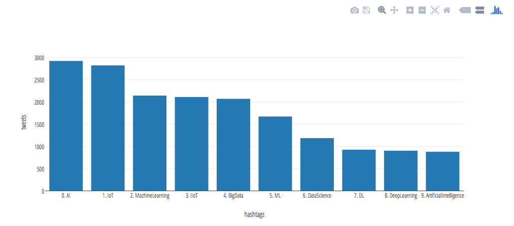
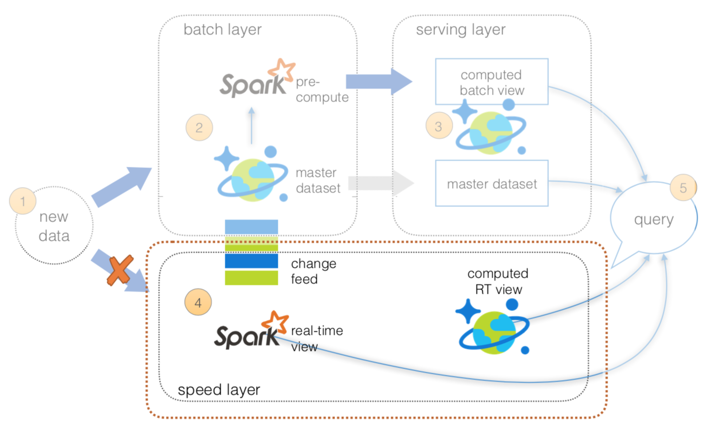
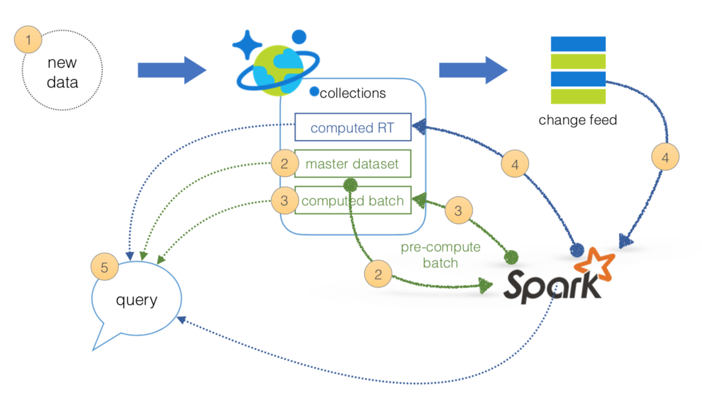

# Azure Cosmos DB: Implement a lambda architecture on the Azure platform 

Lambda architectures enable efficient data processing of massive data sets. Lambda architectures use batch-processing, stream-processing, and a serving layer to minimize the latency involved in querying big data. 

To implement a lambda architecture on Azure, you can combine the following technologies to accelerate real-time big data analytics:
* [Azure Cosmos DB](https://azure.microsoft.com/services/cosmos-db/), the industry's first globally distributed, multi-model database service. 
* [Apache Spark for Azure HDInsight](https://azure.microsoft.com/services/hdinsight/apache-spark/), a processing framework that runs large-scale data analytics applications
* Azure Cosmos DB [change feed](change-feed.md), which streams new data to the batch layer for HDInsight to process
* The [Spark to Azure Cosmos DB Connector](spark-connector.md)

This article describes the fundamentals of a lambda architecture based on the original multi-layer design and the benefits of a "rearchitected" lambda architecture that simplifies operations.  

## What is a lambda architecture?
A lambda architecture is a generic, scalable, and fault-tolerant data processing architecture to address batch and speed latency scenarios as described by [Nathan Marz](https://twitter.com/nathanmarz).



Source: http://lambda-architecture.net/

The basic principles of a lambda architecture are described in the preceding diagram as per [https://lambda-architecture.net](http://lambda-architecture.net/).

 1. All **data** is pushed into *both* the *batch layer* and *speed layer*.
 2. The **batch layer** has a master dataset (immutable, append-only set of raw data) and pre-computes the batch views.
 3. The **serving layer** has batch views for fast queries. 
 4. The **speed layer** compensates for processing time (to the serving layer) and deals with recent data only.
 5. All queries can be answered by merging results from batch views and real-time views or pinging them individually.

Upon further reading, we will be able to implement this architecture using only the following:

* Azure Cosmos DB collection(s)
* HDInsight (Apache Spark 2.1) cluster
* Spark Connector [1.0](https://github.com/Azure/azure-cosmosdb-spark/tree/master/releases/azure-cosmosdb-spark_2.1.0_2.11-1.0.0)

## Speed layer

From an operations perspective, maintaining two streams of data while ensuring the correct state of the data can be a complicated endeavor. To simplify operations, utilize the [Azure Cosmos DB change feed support](change-feed.md) to keep the state for the *batch layer* while revealing the Azure Cosmos DB change log via the *Change Feed API* for your *speed layer*.  


What's important in these layers:

 1. All **data** is pushed *only* into Azure Cosmos DB, thus you can avoid multi-casting issues.
 2. The **batch layer** has a master dataset (immutable, append-only set of raw data) and pre-computes the batch views.
 3. The **serving layer** is discussed in the next section.
 4. The **speed layer** utilizes HDInsight (Apache Spark) to read the Azure Cosmos DB change feed. This enables you to persist your data as well as to query and process it concurrently.
 5. All queries can be answered by merging results from batch views and real-time views or pinging them individually.
 
### Code Example: Spark structured streaming to an Azure Cosmos DB change feed
To run a quick prototype of the Azure Cosmos DB change feed as part of the **speed layer**, can test it out using Twitter data as part of the [Stream Processing Changes using Azure Cosmos DB Change Feed and Apache Spark](https://github.com/Azure/azure-cosmosdb-spark/wiki/Stream-Processing-Changes-using-Azure-Cosmos-DB-Change-Feed-and-Apache-Spark) example. To jump-start your Twitter output, see the code sample in [Stream feed from Twitter to Cosmos DB](https://github.com/tknandu/TwitterCosmosDBFeed). With the preceding example, you're loading Twitter data into Azure Cosmos DB and you can then set up your HDInsight (Apache Spark) cluster to connect to the change feed. For more information on how to set up this configuration, see [Apache Spark to Azure Cosmos DB Connector Setup](https://github.com/Azure/azure-cosmosdb-spark/wiki/Spark-to-Cosmos-DB-Connector-Setup).  

The following code snippet shows how to configure `spark-shell` to run a structured streaming job to connect to an Azure Cosmos DB change feed, which reviews the real-time Twitter data stream, to perform a running interval count.

```
// Import Libraries
import com.microsoft.azure.cosmosdb.spark._
import com.microsoft.azure.cosmosdb.spark.schema._
import com.microsoft.azure.cosmosdb.spark.config.Config
import org.codehaus.jackson.map.ObjectMapper
import com.microsoft.azure.cosmosdb.spark.streaming._
import java.time._


// Configure connection to Azure Cosmos DB Change Feed
val sourceConfigMap = Map(
"Endpoint" -> "[COSMOSDB ENDPOINT]",
"Masterkey" -> "[MASTER KEY]",
"Database" -> "[DATABASE]",
"Collection" -> "[COLLECTION]",
"ConnectionMode" -> "Gateway",
"ChangeFeedCheckpointLocation" -> "checkpointlocation",
"changefeedqueryname" -> "Streaming Query from Cosmos DB Change Feed Interval Count")

// Start reading change feed as a stream
var streamData = spark.readStream.format(classOf[CosmosDBSourceProvider].getName).options(sourceConfigMap).load()

// Start streaming query to console sink
val query = streamData.withColumn("countcol", streamData.col("id").substr(0, 0)).groupBy("countcol").count().writeStream.outputMode("complete").format("console").start()
```

For complete code samples, see [azure-cosmosdb-spark/lambda/samples](https://github.com/Azure/azure-cosmosdb-spark/tree/master/samples/lambda), including:
* [Streaming Query from Cosmos DB Change Feed.scala](https://github.com/Azure/azure-cosmosdb-spark/blob/master/samples/lambda/Streaming%20Query%20from%20Cosmos%20DB%20Change%20Feed.scala)
* [Streaming Tags Query from Cosmos DB Change Feed.scala](https://github.com/Azure/azure-cosmosdb-spark/blob/master/samples/lambda/Streaming%20Tags%20Query%20from%20Cosmos%20DB%20Change%20Feed%20.scala)

The output of this is a `spark-shell` console, which continuously runs a structured streaming job that performs an interval count against the Twitter data from the Azure Cosmos DB change feed. The following image shows the output of the stream job and the interval counts.

 

For more information on Azure Cosmos DB change feed, see:

* [Working with the change feed support in Azure Cosmos DB](change-feed.md)
* [Introducing the Azure CosmosDB Change Feed Processor Library](https://azure.microsoft.com/blog/introducing-the-azure-cosmosdb-change-feed-processor-library/)
* [Stream Processing Changes: Azure CosmosDB change feed + Apache Spark](https://azure.microsoft.com/blog/stream-processing-changes-azure-cosmosdb-change-feed-apache-spark/)

## Batch and serving layers
Since the new data is loaded into Azure Cosmos DB (where the change feed is being used for the speed layer), this is where the **master dataset** (an immutable, append-only set of raw data) resides. From this point onwards, use HDInsight (Apache Spark) to perform the pre-compute functions from the **batch layer** to **serving layer**, as shown in the following image:



What's important in these layers:

 1. All **data** is pushed only into Azure Cosmos DB (to avoid multi-cast issues).
 2. The **batch layer** has a master dataset (immutable, append-only set of raw data) stored in Azure Cosmos DB. Using HDI Spark, you can pre-compute your aggregations to be stored in your computed batch views.
 3. The **serving layer** is an Azure Cosmos DB database with collections for the master dataset and computed batch view.
 4. The **speed layer** is discussed later in this article.
 5. All queries can be answered by merging results from the batch views and real-time views, or pinging them individually.

### Code example: Pre-computing batch views
To showcase how to execute pre-calculated views against your **master dataset** from Apache Spark to Azure Cosmos DB, use the following code snippets from the notebooks [Lambda Architecture Rearchitected - Batch Layer](https://github.com/Azure/azure-cosmosdb-spark/blob/master/samples/lambda/Lambda%20Architecture%20Re-architected%20-%20Batch%20Layer.ipynb) and [Lambda Architecture Rearchitected - Batch to Serving Layer](https://github.com/Azure/azure-cosmosdb-spark/blob/master/samples/lambda/Lambda%20Architecture%20Re-architected%20-%20Batch%20to%20Serving%20Layer.ipynb). In this scenario, use the Twitter data stored in Azure Cosmos DB.

Let's start by creating the configuration connection to the Twitter data within Azure Cosmos DB using the PySpark code below.

```
# Configuration to connect to Azure Cosmos DB
tweetsConfig = {
  "Endpoint" : "[Endpoint URL]",
  "Masterkey" : "[Master Key]",
  "Database" : "[Database]",
  "Collection" : "[Collection]", 
  "preferredRegions" : "[Preferred Regions]",
  "SamplingRatio" : "1.0",
  "schema_samplesize" : "200000",
  "query_custom" : "[Cosmos DB SQL Query]"
}

# Create DataFrame
tweets = spark.read.format("com.microsoft.azure.cosmosdb.spark").options(**tweetsConfig).load()

# Create Temp View (to run Spark SQL statements)
tweets.createOrReplaceTempView("tweets")
```

Next, let's run the following Spark SQL statement to determine the top 10 hashtags of the set of tweets. For this Spark SQL query, we're running this in a Jupyter notebook without the output bar chart directly following this code snippet.

```
%%sql
select hashtags.text, count(distinct id) as tweets
from (
  select 
    explode(hashtags) as hashtags,
    id
  from tweets
) a
group by hashtags.text
order by tweets desc
limit 10
```



Now that you have your query, let's save it back to a collection by using the Spark Connector to save the output data into a different collection.  In this example, use Scala to showcase the connection. Similar to the previous example, create the configuration connection to save the Apache Spark DataFrame to a different Azure Cosmos DB collection.

```
val writeConfigMap = Map(
	"Endpoint" -> "[Endpoint URL]",
	"Masterkey" -> "[Master Key]",
	"Database" -> "[Database]",
	"Collection" -> "[New Collection]", 
	"preferredRegions" -> "[Preferred Regions]",
	"SamplingRatio" -> "1.0",
	"schema_samplesize" -> "200000"
)

// Configuration to write
val writeConfig = Config(writeConfigMap)

```

After specifying the `SaveMode` (indicating whether to `Overwrite` or `Append` documents), create a `tweets_bytags` DataFrame similar to the Spark SQL query in the previous example.  With the `tweets_bytags` DataFrame created, you can save it using the `write` method using the previously specified `writeConfig`.

```
// Import SaveMode so you can Overwrite, Append, ErrorIfExists, Ignore
import org.apache.spark.sql.{Row, SaveMode, SparkSession}

// Create new DataFrame of tweets tags
val tweets_bytags = spark.sql("select hashtags.text as hashtags, count(distinct id) as tweets from ( select explode(hashtags) as hashtags, id from tweets ) a group by hashtags.text order by tweets desc")

// Save to Cosmos DB (using Append in this case)
tweets_bytags.write.mode(SaveMode.Overwrite).cosmosDB(writeConfig)
```

This last statement now has saved your Spark DataFrame into a new Azure Cosmos DB collection; from a lambda architecture perspective, this is your **batch view** within the **serving layer**.
 
#### Resources

For complete code samples, see [azure-cosmosdb-spark/lambda/samples](https://github.com/Azure/azure-cosmosdb-spark/tree/master/samples/lambda) including:
* Lambda Architecture Rearchitected - Batch Layer [HTML](https://github.com/Azure/azure-cosmosdb-spark/blob/master/samples/lambda/Lambda%20Architecture%20Re-architected%20-%20Batch%20Layer.html) | [ipynb](https://github.com/Azure/azure-cosmosdb-spark/blob/master/samples/lambda/Lambda%20Architecture%20Re-architected%20-%20Batch%20Layer.ipynb)
* Lambda Architecture Rearchitected - Batch to Serving Layer [HTML](https://github.com/Azure/azure-cosmosdb-spark/blob/master/samples/lambda/Lambda%20Architecture%20Re-architected%20-%20Batch%20to%20Serving%20Layer.html) | [ipynb](https://github.com/Azure/azure-cosmosdb-spark/blob/master/samples/lambda/Lambda%20Architecture%20Re-architected%20-%20Batch%20to%20Serving%20Layer.ipynb)

## Speed layer
As previously noted, using the Azure Cosmos DB Change Feed Library allows you to simplify the operations between the batch and speed layers. In this architecture, use Apache Spark (via HDInsight) to perform the *structured streaming* queries against the data. You may also want to temporarily persist the results of your structured streaming queries so other systems can access this data.



To do this, create a separate Azure Cosmos DB collection to save the results of your structured streaming queries.  This allows you to have other systems access this information not just Apache Spark. As well with the Cosmos DB Time-to-Live (TTL) feature, you can configure your documents to be automatically deleted after a set duration.  For more information on the Azure Cosmos DB TTL feature, see [Expire data in Azure Cosmos DB collections automatically with time to live](time-to-live.md)

```
// Import Libraries
import com.microsoft.azure.cosmosdb.spark._
import com.microsoft.azure.cosmosdb.spark.schema._
import com.microsoft.azure.cosmosdb.spark.config.Config
import org.codehaus.jackson.map.ObjectMapper
import com.microsoft.azure.cosmosdb.spark.streaming._
import java.time._


// Configure connection to Azure Cosmos DB Change Feed
val sourceCollectionName = "[SOURCE COLLECTION NAME]"
val sinkCollectionName = "[SINK COLLECTION NAME]"

val configMap = Map(
"Endpoint" -> "[COSMOSDB ENDPOINT]",
"Masterkey" -> "[COSMOSDB MASTER KEY]",
"Database" -> "[DATABASE NAME]",
"Collection" -> sourceCollectionName,
"ChangeFeedCheckpointLocation" -> "changefeedcheckpointlocation")

val sourceConfigMap = configMap.+(("changefeedqueryname", "Structured Stream replication streaming test"))

// Start to read the stream
var streamData = spark.readStream.format(classOf[CosmosDBSourceProvider].getName).options(sourceConfigMap).load()
val sinkConfigMap = configMap.-("collection").+(("collection", sinkCollectionName))

// Start the stream writer to new collection
val streamingQueryWriter = streamData.writeStream.format(classOf[CosmosDBSinkProvider].getName).outputMode("append").options(sinkConfigMap).option("checkpointLocation", "streamingcheckpointlocation")
var streamingQuery = streamingQueryWriter.start()

```

## Lambda architecture: Rearchitected
As noted in the previous sections, you can simplify the original lambda architecture by using the following components:
* Azure Cosmos DB
* The Azure Cosmos DB Change Feed Library to avoid the need to multi-cast your data between the batch and speed layers
* Apache Spark on HDInsight
* The Spark Connector for Azure Cosmos DB



With this design, you only need two managed services, Azure Cosmos DB and HDInsight. Together, they address the batch, serving, and speed layers of the lambda architecture. This simplifies not only the operations but also the data flow. 
 1. All data is pushed into Azure Cosmos DB for processing
 2. The batch layer has a master dataset (immutable, append-only set of raw data) and pre-computes the batch views
 3. The serving layer has batch views of data for fast queries.
 4. The speed layer compensates for processing time (to the serving layer) and deals with recent data only.
 5. All queries can be answered by merging results from batch views and real-time views.

### Resources

 * **New data**: The [stream feed from Twitter to CosmosDB](https://github.com/tknandu/TwitterCosmosDBFeed), which is the mechanism to push new data into Azure Cosmos DB.
 * **Batch layer:** The batch layer is composed of the *master dataset* (an immutable, append-only set of raw data) and the ability to pre-compute batch views of the data that are pushed into the **serving layer**.
    * The **Lambda Architecture Rearchitected - Batch Layer** notebook [ipynb](https://github.com/Azure/azure-cosmosdb-spark/blob/master/samples/lambda/Lambda%20Architecture%20Re-architected%20-%20Batch%20Layer.ipynb) | [html](https://github.com/Azure/azure-cosmosdb-spark/blob/master/samples/lambda/Lambda%20Architecture%20Re-architected%20-%20Batch%20Layer.html) queries the *master dataset* set of batch views.
 * **Serving layer:** The **serving layer** is composed of pre-computed data resulting in batch views (for example aggregations, specific slicers, etc.) for fast queries.
    * The **Lambda Architecture Rearchitected - Batch to Serving Layer** notebook [ipynb](https://github.com/Azure/azure-cosmosdb-spark/blob/master/samples/lambda/Lambda%20Architecture%20Re-architected%20-%20Batch%20to%20Serving%20Layer.ipynb) | [html](https://github.com/Azure/azure-cosmosdb-spark/blob/master/samples/lambda/Lambda%20Architecture%20Re-architected%20-%20Batch%20to%20Serving%20Layer.html) pushes the batch data to the serving layer; that is, Spark queries a batch collection of tweets, processes it, and stores it into another collection (a computed batch).
* **Speed layer:** The **speed layer** is composed of Spark utilizing the Azure Cosmos DB change feed to read and act on immediately. The data can also be saved to *computed RT* so that other systems can query the processed real-time data as opposed to running a real-time query themselves.
    * The [Streaming Query from Cosmos DB Change Feed](https://github.com/Azure/azure-cosmosdb-spark/blob/master/samples/lambda/Streaming%20Query%20from%20Cosmos%20DB%20Change%20Feed.scala) scala script executes a streaming query from the Azure Cosmos DB change feed to compute an interval count from the spark-shell.
    * The [Streaming Tags Query from Cosmos DB Change Feed](https://github.com/Azure/azure-cosmosdb-spark/blob/master/samples/lambda/Streaming%20Tags%20Query%20from%20Cosmos%20DB%20Change%20Feed%20.scala) scala script executes a streaming query from the Azure Cosmos DB change feed to compute an interval count of tags from the spark-shell.
  
## Next steps
If you haven't already, download the Spark to Azure Cosmos DB connector from the [azure-cosmosdb-spark](https://github.com/Azure/azure-cosmosdb-spark) GitHub repository and explore the additional resources in the repo:
* [Lambda architecture](https://github.com/Azure/azure-cosmosdb-spark/tree/master/samples/lambda)
* [Distributed aggregations examples](https://github.com/Azure/azure-documentdb-spark/wiki/Aggregations-Examples)
* [Sample scripts and notebooks](https://github.com/Azure/azure-cosmosdb-spark/tree/master/samples)
* [Structured streaming demos](https://github.com/Azure/azure-cosmosdb-spark/wiki/Structured-Stream-demos)
* [Change feed demos](https://github.com/Azure/azure-cosmosdb-spark/wiki/Change-Feed-demos)
* [Stream processing changes using Azure Cosmos DB Change Feed and Apache Spark](https://github.com/Azure/azure-cosmosdb-spark/wiki/Stream-Processing-Changes-using-Azure-Cosmos-DB-Change-Feed-and-Apache-Spark)

You might also want to review the [Apache Spark SQL, DataFrames, and Datasets Guide](http://spark.apache.org/docs/latest/sql-programming-guide.html) and the [Apache Spark on Azure HDInsight](../hdinsight/spark/apache-spark-jupyter-spark-sql.md) article.
