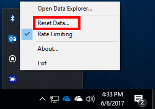
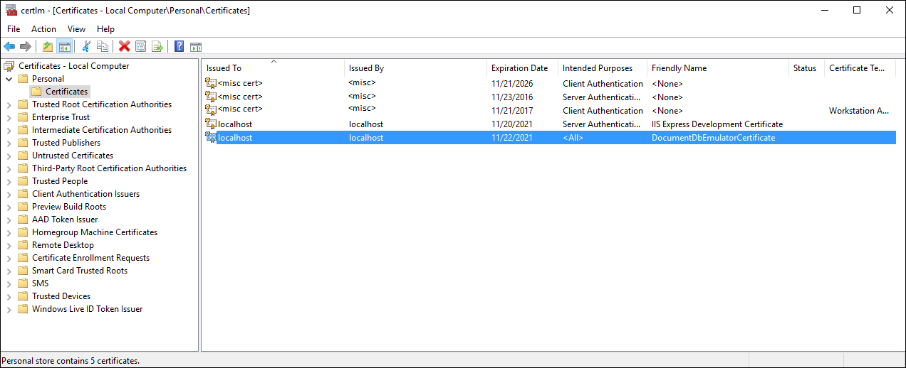
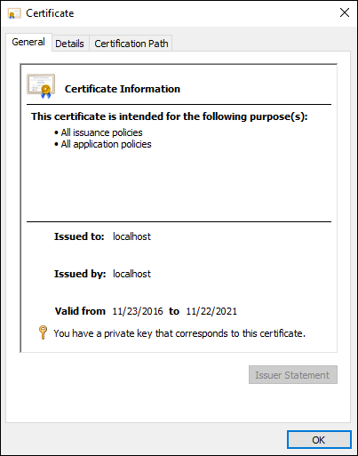
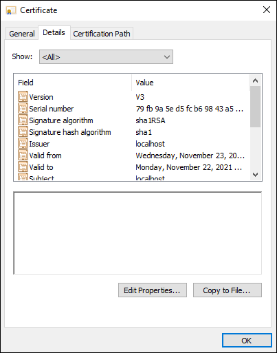
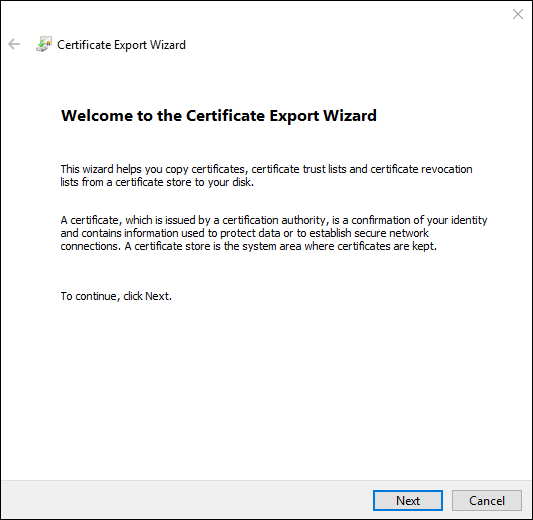
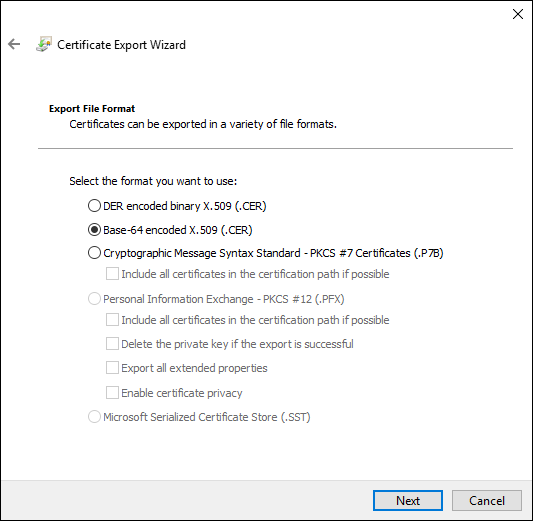
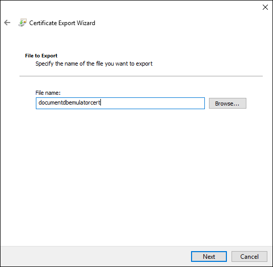
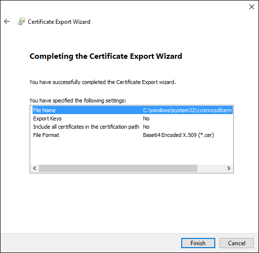

# Export the Azure Cosmos DB Emulator certificates for use with Java, Python, and Node.js

[**Download the Emulator**](https://aka.ms/cosmosdb-emulator)

The Azure Cosmos DB Emulator provides a local environment that emulates the Azure Cosmos DB service for development purposes including its use of SSL connections. This post demonstrates how to export the SSL certificates for use in languages and runtimes that do not integrate with the Windows Certificate Store such as Java which uses its own [certificate store](https://docs.oracle.com/cd/E19830-01/819-4712/ablqw/index.html) and Python which uses [socket wrappers](https://docs.python.org/2/library/ssl.html) and Node.js which uses [tlsSocket](https://nodejs.org/api/tls.html#tls_tls_connect_options_callback). You can read more about the emulator in [Use the Azure Cosmos DB Emulator for development and testing](./local-emulator.md).

This tutorial covers the following tasks:

> [!div class="checklist"]
> * Rotating certificates
> * Exporting SSL certificate
> * Learning how to use the certificate in Java, Python, and Node.js

## Certification rotation

Certificates in the Azure Cosmos DB Local Emulator are generated the first time the emulator is run. There are two certificates. One used for connecting to the local emulator and one for managing secrets within the emulator. The certificate you want to export is the connection certificate with the friendly name "DocumentDBEmulatorCertificate".

Both certificates can be regenerated by clicking **Reset Data** as shown below from Azure Cosmos DB Emulator running in the Windows Tray. If you regenerate the certificates and have installed them into the Java certificate store or used them elsewhere you will need to update them, otherwise your application will no longer connect to the local emulator.

## How to export the Azure Cosmos DB SSL certificate

1. Start the Windows Certificate manager by running certlm.msc and navigate to the Personal->Certificates folder and open the certificate with the friendly name **DocumentDbEmulatorCertificate**.

    

2. Click on **Details** then **OK**.

    

3. Click **Copy to File...**.

    

4. Click **Next**.

    

5. Click **No, do not export private key**, then click **Next**.

    

6. Click on **Base-64 encoded X.509 (.CER)** and then **Next**.

    

7. Give the certificate a name. In this case **documentdbemulatorcert** and then click **Next**.

    

8. Click **Finish**.

    

## How to use the certificate in Java

When running Java applications or MongoDB applications that use the Java client it is easier to install the certificate into the Java default certificate store than passing the "-Djavax.net.ssl.trustStore=<keystore> -Djavax.net.ssl.trustStorePassword="<password>" flags. For example the included [Java Demo application](https://localhost:8081/_explorer/index.html) depends on the default certificate store.

Follow the instructions in the [Adding a Certificate to the Java CA Certificates Store](https://docs.microsoft.com/azure/java-add-certificate-ca-store) to import the X.509 certificate into the default Java certificate store. Keep in mind you will be working in the %JAVA_HOME% directory when running keytool.

Once the "CosmosDBEmulatorCertificate" SSL certificate is installed your application should be able to connect and use the local Azure Cosmos DB Emulator. If you continue to have trouble you may want to follow the [Debugging SSL/TLS Connections](http://docs.oracle.com/javase/7/docs/technotes/guides/security/jsse/ReadDebug.html) article. It is very likely the certificate is not installed into the %JAVA_HOME%/jre/lib/security/cacerts store. For example if you have multiple installed versions of Java your application may be using a different cacerts store than the one you updated.

## How to use the certificate in Python

By default the [Python SDK(version 2.0.0 or higher)](sql-api-sdk-python.md) for the SQL API will not try and use the SSL certificate when connecting to the local emulator. If however you want to use SSL validation you can follow the examples in the [Python socket wrappers](https://docs.python.org/2/library/ssl.html) documentation.

## How to use the certificate in Node.js

By default the [Node.js SDK(version 1.10.1 or higher)](sql-api-sdk-node.md) for the SQL API will not try and use the SSL certificate when connecting to the local emulator. If however you want to use SSL validation you can follow the examples in the [Node.js documentation](https://nodejs.org/api/tls.html#tls_tls_connect_options_callback).

## Next steps

In this tutorial, you've done the following:

> [!div class="checklist"]
> * Rotated certificates
> * Exported the SSL certificate
> * Learned how to use the certificate in Java, Python and Node.js

You can now proceed to the concepts section for more information about Azure Cosmos DB. 

> [!div class="nextstepaction"]
>[Tunable data consistency levels in Azure Cosmos DB](../cosmos-db/consistency-levels.md)
