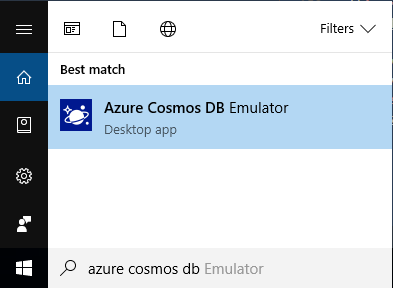

# Use the Azure Cosmos Emulator for local development and testing

The Azure Cosmos Emulator provides a local environment that emulates the Azure Cosmos DB service for development purposes. Using the Azure Cosmos Emulator, you can develop and test your application locally, without creating an Azure subscription or incurring any costs. When you're satisfied with how your application is working in the Azure Cosmos Emulator, you can switch to using an Azure Cosmos account in the cloud.

You can develop using Azure Cosmos Emulator with [SQL](local-emulator.md#sql-api), [Cassandra](local-emulator.md#cassandra-api), [MongoDB](local-emulator.md#azure-cosmos-dbs-api-for-mongodb), [Gremlin](local-emulator.md#gremlin-api), and [Table](local-emulator.md#table-api) API accounts. However at this time the Data Explorer view in the emulator fully supports clients for SQL API only. 

## How the emulator works

The Azure Cosmos Emulator provides a high-fidelity emulation of the Azure Cosmos DB service. It supports identical functionality as Azure Cosmos DB, including support for creating and querying data, provisioning and scaling containers, and executing stored procedures and triggers. You can develop and test applications using the Azure Cosmos Emulator, and deploy them to Azure at global scale by just making a single configuration change to the connection endpoint for Azure Cosmos DB.

While emulation of the Azure Cosmos DB service is faithful, the emulator's implementation is different than the service. For example, the emulator uses standard OS components such as the local file system for persistence, and the HTTPS protocol stack for connectivity. Functionality that relies on Azure infrastructure like global replication, single-digit millisecond latency for reads/writes, and tunable consistency levels are not applicable.

You can migrate data between the Azure Cosmos Emulator and the Azure Cosmos DB service by using the [Azure Cosmos DB Data Migration Tool](https://github.com/azure/azure-documentdb-datamigrationtool).

You can run Azure Cosmos Emulator on the Windows Docker container, see the [Docker Hub](https://hub.docker.com/r/microsoft/azure-cosmosdb-emulator/) for the docker pull command and [GitHub](https://github.com/Azure/azure-cosmos-db-emulator-docker) for the `Dockerfile` and more information.

## Differences between the emulator and the service

Because the Azure Cosmos Emulator provides an emulated environment running on the local developer workstation, there are some differences in functionality between the emulator and an Azure Cosmos account in the cloud:

* Currently Data Explorer in the emulator supports clients for SQL API. The Data Explorer view and operations for Azure Cosmos DB APIs such as MongoDB, Table, Graph, and Cassandra APIs are not fully supported.
* The Azure Cosmos Emulator supports only a single fixed account and a well-known master key. Key regeneration is not possible in the Azure Cosmos Emulator, however the default key can be changed using the command-line option.
* The Azure Cosmos Emulator is not a scalable service and will not support a large number of containers.
* The Azure Cosmos Emulator does not offer different [Azure Cosmos DB consistency levels](consistency-levels.md).
* The Azure Cosmos Emulator does not offer [multi-region replication](distribute-data-globally.md).
* As your copy of the Azure Cosmos Emulator might not always be up-to-date with the most recent changes in the Azure Cosmos DB service, you should refer to the [Azure Cosmos DB capacity planner](https://www.documentdb.com/capacityplanner) to accurately estimate the production throughput (RUs) needs of your application.
* When using the Azure Cosmos Emulator, by default, you can create up to 25 fixed size containers (only supported using Azure Cosmos DB SDKs), or 5 unlimited containers using the Azure Cosmos Emulator. For more information about changing this value, see [Setting the PartitionCount value](#set-partitioncount).
* Emulator supports max id property size of 254 characters.

## System requirements

The Azure Cosmos Emulator has the following hardware and software requirements:

* Software requirements
  * Windows Server 2012 R2, Windows Server 2016, or Windows 10
  * 64-bit operating system
* Minimum Hardware requirements
  * 2-GB RAM
  * 10-GB available hard disk space

## Installation

You can download and install the Azure Cosmos Emulator from the [Microsoft Download Center](https://aka.ms/cosmosdb-emulator) or you can run the emulator on Docker for Windows. For instructions on using the emulator on Docker for Windows, see [Running on Docker](#running-on-docker).

> [!NOTE]
> To install, configure, and run the Azure Cosmos Emulator, you must have administrative privileges on the computer. The emulator will create/add a certificate and also set the firewall rules in order to run its services; therefore it's necessary for the emulator to be able to execute such operations.

## Running on Windows

To start the Azure Cosmos Emulator, select the Start button or press the Windows key. Begin typing **Azure Cosmos Emulator**, and select the emulator from the list of applications.



When the emulator is running, you'll see an icon in the Windows taskbar notification area. 

The Azure Cosmos Emulator by default runs on the local machine ("localhost") listening on port 8081.

The Azure Cosmos Emulator is installed to `C:\Program Files\Azure Cosmos DB Emulator` by default. You can also start and stop the emulator from the command-line. For more information, see the [command-line tool reference](#command-line).

## Start Data Explorer

When the Azure Cosmos  Emulator launches, it automatically opens the Azure Cosmos Data Explorer in your browser. The address appears as `https://localhost:8081/_explorer/index.html`. If you close the explorer and would like to reopen it later, you can either open the URL in your browser or launch it from the Azure Cosmos Emulator in the Windows Tray Icon as shown below.

:::image type="content" source="./media/local-emulator/database-local-emulator-data-explorer-launcher.png" alt-text="Azure Cosmos local emulator data explorer launcher":::

## Checking for updates

Data Explorer indicates if there is a new update available for download.

> [!NOTE]
> Data created in one version of the Azure Cosmos Emulator (see %LOCALAPPDATA%\CosmosDBEmulator or data path optional settings) is not guaranteed to be accessible when using a different version. If you need to persist your data for the long term, it is recommended that you store that data in an Azure Cosmos account, rather than in the Azure Cosmos Emulator.

## Authenticating requests

As with Azure Cosmos DB in the cloud, every request that you make against the Azure Cosmos Emulator must be authenticated. The Azure Cosmos Emulator supports a single fixed account and a well-known authentication key for master key authentication. This account and key are the only credentials permitted for use with the Azure Cosmos Emulator. They are:

```bash
Account name: localhost:<port>
Account key: C2y6yDjf5/R+ob0N8A7Cgv30VRDJIWEHLM+4QDU5DE2nQ9nDuVTqobD4b8mGGyPMbIZnqyMsEcaGQy67XIw/Jw==
```

> [!NOTE]
> The master key supported by the Azure Cosmos Emulator is intended for use only with the emulator. You cannot use your production Azure Cosmos DB account and key with the Azure Cosmos Emulator.

> [!NOTE]
> If you have started the emulator with the /Key option, then use the generated key instead of `C2y6yDjf5/R+ob0N8A7Cgv30VRDJIWEHLM+4QDU5DE2nQ9nDuVTqobD4b8mGGyPMbIZnqyMsEcaGQy67XIw/Jw==`. For more information about /Key option, see [Command-line tool reference.](#command-line)

As with the Azure Cosmos DB, the Azure Cosmos Emulator supports only secure communication via TLS.

## Running on a local network

You can run the emulator on a local network. To enable network access, specify the `/AllowNetworkAccess` option at the [command-line](#command-line-syntax), which also requires that you specify `/Key=key_string` or `/KeyFile=file_name`. You can use `/GenKeyFile=file_name` to generate a file with a random key upfront. Then you can pass that to `/KeyFile=file_name` or `/Key=contents_of_file`.

To enable network access for the first time the user should shut down the emulator and delete the emulator's data directory (%LOCALAPPDATA%\CosmosDBEmulator).

## Developing with the emulator

### SQL API

Once you have the Azure Cosmos Emulator running on your desktop, you can use any supported [Azure Cosmos DB SDK](sql-api-sdk-dotnet.md) or the [Azure Cosmos DB REST API](/rest/api/cosmos-db/) to interact with the emulator. The Azure Cosmos Emulator also includes a built-in Data Explorer that lets you create containers for SQL API or Cosmos DB for Mongo DB API, and view and edit items without writing any code.

```csharp
// Connect to the Azure Cosmos Emulator running locally
DocumentClient client = new DocumentClient(
   new Uri("https://localhost:8081"), "C2y6yDjf5/R+ob0N8A7Cgv30VRDJIWEHLM+4QDU5DE2nQ9nDuVTqobD4b8mGGyPMbIZnqyMsEcaGQy67XIw/Jw==");

```

### Azure Cosmos DB's API for MongoDB

Once you have the Azure Cosmos Emulator running on your desktop, you can use the [Azure Cosmos DB's API for MongoDB](mongodb-introduction.md) to interact with the emulator. Start emulator from command prompt as an administrator with "/EnableMongoDbEndpoint". Then use the following connection string to connect to the MongoDB API account:

```bash
mongodb://localhost:C2y6yDjf5/R+ob0N8A7Cgv30VRDJIWEHLM+4QDU5DE2nQ9nDuVTqobD4b8mGGyPMbIZnqyMsEcaGQy67XIw/Jw==@localhost:10255/admin?ssl=true
```

### Table API

Once you have the Azure Cosmos Emulator running on your desktop, you can use the [Azure Cosmos DB Table API SDK](table-storage-how-to-use-dotnet.md) to interact with the emulator. Start emulator from command prompt as an administrator with "/EnableTableEndpoint". Next run the following code to connect to the table API account:

```csharp
using Microsoft.WindowsAzure.Storage;
using Microsoft.WindowsAzure.Storage.Table;
using CloudTable = Microsoft.WindowsAzure.Storage.Table.CloudTable;
using CloudTableClient = Microsoft.WindowsAzure.Storage.Table.CloudTableClient;

string connectionString = "DefaultEndpointsProtocol=http;AccountName=localhost;AccountKey=C2y6yDjf5/R+ob0N8A7Cgv30VRDJIWEHLM+4QDU5DE2nQ9nDuVTqobD4b8mGGyPMbIZnqyMsEcaGQy67XIw/Jw==;TableEndpoint=http://localhost:8902/;";

CloudStorageAccount account = CloudStorageAccount.Parse(connectionString);
CloudTableClient tableClient = account.CreateCloudTableClient();
CloudTable table = tableClient.GetTableReference("testtable");
table.CreateIfNotExists();
table.Execute(TableOperation.Insert(new DynamicTableEntity("partitionKey", "rowKey")));
```

### Cassandra API

Start emulator from an administrator command prompt with "/EnableCassandraEndpoint". Alternatively you can also set the environment variable `AZURE_COSMOS_EMULATOR_CASSANDRA_ENDPOINT=true`.

* [Install Python 2.7](https://www.python.org/downloads/release/python-2716/)

* [Install Cassandra CLI/CQLSH](https://cassandra.apache.org/download/)

* Run the following commands in a regular command prompt window:

  ```bash
  set Path=c:\Python27;%Path%
  cd /d C:\sdk\apache-cassandra-3.11.3\bin
  set SSL_VERSION=TLSv1_2
  set SSL_VALIDATE=false
  cqlsh localhost 10350 -u localhost -p C2y6yDjf5/R+ob0N8A7Cgv30VRDJIWEHLM+4QDU5DE2nQ9nDuVTqobD4b8mGGyPMbIZnqyMsEcaGQy67XIw/Jw== --ssl
  ```

* In the CQLSH shell, run the following commands to connect to the Cassandra endpoint:

  ```bash
  CREATE KEYSPACE MyKeySpace WITH replication = {'class':'MyClass', 'replication_factor': 1};
  DESCRIBE keyspaces;
  USE mykeyspace;
  CREATE table table1(my_id int PRIMARY KEY, my_name text, my_desc text);
  INSERT into table1 (my_id, my_name, my_desc) values( 1, 'name1', 'description 1');
  SELECT * from table1;
  EXIT
  ```

### Gremlin API

Start emulator from an administrator command prompt with "/EnableGremlinEndpoint". Alternatively you can also set the environment variable `AZURE_COSMOS_EMULATOR_GREMLIN_ENDPOINT=true`

* [Install apache-tinkerpop-gremlin-console-3.3.4](https://archive.apache.org/dist/tinkerpop/3.3.4).

* In the emulator's Data Explorer create a database "db1" and a collection "coll1"; for the partition key, choose "/name"

* Run the following commands in a regular command prompt window:

  ```bash
  cd /d C:\sdk\apache-tinkerpop-gremlin-console-3.3.4-bin\apache-tinkerpop-gremlin-console-3.3.4
  
  copy /y conf\remote.yaml conf\remote-localcompute.yaml
  notepad.exe conf\remote-localcompute.yaml
    hosts: [localhost]
    port: 8901
    username: /dbs/db1/colls/coll1
    password: C2y6yDjf5/R+ob0N8A7Cgv30VRDJIWEHLM+4QDU5DE2nQ9nDuVTqobD4b8mGGyPMbIZnqyMsEcaGQy67XIw/Jw==
    connectionPool: {
    enableSsl: false}
    serializer: { className: org.apache.tinkerpop.gremlin.driver.ser.GraphSONMessageSerializerV1d0,
    config: { serializeResultToString: true  }}

  bin\gremlin.bat
  ```

* In the Gremlin shell run the following commands to connect to the Gremlin endpoint:

  ```bash
  :remote connect tinkerpop.server conf/remote-localcompute.yaml
  :remote console
  :> g.V()
  :> g.addV('person1').property(id, '1').property('name', 'somename1')
  :> g.addV('person2').property(id, '2').property('name', 'somename2')
  :> g.V()
  ```

## Export the TLS/SSL certificate

.NET languages and runtime use the Windows Certificate Store to securely connect to the Azure Cosmos DB local emulator. Other languages have their own method of managing and using certificates. Java uses its own [certificate store](https://docs.oracle.com/cd/E19830-01/819-4712/ablqw/index.html) whereas Python uses [socket wrappers](https://docs.python.org/2/library/ssl.html).

In order to obtain a certificate to use with languages and runtimes that do not integrate with the Windows Certificate Store, you will need to export it using the Windows Certificate Manager. You can start it by running certlm.msc or follow the step by step instructions in [Export the Azure Cosmos Emulator Certificates](./local-emulator-export-ssl-certificates.md). Once the certificate manager is running, open the Personal Certificates as shown below and export the certificate with the friendly name "DocumentDBEmulatorCertificate" as a BASE-64 encoded X.509 (.cer) file.


The X.509 certificate can be imported into the Java certificate store by following the instructions in [Adding a Certificate to the Java CA Certificates Store](https://docs.microsoft.com/azure/java-add-certificate-ca-store). Once the certificate is imported into the certificate store, clients for SQL and Azure Cosmos DB's API for MongoDB will be able to connect to the Azure Cosmos Emulator.

When connecting to the emulator from Python and Node.js SDKs, TLS verification is disabled.

## <a id="command-line"></a>Command-line tool reference
From the installation location, you can use the command-line to start and stop the emulator, configure options, and perform other operations.

### Command-line syntax

```cmd
Microsoft.Azure.Cosmos.Emulator.exe [/Shutdown] [/DataPath] [/Port] [/MongoPort] [/DirectPorts] [/Key] [/EnableRateLimiting] [/DisableRateLimiting] [/NoUI] [/NoExplorer] [/EnableMongoDbEndpoint] [/?]
```

To view the list of options, type `Microsoft.Azure.Cosmos.Emulator.exe /?` at the command prompt.

|**Option** | **Description** | **Command**| **Arguments**|
|---|---|---|---|
|[No arguments] | Starts up the Azure Cosmos Emulator with default settings. |Microsoft.Azure.Cosmos.Emulator.exe| |
|[Help] |Displays the list of supported command-line arguments.|Microsoft.Azure.Cosmos.Emulator.exe /? | |
| GetStatus |Gets the status of the Azure Cosmos Emulator. The status is indicated by the exit code: 1 = Starting, 2 = Running, 3 = Stopped. A negative exit code indicates that an error occurred. No other output is produced. | Microsoft.Azure.Cosmos.Emulator.exe /GetStatus| |
| Shutdown| Shuts down the Azure Cosmos Emulator.| Microsoft.Azure.Cosmos.Emulator.exe /Shutdown | |
|DataPath | Specifies the path in which to store data files. Default value is %LocalAppdata%\CosmosDBEmulator. | Microsoft.Azure.Cosmos.Emulator.exe /DataPath=\<datapath\> | \<datapath\>: An accessible path |
|Port | Specifies the port number to use for the emulator. Default value is 8081. |Microsoft.Azure.Cosmos.Emulator.exe /Port=\<port\> | \<port\>: Single port number |
| ComputePort | Specified the port number to use for the Compute Interop Gateway service. The Gateway's HTTP endpoint probe port is calculated as ComputePort + 79. Hence, ComputePort and ComputePort + 79 must be open and available. The default value is 8900. | Microsoft.Azure.Cosmos.Emulator.exe /ComputePort=\<computeport\> | \<computeport\>: Single port number |
| EnableMongoDbEndpoint=3.2 | Enables MongoDB API 3.2 | Microsoft.Azure.Cosmos.Emulator.exe /EnableMongoDbEndpoint=3.2 | |
| EnableMongoDbEndpoint=3.6 | Enables MongoDB API 3.6 | Microsoft.Azure.Cosmos.Emulator.exe /EnableMongoDbEndpoint=3.6 | |
| MongoPort | Specifies the port number to use for MongoDB compatibility API. Default value is 10255. |Microsoft.Azure.Cosmos.Emulator.exe /MongoPort=\<mongoport\>|\<mongoport\>: Single port number|
| EnableCassandraEndpoint | Enables Cassandra API | Microsoft.Azure.Cosmos.Emulator.exe /EnableCassandraEndpoint | |
| CassandraPort | Specifies the port number to use for the Cassandra endpoint. Default value is 10350. | Microsoft.Azure.Cosmos.Emulator.exe /CassandraPort=\<cassandraport\> | \<cassandraport\>: Single port number |
| EnableGremlinEndpoint | Enables Gremlin API | Microsoft.Azure.Cosmos.Emulator.exe /EnableGremlinEndpoint | |
| GremlinPort | Port number to use for the Gremlin Endpoint. Default value is 8901. | Microsoft.Azure.Cosmos.Emulator.exe /GremlinPort=\<port\> | \<port\>: Single port number |
|EnableTableEndpoint | Enables Azure Table API | Microsoft.Azure.Cosmos.Emulator.exe /EnableTableEndpoint | |
|TablePort | Port number to use for the Azure Table Endpoint. Default value is 8902. | Microsoft.Azure.Cosmos.Emulator.exe /TablePort=\<port\> | \<port\>: Single port number|
| KeyFile | Read authorization key from the specified file. Use the /GenKeyFile option to generate a keyfile | Microsoft.Azure.Cosmos.Emulator.exe /KeyFile=\<file_name\> | \<file_name\>: Path to the file |
| ResetDataPath | Recursively removes all the files in the specified path. If you don't specify a path, it defaults to %LOCALAPPDATA%\CosmosDbEmulator | Microsoft.Azure.Cosmos.Emulator.exe /ResetDataPath=\<path> | \<path\>: File path  |
| StartTraces  |  Start collecting debug trace logs using LOGMAN. | Microsoft.Azure.Cosmos.Emulator.exe /StartTraces | |
| StopTraces     | Stop collecting debug trace logs using LOGMAN. | Microsoft.Azure.Cosmos.Emulator.exe /StopTraces  | |
| StartWprTraces  |  Start collecting debug trace logs using Windows Performance Recording tool. | Microsoft.Azure.Cosmos.Emulator.exe /StartWprTraces | |
| StopWprTraces     | Stop collecting debug trace logs using Windows Performance Recording tool. | Microsoft.Azure.Cosmos.Emulator.exe /StopWprTraces  | |
|FailOnSslCertificateNameMismatch | By default the Emulator regenerates its self-signed TLS/SSL certificate, if the certificate's SAN does not include the Emulator host's domain name, local IPv4 address, 'localhost', and '127.0.0.1'. With this option, the emulator will fail at startup instead. You should then use the /GenCert option to create and install a new self-signed TLS/SSL certificate. | Microsoft.Azure.Cosmos.Emulator.exe /FailOnSslCertificateNameMismatch  | |
| GenCert | Generate and install a new self-signed TLS/SSL certificate. optionally including a comma-separated list of additional DNS names for accessing the Emulator over the network. | Microsoft.Azure.Cosmos.Emulator.exe /GenCert=\<dns-names\> |\<dns-names\>: Optional comma-separated list of additional dns names  |
| DirectPorts |Specifies the ports to use for direct connectivity. Defaults are 10251,10252,10253,10254. | Microsoft.Azure.Cosmos.Emulator.exe /DirectPorts:\<directports\> | \<directports\>: Comma-delimited list of 4 ports |
| Key |Authorization key for the emulator. Key must be the base-64 encoding of a 64-byte vector. | Microsoft.Azure.Cosmos.Emulator.exe /Key:\<key\> | \<key\>: Key must be the base-64 encoding of a 64-byte vector|
| EnableRateLimiting | Specifies that request rate limiting behavior is enabled. |Microsoft.Azure.Cosmos.Emulator.exe /EnableRateLimiting | |
| DisableRateLimiting |Specifies that request rate limiting behavior is disabled. |Microsoft.Azure.Cosmos.Emulator.exe /DisableRateLimiting | |
| NoUI | Do not show the emulator user interface. | Microsoft.Azure.Cosmos.Emulator.exe /NoUI | |
| NoExplorer | Don't show data explorer on startup. |Microsoft.Azure.Cosmos.Emulator.exe /NoExplorer | | 
| PartitionCount | Specifies the maximum number of partitioned containers. See [Change the number of containers](#set-partitioncount) for more information. | Microsoft.Azure.Cosmos.Emulator.exe /PartitionCount=\<partitioncount\> | \<partitioncount\>: Maximum number of allowed single partition containers. Default value is 25. Maximum allowed is 250.|
| DefaultPartitionCount| Specifies the default number of partitions for a partitioned container. | Microsoft.Azure.Cosmos.Emulator.exe /DefaultPartitionCount=\<defaultpartitioncount\> | \<defaultpartitioncount\> Default value is 25.|
| AllowNetworkAccess | Enables access to the emulator over a network. You must also pass /Key=\<key_string\> or /KeyFile=\<file_name\> to enable network access. | Microsoft.Azure.Cosmos.Emulator.exe /AllowNetworkAccess /Key=\<key_string\> or  Microsoft.Azure.Cosmos.Emulator.exe /AllowNetworkAccess /KeyFile=\<file_name\>| |
| NoFirewall | Don't adjust firewall rules when /AllowNetworkAccess option is used. |Microsoft.Azure.Cosmos.Emulator.exe /NoFirewall | |
| GenKeyFile | Generate a new authorization key and save to the specified file. The generated key can be used with the /Key or /KeyFile options. | Microsoft.Azure.Cosmos.Emulator.exe /GenKeyFile=\<path to key file\> | |
| Consistency | Set the default consistency level for the account. | Microsoft.Azure.Cosmos.Emulator.exe /Consistency=\<consistency\> | \<consistency\>: Value must be one of the following [consistency levels](consistency-levels.md): Session, Strong, Eventual, or BoundedStaleness. The default value is Session. |
| ? | Show the help message.| | |

## <a id="set-partitioncount"></a>Change the number of containers

By default, you can create up to 25 fixed size containers (only supported using Azure Cosmos DB SDKs), or 5 unlimited containers using the Azure Cosmos Emulator. By modifying the **PartitionCount** value, you can create up to 250 fixed size containers or 50 unlimited containers, or any combination of the two that does not exceed 250 fixed size containers (where one unlimited container = 5 fixed size containers). However it's not recommended to set up the emulator to run with more than 200 fixed size containers. Because of the overhead that it adds to the disk IO operations, which result in unpredictable timeouts when using the endpoint APIs.

If you attempt to create a container after the current partition count has been exceeded, the emulator throws a ServiceUnavailable exception, with the following message.

"Sorry, we are currently experiencing high demand in this region, and cannot fulfill your request at this time. We work continuously to bring more and more capacity online, and encourage you to try again.
ActivityId: 12345678-1234-1234-1234-123456789abc"

To change the number of containers available in the Azure Cosmos Emulator, run the following steps:

1. Delete all local Azure Cosmos Emulator data by right-clicking the **Azure Cosmos DB Emulator** icon on the system tray, and then clicking **Reset Data…**.
2. Delete all emulator data in this folder `%LOCALAPPDATA%\CosmosDBEmulator`.
3. Exit all open instances by right-clicking the **Azure Cosmos DB Emulator** icon on the system tray, and then clicking **Exit**. It may take a minute for all instances to exit.
4. Install the latest version of the [Azure Cosmos Emulator](https://aka.ms/cosmosdb-emulator).
5. Launch the emulator with the PartitionCount flag by setting a value <= 250. For example: `C:\Program Files\Azure Cosmos DB Emulator> Microsoft.Azure.Cosmos.Emulator.exe /PartitionCount=100`.

## Controlling the emulator

The emulator comes with a PowerShell module to start, stop, uninstall, and retrieve the status of the service. Run the following cmdlet to use the PowerShell module:

```powershell
Import-Module "$env:ProgramFiles\Azure Cosmos DB Emulator\PSModules\Microsoft.Azure.CosmosDB.Emulator"
```

or place the `PSModules` directory on your `PSModulesPath` and import it as shown in the following command:

```powershell
$env:PSModulesPath += "$env:ProgramFiles\Azure Cosmos DB Emulator\PSModules"
Import-Module Microsoft.Azure.CosmosDB.Emulator
```

Here is a summary of the commands for controlling the emulator from PowerShell:

### `Get-CosmosDbEmulatorStatus`

**Syntax**

`Get-CosmosDbEmulatorStatus`

**Remarks**

Returns one of these ServiceControllerStatus values: ServiceControllerStatus.StartPending, ServiceControllerStatus.Running, or ServiceControllerStatus.Stopped.

### `Start-CosmosDbEmulator`

**Syntax**

`Start-CosmosDbEmulator [-DataPath <string>] [-DefaultPartitionCount <uint16>] [-DirectPort <uint16[]>] [-MongoPort <uint16>] [-NoUI] [-NoWait] [-PartitionCount <uint16>] [-Port <uint16>] [<CommonParameters>]`

**Remarks**

Starts the emulator. By default, the command waits until the emulator is ready to accept requests. Use the -NoWait option, if you wish the cmdlet to return as soon as it starts the emulator.

### `Stop-CosmosDbEmulator`

**Syntax**

 `Stop-CosmosDbEmulator [-NoWait]`

**Remarks**

Stops the emulator. By default, this command waits until the emulator is fully shut down. Use the -NoWait option, if you wish the cmdlet to return as soon as the emulator begins to shut down.

### `Uninstall-CosmosDbEmulator`

**Syntax**

`Uninstall-CosmosDbEmulator [-RemoveData]`

**Remarks**

Uninstalls the emulator and optionally removes the full contents of $env:LOCALAPPDATA\CosmosDbEmulator.
The cmdlet ensures the emulator is stopped before uninstalling it.

## Running on Docker

The Azure Cosmos Emulator can be run on Docker for Windows. The emulator does not work on Docker for Oracle Linux.

Once you have [Docker for Windows](https://www.docker.com/docker-windows) installed, switch to Windows containers by right-clicking the Docker icon on the toolbar and selecting **Switch to Windows containers**.

Next, pull the emulator image from Docker Hub by running the following command from your favorite shell.

```bash
docker pull mcr.microsoft.com/cosmosdb/windows/azure-cosmos-emulator
```
To start the image, run the following commands.

From the command-line:
```cmd

md %LOCALAPPDATA%\CosmosDBEmulator\bind-mount

docker run --name azure-cosmosdb-emulator --memory 2GB --mount "type=bind,source=%LOCALAPPDATA%\CosmosDBEmulator\bind-mount,destination=C:\CosmosDB.Emulator\bind-mount" --interactive --tty -p 8081:8081 -p 8900:8900 -p 8901:8901 -p 8902:8902 -p 10250:10250 -p 10251:10251 -p 10252:10252 -p 10253:10253 -p 10254:10254 -p 10255:10255 -p 10256:10256 -p 10350:10350 mcr.microsoft.com/cosmosdb/windows/azure-cosmos-emulator
```

> [!NOTE]
> If you see a port conflict error (specified port is already in use) when you run the docker run command, you can pass a custom port by altering the port numbers. For example, you can change the "-p 8081:8081" to "-p 443:8081"

From PowerShell:
```powershell

md $env:LOCALAPPDATA\CosmosDBEmulator\bind-mount 2>null

docker run --name azure-cosmosdb-emulator --memory 2GB --mount "type=bind,source=$env:LOCALAPPDATA\CosmosDBEmulator\bind-mount,destination=C:\CosmosDB.Emulator\bind-mount" --interactive --tty -p 8081:8081 -p 8900:8900 -p 8901:8901 -p 8902:8902 -p 10250:10250 -p 10251:10251 -p 10252:10252 -p 10253:10253 -p 10254:10254 -p 10255:10255 -p 10256:10256 -p 10350:10350 mcr.microsoft.com/cosmosdb/windows/azure-cosmos-emulator

```

The response looks similar to the following:

```
Starting emulator
Emulator Endpoint: https://172.20.229.193:8081/
Master Key: C2y6yDjf5/R+ob0N8A7Cgv30VRDJIWEHLM+4QDU5DE2nQ9nDuVTqobD4b8mGGyPMbIZnqyMsEcaGQy67XIw/Jw==
Exporting SSL Certificate
You can import the SSL certificate from an administrator command prompt on the host by running:
cd /d %LOCALAPPDATA%\CosmosDBEmulatorCert
powershell .\importcert.ps1
--------------------------------------------------------------------------------------------------
Starting interactive shell
```

Now use the endpoint and master key-in from the response in your client and import the TLS/SSL certificate into your host. To import the TLS/SSL certificate, do the following from an admin command prompt:

From the command-line:

```cmd
cd  %LOCALAPPDATA%\CosmosDBEmulator\bind-mount
powershell .\importcert.ps1
```

From PowerShell:
```powershell
cd $env:LOCALAPPDATA\CosmosDBEmulator\bind-mount
.\importcert.ps1
```

Closing the interactive shell once the emulator has been started will shut down the emulator's container.

To open the Data Explorer, navigate to the following URL in your browser. The emulator endpoint is provided in the response message shown above.

**https\://**\<emulator endpoint provided in response>**/_explorer/index.html**

If you have a .NET client application running on a Linux docker container and if you are running Azure Cosmos emulator on a host machine, please follow the below section for Linux to import the certificate into the Linux docker container.

## Running on Mac or Linux<a id="mac"></a>

Currently the Cosmos emulator can only be run on Windows. Users running Mac or Linux can run the emulator in a Windows virtual machine hosted a hypervisor such as Parallels or VirtualBox. Below are the steps to enable this.

Within the Windows VM run the command below and make note of the IPv4 address.

```cmd
ipconfig.exe
```

Within your application you need to change the URI used as Endpoint to use the IPv4 address returned by `ipconfig.exe` instead of `localhost`.

The next step, from the within the Windows VM, launch the Cosmos emulator from the command line using the following options.

```cmd
Microsoft.Azure.Cosmos.Emulator.exe /AllowNetworkAccess /Key=C2y6yDjf5/R+ob0N8A7Cgv30VRDJIWEHLM+4QDU5DE2nQ9nDuVTqobD4b8mGGyPMbIZnqyMsEcaGQy67XIw/Jw==
```

Finally, we need to import the Emulator CA certificate into the Linux or Mac environment.

### Linux

If you are working on Linux, .NET relays on OpenSSL to do the validation:

1. [Export the certificate in PFX format](./local-emulator-export-ssl-certificates.md#how-to-export-the-azure-cosmos-db-tlsssl-certificate) (PFX is available when choosing to export the private key). 

1. Copy that PFX file into your Linux environment.

1. Convert the PFX file into a CRT file

   ```bash
   openssl pkcs12 -in YourPFX.pfx -clcerts -nokeys -out YourCTR.crt
   ```

1. Copy the CRT file to the folder that contains custom certificates in your Linux distribution. Commonly on Debian distributions, it is located on `/usr/local/share/ca-certificates/`.

   ```bash
   cp YourCTR.crt /usr/local/share/ca-certificates/
   ```

1. Update the CA certificates, which will update the `/etc/ssl/certs/` folder.

   ```bash
   update-ca-certificates
   ```

### Mac OS

Use the following steps if you are working on Mac:

1. [Export the certificate in PFX format](./local-emulator-export-ssl-certificates.md#how-to-export-the-azure-cosmos-db-tlsssl-certificate) (PFX is available when choosing to export the private key).

1. Copy that PFX file into your Mac environment.

1. Open the *Keychain Access* application and import the PFX file.

1. Open the list of Certificates and identify the one with the name `localhost`.

1. Open the context menu for that particular item, select *Get Item* and under *Trust* > *When using this certificate* option, select *Always Trust*. 

   :::image type="content" source="./media/local-emulator/mac-trust-certificate.png" alt-text="Open the context menu for that particular item, select Get Item and under Trust - When using this certificate option, select Always Trust":::

After following these steps, your environment will trust the certificate used by the Emulator when connecting to the IP address exposes by `/AllowNetworkAccess`.

## Troubleshooting

Use the following tips to help troubleshoot issues you encounter with the Azure Cosmos Emulator:

- If you installed a new version of the emulator and are experiencing errors, ensure you reset your data. You can reset your data by right-clicking the Azure Cosmos Emulator icon on the system tray, and then clicking Reset Data…. If that does not fix the errors, you can uninstall the emulator and any older versions of the emulator if found, remove "C:\Program files\Azure Cosmos DB Emulator" directory and reinstall the emulator. See [Uninstall the local emulator](#uninstall) for instructions.

- If the Azure Cosmos Emulator crashes, collect dump files from '%LOCALAPPDATA%\CrashDumps' folder, compress them, and open a support ticket from the [Azure portal](https://portal.azure.com).

- If you experience crashes in `Microsoft.Azure.Cosmos.ComputeServiceStartupEntryPoint.exe`, this might be a symptom where the Performance Counters are in a corrupted state. Usually running the following command from an admin command prompt fixes the issue:

  ```cmd
  lodctr /R
   ```

- If you encounter a connectivity issue, [collect trace files](#trace-files), compress them, and open a support ticket in the [Azure portal](https://portal.azure.com).

- If you receive a **Service Unavailable** message, the emulator might be failing to initialize the network stack. Check to see if you have the Pulse secure client or Juniper networks client installed, as their network filter drivers may cause the problem. Uninstalling third-party network filter drivers typically fixes the issue. Alternatively, start the emulator with /DisableRIO, which will switch the emulator network communication to regular Winsock. 

- While the emulator is running, if your computer goes to sleep mode or runs any OS updates, you might see a **Service is currently unavailable** message. Reset the emulator's data, by right-clicking on the icon that appears on the windows notification tray and select **Reset Data**.

### <a id="trace-files"></a>Collect trace files

To collect debugging traces, run the following commands from an administrative command prompt:

1. `cd /d "%ProgramFiles%\Azure Cosmos DB Emulator"`
2. `Microsoft.Azure.Cosmos.Emulator.exe /shutdown`. Watch the system tray to make sure the program has shut down, it may take a minute. You can also just click **Exit** in the Azure Cosmos Emulator user interface.
3. `Microsoft.Azure.Cosmos.Emulator.exe /startwprtraces`
4. `Microsoft.Azure.Cosmos.Emulator.exe`
5. Reproduce the problem. If Data Explorer is not working, you only need to wait for the browser to open for a few seconds to catch the error.
6. `Microsoft.Azure.Cosmos.Emulator.exe /stopwprtraces`
7. Navigate to `%ProgramFiles%\Azure Cosmos DB Emulator` and find the docdbemulator_000001.etl file.
8. Open a support ticket in the [Azure portal](https://portal.azure.com) and include the .etl file along with repro steps.

### <a id="uninstall"></a>Uninstall the local emulator

1. Exit all open instances of the local emulator by right-clicking the Azure Cosmos Emulator icon on the system tray, and then clicking Exit. It may take a minute for all instances to exit.
2. In the Windows search box, type **Apps & features** and click on the **Apps & features (System settings)** result.
3. In the list of apps, scroll to **Azure Cosmos DB Emulator**, select it, click **Uninstall**, then confirm and click **Uninstall** again.
4. When the app is uninstalled, navigate to `%LOCALAPPDATA%\CosmosDBEmulator` and delete the folder.

## Next steps

In this tutorial, you've learned how to use the local emulator for free local development. You can now proceed to the next tutorial and learn how to export emulator TLS/SSL certificates.

> [!div class="nextstepaction"]
> [Export the Azure Cosmos Emulator certificates](local-emulator-export-ssl-certificates.md)
