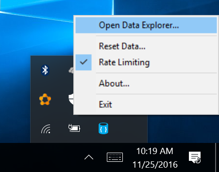

# Use the Azure Cosmos DB Emulator for local development and testing

<table>
<tr>
  <td><strong>Binaries</strong></td>
  <td>[Download MSI](https://aka.ms/cosmosdb-emulator)</td>
</tr>
<tr>
  <td><strong>Docker</strong></td>
  <td>[Docker Hub](https://hub.docker.com/r/microsoft/azure-documentdb-emulator/)</td>
</tr>
<tr>
  <td><strong>Docker source</strong></td>
  <td>[Github](https://github.com/azure/azure-documentdb-emulator-docker)</td>
</tr>
</table>
  
The Azure Cosmos DB Emulator provides a local environment that emulates the Azure Cosmos DB service for development purposes. Using the Azure Cosmos DB Emulator, you can develop and test your application locally, without creating an Azure subscription or incurring any costs. When you're satisfied with how your application is working in the Azure Cosmos DB Emulator, you can switch to using an Azure Cosmos DB account in the cloud.

This article covers the following tasks: 

> [!div class="checklist"]
> * Installing the Emulator
> * Running the Emulator on Docker for Windows
> * Authenticating requests
> * Using the Data Explorer in the Emulator
> * Exporting SSL certificates
> * Calling the Emulator from the command line
> * Collecting trace files

We recommend getting started by watching the following video, where Kirill Gavrylyuk shows how to get started with the Azure Cosmos DB Emulator. Note that the video refers to the emulator as the DocumentDB Emulator, but the tool itself has been renamed the Azure Cosmos DB Emulator since taping the video. All information in the video is still accurate for the Azure Cosmos DB Emulator. 

> [!VIDEO https://channel9.msdn.com/Events/Connect/2016/192/player]
> 
> 

## How the Emulator works
The Azure Cosmos DB Emulator provides a high-fidelity emulation of the Azure Cosmos DB service. It supports identical functionality as Azure Cosmos DB, including support for creating and querying JSON documents, provisioning and scaling collections, and executing stored procedures and triggers. You can develop and test applications using the Azure Cosmos DB Emulator, and deploy them to Azure at global scale by just making a single configuration change to the connection endpoint for Azure Cosmos DB.

While we created a high-fidelity local emulation of the actual Azure Cosmos DB service, the implementation of the Azure Cosmos DB Emulator is different than that of the service. For example, the Azure Cosmos DB Emulator uses standard OS components such as the local file system for persistence, and HTTPS protocol stack for connectivity. This means that some functionality that relies on Azure infrastructure like global replication, single-digit millisecond latency for reads/writes, and tunable consistency levels are not available via the Azure Cosmos DB Emulator.

> [!NOTE]
> At this time the Data Explorer in the emulator only supports the creation of DocumentDB API collections and MongoDB collections. The Data Explorer in the emulator does not currently support the creation of tables and graphs. 

## System requirements
The Azure Cosmos DB Emulator has the following hardware and software requirements:

* Software requirements
  * Windows Server 2012 R2, Windows Server 2016, or Windows 10
*	Minimum Hardware requirements
  *	2 GB RAM
  *	10 GB available hard disk space

## Installation
You can download and install the Azure Cosmos DB Emulator from the [Microsoft Download Center](https://aka.ms/cosmosdb-emulator). 

> [!NOTE]
> To install, configure, and run the Azure Cosmos DB Emulator, you must have administrative privileges on the computer.

## Running on Docker for Windows

The Azure Cosmos DB Emulator can be run on Docker for Windows. The Emulator does not work on Docker for Oracle Linux.

Once you have [Docker for Windows](https://www.docker.com/docker-windows) installed, you can pull the Emulator image from Docker Hub by running the following command from your favorite shell (cmd.exe, PowerShell, etc.).

```      
docker pull microsoft/azure-cosmosdb-emulator 
```
To start the image, run the following commands.

``` 
md %LOCALAPPDATA%\CosmosDBEmulatorCert 2>nul
docker run -v %LOCALAPPDATA%\CosmosDBEmulatorCert:c:\CosmosDBEmulator\CosmosDBEmulatorCert -P -t -i microsoft/azure-cosmosdb-emulator 
```

The response looks similar to the following:

```
Starting Emulator
Emulator Endpoint: https://172.20.229.193:8081/
Master Key: C2y6yDjf5/R+ob0N8A7Cgv30VRDJIWEHLM+4QDU5DE2nQ9nDuVTqobD4b8mGGyPMbIZnqyMsEcaGQy67XIw/Jw==
Exporting SSL Certificate
You can import the SSL certificate from an administrator command prompt on the host by running:
cd /d %LOCALAPPDATA%\CosmosDBEmulatorCert
powershell .\importcert.ps1
--------------------------------------------------------------------------------------------------
Starting interactive shell
``` 

Closing the interactive shell once the Emulator has been started will shutdown the Emulator’s container.

Use the endpoint and master key in from the response in your client and import the SSL certificate into your host. To import the SSL certificate, do the following from an admin command prompt:

```
cd %LOCALAPPDATA%\CosmosDBEmulatorCert
powershell .\importcert.ps1
```


## Start the Emulator

To start the Azure Cosmos DB Emulator, select the Start button or press the Windows key. Begin typing **Azure Cosmos DB Emulator**, and select the emulator from the list of applications. 


When the emulator is running, you'll see an icon in the Windows taskbar notification area. 

The Azure Cosmos DB Emulator by default runs on the local machine ("localhost") listening on port 8081.

The Azure Cosmos DB Emulator is installed by default to the `C:\Program Files\Azure Cosmos DB Emulator` directory. You can also start and stop the emulator from the command-line. See [command-line tool reference](#command-line) for more information.

## Start Data Explorer

When the Azure Cosmos DB emulator launches it will automatically open the Azure Cosmos DB Data Explorer in your browser. The address will appear as [https://localhost:8081/_explorer/index.html](https://localhost:8081/_explorer/index.html). If you close the explorer and would like to re-open it later, you can either open the URL in your browser or launch it from the Azure Cosmos DB Emulator in the Windows Tray Icon as shown below.



## Checking for updates
Data Explorer indicates if there is a new update available for download. 

> [!NOTE]
> Data created in one version of the Azure Cosmos DB Emulator is not guaranteed to be accessible when using a different version. If you need to persist your data for the long term, it is recommended that you store that data in an Azure Cosmos DB account, rather than in the Azure Cosmos DB Emulator. 

## Authenticating requests
Just as with Azure Document in the cloud, every request that you make against the Azure Cosmos DB Emulator must be authenticated. The Azure Cosmos DB Emulator supports a single fixed account and a well-known authentication key for master key authentication. This account and key are the only credentials permitted for use with the Azure Cosmos DB Emulator. They are:

    Account name: localhost:<port>
    Account key: C2y6yDjf5/R+ob0N8A7Cgv30VRDJIWEHLM+4QDU5DE2nQ9nDuVTqobD4b8mGGyPMbIZnqyMsEcaGQy67XIw/Jw==

> [!NOTE]
> The master key supported by the Azure Cosmos DB Emulator is intended for use only with the emulator. You cannot use your production Azure Cosmos DB account and key with the Azure Cosmos DB Emulator. 

Additionally, just as the Azure Cosmos DB service, the Azure Cosmos DB Emulator supports only secure communication via SSL.

## Developing with the Emulator
Once you have the Azure Cosmos DB Emulator running on your desktop, you can use any supported [Azure Cosmos DB SDK](documentdb-sdk-dotnet.md) or the [Azure Cosmos DB REST API](https://msdn.microsoft.com/library/azure/dn781481.aspx) to interact with the Emulator. The Azure Cosmos DB Emulator also includes a built-in Data Explorer that lets you create collections for the DocumentDB and MongoDB APIs, and view and edit documents without writing any code.   

    // Connect to the Azure Cosmos DB Emulator running locally
    DocumentClient client = new DocumentClient(
        new Uri("https://localhost:8081"), 
        "C2y6yDjf5/R+ob0N8A7Cgv30VRDJIWEHLM+4QDU5DE2nQ9nDuVTqobD4b8mGGyPMbIZnqyMsEcaGQy67XIw/Jw==");

If you're using [Azure Cosmos DB protocol support for MongoDB](mongodb-introduction.md), please use the following connection string:

    mongodb://localhost:C2y6yDjf5/R+ob0N8A7Cgv30VRDJIWEHLM+4QDU5DE2nQ9nDuVTqobD4b8mGGyPMbIZnqyMsEcaGQy67XIw/Jw==@localhost:10250/admin?ssl=true&3t.sslSelfSignedCerts=true

You can use existing tools like [Azure DocumentDB Studio](https://github.com/mingaliu/DocumentDBStudio) to connect to the Azure Cosmos DB Emulator. You can also migrate data between the Azure Cosmos DB Emulator and the Azure Cosmos DB service using the [Azure Cosmos DB Data Migration Tool](https://github.com/azure/azure-documentdb-datamigrationtool).

Using the Azure Cosmos DB emulator, by default, you can create up to 25 single partition collections or 1 partitioned collection. For more information about changing this value, see [Setting the PartitionCount value](#set-partitioncount).

## Export the SSL certificate

.NET languages and runtime use the Windows Certificate Store to securely connect to the Azure Cosmos DB local emulator. Other languages have their own method of managing and using certificates. Java uses its own [certificate store](https://docs.oracle.com/cd/E19830-01/819-4712/ablqw/index.html) whereas Python uses [socket wrappers](https://docs.python.org/2/library/ssl.html).

In order to obtain a certificate to use with languages and runtimes that do not integrate with the Windows Certificate Store you will need to export it using the Windows Certificate Manager. You can start it by running certlm.msc or follow the step by step instructions in [Export the Azure Cosmos DB Emulator Certificates](./local-emulator-export-ssl-certificates.md). Once the certificate manager is running, open the Personal Certificates as shown below and export the certificate with the friendly name "DocumentDBEmulatorCertificate" as a BASE-64 encoded X.509 (.cer) file.


The X.509 certificate can be imported into the Java certificate store by following the instructions in [Adding a Certificate to the Java CA Certificates Store](https://docs.microsoft.com/azure/java-add-certificate-ca-store). Once the certificate is imported into the certificate store, Java and MongoDB applications will be able to connect to the Azure Cosmos DB Emulator.

When connecting to the emulator from Python and Node.js SDKs, SSL verification is disabled.

## <a id="command-line"></a>Command-line tool reference
From the installation location, you can use the command-line to start and stop the emulator, configure options, and perform other operations.

### Command-line Syntax

    CosmosDB.Emulator.exe [/Shutdown] [/DataPath] [/Port] [/MongoPort] [/DirectPorts] [/Key] [/EnableRateLimiting] [/DisableRateLimiting] [/NoUI] [/NoExplorer] [/?]

To view the list of options, type `CosmosDB.Emulator.exe /?` at the command prompt.

<table>
<tr>
  <td><strong>Option</strong></td>
  <td><strong>Description</strong></td>
  <td><strong>Command</strong></td>
  <td><strong>Arguments</strong></td>
</tr>
<tr>
  <td>[No arguments]</td>
  <td>Starts up the Azure Cosmos DB Emulator with default settings.</td>
  <td>CosmosDB.Emulator.exe</td>
  <td></td>
</tr>
<tr>
  <td>[Help]</td>
  <td>Displays the list of supported command-line arguments.</td>
  <td>CosmosDB.Emulator.exe /?</td>
  <td></td>
</tr>
<tr>
  <td>Shutdown</td>
  <td>Shuts down the Azure Cosmos DB Emulator.</td>
  <td>CosmosDB.Emulator.exe /Shutdown</td>
  <td></td>
</tr>
<tr>
  <td>DataPath</td>
  <td>Specifies the path in which to store data files. Default is %LocalAppdata%\CosmosDBEmulator.</td>
  <td>CosmosDB.Emulator.exe /DataPath=&lt;datapath&gt;</td>
  <td>&lt;datapath&gt;: An accessible path</td>
</tr>
<tr>
  <td>Port</td>
  <td>Specifies the port number to use for the emulator.  Default is 8081.</td>
  <td>CosmosDB.Emulator.exe /Port=&lt;port&gt;</td>
  <td>&lt;port&gt;: Single port number</td>
</tr>
<tr>
  <td>MongoPort</td>
  <td>Specifies the port number to use for MongoDB compatibility API. Default is 10250.</td>
  <td>CosmosDB.Emulator.exe /MongoPort=&lt;mongoport&gt;</td>
  <td>&lt;mongoport&gt;: Single port number</td>
</tr>
<tr>
  <td>DirectPorts</td>
  <td>Specifies the ports to use for direct connectivity. Defaults are 10251,10252,10253,10254.</td>
  <td>CosmosDB.Emulator.exe /DirectPorts:&lt;directports&gt;</td>
  <td>&lt;directports&gt;: Comma-delimited list of 4 ports</td>
</tr>
<tr>
  <td>Key</td>
  <td>Authorization key for the emulator. Key must be the base-64 encoding of a 64-byte vector.</td>
  <td>CosmosDB.Emulator.exe /Key:&lt;key&gt;</td>
  <td>&lt;key&gt;: Key must be the base-64 encoding of a 64-byte vector</td>
</tr>
<tr>
  <td>EnableRateLimiting</td>
  <td>Specifies that request rate limiting behavior is enabled.</td>
  <td>CosmosDB.Emulator.exe /EnableRateLimiting</td>
  <td></td>
</tr>
<tr>
  <td>DisableRateLimiting</td>
  <td>Specifies that request rate limiting behavior is disabled.</td>
  <td>CosmosDB.Emulator.exe /DisableRateLimiting</td>
  <td></td>
</tr>
<tr>
  <td>NoUI</td>
  <td>Do not show the emulator user interface.</td>
  <td>CosmosDB.Emulator.exe /NoUI</td>
  <td></td>
</tr>
<tr>
  <td>NoExplorer</td>
  <td>Don't show document explorer on startup.</td>
  <td>CosmosDB.Emulator.exe /NoExplorer</td>
  <td></td>
</tr>
<tr>
  <td>PartitionCount</td>
  <td>Specifies the maximum number of partitioned collections. See [Change the number of collections](#set-partitioncount) for more information.</td>
  <td>CosmosDB.Emulator.exe /PartitionCount=&lt;partitioncount&gt;</td>
  <td>&lt;partitioncount&gt;: Maximum number of allowed single partition collections. Default is 25. Maximum allowed is 250.</td>
</tr>
</table>

## Differences between the Azure Cosmos DB Emulator and Azure Cosmos DB 
Because the Azure Cosmos DB Emulator provides an emulated environment running on a local developer workstation, there are some differences in functionality between the emulator and an Azure Cosmos DB account in the cloud:

* The Azure Cosmos DB Emulator supports only a single fixed account and a well-known master key.  Key regeneration is not possible in the Azure Cosmos DB Emulator.
* The Azure Cosmos DB Emulator is not a scalable service and will not support a large number of collections.
* The Azure Cosmos DB Emulator does not simulate different [Azure Cosmos DB consistency levels](consistency-levels.md).
* The Azure Cosmos DB Emulator does not simulate [multi-region replication](distribute-data-globally.md).
* The Azure Cosmos DB Emulator does not support the service quota overrides that are available in the Azure Cosmos DB service (e.g. document size limits, increased partitioned collection storage).
* As your copy of the Azure Cosmos DB Emulator might not be up to date with the most recent changes with the Azure Cosmos DB service, please [Azure Cosmos DB capacity planner](https://www.documentdb.com/capacityplanner) to accurately estimate production throughput (RUs) needs of your application.

## <a id="set-partitioncount"></a>Change the number of collections

By default, you can create up to 25 single partition collections, or 1 partitioned collection using the Azure Cosmos DB Emulator. By modifying the **PartitionCount** value, you can create up to 250 single partition collections or 10 partitioned collections, or any combination of the two that does not exceed 250 single partitions (where 1 partitioned collection = 25 single partition collection).

If you attempt to create a collection after the current partition count has been exceeded, the emulator throws a ServiceUnavailable exception, with the following message.

    Sorry, we are currently experiencing high demand in this region, 
    and cannot fulfill your request at this time. We work continuously 
    to bring more and more capacity online, and encourage you to try again. 
    Please do not hesitate to email docdbswat@microsoft.com at any time or 
    for any reason. ActivityId: 29da65cc-fba1-45f9-b82c-bf01d78a1f91

To change the number of collections available to the Azure Cosmos DB Emulator, do the following:

1. Delete all local Azure Cosmos DB Emulator data by right-clicking the **Azure Cosmos DB Emulator** icon on the system tray, and then clicking **Reset Data…**.
2. Delete all emulator data in this folder C:\Users\user_name\AppData\Local\CosmosDBEmulator.
3. Exit all open instances by right-clicking the **Azure Cosmos DB Emulator** icon on the system tray, and then clicking **Exit**. It may take a minute for all instances to exit.
4. Install the latest version of the [Azure Cosmos DB Emulator](https://aka.ms/cosmosdb-emulator).
5. Launch the emulator with the PartitionCount flag by setting a value <= 250. For example: `C:\Program Files\Azure CosmosDB Emulator>CosmosDB.Emulator.exe /PartitionCount=100`.

## Troubleshooting

Use the following tips to help troubleshoot issues you encounter with the Azure Cosmos DB emulator:

- If the Azure Cosmos DB emulator crashes, collect dump files from c:\Users\user_name\AppData\Local\CrashDumps folder, compress them, and attach them to an email to [askcosmosdb@microsoft.com](mailto:askcosmosdb@microsoft.com).

- If you experience crashes in CosmosDB.StartupEntryPoint.exe, run the following command from an admin command prompt:
`lodctr /R` 

- If you encounter a connectivity issue, [collect trace files](#trace-files), compress them, and attach them to an email to [askcosmosdb@microsoft.com](mailto:askcosmosdb@microsoft.com).

- If you receive a **Service Unavailable** message, the emulator might be failing to initialize the network stack. Check to see if you have the Pulse secure client or Juniper networks client installed, as their network filter drivers may cause the problem. Uninstalling third party network filter drivers typically fixes the issue.

### <a id="trace-files"></a>Collect trace files

To collect debugging traces, run the following commands from an administrative command prompt:

1. `cd /d "%ProgramFiles%\Azure Cosmos DB Emulator"`
2. `CosmosDB.Emulator.exe /shutdown`. Watch the system tray to make sure the program has shut down, it may take a minute. You can also just click **Exit** in the Azure Cosmos DB emulator user interface.
3. `CosmosDB.Emulator.exe /starttraces`
4. `CosmosDB.Emulator.exe`
5. Reproduce the problem. If Data Explorer is not working, you only need to wait for the browser to open for a few seconds to catch the error.
5. `CosmosDB.Emulator.exe /stoptraces`
6. Navigate to `%ProgramFiles%\Azure Cosmos DB Emulator` and find the docdbemulator_000001.etl file.
7. Send the .etl file along with repro steps to [askcosmosdb@microsoft.com](mailto:askcosmosdb@microsoft.com) for debugging.

## Next steps

In this tutorial, you've done the following:

> [!div class="checklist"]
> * Installed the local Emulator
> * Rand the Emulator on Docker for Windows
> * Authenticated requests
> * Used the Data Explorer in the Emulator
> * Exported SSL certificates
> * Called the Emulator from the command line
> * Collected trace files

In this tutorial, you've learned how to use the local Emulator for free local development. You can now proceed to the next tutorial and learn how to export Emulator SSL certificates. 

> [!div class="nextstepaction"]
> [Export the Azure Cosmos DB Emulator certificates](local-emulator-export-ssl-certificates.md)
