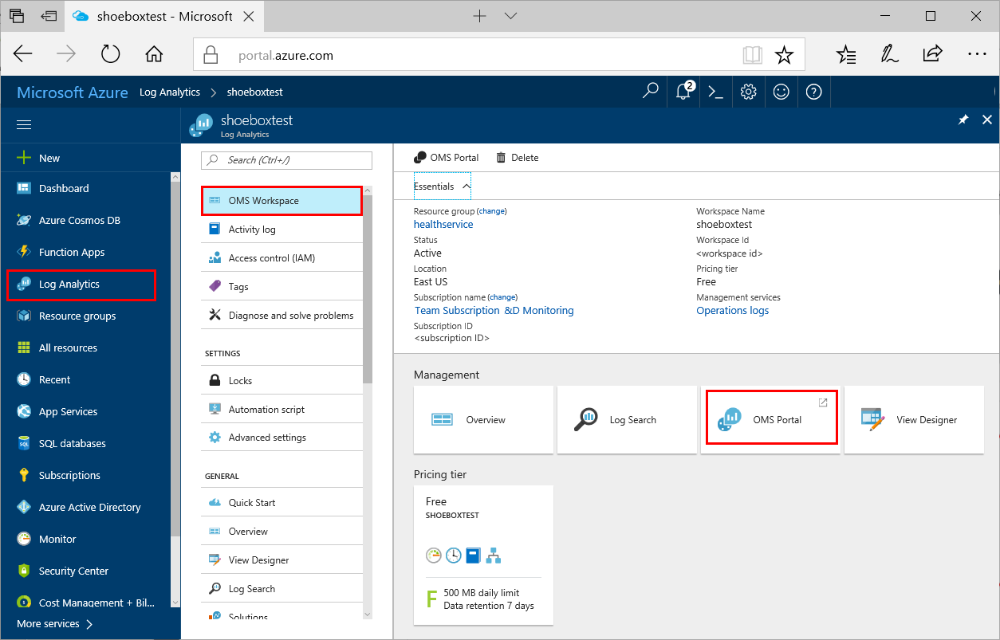
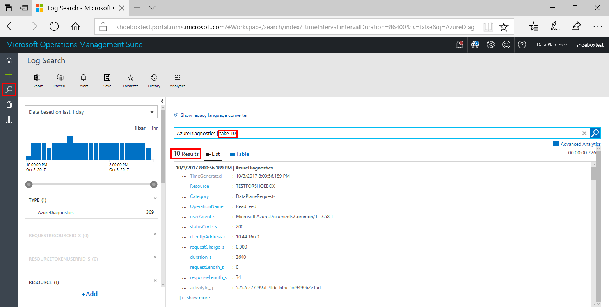

# Azure Cosmos DB diagnostic logging

Once you've started using one or more Azure Cosmos DB databases, you may want to monitor how and when your databases are accessed. Diagnostic logging in Azure Cosmos DB enables you to perform this monitoring. By enabling diagnostic logging, you can send logs to [Azure Storage](https://azure.microsoft.com/services/storage/), stream them to [Azure Event Hubs](https://azure.microsoft.com/en-us/services/event-hubs/), and/or export them into an [Operations Management Suite](https://www.microsoft.com/cloud-platform/operations-management-suite) workspace via [Log Analytics](https://azure.microsoft.com/services/log-analytics/).


Use this tutorial to get started with Azure Cosmos DB logging via the Azure portal, CLI, or PowerShell.

## What is logged?

* All authenticated REST DocumentDB (SQL) API requests are logged, which includes failed requests as a result of access permissions, system errors, or bad requests. Support for MongoDB, Graph, and Table APIs is not currently available.
* Operations on the database itself, which includes CRUD operations on all documents, containers, and databases.
* Operations on account keys, which include creating, modifying, or deleting these keys.
* Unauthenticated requests that result in a 401 response. For example, requests that do not have a bearer token, or are malformed or expired, or have an invalid token.

## Prerequisites
To complete this tutorial, you must have the following resources:

* An existing Azure Cosmos DB account, database, and container. For instructions on creating these resources, see [Create a database account using the Azure portal](create-documentdb-dotnet.md#create-a-database-account), [CLI samples](cli-samples.md), or [PowerShell samples](powershell-samples.md).

<a id="#turn-on"></a>
## Turn on logging in the Azure portal

1. In the [Azure portal](https://portal.azure.com), in your Azure Cosmos DB account, click **Diagnostic logs** in the left navigation, and then click **Turn on diagnostics**.

    

2. In the **Diagnostic settings** page, do the following: 

    * **Name**. Enter a name for the logs to create.

    * **Archive to a storage account**. To use this option, you need an existing storage account to connect to. To create a new storage account in the portal, see [Create a storage account](../storage/common/storage-create-storage-account.md) and follow instructions to create a Resource Manager, general-purpose account. Then return to this page in the portal to select your storage account. It may take a few minutes for newly created storage accounts to appear in the drop-down menu.
    * **Stream to an event hub**. To use this option, you need an existing Event Hub namespace and event hub to connect to. To create an Event Hubs namespace, see [Create an Event Hubs namespace and an event hub using the Azure portal](../event-hubs/event-hubs-create.md). Then return to this page in the portal to select the Event Hub namespace and policy name.
    * **Send to Log Analytics**. To use this option, either use one of the existing workspaces or create a new Operations Management Suite workspace by following the prompts in the portal. For more information on viewing your logs in Operations Management Suite, see [View logs in Operations Management Suite](#view-in-oms).
    * **Log DataPlaneRequests**. If you are archiving to a storage account, you can select the retention period for the diagnostic logs by selecting **DataPlaneRequests** and choosing the number of days to retain logs. Logs are autodeleted after the retention period expires. 

3. Click **Save**.

    You can return to this page at anytime to modify the diagnostic log settings for your account.

## Turn on logging using CLI

To enable metrics and diagnostics logging using the Azure CLI, use the following commands:

- To enable storage of Diagnostic Logs in a Storage Account, use this command:

   ```azurecli-interactive
   azure insights diagnostic set --resourceId <resourceId> --storageId <storageAccountId> --enabled true
   ```

   The `resourceId` is the name of the Azure Cosmos DB account. The `storageId` is the name of the storage account to which you want to send the logs.

- To enable streaming of Diagnostic Logs to an Event Hub, use this command:

   ```azurecli-interactive
   azure insights diagnostic set --resourceId <resourceId> --serviceBusRuleId <serviceBusRuleId> --enabled true
   ```

   The `resourceId` is the name of the Azure Cosmos DB account. The `serviceBusRuleId` is a string with this format:

   ```azurecli-interactive
   {service bus resource ID}/authorizationrules/{key name}
   ```

- To enable sending of Diagnostic Logs to a Log Analytics workspace, use this command:

   ```azurecli-interactive
   azure insights diagnostic set --resourceId <resourceId> --workspaceId <resource id of the log analytics workspace> --enabled true
   ```

You can combine these parameters to enable multiple output options.

## Turn on logging using PowerShell

To turn on logging using PowerShell, you need Azure Powershell, with a minimum version of 1.0.1.

To install Azure PowerShell and associate it with your Azure subscription, see [How to install and configure Azure PowerShell](/powershell/azure/overview).

If you have already installed Azure PowerShell and do not know the version, from the PowerShell console, type `(Get-Module azure -ListAvailable).Version`.  

### <a id="connect"></a>Connect to your subscriptions
Start an Azure PowerShell session and sign in to your Azure account with the following command:  

```powershell
Login-AzureRmAccount
```

In the pop-up browser window, enter your Azure account user name and password. Azure PowerShell gets all the subscriptions that are associated with this account and by default, uses the first one.

If you have multiple subscriptions, you might have to specify a specific one that was used to create your Azure Key Vault. Type the following to see the subscriptions for your account:

```powershell
Get-AzureRmSubscription
```

Then, to specify the subscription that's associated with the Azure Cosmos DB account you are logging, type:

```powershell
Set-AzureRmContext -SubscriptionId <subscription ID>
```

> [!NOTE]
> If you have multiple subscriptions associated with your account it is important to specify the subscription.
>
>

For more information about configuring Azure PowerShell, see [How to install and configure Azure PowerShell](/powershell/azure/overview).

### <a id="storage"></a>Create a new storage account for your logs
Although you can use an existing storage account for your logs, in this tutorial we create a new storage account dedicated to Azure Cosmos DB logs. For convenience, we are storing the storage account details into a variable named **sa**.

For additional ease of management, in this tutorial we use the same resource group as the one that contains our Azure Cosmos DB database. Substitute values for ContosoResourceGroup, contosocosmosdblogs, and 'North Central US' for your own values, as applicable:

```powershell
$sa = New-AzureRmStorageAccount -ResourceGroupName ContosoResourceGroup `
-Name contosocosmosdblogs -Type Standard_LRS -Location 'North Central US'
```

> [!NOTE]
> If you decide to use an existing storage account, it must use the same subscription as your Azure Cosmos DB subscription and it must use the Resource Manager deployment model, rather than the Classic deployment model.
>
>

### <a id="identify"></a>Identify the Azure Cosmos DB account for your logs
Set the Azure Cosmos DB account name to a variable named **account**, where ResourceName is the name of the Azure Cosmos DB account.

```powershell
$account = Get-AzureRmResource -ResourceGroupName ContosoResourceGroup `
-ResourceName contosocosmosdb -ResourceType "Microsoft.DocumentDb/databaseAccounts"
```

### <a id="enable"></a>Enable logging
To enable logging for Azure Cosmos DB, use the Set-AzureRmDiagnosticSetting cmdlet, together with the variables for the new storage account, Azure Cosmos DB account and the category for which you would like to enable logs. Run the following command, setting the **-Enabled** flag to **$true**:

```powershell
Set-AzureRmDiagnosticSetting  -ResourceId $account.ResourceId -StorageAccountId $sa.Id -Enabled $true -Categories DataPlaneRequests
```

The output for the command should resemble the following:

```powershell
    StorageAccountId            : /subscriptions/<subscription-ID>/resourceGroups/ContosoResourceGroup/providers`
    /Microsoft.Storage/storageAccounts/contosocosmosdblogs
    ServiceBusRuleId            :
    EventHubAuthorizationRuleId :
    Metrics
        TimeGrain       : PT1M
        Enabled         : False
        RetentionPolicy
        Enabled : False
        Days    : 0
    
    Logs
        Category        : DataPlaneRequests
        Enabled         : True
        RetentionPolicy
        Enabled : False
        Days    : 0
    
    WorkspaceId                 :
    Id                          : /subscriptions/<subscription-ID>/resourcegroups/ContosoResourceGroup/providers`
    /microsoft.documentdb/databaseaccounts/contosocosmosdb/providers/microsoft.insights/diagnosticSettings/service
    Name                        : service
    Type                        :
    Location                    :
    Tags                        :
```

This confirms that logging is now enabled for your database, saving information to your storage account.

Optionally you can also set retention policy for your logs such that older logs will be automatically deleted. For example, set retention policy using **-RetentionEnabled** flag to **$true** and set **-RetentionInDays** parameter to **90** so that logs older than 90 days will be automatically deleted.

```powershell
Set-AzureRmDiagnosticSetting -ResourceId $account.ResourceId`
 -StorageAccountId $sa.Id -Enabled $true -Categories DataPlaneRequests`
  -RetentionEnabled $true -RetentionInDays 90
```

### <a id="access"></a>Access your logs
Azure Cosmos DB logs for **DataPlaneRequests** category are stored in the **insights-logs-data-plane-requests**  container in the storage account you provided. 

First, create a variable for the container name. This will be used throughout the rest of the walk-through.

```powershell
    $container = 'insights-logs-dataplanerequests'
```

To list all the blobs in this container, type:

```powershell
Get-AzureStorageBlob -Container $container -Context $sa.Context
```

The output will look something similar to this:

```powershell
ICloudBlob        : Microsoft.WindowsAzure.Storage.Blob.CloudBlockBlob
BlobType          : BlockBlob
Length            : 10510193
ContentType       : application/octet-stream
LastModified      : 9/28/2017 7:49:04 PM +00:00
SnapshotTime      :
ContinuationToken:
Context           : Microsoft.WindowsAzure.Commands.Common.Storage.`
                    LazyAzureStorageContext
Name              : resourceId=/SUBSCRIPTIONS/<subscription-ID>/RESOURCEGROUPS/CONTOSORESOURCEGROUP/PROVIDERS`
/MICROSOFT.DOCUMENTDB/DATABASEACCOUNTS/CONTOSOCOSMOSDB/y=2017/m=09/d=28/h=19/m=00/PT1H.json
```

As you can see from this output, the blobs follow a naming convention: `resourceId=/SUBSCRIPTIONS/<subscription-ID>/RESOURCEGROUPS/<resource group name>/PROVIDERS/MICROSOFT.DOCUMENTDB/DATABASEACCOUNTS/<Database Account Name>/y=<year>/m=<month>/d=<day of month>/h=<hour>/m=<minute>/filename.json`

The date and time values use UTC.

Because the same storage account can be used to collect logs for multiple resources, the fully qualified resource ID in the blob name is very useful to access or download just the blobs that you need. But before we do that, we'll first cover how to download all the blobs.

First, create a folder to download the blobs. For example:

```powershell
New-Item -Path 'C:\Users\username\ContosoCosmosDBLogs'`
 -ItemType Directory -Force
```

Then get a list of all blobs:  

```powershell
$blobs = Get-AzureStorageBlob -Container $container -Context $sa.Context
```

Pipe this list through 'Get-AzureStorageBlobContent' to download the blobs into our destination folder:

```powershell
$blobs | Get-AzureStorageBlobContent `
 -Destination 'C:\Users\username\ContosoCosmosDBLogs'
```

When you run this second command, the **/** delimiter in the blob names creates a full folder structure under the destination folder. This folder structure is used to download and store the blobs as files.

To selectively download blobs, use wildcards. For example:

* If you have multiple databases and want to download logs for just one database, named CONTOSOCOSMOSDB3:

    ```powershell
    Get-AzureStorageBlob -Container $container `
     -Context $sa.Context -Blob '*/DATABASEACCOUNTS/CONTOSOCOSMOSDB3
    ```

* If you have multiple resource groups and want to download logs for just one resource group, use `-Blob '*/RESOURCEGROUPS/<resource group name>/*'`:

    ```powershell
    Get-AzureStorageBlob -Container $container `
    -Context $sa.Context -Blob '*/RESOURCEGROUPS/CONTOSORESOURCEGROUP3/*'
    ```
* If you want to download all the logs for the month of July 2017, use `-Blob '*/year=2017/m=07/*'`:

    ```powershell
    Get-AzureStorageBlob -Container $container `
     -Context $sa.Context -Blob '*/year=2017/m=07/*'
    ```

You're now ready to start looking at what's in the logs. But before moving onto that, two more parameters for `Get-AzureRmDiagnosticSetting` that you might need to know:

* To query the  status of diagnostic settings for your database resource: `Get-AzureRmDiagnosticSetting -ResourceId $account.ResourceId`
* To disable logging of **DataPlaneRequests** category for your database account resource: `Set-AzureRmDiagnosticSetting -ResourceId $account.ResourceId -StorageAccountId $sa.Id -Enabled $false -Categories DataPlaneRequests`

## <a id="interpret"></a>Interpret your Azure Cosmos DB logs
Individual blobs are stored as text, formatted as a JSON blob. This JSON is an example log entry:

    {
        "records":
        [
            {
               "time": "Fri, 23 Jun 2017 19:29:50.266 GMT",
			   "resourceId": "contosocosmosdb",
			   "category": "DataPlaneRequests",
			   "operationName": "Query",
			   "resourceType": "Database",
			   "properties": {"activityId": "05fcf607-6f64-48fe-81a5-f13ac13dd1eb",`
               "userAgent": "documentdb-dotnet-sdk/1.12.0 Host/64-bit MicrosoftWindowsNT/6.2.9200.0 AzureSearchIndexer/1.0.0",`
               "resourceType": "Database","statusCode": "200","documentResourceId": "",`
               "clientIpAddress": "13.92.241.0","requestCharge": "2.260","collectionRid": "",`
               "duration": "9250","requestLength": "72","responseLength": "209", "resourceTokenUserRid": ""}
            }
        ]
    }


The following table lists the field names and descriptions.

| Field name | Description |
| --- | --- |
| time |The date and time (UTC) when the operation occurred. |
| resourceId |The Azure Cosmos DB account for which logs are enabled.|
| category |For Azure Cosmos DB logs, DataPlaneRequests is the only available value. |
| operationName |Name of the operation. This value can be any of the following operations: Create, Update, Read, ReadFeed, Delete, Replace, Execute, SqlQuery, Query, JSQuery, Head, HeadFeed, or Upsert.   |
| properties |The contents of this field are described in the following table. |

The following table lists the fields logged inside the properties field.

| Property field name | Description |
| --- | --- |
| activityId | The unique GUID for the logged operation. |
| userAgent |A string that specifies the client user agent performing the request. The format is {user agent name}/{version}.|
| resourceType | The type of the resource accessed. This value can be any of the following resource types: Database, Collection, Document, Attachment, User, Permission, StoredProcedure, Trigger, UserDefinedFunction, or Offer. |
| statusCode |The response status of the operation. |
| requestResourceId | The resourceId pertaining to the request, may point to databaseRid, collectionRid or documentRid depending on the operation performed.|
| clientIpAddress |The client's IP address. |
| requestCharge | The number of RUs used by the operation |
| collectionRid | The unique ID for the collection.|
| duration | The duration of operation, in ticks. |
| requestLength |The length of the request, in bytes. |
| responseLength | The length of the response, in bytes.|
| resourceTokenUserRid | This is non-empty when [resource tokens](https://docs.microsoft.com/en-us/azure/cosmos-db/secure-access-to-data#resource-tokens) are used for authentication and points to resource ID of the user. |

## Managing your logs

Logs are made available in your account two hours from the time the Azure Cosmos DB operation was made. It's up to you to manage your logs in your storage account:

* Use standard Azure access control methods to secure your logs by restricting who can access them.
* Delete logs that you no longer want to keep in your storage account.
* The retention period for data plane requests archived to a 
Storage account is configured in the portal when **Log DataPlaneRequests** is selected. To change that setting, see [Turn on logging in the Azure portal](#turn-on-logging-in-the-azure-portal).


<a id="#view-in-loganalytics"></a>
## View diagnostic logs in Log Analytics

If you selected **Send to Log Analytics** option when you turned on logging, diagnostic data from your collection gets pushed to Log Analytics and Operations Management Suite within two hours. This means that if you look at Log Analytics immediately after turning on logging, you won't see any data. Just wait two hours and try again. 

Before viewing your logs, you'll want to check and see if your Log Analytics workspace has been upgraded to use the most recent Log Analytics query language. To check this, open the [Azure portal](https://portal.azure.com), click **Log Analytics** on the far left side, select the workspace name, and go to the **OMS Workspace** page as shown in the following image. 


If you see the following message in the portal, your workspace has not been upgraded to use the new language. You can either click the error to upgrade your workspace (recommended), or you can leave your account as-is and use the queries marked "Current" in the list below. For more information about the impact of the upgrade, see [Upgrade your Azure Log Analytics workspace to new log search](../log-analytics/log-analytics-log-search-upgrade.md). 


To view your diagnostic data in Log Analytics, open the Log Search page from the left menu or the Management area of the page, as shown in the following image.


Now enter a query in the search box. For example, the following image shows how to display the ten most recent logs using the `AzureDiagnostics | take 10` query. Note that this query uses the new query language. 


<a id="#queries"></a>
### Queries

Here are some additional queries you can enter into the **Log search** box to help you monitor your containers. Queries marked New are for accounts that have been upgraded, queries marked Current are for accounts that have not been upgraded. 

* All diagnostic logs for the specified time period.
    * New: `AzureDiagnostics`
    * Current: `(Type=AzureDiagnostics)`
* Ten most recent events.
    * New: `AzureDiagnostics | take 10`
    * Current: `(Type=AzureDiagnostics)| top 10`
* All operations, grouped by operation type.
    * New: `AzureDiagnostics | summarize count() by OperationName`
    * Current: `(Type=AzureDiagnostics) | Measure count() by OperationName`
* All operations, grouped by Resource.
    * New: `AzureDiagnostics | summarize count() by Resource`
    * Current: `(Type=AzureDiagnostics) | Measure count() by Resource` 
* User activity, grouped by resource. Note that this is an activity log, not a diagnostic log.
    * New: `AzureActivity | where Caller == "test@company.com" | summarize count() by Resource`
    * Current (not correct): `(Type=AzureActivity) | Measure count() by Resource | where Caller = "test@company.com"`
* Operations that take longer than 3 milliseconds.
    * New: `AzureDiagnostics | where toint(duration_s) > 3000 | summarize count() by clientIpAddress_s, TimeGenerated`
    * Current (not correct): `(Type=AzureDiagnostics) | Measure count() by clientIpAddress_s, TimeGenerated | Where toint (duration_s) > 3000`
* What kind of agent is running which operations.
    * New: `AzureDiagnostics | summarize count() by OperationName, userAgent_s`
    * Current (not correct): `(Type=AzureDiagnostics)s | Measure count() by OperationName, userAgent_s`
* When were long running operations performed.
    * New: `AzureDiagnostics | project TimeGenerated , toint(duration_s)/1000 | render timechart`
    * Current (not correct): `(Type=AzureDiagnostics) | project TimeGenerated , toint(duration_s)/1000 | render timechart`

For additional information on using the new Log Search language, see [Getting Started with Queries](https://docs.loganalytics.io/docs/Learn/Getting-Started/Getting-started-with-queries). 

For information on using the current Log Search language, see [Find data using log searches in Log Analytics](../log-analytics/log-analytics-log-searches.md)

<a id="#view-in-oms"></a>
## View diagnostic logs in Operations Management Suite

If you selected **Send to Log Analytics** option when you turned on logging, diagnostic data from your collection gets pushed to Operations Management Suite within two hours. This means that if you look at Operations Management Suite immediately after turning on logging, you won't see any data. Just wait two hours and try again. 

If you're already in the [Azure portal](https://portal.azure.com), the easiest way to open Operations Management Suite is to click one of the **OMS Portal** links as shown in the following diagram.



You can also go to the [Operations Management Suite](https://www.microsoft.com/en-us/cloud-platform/operations-management-suite) page and then click **Sign in**, however if you're working multiple with shared subscriptions the Azure portal path provides more visibility into all of your subscriptions. 

Once data starts streaming into your Operations Management Suite workspace you can view data from Azure Cosmos DB by clicking the the **Log Search** icon  on the left menu and entering a query into the search box. For example, the following image shows how to display the ten most recent logs using the `AzureDiagnostics | take 10` query.



See the [Queries](#queries) section in this article for additional sample queries. The query language used by Log Analytics and Operations Management Suite is the same.

## Next steps

- To gain an understanding of not only how to enable logging, but also the metrics and log categories supported by the various Azure services read both the [Overview of metrics in Microsoft Azure](../monitoring-and-diagnostics/monitoring-overview-metrics.md) and [Overview of Azure Diagnostic Logs](../monitoring-and-diagnostics/monitoring-overview-of-diagnostic-logs.md) articles.
- Read these articles to learn about event hubs:
   - [What are Azure Event Hubs](../event-hubs/event-hubs-what-is-event-hubs.md)?
   - [Get started with Event Hubs](../event-hubs/event-hubs-csharp-ephcs-getstarted.md)
- See [Download metrics and diagnostic logs from Azure Storage](../storage/blobs/storage-dotnet-how-to-use-blobs.md#download-blobs)
