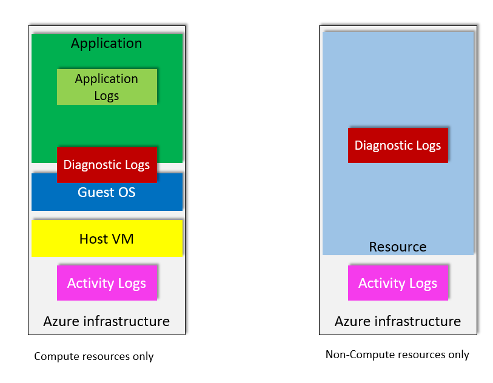
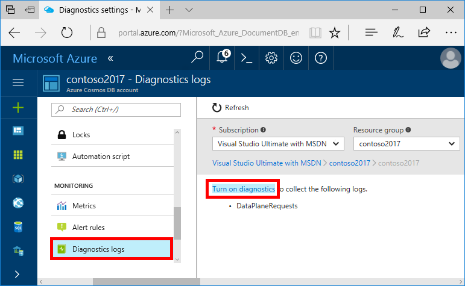
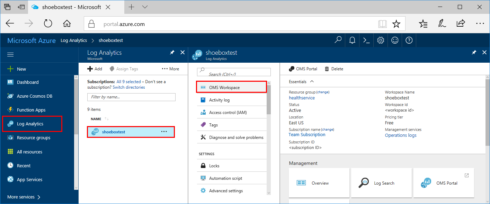
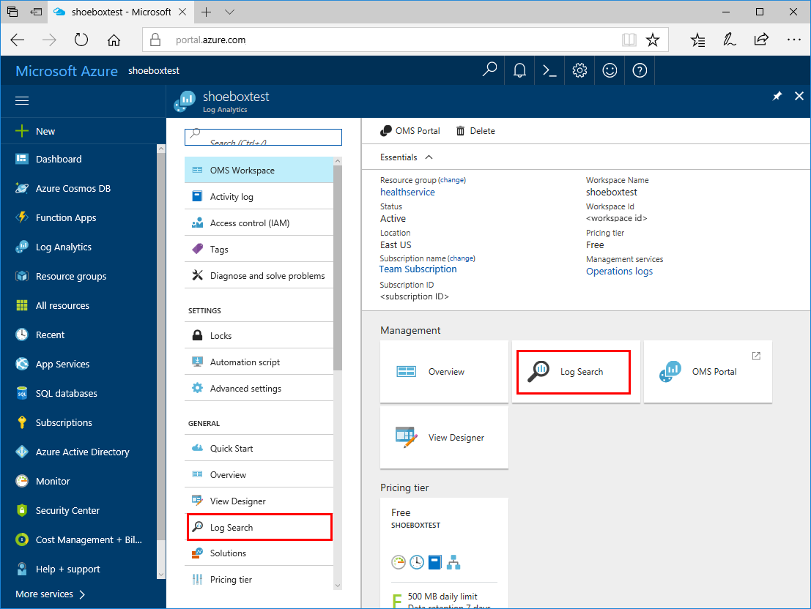

# Diagnostic logging in Azure Cosmos DB 

After you start to use one or more Azure Cosmos DB databases, you may want to monitor how and when your databases are accessed. This article provides an overview of the logs that are available on the Azure platform. You learn how to enable diagnostic logging for monitoring purposes to send logs to [Azure Storage](https://azure.microsoft.com/services/storage/), how to stream logs to [Azure Event Hubs](https://azure.microsoft.com/services/event-hubs/), and how to export logs to [Azure Monitor logs](https://azure.microsoft.com/services/log-analytics/).

[!INCLUDE [azure-monitor-log-analytics-rebrand](../../includes/azure-monitor-log-analytics-rebrand.md)]


[!INCLUDE [updated-for-az](../../includes/updated-for-az.md)]

## Logs available in Azure

Before we talk about how to monitor your Azure Cosmos DB account, let's clarify a few things about logging and monitoring. There are different types of logs on the Azure platform. There are [Azure Activity Logs](https://docs.microsoft.com/azure/monitoring-and-diagnostics/monitoring-overview-activity-logs), [Azure Diagnostic Logs](https://docs.microsoft.com/azure/monitoring-and-diagnostics/monitoring-overview-of-diagnostic-logs), [Azure metrics](https://docs.microsoft.com/azure/monitoring-and-diagnostics/monitoring-overview-metrics), events, heartbeat monitoring, operations logs, and so on. There is a plethora of logs. You can see the complete list of logs in [Azure Monitor logs](https://azure.microsoft.com/services/log-analytics/) in the Azure portal. 

The following image shows the different kind of Azure logs that are available:



In the image, the **Compute resources** represent the Azure resources for which you can access the Microsoft Guest OS. For example, Azure Virtual Machines, virtual machine scale sets, Azure Container Service, and so on, are considered compute resources. Compute resources generate Activity Logs, Diagnostic Logs, and Application Logs. To learn more, refer to the [Sources of monitoring data in Azure](../azure-monitor/platform/data-sources.md) article.

The **Non-Compute resources** are resources in which you can't access the underlying OS and work directly with the resource. For example, Network Security Groups, Logic Apps, and so on. Azure Cosmos DB is a non-compute resource. You can view logs for non-compute resources in the Activity Log or enable the Diagnostic Logs option in the portal. To learn more, refer to the [Sources of data in Azure Monitor](../azure-monitor/platform/data-sources.md) article.

The Activity Log records the operations at a subscription level for Azure Cosmos DB. Operations like ListKeys, Write DatabaseAccounts, and more are logged. Diagnostic Logs provide more granular logging and allow you to log DataPlaneRequests (Create, Read, Query, and so on) and MongoRequests.


In this article, we focus on the Azure Activity Log, Azure Diagnostic Logs, and Azure metrics. What's the difference between these three logs? 

### Azure Activity Log

The Azure Activity Log is a subscription log that provides insight into subscription-level events that have occurred in Azure. The Activity Log reports control-plane events for your subscriptions under the Administrative category. You can use the Activity Log to determine the "what, who, and when" for any write operation (PUT, POST, DELETE) on the resources in your subscription. You can also understand the status of the operation and other relevant properties. 

The Activity Log differs from Diagnostic Logs. The Activity Log provides data about the operations on a resource from the outside (the _control plane_). In the Azure Cosmos DB context, control plane operations include create container, list keys, delete keys, list database, and so on. Diagnostics Logs are emitted by a resource and provide information about the operation of that resource (the _data plane_). Some examples of the data plane operations in the diagnostic log are Delete, Insert, and ReadFeed.

Activity Logs (control plane operations) can be richer in nature and can include the full email address of the caller, caller IP address, resource name, operation name, TenantId, and more. The Activity Log contains several [categories](https://docs.microsoft.com/azure/monitoring-and-diagnostics/monitoring-activity-log-schema) of data. For full details on the schemata of these categories, see [Azure Activity Log event schema](https://docs.microsoft.com/azure/monitoring-and-diagnostics/monitoring-activity-log-schema). However, Diagnostic Logs can be restrictive in nature as personal data is often stripped from these logs. You might have the IP address of the caller, but the last octant is removed.

### Azure metrics

[Azure metrics](https://docs.microsoft.com/azure/monitoring-and-diagnostics/monitoring-overview-metrics) have the most important type of Azure telemetry data (also called _performance counters_) that's emitted by most Azure resources. Metrics let you view information about throughput, storage, consistency, availability, and the latency of your Azure Cosmos DB resources. For more information, see [Monitoring and debugging with metrics in Azure Cosmos DB](use-metrics.md).

### Azure Diagnostic Logs

Azure Diagnostic Logs are emitted by a resource and provide rich, frequent data about the operation of that resource. These logs are captured per request. The content of these logs varies by resource type. Resource-level diagnostic logs also differ from Guest OS-level diagnostic logs. Guest OS diagnostic logs are collected by an agent that's running inside a virtual machine or other supported resource type. Resource-level diagnostic logs require no agent and capture resource-specific data from the Azure platform itself. Guest OS-level diagnostic logs capture data from the operating system and applications that are running on a virtual machine.


### What is logged by Azure Diagnostic Logs?

* All authenticated backend requests (TCP/REST) across all APIs are logged, including failed requests as a result of access permissions, system errors, or bad requests. Support for user-initiated Graph, Cassandra, and Table API requests aren't currently available.
* Operations on the database itself, which include CRUD operations on all documents, containers, and databases.
* Operations on account keys, which include creating, modifying, or deleting the keys.
* Unauthenticated requests that result in a 401 response. For example, requests that don't have a bearer token, or are malformed or expired, or have an invalid token.

<a id="#turn-on"></a>
## Turn on logging in the Azure portal

Use the following steps to enable diagnostic logging in the Azure portal:

1. Sign into the [Azure portal](https://portal.azure.com). 

1. Navigate to your Azure Cosmos account. Open the **Diagnostic settings** pane, and then select **Add diagnostic setting** option.

    

1. In the **Diagnostic settings** page, fill the form with the following details: 

    * **Name**: Enter a name for the logs to create.

    * You can store the logs to the following services:

      * **Archive to a storage account**: To use this option, you need an existing storage account to connect to. To create a new storage account in the portal, see [Create a storage account](../storage/common/storage-create-storage-account.md) article. Then, return to the Azure Cosmos Db diagnostic settings pane in the portal to select your storage account. It might take a few minutes for newly created storage accounts to appear in the drop-down menu.

      * **Stream to an event hub**: To use this option, you need an existing Event Hubs namespace and event hub to connect to. To create an Event Hubs namespace, see [Create an Event Hubs namespace and an event hub by using the Azure portal](../event-hubs/event-hubs-create.md). Then, return to this page in the portal to select the Event Hub namespace and policy name.

      * **Send to Log Analytics**: To use this option, either use an existing workspace or create a new Log Analytics workspace by following the steps to [Create a new workspace](../azure-monitor/learn/quick-collect-azurevm.md#create-a-workspace) in the portal. 

   * You can log the following data:

      * **DataPlaneRequests**: Select this option to log back-end requests to all APIs which includes SQL, Graph, MongoDB, Cassandra, and Table API accounts in Azure Cosmos DB. If you're archiving to a storage account, you can select the retention period for the diagnostic logs. Logs are auto-deleted after the retention period expires. The following JSON data is an example output of details logged using DataPlaneRequests. Key properties to note are: Requestcharge, statusCode, clientIPaddress, and partitionID:

       ```
       { "time": "2019-04-23T23:12:52.3814846Z", "resourceId": "/SUBSCRIPTIONS/<your_subscription_ID>/RESOURCEGROUPS/<your_resource_group>/PROVIDERS/MICROSOFT.DOCUMENTDB/DATABASEACCOUNTS/<your_database_account>", "category": "DataPlaneRequests", "operationName": "ReadFeed", "properties": {"activityId": "66a0c647-af38-4b8d-a92a-c48a805d6460","requestResourceType": "Database","requestResourceId": "","collectionRid": "","statusCode": "200","duration": "0","userAgent": "Microsoft.Azure.Documents.Common/2.2.0.0","clientIpAddress": "10.0.0.24","requestCharge": "1.000000","requestLength": "0","responseLength": "372","resourceTokenUserRid": "","region": "East US","partitionId": "062abe3e-de63-4aa5-b9de-4a77119c59f8","keyType": "PrimaryReadOnlyMasterKey","databaseName": "","collectionName": ""}}
       ```

      * **MongoRequests**: Select this option to log user-initiated requests from the front end to serve requests to Azure Cosmos DB's API for MongoDB. MongoDB requests will appear in MongoRequests as well as DataPlaneRequests. If you're archiving to a storage account, you can select the retention period for the diagnostic logs. Logs are auto-deleted after the retention period expires. The following JSON data is an example output of details logged using MongoRequests. Key properties to note are: Requestcharge, opCode:

       ```
       { "time": "2019-04-10T15:10:46.7820998Z", "resourceId": "/SUBSCRIPTIONS/<your_subscription_ID>/RESOURCEGROUPS/<your_resource_group>/PROVIDERS/MICROSOFT.DOCUMENTDB/DATABASEACCOUNTS/<your_database_account>", "category": "MongoRequests", "operationName": "ping", "properties": {"activityId": "823cae64-0000-0000-0000-000000000000","opCode": "MongoOpCode_OP_QUERY","errorCode": "0","duration": "0","requestCharge": "0.000000","databaseName": "admin","collectionName": "$cmd","retryCount": "0"}}
       ```

      * **QueryRuntimeStatistics**: Select this option to log the query text that was executed.  The following JSON data is an example output of details logged using QueryRuntimeStatistics:

       ```
       { "time": "2019-04-14T19:08:11.6353239Z", "resourceId": "/SUBSCRIPTIONS/<your_subscription_ID>/RESOURCEGROUPS/<your_resource_group>/PROVIDERS/MICROSOFT.DOCUMENTDB/DATABASEACCOUNTS/<your_database_account>", "category": "QueryRuntimeStatistics", "properties": {"activityId": "278b0661-7452-4df3-b992-8aa0864142cf","databasename": "Tasks","collectionname": "Items","partitionkeyrangeid": "0","querytext": "{"query":"SELECT *\nFROM c\nWHERE (c.p1__10 != true)","parameters":[]}"}}
       ```

      * **Metric Requests**: Select this option to store verbose data in [Azure metrics](../azure-monitor/platform/metrics-supported.md). If you're archiving to a storage account, you can select the retention period for the diagnostic logs. Logs are auto-deleted after the retention period expires.

3. Select **Save**.

    If you receive an error that says "Failed to update diagnostics for \<workspace name>. The subscription \<subscription id> is not registered to use microsoft.insights," follow the [Troubleshoot Azure Diagnostics](https://docs.microsoft.com/azure/log-analytics/log-analytics-azure-storage) instructions to register the account and then retry this procedure.

    If you want to change how your diagnostic logs are saved at any point in the future, return to this page to modify the diagnostic log settings for your account.

## Turn on logging by using Azure CLI

To enable metrics and diagnostics logging by using Azure CLI, use the following commands:

- To enable storage of Diagnostic Logs in a storage account, use this command:

   ```azurecli-interactive
   az monitor diagnostic-settings create --name DiagStorage --resource <resourceId> --storage-account <storageAccountName> --logs '[{"category": "QueryRuntimeStatistics", "enabled": true, "retentionPolicy": {"enabled": true, "days": 0}}]'
   ```

   The `resource` is the name of the Azure Cosmos DB account. The resource is in the format "/subscriptions/`<subscriptionId>`/resourceGroups/`<resource_group_name>`/providers/Microsoft.DocumentDB/databaseAccounts/<Azure_Cosmos_account_name>" The `storage-account` is the name of the storage account to which you want to send the logs. You can log other logs by updating the category parameter values to "MongoRequests" or "DataPlaneRequests". 

- To enable streaming of Diagnostic Logs to an event hub, use this command:

   ```azurecli-interactive
   az monitor diagnostic-settings create --name cdbdiagsett --resourceId <resourceId> --event-hub-rule <eventHubRuleID> --logs '[{"category":"QueryRuntimeStatistics","enabled":true,"retentionPolicy":{"days":6,"enabled":true}}]'
   ```

   The `resource` is the name of the Azure Cosmos DB account. The `event-hub-rule` is the event hub rule ID. 

- To enable sending Diagnostic Logs to a Log Analytics workspace, use this command:

   ```azurecli-interactive
   az monitor diagnostic-settings create --name cdbdiagsett --resourceId <resourceId> --workspace <resource id of the log analytics workspace> --logs '[{"category":"QueryRuntimeStatistics","enabled":true,"retentionPolicy":{"days":6,"enabled":true}}]'
   ```

You can combine these parameters to enable multiple output options.

## Turn on logging by using PowerShell

To turn on diagnostic logging by using PowerShell, you need Azure Powershell with a minimum version of 1.0.1.

To install Azure PowerShell and associate it with your Azure subscription, see [How to install and configure Azure PowerShell](/powershell/azure/overview).

If you've already installed Azure PowerShell and don't know the version, from the PowerShell console type `(Get-Module azure -ListAvailable).Version`.  

### <a id="connect"></a>Connect to your subscriptions
Start an Azure PowerShell session and sign in to your Azure account with the following command:  

```powershell
Connect-AzAccount
```

In the pop-up browser window, enter your Azure account user name and password. Azure PowerShell gets all of the subscriptions that are associated with this account, and by default, uses the first one.

If you have more than one subscription, you might have to specify the specific subscription that was used to create your Azure key vault. To see the subscriptions for your account, type the following command:

```powershell
Get-AzSubscription
```

Then, to specify the subscription that's associated with the Azure Cosmos DB account that you're logging, type the following command:

```powershell
Set-AzContext -SubscriptionId <subscription ID>
```

> [!NOTE]
> If you have more than one subscription that's associated with your account, it's important to specify the subscription that you want to use.
>
>

For more information about how to configure Azure PowerShell, see [How to install and configure Azure PowerShell](/powershell/azure/overview).

### <a id="storage"></a>Create a new storage account for your logs
Although you can use an existing storage account for your logs, in this tutorial, we create a new storage account that's dedicated to Azure Cosmos DB logs. For convenience, we store the storage account details in a variable named **sa**.

For additional ease of management, in this tutorial, we use the same resource group as the one that contains the Azure Cosmos DB database. Substitute your values for the **ContosoResourceGroup**, **contosocosmosdblogs**, and **North Central US** parameters, as applicable:

```powershell
$sa = New-AzStorageAccount -ResourceGroupName ContosoResourceGroup `
-Name contosocosmosdblogs -Type Standard_LRS -Location 'North Central US'
```

> [!NOTE]
> If you decide to use an existing storage account, the account must use the same subscription as your Azure Cosmos DB subscription. The account must also use the Resource Manager deployment model, rather than the classic deployment model.
>
>

### <a id="identify"></a>Identify the Azure Cosmos DB account for your logs
Set the Azure Cosmos DB account name to a variable named **account**, where **ResourceName** is the name of the Azure Cosmos DB account.

```powershell
$account = Get-AzResource -ResourceGroupName ContosoResourceGroup `
-ResourceName contosocosmosdb -ResourceType "Microsoft.DocumentDb/databaseAccounts"
```

### <a id="enable"></a>Enable logging
To enable logging for Azure Cosmos DB, use the `Set-AzDiagnosticSetting` cmdlet with variables for the new storage account, Azure Cosmos DB account, and the category to enable for logging. Run the following command and set the **-Enabled** flag to **$true**:

```powershell
Set-AzDiagnosticSetting  -ResourceId $account.ResourceId -StorageAccountId $sa.Id -Enabled $true -Categories DataPlaneRequests
```

The output for the command should resemble the following sample:

```powershell
    StorageAccountId            : /subscriptions/<subscription-ID>/resourceGroups/ContosoResourceGroup/providers`
    /Microsoft.Storage/storageAccounts/contosocosmosdblogs
    ServiceBusRuleId            :
    EventHubAuthorizationRuleId :
    Metrics
        TimeGrain       : PT1M
        Enabled         : False
        RetentionPolicy
        Enabled : False
        Days    : 0
    
    Logs
        Category        : DataPlaneRequests
        Enabled         : True
        RetentionPolicy
        Enabled : False
        Days    : 0
    
    WorkspaceId                 :
    Id                          : /subscriptions/<subscription-ID>/resourcegroups/ContosoResourceGroup/providers`
    /microsoft.documentdb/databaseaccounts/contosocosmosdb/providers/microsoft.insights/diagnosticSettings/service
    Name                        : service
    Type                        :
    Location                    :
    Tags                        :
```

The output from the command confirms that logging is now enabled for your database and information is being saved to your storage account.

Optionally, you can also set the retention policy for your logs, such that older logs are automatically deleted. For example, set the retention policy with the **-RetentionEnabled** flag set to **$true**. Set the **-RetentionInDays** parameter to **90** so that logs older than 90 days are automatically deleted.

```powershell
Set-AzDiagnosticSetting -ResourceId $account.ResourceId`
 -StorageAccountId $sa.Id -Enabled $true -Categories DataPlaneRequests`
  -RetentionEnabled $true -RetentionInDays 90
```

### <a id="access"></a>Access your logs
Azure Cosmos DB logs for the **DataPlaneRequests** category are stored in the **insights-logs-dataplanerequests** container in the storage account that you provided. 

First, create a variable for the container name. The variable is used throughout the walk-through.

```powershell
    $container = 'insights-logs-dataplanerequests'
```

To list all of the blobs in this container, type:

```powershell
Get-AzStorageBlob -Container $container -Context $sa.Context
```

The output for the command should resemble the following sample:

```powershell
ICloudBlob        : Microsoft.WindowsAzure.Storage.Blob.CloudBlockBlob
BlobType          : BlockBlob
Length            : 10510193
ContentType       : application/octet-stream
LastModified      : 9/28/2017 7:49:04 PM +00:00
SnapshotTime      :
ContinuationToken:
Context           : Microsoft.WindowsAzure.Commands.Common.Storage.`
                    LazyAzureStorageContext
Name              : resourceId=/SUBSCRIPTIONS/<subscription-ID>/RESOURCEGROUPS/CONTOSORESOURCEGROUP/PROVIDERS`
/MICROSOFT.DOCUMENTDB/DATABASEACCOUNTS/CONTOSOCOSMOSDB/y=2017/m=09/d=28/h=19/m=00/PT1H.json
```

As you can see from this output, the blobs follow a naming convention: `resourceId=/SUBSCRIPTIONS/<subscription-ID>/RESOURCEGROUPS/<resource group name>/PROVIDERS/MICROSOFT.DOCUMENTDB/DATABASEACCOUNTS/<Database Account Name>/y=<year>/m=<month>/d=<day of month>/h=<hour>/m=<minute>/filename.json`

The date and time values use UTC.

Because the same storage account can be used to collect logs for multiple resources, you can use the fully qualified resource ID in the blob name to access and download the specific blobs that you need. Before we do that, we cover how to download all of the blobs.

First, create a folder to download the blobs. For example:

```powershell
New-Item -Path 'C:\Users\username\ContosoCosmosDBLogs'`
 -ItemType Directory -Force
```

Then, get a list of all of the blobs:  

```powershell
$blobs = Get-AzStorageBlob -Container $container -Context $sa.Context
```

Pipe this list through the `Get-AzStorageBlobContent` command to download the blobs into the destination folder:

```powershell
$blobs | Get-AzStorageBlobContent `
 -Destination 'C:\Users\username\ContosoCosmosDBLogs'
```

When you run this second command, the **/** delimiter in the blob names creates a full folder structure under the destination folder. This folder structure is used to download and store the blobs as files.

To selectively download blobs, use wildcards. For example:

* If you have multiple databases and want to download logs for just one database named **CONTOSOCOSMOSDB3**, use the command:

    ```powershell
    Get-AzStorageBlob -Container $container `
     -Context $sa.Context -Blob '*/DATABASEACCOUNTS/CONTOSOCOSMOSDB3
    ```

* If you have multiple resource groups and want to download logs for just one resource group, use the command `-Blob '*/RESOURCEGROUPS/<resource group name>/*'`:

    ```powershell
    Get-AzStorageBlob -Container $container `
    -Context $sa.Context -Blob '*/RESOURCEGROUPS/CONTOSORESOURCEGROUP3/*'
    ```
* If you want to download all of the logs for the month of July 2017, use the command `-Blob '*/year=2017/m=07/*'`:

    ```powershell
    Get-AzStorageBlob -Container $container `
     -Context $sa.Context -Blob '*/year=2017/m=07/*'
    ```

You can also run the following commands:

* To query the status of diagnostic settings for your database resource, use the command `Get-AzDiagnosticSetting -ResourceId $account.ResourceId`.
* To disable logging of the **DataPlaneRequests** category for your database account resource, use the command `Set-AzDiagnosticSetting -ResourceId $account.ResourceId -StorageAccountId $sa.Id -Enabled $false -Categories DataPlaneRequests`.


The blobs that are returned in each of these queries are stored as text and formatted as a JSON blob, as shown in the following code:

```json
{
    "records":
    [
        {
           "time": "Fri, 23 Jun 2017 19:29:50.266 GMT",
		   "resourceId": "contosocosmosdb",
		   "category": "DataPlaneRequests",
		   "operationName": "Query",
		   "resourceType": "Database",
		   "properties": {"activityId": "05fcf607-6f64-48fe-81a5-f13ac13dd1eb",`
           "userAgent": "documentdb-dotnet-sdk/1.12.0 Host/64-bit MicrosoftWindowsNT/6.2.9200.0 AzureSearchIndexer/1.0.0",`
           "resourceType": "Database","statusCode": "200","documentResourceId": "",`
           "clientIpAddress": "13.92.241.0","requestCharge": "2.260","collectionRid": "",`
           "duration": "9250","requestLength": "72","responseLength": "209", "resourceTokenUserRid": ""}
        }
    ]
}
```

To learn about the data in each JSON blob, see [Interpret your Azure Cosmos DB logs](#interpret).

## Manage your logs

Diagnostic Logs are made available in your account for two hours from the time that the Azure Cosmos DB operation was made. It's up to you to manage your logs in your storage account:

* Use standard Azure access control methods to secure your logs and restrict who can access them.
* Delete logs that you no longer want to keep in your storage account.
* The retention period for data plane requests that are archived to a Storage account is configured in the portal when the **Log DataPlaneRequests** setting is selected. To change that setting, see [Turn on logging in the Azure portal](#turn-on-logging-in-the-azure-portal).


<a id="#view-in-loganalytics"></a>
## View logs in Azure Monitor logs

If you selected the **Send to Log Analytics** option when you turned on diagnostic logging, diagnostic data from your container is forwarded to Azure Monitor logs within two hours. When you look at Azure Monitor logs immediately after you turn on logging, you won't see any data. Just wait two hours and try again. 

Before you view your logs, check and see if your Log Analytics workspace has been upgraded to use the new Kusto query language. To check, open the [Azure portal](https://portal.azure.com), select **Log Analytics workspaces** on the far left, then select the workspace name as shown in the next image. The **Log Analytics workspace** page is displayed:



>[!NOTE]
>OMS workspaces are now referred to as Log Analytics workspaces.  

If you see the following message on the **Log Analytics workspace** page, your workspace hasn't been upgraded to use the new language. For more information on how to upgrade to the new query language, see [Upgrade your Azure Log Analytics workspace to new log search](../log-analytics/log-analytics-log-search-upgrade.md). 


To view your diagnostic data in Azure Monitor logs, open the **Log Search** page from the left menu or the **Management** area of the page, as shown in the following image:



Now that you've enabled data collection, run the following log search example by using the new query language to see the 10 most recent logs `AzureDiagnostics | take 10`.


<a id="#queries"></a>
### Queries

Here are some additional queries that you can enter into the **Log search** box to help you monitor your Azure Cosmos DB containers. These queries work with the [new language](../log-analytics/log-analytics-log-search-upgrade.md). 

To learn about the meaning of the data that's returned by each log search, see [Interpret your Azure Cosmos DB logs](#interpret).

* To query for all of the diagnostic logs from Azure Cosmos DB for a specified time period:

    ```
    AzureDiagnostics | where ResourceProvider=="MICROSOFT.DOCUMENTDB" and Category=="DataPlaneRequests"
    ```

* To query for the 10 most recently logged events:

    ```
    AzureDiagnostics | where ResourceProvider=="MICROSOFT.DOCUMENTDB" and Category=="DataPlaneRequests" | take 10
    ```

* To query for all operations, grouped by operation type:

    ```
    AzureDiagnostics | where ResourceProvider=="MICROSOFT.DOCUMENTDB" and Category=="DataPlaneRequests" | summarize count() by OperationName
    ```

* To query for all operations, grouped by **Resource**:

    ```
    AzureActivity | where ResourceProvider=="MICROSOFT.DOCUMENTDB" and Category=="DataPlaneRequests" | summarize count() by Resource
    ```

* To query for all user activity, grouped by resource:

    ```
    AzureActivity | where Caller == "test@company.com" and ResourceProvider=="MICROSOFT.DOCUMENTDB" and Category=="DataPlaneRequests" | summarize count() by Resource
    ```
    > [!NOTE]
    > This command is for an activity log, not a diagnostic log.

* To query for which operations take longer than 3 milliseconds:

    ```
    AzureDiagnostics | where toint(duration_s) > 30000 and ResourceProvider=="MICROSOFT.DOCUMENTDB" and Category=="DataPlaneRequests" | summarize count() by clientIpAddress_s, TimeGenerated
    ```

* To query for which agent is running the operations:

    ```
    AzureDiagnostics | where ResourceProvider=="MICROSOFT.DOCUMENTDB" and Category=="DataPlaneRequests" | summarize count() by OperationName, userAgent_s
    ```

* To query for when the long running operations were performed:

    ```
    AzureDiagnostics | where ResourceProvider=="MICROSOFT.DOCUMENTDB" and Category=="DataPlaneRequests" | project TimeGenerated , toint(duration_s)/1000 | render timechart
    ```

For more information about how to use the new Log Search language, see [Understand log searches in Azure Monitor logs](../log-analytics/log-analytics-log-search-new.md). 

## <a id="interpret"></a>Interpret your logs

Diagnostic data that's stored in Azure Storage and Azure Monitor logs uses a similar schema. 

The following table describes the content of each log entry.

| Azure Storage field or property | Azure Monitor logs property | Description |
| --- | --- | --- |
| **time** | **TimeGenerated** | The date and time (UTC) when the operation occurred. |
| **resourceId** | **Resource** | The Azure Cosmos DB account for which logs are enabled.|
| **category** | **Category** | For Azure Cosmos DB logs, **DataPlaneRequests** is the only available value. |
| **operationName** | **OperationName** | Name of the operation. This value can be any of the following operations: Create, Update, Read, ReadFeed, Delete, Replace, Execute, SqlQuery, Query, JSQuery, Head, HeadFeed, or Upsert.   |
| **properties** | n/a | The contents of this field are described in the rows that follow. |
| **activityId** | **activityId_g** | The unique GUID for the logged operation. |
| **userAgent** | **userAgent_s** | A string that specifies the client user agent that's performing the request. The format is {user agent name}/{version}.|
| **requestResourceType** | **requestResourceType_s** | The type of the resource accessed. This value can be any of the following resource types: Database, Container, Document, Attachment, User, Permission, StoredProcedure, Trigger, UserDefinedFunction, or Offer. |
| **statusCode** | **statusCode_s** | The response status of the operation. |
| **requestResourceId** | **ResourceId** | The resourceId that pertains to the request. The value may point to databaseRid, collectionRid, or documentRid depending on the operation performed.|
| **clientIpAddress** | **clientIpAddress_s** | The client's IP address. |
| **requestCharge** | **requestCharge_s** | The number of RUs that are used by the operation |
| **collectionRid** | **collectionId_s** | The unique ID for the collection.|
| **duration** | **duration_s** | The duration of the operation, in ticks. |
| **requestLength** | **requestLength_s** | The length of the request, in bytes. |
| **responseLength** | **responseLength_s** | The length of the response, in bytes.|
| **resourceTokenUserRid** | **resourceTokenUserRid_s** | This value is non-empty when [resource tokens](https://docs.microsoft.com/azure/cosmos-db/secure-access-to-data#resource-tokens) are used for authentication. The value points to the resource ID of the user. |

## Next steps

- To understand how to enable logging, and also the metrics and log categories that are supported by the various Azure services, read both the [Overview of metrics in Microsoft Azure](../monitoring-and-diagnostics/monitoring-overview-metrics.md) and [Overview of Azure Diagnostic Logs](../azure-monitor/platform/diagnostic-logs-overview.md) articles.
- Read these articles to learn about event hubs:
   - [What is Azure Event Hubs?](../event-hubs/event-hubs-what-is-event-hubs.md)
   - [Get started with Event Hubs](../event-hubs/event-hubs-csharp-ephcs-getstarted.md)
- Read [Download metrics and diagnostic logs from Azure Storage](../storage/blobs/storage-quickstart-blobs-dotnet.md#download-blobs).
- Read [Understand log searches in Azure Monitor logs](../log-analytics/log-analytics-log-search-new.md).
