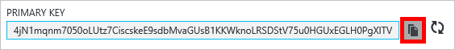
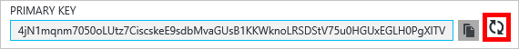
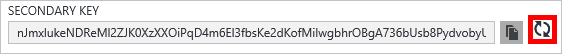
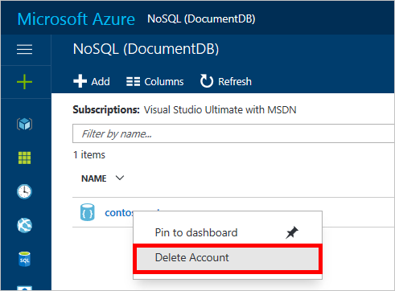
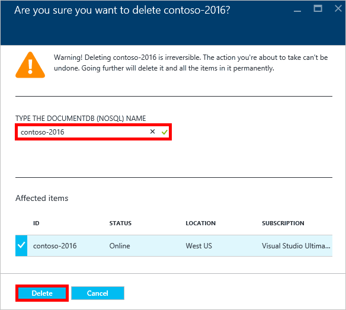

# How to manage an Azure Cosmos DB account
Learn how to set global consistency, work with keys, and delete an Azure Cosmos DB account in the Azure portal.

## Manage Azure Cosmos DB consistency settings
Selecting the right consistency level depends on the semantics of your application. You should familiarize yourself with the available consistency levels in Azure Cosmos DB by reading [Using consistency levels to maximize availability and performance in Azure Cosmos DB][consistency]. Azure Cosmos DB provides consistency, availability, and performance guarantees, at every consistency level available for your database account. Configuring your database account with a consistency level of Strong requires that your data is confined to a single Azure region and not globally available. On the other hand, the relaxed consistency levels - bounded staleness, session or eventual enable you to associate any number of Azure regions with your database account. The following simple steps show you how to select the default consistency level for your database account. 

### To specify the default consistency for an Azure Cosmos DB account
1. In the [Azure portal](https://portal.azure.com/), access your Azure Cosmos DB account.
2. In the account blade, click **Default consistency**.
3. In the **Default Consistency** blade, select the new consistency level and click **Save**.
    ![Default consistency session][5]

## View, copy, and regenerate access keys
When you create an Azure Cosmos DB account, the service generates two master access keys that can be used for authentication when the Azure Cosmos DB account is accessed. By providing two access keys, Azure Cosmos DB enables you to regenerate the keys with no interruption to your Azure Cosmos DB account. 

In the [Azure portal](https://portal.azure.com/), access the **Keys** blade from the resource menu on the **Azure Cosmos DB account** blade to view, copy, and regenerate the access keys that are used to access your Azure Cosmos DB account.

> [!NOTE]
> The **Keys** blade also includes primary and secondary connection strings that can be used to connect to your account from the [Data Migration Tool](import-data.md).
> 
> 

Read-only keys are also available on this blade. Reads and queries are read-only operations, while creates, deletes, and replaces are not.

### Copy an access key in the Azure Portal
On the **Keys** blade, click the **Copy** button to the right of the key you wish to copy.

### Regenerate access keys
You should change the access keys to your Azure Cosmos DB account periodically to help keep your connections more secure. Two access keys are assigned to enable you to maintain connections to the Azure Cosmos DB account using one access key while you regenerate the other access key.

> [!WARNING]
> Regenerating your access keys affects any applications that are dependent on the current key. All clients that use the access key to access the Azure Cosmos DB account must be updated to use the new key.
> 
> 

If you have applications or cloud services using the Azure Cosmos DB account, you will lose the connections if you regenerate keys, unless you roll your keys. The following steps outline the process involved in rolling your keys.

1. Update the access key in your application code to reference the secondary access key of the Azure Cosmos DB account.
2. Regenerate the primary access key for your Azure Cosmos DB account. In the [Azure Portal](https://portal.azure.com/),
   access your Azure Cosmos DB account.
3. In the **Azure Cosmos DB Account** blade, click **Keys**.
4. On the **Keys** blade, click the regenerate button, then click **Ok** to confirm that you want to generate a new key.
    
5. Once you have verified that the new key is available for use (approximately 5 minutes after regeneration), update the access key in your application code to reference the new primary access key.
6. Regenerate the secondary access key.
   
    

> [!NOTE]
> It can take several minutes before a newly generated key can be used to access your Azure Cosmos DB account.
> 
> 

## Get the  connection string
To retrieve your connection string, do the following: 

1. In the [Azure portal](https://portal.azure.com), access your Azure Cosmos DB account.
2. In the resource menu, click **Keys**.
3. Click the **Copy** button next to the **Primary Connection String** or **Secondary Connection String** box. 

If you are using the connection string in the [Azure Cosmos DB Database Migration Tool](import-data.md), append the database name to the end of the connection string. `AccountEndpoint=< >;AccountKey=< >;Database=< >`.

##  Delete an Azure Cosmos DB account
To remove an Azure Cosmos DB account from the Azure Portal that you are no longer using, right-click the account name, and click **Delete account**.

1. In the [Azure portal](https://portal.azure.com/), access the Azure Cosmos DB account you wish to delete.
2. On the **Azure Cosmos DB account** blade, right-click the account, and then click **Delete Account**. 
3. On the resulting confirmation blade, type the Azure Cosmos DB account name to confirm that you want to delete the account.
4. Click the **Delete** button.

## Next steps
Learn how to [get started with your Azure Cosmos DB account](http://go.microsoft.com/fwlink/p/?LinkId=402364).

<!--Image references-->
[5]: ./media/manage-account/documentdb_change_consistency-1.png

<!--Reference style links - using these makes the source content way more readable than using inline links-->
[bcdr]: https://azure.microsoft.com/documentation/articles/best-practices-availability-paired-regions/
[consistency]: consistency-levels.md
[azureregions]: https://azure.microsoft.com/regions/#services
[offers]: https://azure.microsoft.com/pricing/details/cosmos-db/
