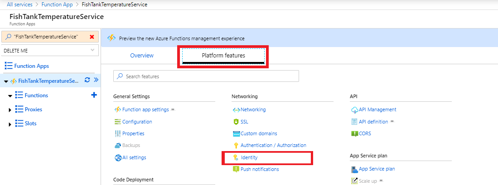
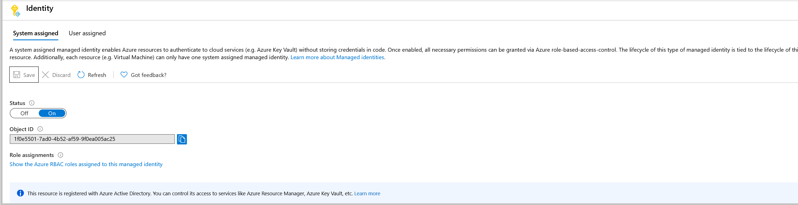
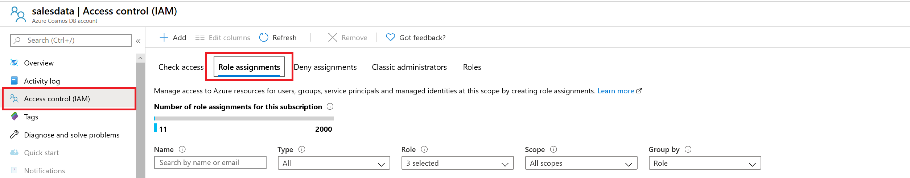
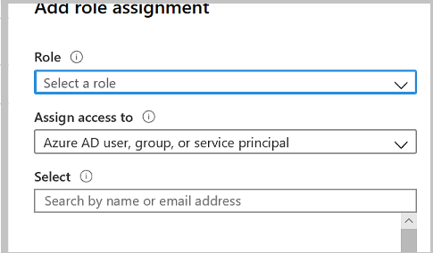
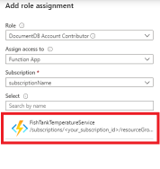

# How to use a system-assigned managed identity to access Azure Cosmos DB data

In this article you will set up a **robust, key rotation agnostic,** solution to access Azure Cosmos DB keys by leveraging [managed identities](../active-directory/managed-identities-azure-resources/services-support-managed-identities.md). The example in this article uses an Azure Function. However, you can achieve this solution by using any service that supports managed identities. 

You'll learn how to create an Azure Function that can access Azure Cosmos DB without needing to copy any Azure Cosmos DB keys. The function will wake up every minute and record the current temperature of an aquarium fish tank. To learn how to set up a timer triggered Azure Function see the [Create a function in Azure that is triggered by a timer](../azure-functions/functions-create-scheduled-function.md) article.

To simplify the scenario, cleanup of older temperature documents is handled by an already configured [Time To Live](./time-to-live.md) setting. 

## Assign a system-assigned managed identity to an Azure Function

In this step, you'll assign a system-assigned managed identity to your Azure Function.

1. In the [Azure portal](https://portal.azure.com/), open the **Azure Function** pane and navigate to your function app. 

1. Open the **Platform features** > **Identity** tab: 

   

1. On the **Identity** tab, turn **On** the **System Identity** status. Be sure to select **Save**, and confirm that you want to turn on the system identity. At the end the **System Identity** pane should look as follows:  

   

## Grant the managed identity access to your Azure Cosmos account

In this step, you'll assign a role to the Azure Function's system-assigned managed identity. Azure Cosmos DB has multiple built-in roles that you can assign to the managed identity. For this solution, you will use the following two roles:

|Built-in role  |Description  |
|---------|---------|
|[DocumentDB Account Contributor](../role-based-access-control/built-in-roles.md#documentdb-account-contributor)|Can manage Azure Cosmos DB accounts. Allows retrieval of read/write keys. |
|[Cosmos DB Account Reader](../role-based-access-control/built-in-roles.md#cosmos-db-account-reader-role)|Can read Azure Cosmos DB account data. Allows retrieval of read keys. |

> [!IMPORTANT]
> RBAC support in Azure Cosmos DB is applicable to control plane operations only. Data plane operations are secured using master keys or resource tokens. To learn more, see the [Secure access to data](secure-access-to-data.md) article.

> [!TIP] 
> When assigning roles, only assign the needed access. If your service only requires reading data, then assign the managed identity to **Cosmos DB Account Reader** role. For more information about the importance of least privilege access, see the [lower exposure of privileged accounts](../security/fundamentals/identity-management-best-practices.md#lower-exposure-of-privileged-accounts) article.

For your scenario, you will read the temperature, then write back that data to a container in Azure Cosmos DB. Because you have to write the data, you will use the **DocumentDB Account Contributor** role. 

1. Sign in to the Azure portal and navigate to your Azure Cosmos DB account. Open the **Access Management (IAM) Pane**, and then the **Role Assignments** tab:

   

1. Select the **+ Add** button, then **add role assignment**.

1. The **Add Role Assignment** panel opens to the right:

   

   * **Role** - Select **DocumentDB Account Contributor**
   * **Assign access to** - Under the Select **System-assigned managed identity** subsection, select  **Function App**.
   * **Select** - The pane will be populated with all the function apps, in your subscription, that have a **Managed System Identity**. In our case I select the **SummaryService** function app: 

      

1. After the function app's identity is selected click **Save**.

## Programmatically access the Azure Cosmos DB keys from the Azure Function

Now we have a function app that has a system-assigned managed identity. That identity is given the **DocumentDB Account Contributor** role in the Azure Cosmos DB permissions. The following function app code will get the Azure Cosmos DB keys, create a CosmosClient object, get the temperature, then save this to Cosmos DB.

This sample uses the [List Keys API](https://docs.microsoft.com/rest/api/cosmos-db-resource-provider/DatabaseAccounts/ListKeys) to access your Azure Cosmos DB account keys.

> [!IMPORTANT] 
> If you want to [assign the **Cosmos DB Account Reader**](#grant-the-managed-identity-access-to-your-azure-cosmos-account) role, you will need to use the read only [List Keys api](https://docs.microsoft.com/rest/api/cosmos-db-resource-provider/DatabaseAccounts/ListReadOnlyKeys). This will only populate the read only keys.

The List Keys API returns the `DatabaseAccountListKeysResult` object. This type isn't defined in the C# libraries. The following code shows the implementation of this class:  

```csharp 
namespace SummarizationService 
{
  public class DatabaseAccountListKeysResult
  {
      public string primaryMasterKey {get;set;}
      public string primaryReadonlyMasterKey {get; set;}
      public string secondaryMasterKey {get; set;}
      public string secondaryReadonlyMasterKey {get;set;}
  }
}
```

The example also uses a simple document called "TemperatureRecord", which is defined as follows:

```csharp
using System;

namespace Monitor
{
    public class TemperatureRecord
    {
        public string id { get; set; } = Guid.NewGuid().ToString();
        public DateTime RecordTime { get; set; }
        public int Temperature { get; set; }

    }
}
```

You will use the [Microsoft.Azure.Services.AppAuthentication](https://www.nuget.org/packages/Microsoft.Azure.Services.AppAuthentication) library to get the system-assigned managed identity token. To learn other ways to get the token and more information about the `Microsoft.Azure.Service.AppAuthentication` library, see the [Service To Service Authentication](../key-vault/service-to-service-authentication.md) article.

```csharp
using System;
using System.Net.Http;
using System.Net.Http.Headers;
using System.Threading.Tasks;
using Microsoft.Azure.Cosmos;
using Microsoft.Azure.Services.AppAuthentication;
using Microsoft.Azure.WebJobs;
using Microsoft.Extensions.Logging;

namespace Monitor
{
    public static class TemperatureMonitor
    {
        private static string subscriptionId =
        "<azure subscription id>";
        private static string resourceGroupName =
        "<name of your azure resource group>";
        private static string accountName =
        "<Azure Cosmos DB account name>";
        private static string cosmosDbEndpoint =
        "<Azure Cosmos DB endpoint>";
        private static string databaseName =
        "<Azure Cosmos DB name>";
        private static string containerName =
        "<container to store the temperature in>";

        [FunctionName("TemperatureMonitor")]
        public static async Task Run([TimerTrigger("0 * * * * *")]TimerInfo myTimer, ILogger log)
        {
            log.LogInformation($"Starting temperature monitoring: {DateTime.Now}");

            // AzureServiceTokenProvider will help us to get the Service Managed token.
            var azureServiceTokenProvider = new AzureServiceTokenProvider();

            // In order to get the Service Managed token we need to authenticate to the Azure Resource Manager.
            string accessToken = await azureServiceTokenProvider.GetAccessTokenAsync("https://management.azure.com/");

            // To get the Azure Cosmos DB keys setup the List Keys API:
            string endpoint = $"https://management.azure.com/subscriptions/{subscriptionId}/resourceGroups/{resourceGroupName}/providers/Microsoft.DocumentDB/databaseAccounts/{accountName}/listKeys?api-version=2019-12-12";

            // setup an HTTP Client and add the access token.
            HttpClient httpClient = new HttpClient();
            httpClient.DefaultRequestHeaders.Authorization = new AuthenticationHeaderValue("Bearer", accessToken);

            // Post to the endpoint to get the keys result.
            var result = await httpClient.PostAsync(endpoint, new StringContent(""));

            // Get the Result back as a DatabaseAccountListKeysResult.
            DatabaseAccountListKeysResult keys = await result.Content.ReadAsAsync<DatabaseAccountListKeysResult>();

            log.LogInformation("Starting to create the client");

            CosmosClient client = new CosmosClient(cosmosDbEndpoint, keys.primaryMasterKey);

            log.LogInformation("Client created");

            var database = client.GetDatabase(databaseName);
            var container = database.GetContainer(containerName);

            log.LogInformation("Get the temperature.");

            var tempRecord = new TemperatureRecord() { RecordTime = DateTime.UtcNow, Temperature = GetTemperature() };

            log.LogInformation("Store temperature");

            await container.CreateItemAsync<TemperatureRecord>(tempRecord);

            log.LogInformation($"Ending temperature monitor: {DateTime.Now}");
        }

        private static int GetTemperature()
        {
            // fake the temperature sensor for this demo
            Random r = new Random(DateTime.UtcNow.Second);
            return r.Next(0, 120);
        }
    }
}
```

You are now ready to [deploy your Azure Function](../azure-functions/functions-create-first-function-vs-code.md).

## Next steps

* [Certificate-based authentication with Azure Cosmos DB and Active Directory](certificate-based-authentication.md)
* [Secure Azure Cosmos keys using Azure Key Vault](access-secrets-from-keyvault.md)
* [Security baseline for Azure Cosmos DB](security-baseline.md)
