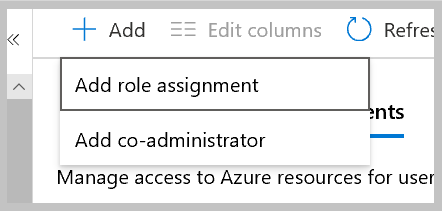

# Managed Identity based authentication and authorization with Azure Cosmos DB and Azure Active Directory

In this article we'll setup a **robust, key rotation agnostic,** solution for Cosmos DB key management by leveraging [Managed Service Identities](../active-directory/managed-identities-azure-resources/services-support-managed-identities.md). Though we're using an Azure Function for this example, this solution can be used with any service that [supports managed service identities](../active-directory/managed-identities-azure-resources/services-support-managed-identities.md). 

You'll learn how to:

* Assign a System Identity
* Grant the System Identity access to your Cosmos DB
* Write the code for robust Cosmos DB key management

In the solution below, we'll be building an Azure Function that will handle summarizing the last hour of sales. The function will wake up every hour, and will read a set of sale receipts from Cosmos DB. Then the function will create an hourly summary of sales and store it back in the container. To simplify the scenario, cleanup of the already processed receipts will be handled by an already configured [TTL](./time-to-live.md) setting.

## Assign a System Identity to an Azure Function

In this step, you'll assign a managed system identity to your Azure Function.

1. Sign into the [Azure portal](https://portal.azure.com/)

1. Open the Azure Function pane, and for your function app select the **Identity tab**: 


1. On the **Identity tab** switch **System Identity** to the "On" position. Be sure to click **Save**, and confirm you want to turn on System Identity. In the end the **System Identity** pane should look like this:  


## Grant the System Identity Access to your Cosmos DB 

In this step, you'll assign a role to the Azure Function's System Identity. Cosmos DB has multiple built-in roles you can assign the System Identity too. For this exercise we'll just focus on two:

|**Built-in role**  |**Description**  |
|---------|---------|
|[DocumentDB Account Contributor](../role-based-access-control/built-in-roles.md#documentdb-account-contributor)|Can manage Azure Cosmos DB accounts. Allows retrieval of read/write keys. |
|[Cosmos DB Account Reader](../role-based-access-control/built-in-roles.md#cosmos-db-account-reader-role)|Can read Azure Cosmos DB account data. Allows retrieval of read keys. |

> [!IMPORTANT]
> RBAC support in Azure Cosmos DB applies to control plane operations only. Data plane operations are secured using master keys or resource tokens. To learn more, see [Secure access to data in Azure Cosmos DB](secure-access-to-data.md)

> [!TIP] 
> When assigning roles, only assign the needed access. So if your service only need to read, then only assign the Service Identity to **Cosmos DB Account Reader**. For more information about the importance of **least privilege access,** see [lower exposure of privileged accounts](../security/fundamentals/identity-management-best-practices.md#lower-exposure-of-privileged-accounts).

For our scenario, we'll read the sale receipt documents, summarize them, and then write back that summary to Cosmos DB. Since we need write access, we'll use the **DocumentDB Account Contributor** role. 

1. Open your Cosmos DB in the portal, select the **Access Management (IAM) Pane**, and then the **Role Assignments** tab:


1. Select the **+ Add** button, then **add role assignment**:


1. The **Role Assignment** panel opens to the right:


     * **Role** - Select **DocumentDB Account Contributor**
     * **Assign access to** - Under the Select **System assigned managed identity** subsection, select  **Function App**.
    * **Select** - The pane will be populated with all the function apps, in your subscription, that have a **System Managed Identity**. In our case I select the **SummaryService** function app: 


1. Select the function app and click **Save**.

## Programmatically access the Cosmos DB keys from the Azure Function

Now we have a function app that has a system managed identity. That identity is given the **DocumentDB Account Contributor** role in the Cosmos DB permissions. The **Function App** code below will get the needed Cosmos DB Keys, create a CosmosClient, and run the summarization business logic.

We'll be using to get the Cosmos DB Keys is the [List Keys API](https://docs.microsoft.com/rest/api/cosmos-db-resource-provider/DatabaseAccounts/ListKeys).


The api returns DatabaseAccountListKeysResult. This type isn't defined in the C# libraries. The code below is an implementation for this class. Add it to the solution: 
```csharp 
namespace SummarizationService 
{
  public class DatabaseAccountListKeysResult
  {
      public string primaryMasterKey {get;set;}
      public string primaryReadonlyMasterKey {get; set;}
      public string secondaryMasterKey {get; set;}
      public string secondaryReadonlyMasterKey {get;set;}
  }
}
```

The library we'll use to get our Service Managed token is [Microsoft.Azure.Services.AppAuthentication](https://www.nuget.org/packages/Microsoft.Azure.Services.AppAuthentication). You can find other ways to get the token and more information about the Microsoft.Azure.Service.AppAuthentication library by reading up on  [Service To Service Authentication](../key-vault/service-to-service-authentication.md).


```csharp
using System;
using System.Collections.Generic;
using System.Net.Http;
using System.Net.Http.Headers;
using System.Threading.Tasks;
using Microsoft.Azure.Cosmos;
using Microsoft.Azure.Services.AppAuthentication;
using Microsoft.Azure.WebJobs;
using Microsoft.Extensions.Logging;

namespace SummarizationService
{
    public static class SummarizationFunction
    {
        private static string subscriptionId = 
        "<azure subscription id>";
        private static string resourceGroupName = "
        <name of your azure resource group>";
        private static string accountName = 
        "<cosmos db account name>";
        private static string cosmosDbEndpoint = 
        "<cosmos db endpoint>";
        private static string databaseName = 
        "<cosmos db name>";
        private static string containerName =
        "<container where the sales receipts are>";
        private static string indexToQuery = 
        "<index to query for the sale receipts>";

        [FunctionName("SummarizationService")]
        public static async Task Run([TimerTrigger("0 5 * * * *")]TimerInfo myTimer, ILogger log)
        {
            log.LogInformation($"Starting receipt processing: {DateTime.Now}");

            // AzureServiceTokenProvider will help us to get the Service Managed token.
            var azureServiceTokenProvider = new AzureServiceTokenProvider();

            // In order to get the Service Managed token we need to authenticate to the Azure Resource Manager.
            string accessToken = await azureServiceTokenProvider.GetAccessTokenAsync("https://management.azure.com/");
            
            // To get the Cosmos DB keys setup the List Keys API:
            string endpoint = $"https://management.azure.com/subscriptions/{subscriptionId}/resourceGroups/{resourceGroupName}/providers/Microsoft.DocumentDB/databaseAccounts/{accountName}/listKeys?api-version=2019-12-12";
            
            // setup an HTTP Client and add the access token.
            HttpClient httpClient = new HttpClient();
            httpClient.DefaultRequestHeaders.Authorization = new AuthenticationHeaderValue("Bearer", accessToken);
            
            // Post to the endpoint to get the keys result.
            var result = await httpClient.PostAsync(endpoint, new StringContent(""));

            // Get the Result back as a DatabaseAccountListKeysResult.
            DatabaseAccountListKeysResult keys = await result.Content.ReadAsAsync<DatabaseAccountListKeysResult>();
     
            log.LogInformation("Starting to create the client");

            CosmosClient client = new CosmosClient(cosmosDbEndpoint, keys.primaryMasterKey);

            log.LogInformation("Client created");

            var database = client.GetDatabase(databaseName);
            var container = database.GetContainer(containerName);
            
            // get all the receipts that are for "sales"
            QueryDefinition query = new QueryDefinition($"SELECT * FROM {containerName} f WHERE f.type = @type")
            .WithParameter("@type", "sales");

            SummarySalesReceipt summarySales = new SummarySalesReceipt();

            FeedIterator<SalesReceipt> resultSetIterator = 
            container.GetItemQueryIterator<SalesReceipt>(query, 
            requestOptions: new QueryRequestOptions() { PartitionKey = new PartitionKey(indexToQuery) });

            while (resultSetIterator.HasMoreResults)
            {
                // Get all the sales receipts
                FeedResponse<SalesReceipt> response = await resultSetIterator.ReadNextAsync();

               // ... summarization logic for sales receipts.
               // The summary is then added to the summarySales document.
               // Note: another function will handle cleanup ...

            }

            log.LogInformation("Finished the summarization");
            await container.CreateItemAsync<SummarySalesReceipt>(summarySales);
            
            log.LogInformation($"Ending receipt processing: {DateTime.Now}");
        }
    }
}
```
You are now ready to [deploy your Azure Function.](../azure-functions/functions-create-first-function-vs-code.md) 

> [!IMPORTANT] 
> If you want to [assign the **Cosmos DB Account Reader**](#grant-the-system-identity-access-to-your-cosmos-db) role, you will need to use the read only [List Keys api](https://docs.microsoft.com/rest/api/cosmos-db-resource-provider/DatabaseAccounts/ListReadOnlyKeys). This would only populate the read only keys on the DatabaseAccountListKeysResult class.

## Next steps

* [Certificate-based authentication with Azure Cosmos DB and Active Directory](certificate-based-authentication.md)
* [Secure Azure Cosmos keys using Azure Key Vault](access-secrets-from-keyvault.md)

* [Security baseline for Azure Cosmos DB](security-baseline.md)
