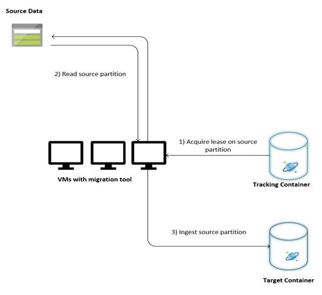
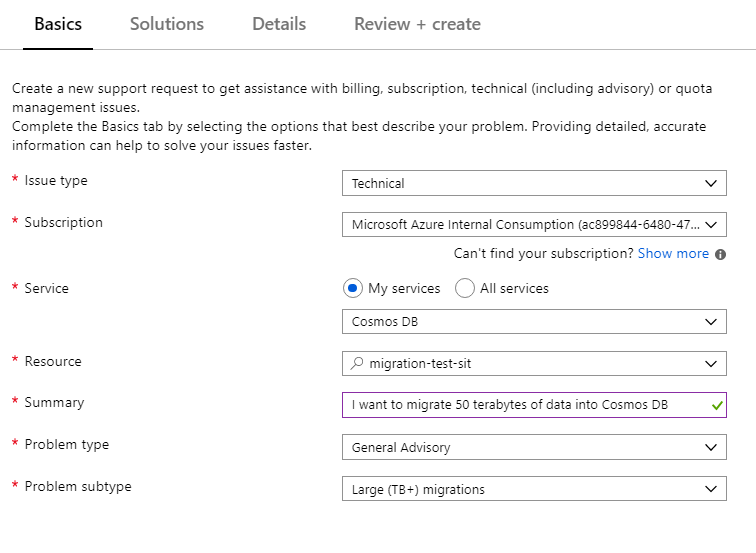

# Migrate hundreds of terabytes of data into Azure Cosmos DB 

Azure Cosmos DB can store terabytes of data. You can perform a large-scale data migration to move your production workload to Azure Cosmos DB. This article describes the challenges involved in moving large-scale data to Azure Cosmos DB and introduces you to the tool that helps with the challenges and migrates data to Azure Cosmos DB. In this case study, the customer used the Cosmos DB SQL API.  

Before you migrate the entire workload to Azure Cosmos DB, you can migrate a subset of data to validate some of the aspects like partition key choice, query performance, and data modeling. After you validate the proof of concept, you can move the entire workload to Azure Cosmos DB.  

## Tools for data migration 

Azure Cosmos DB migration strategies currently differ based on the API choice and the size of the data. To migrate smaller datasets – for validating data modeling, query performance, partition key choice etc. – you can choose the [Data Migration Tool](import-data.md) or [Azure Data Factory’s Azure Cosmos DB connector](../data-factory/connector-azure-cosmos-db.md). If you are familiar with Spark, you can also choose to use the [Azure Cosmos DB Spark connector](spark-connector.md) to migrate data.

## Challenges for large-scale migrations 

The existing tools for migrating data to Azure Cosmos DB have some limitations that become especially apparent at large scales:

 * **Limited scale out capabilities**: In order to migrate terabytes of data into Azure Cosmos DB as quickly as possible, and to effectively consume the entire provisioned throughput, the migration clients should have the ability to scale out indefinitely.  

* **Lack of progress tracking and check-pointing**: It is important to track the migration progress and have check-pointing while migrating large data sets. Otherwise, any error that occurs during the migration will stop the migration, and you have to start the process from scratch. It would be not productive to restart the whole migration process when 99% of it has already completed.  

* **Lack of dead letter queue**: Within large data sets, in some cases there could be issues with parts of the source data. Additionally, there might be transient issues with the client or the network. Either of these cases should not cause the entire migration to fail. Even though most migration tools have robust retry capabilities that guard against intermittent issues, it is not always enough. For example, if less than 0.01% of the source data documents are greater than 2 MB in size, it will cause the document write to fail in Azure Cosmos DB. Ideally, it is useful for the migration tool to persist these ‘failed’ documents to another dead letter queue, which can be processed post migration. 

Many of these limitations are being fixed for tools like Azure Data factory, Azure Data Migration services. 

## Custom tool with bulk executor library 

The challenges described in the above section, can be solved by using a custom tool that can be easily scaled out across multiple instances and it is resilient to transient failures. Additionally, the custom tool can pause and resume migration at various checkpoints. Azure Cosmos DB already provides the [bulk executor library](https://docs.microsoft.com/azure/cosmos-db/bulk-executor-overview) that incorporates some of these features. For example, the bulk executor library already has the functionality to handle transient errors and can scale out threads in a single node to consume about 500 K RUs per node. The bulk executor library also partitions the source dataset into micro-batches that are operated independently as a form of checkpointing.  

The custom tool uses the bulk executor library and supports scaling out across multiple clients and to track errors during the ingestion process. To use this tool, the source data should be partitioned into distinct files in Azure Data Lake Storage (ADLS) so that different migration workers can pick up each file and ingest them into Azure Cosmos DB. The custom tool makes use of a separate collection, which stores metadata about the migration progress for each individual source file in ADLS and tracks any errors associated with them.  

The following image describes the migration process using this custom tool. The tool is running on a set of virtual machines, and each virtual machine queries the tracking collection in Azure Cosmos DB to acquire a lease on one of the source data partitions. Once this is done, the source data partition is read by the tool and ingested into Azure Cosmos DB by using the bulk executor library. Next, the tracking collection is updated to record the progress of data ingestion and any errors encountered. After a data partition is processed, the tool attempts to query for the next available source partition. It continues to process the next source partition until all the data is migrated. The source code for the tool is available [here](https://github.com/Azure-Samples/azure-cosmosdb-bulkingestion).  

 

 

 

The tracking collection contains documents  as shown in the following example. You will see such documents one for each partition in the source data.  Each document contains the metadata for the source data partition such as its location, migration status, and errors (if any):  

```json
{ 
  "owner": "25812@bulkimporttest07", 
  "jsonStoreEntityImportResponse": { 
    "numberOfDocumentsReceived": 446688, 
    "isError": false, 
    "totalRequestUnitsConsumed": 3950252.2800000003, 
    "errorInfo": [], 
    "totalTimeTakenInSeconds": 188, 
    "numberOfDocumentsImported": 446688 
  }, 
  "storeType": "AZURE_BLOB", 
  "name": "sourceDataPartition", 
  "location": "sourceDataPartitionLocation", 
  "id": "sourceDataPartitionId", 
  "isInProgress": false, 
  "operation": "unpartitioned-writes", 
  "createDate": { 
    "seconds": 1561667225, 
    "nanos": 146000000 
  }, 
  "completeDate": { 
    "seconds": 1561667515, 
    "nanos": 180000000 
  }, 
  "isComplete": true 
} 
```
 

## Prerequisites for data migration 

Before the data migration starts, there are a few prerequisites to consider:  

#### Estimate the data size:  

The source data size may not exactly map to the data size in Azure Cosmos DB. A few sample documents from the source can be inserted to check their data size in Azure Cosmos DB. Depending on the sample document size, the total data size in Azure Cosmos DB post-migration, can be estimated. 

For example, if each document after migration in Azure Cosmos DB is around 1 KB and if there are around 60 billion documents in the source dataset, it would mean that the estimated size in Azure Cosmos DB would be close to 60 TB. 

 

#### Pre-create containers with enough RUs: 

Although Azure Cosmos DB scales out storage automatically, it is not advisable to start from the smallest container size. Smaller containers have lower throughput availability, which means that the migration would take much longer to complete. Instead, it is useful to create the containers with the final data size (as estimated in the previous step) and make sure that the migration workload is fully consuming the provisioned throughput.  

In the previous step. since the data size was estimated to be around 60 TB, a container of at least 2.4 M RUs is required to accommodate the entire dataset.  

 

#### Estimate the migration speed: 

Assuming that the migration workload can consume the entire provisioned throughput, the provisioned throughout would provide an estimation of the migration speed. Continuing the previous example, 5 RUs are required for writing a 1-KB document to Azure Cosmos DB SQL API account.  2.4 million RUs would allow a transfer of 480,000 documents per second (or 480 MB/s). This means that the complete migration of 60 TB will take 125,000 seconds or about 34 hours.  

In case you want the migration to be completed within a day, you should increase the provisioned throughput to 5 million RUs. 

 

#### Turn off the indexing:  

Since the migration should be completed as soon as possible, it is advisable to minimize time and RUs spent on creating indexes for each of the documents ingested.  Azure Cosmos DB automatically indexes all properties, it is worthwhile to minimize indexing to a selected few terms or turn it off completely for the course of migration. You can turn off the container’s indexing policy by changing the indexingMode to none as shown below:  

 
```
  { 
        "indexingMode": "none" 
  } 
```
 

After the migration is complete, you can update the indexing.  

## Migration process 

After the prerequisites are completed, you can migrate data with the following steps:  

1. First import the data from source to Azure Blob Storage. To increase the speed of migration, it is helpful to parallelize across distinct source partitions. Before starting the migration, the source data set should be partitioned into files with size around 200 MB size.   

2. The bulk executor library can scale up, to consume 500,000 RUs in a single client VM. Since the available throughput is 5 million RUs, 10 Ubuntu 16.04 VMs (Standard_D32_v3) should be provisioned in the same region where your Azure Cosmos database is located. You should prepare these VMs with the migration tool and its settings file.  

3. Run the queue step on one of the client virtual machines. This step creates the tracking collection, which scans the ADLS container and creates a progress-tracking document for each of the source data set’s partition files.  

4. Next, run the import step on all the client VMs. Each of the clients can take ownership on a source partition and ingest its data into Azure Cosmos DB. Once it’s completed and its status is updated in the tracking collection, the clients can then query for the next available source partition in the tracking collection.  

5. This process continues until the entire set of source partitions were ingested. Once all the source partitions are processed, the tool should be rerun on the error-correction mode on the same tracking collection. This step is required to identify the source partitions that should to be re-processed due to errors.  

6. Some of these errors could be due to incorrect documents in the source data. These should be identified and fixed. Next, you should rerun the import step on the failed partitions to reingest them. 

Once the migration is completed, you can validate that the document count in Azure Cosmos DB is same as the document count in the source database. In this example, the total size in Azure Cosmos DB turned out to 65 terabytes. Post migration, indexing can be selectively turned on and the RUs can be lowered to the level required by the workload’s operations.

## Contact the Azure Cosmos DB team
Although you can follow this guide to successfully migrate large datasets to Azure Cosmos DB, for large scale migrations, it is recommended that you reach out the Azure Cosmos DB product team to validate the data modelling and a general architecture review. Based on your dataset and workload, the product team can also suggest other performance and cost optimizations that could be applicable to you. 
To contact the Azure Cosmos DB team for assistance with large scale migrations, you can open a support ticket under the "General Advisory" problem type and "Large (TB+) migrations" problem subtype as shown below.




## Next steps

* Learn more by trying out the sample applications consuming the bulk executor library in [.NET](bulk-executor-dot-net.md) and [Java](bulk-executor-java.md). 
* The bulk executor library is integrated into the Cosmos DB Spark connector, to learn more, see [Azure Cosmos DB Spark connector](spark-connector.md) article.  
* Contact the Azure Cosmos DB product team by opening  a support ticket under the "General Advisory" problem type and "Large (TB+) migrations" problem subtype for additional help with large scale migrations. 
