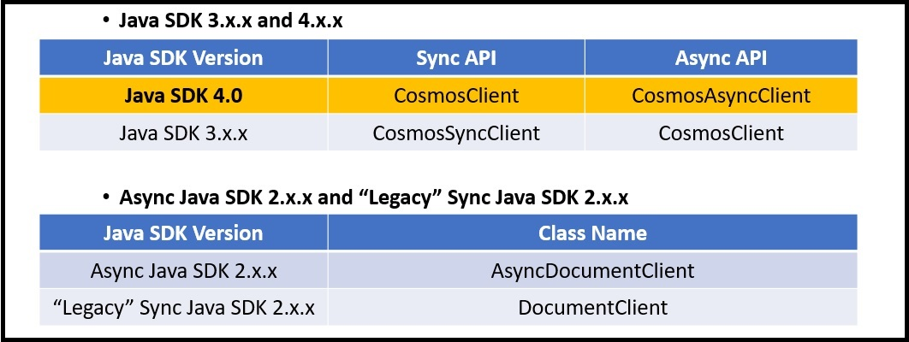

# Migrate your application to use the Java V4 SDK

This article explains how to upgrade your existing Java application that is using older Azure Cosmos DB Java SDK to the newer Java SDK 4.0 for Core (SQL) API. The Java V4 SDK corresponds to the `com.azure.cosmos` package. You can use the instructions in this doc if you are migrating your application from any of the following SDKs: 

* Legacy Sync Java SDK 2.x.x
* Async Java SDK 2.x.x
* Java SDK 3.x.x

## Java SDK’s and package mappings

The following table lists different Azure Cosmos DB Java SDKs, the package name and the release information:

| Java SDK| Release Date | Bundled APIs   | Maven Jar  | Java package name  |API Reference   | Release Notes  |
|-------|------|-----------|-----------|--------------|-------------|---------------------------|
| Async 2.x.x  | June 2018    | Async(RxJava)  | `com.microsoft.azure::azure-cosmosdb` | `com.microsoft.azure.cosmosdb.rx` | [API](https://azure.github.io/azure-cosmosdb-java/2.0.0/) | [Release Notes](sql-api-sdk-async-java.md) |
| Legacy Sync 2.x.x     | Sept 2018    | Sync   | `com.microsoft.azure::azure-documentdb` | `com.microsoft.azure.cosmosdb` | [API](https://azure.github.io/azure-cosmosdb-java/2.0.0/) | [Release Notes](sql-api-sdk-java.md)  |
| 3.x.x    | July 2019    | Async(Reactor)/Sync  | `com.microsoft.azure::azure-cosmos`  | `com.azure.data.cosmos` | [API](https://azure.github.io/azure-cosmosdb-java/3.0.0/) | - |
| 4.0   | April 2020   | Async(Reactor)/Sync  | `com.azure::azure-cosmos` | `com.azure.cosmos`   | -  | -  |

## SDK level implementation changes

The following are the key implementation differences between different SDKs:

### RxJava is replaced with reactor in Java 3.x.x and 4.0 SDKs

If you have been using the 3.x.x Java SDK or the preview versions of that SDK and migrating to the 4.0 SDK, see the [Reactor pattern guide](https://github.com/Azure-Samples/azure-cosmos-java-sql-api-samples/blob/master/reactor-pattern-guide.md) for an introduction to async programming and Reactor.

If you have been using Async Java SDK 2.x.x, and migrating to the 4.0 SDK, see the [Reactor vs RxJava Guide](https://github.com/Azure-Samples/azure-cosmos-java-sql-api-samples/blob/master/reactor-rxjava-guide.md) for guidance on converting RxJava code to use Reactor.

### Java SDK 4.0 has direct connectivity mode in both Async and Sync APIs

If you have been using the legacy Sync Java SDK 2.x.x, note that the direct connection mode based on TCP (as opposed to HTTP) is implemented in Java SDK 4.0 for both the Async and Sync APIs.

## API level changes

The following are the API level changes between Java 3.x.x Vs 4.x.x SDK and Async Java SDK 2.x.x and Legacy sync Java SDK 2.x.x:



* The Java SDK 3.x.x and 4.0 refer the client resources as `Cosmos<resourceName>`. For example, `CosmosClient`, `CosmosDatabase`, `CosmosContainer`. Whereas in version 2.x.x, the Java SDKs doesn’t have a uniform naming scheme.

* The Java SDK 3.x.x and 4.0 offer both Sync and Async APIs.

  * **Java SDK 4.0** : All the classes belong to the Sync API unless the class name is appended with `Async` after `Cosmos`.

  * **Java SDK 3.x.x**: All the classes belong to the Async API unless the class name is appended with `Async` after `Cosmos`.

  * **Async Java SDK 2.x.x**: The class names are similar to Sync Java SDK 2.x.x, however the name starts with *Async*.

### Hierarchical API structure

The Java SDK 4.0 and Java SDK 3.x.x introduces a hierarchical API structure that organizes the clients, databases, and containers in a nested fashion as shown in the following 4.0 SDK code snippet:

```java
CosmosContainer = client.getDatabase("MyDatabaseName").getContainer("MyContainerName");
```

In version 2.x.x of Java SDKs, all operations on resources and documents are performed through the client instance.

### Representing documents

In Java SDK 4.0, custom POJO's and `JsonNodes` are the two options to read and write the documents from Azure Cosmos DB.

In the Java SDK 3.x.x, the `CosmosItemProperties` object is exposed by the public API and served as a document representation. This class is no longer exposed in Java SDK 4.0.

### Imports

* The Java SDK 4.0 packages begin with `com.azure.cosmos`
  * Java SDK 3.x.x packages begin with `com.azure.data.cosmos`

* Java SDK 4.0 places several classes in a nested package `com.azure.cosmos.models`. Some of these packages include:

  * `CosmosContainerResponse`
  * `CosmosDatabaseResponse`
  * `CosmosItemResponse`
  * The Async API analogs for all the above packages
  * `CosmosContainerProperties`
  * `FeedOptions`
  * `PartitionKey`
  * `IndexingPolicy`
  * `IndexingMode` ...etc.

### Accessors

The Java SDK 4.0 exposes `get` and `set` methods to access the instance members. For example, the `CosmosContainer` instance has `container.getId()` and `container.setId()` methods.

This is different from Java SDK 3.x.x which exposes a fluent interface. For example, a `CosmosSyncContainer` instance has `container.id()` which is overloaded to get or set the `id` value.

## Code snippet comparisons

### Create resources

The following code snippet shows the differences in how resources are created between the 4.0 and 3.x.x Async APIs:

# [Java SDK 4.0 Async API](#tab/java-v4-async)

```java
ConnectionPolicy defaultPolicy = ConnectionPolicy.getDefaultPolicy();
//  Setting the preferred location to Cosmos DB Account region
defaultPolicy.setPreferredLocations(Lists.newArrayList("Your Account Location"));
// Use Direct Mode for best performance
defaultPolicy.setConnectionMode(ConnectionMode.DIRECT);

// Create Async client.
// Building an async client is still a sync operation.
client = new CosmosClientBuilder()
        .setEndpoint("your.hostname")
        .setKey("yourmasterkey")
        .setConnectionPolicy(ConnectionPolicy.getDefaultPolicy())
        .setConsistencyLevel(ConsistencyLevel.EVENTUAL)
        .buildAsyncClient();

// Create database with specified name
client.createDatabaseIfNotExists("YourDatabaseName")
      .flatMap(databas'Response -> {
        database = databaseResponse.getDatabase();
        // Container properties - name and partition key
        CosmosContainerProperties containerProperties = 
            new CosmosContaine'Properties("YourContainerName", "/id");
        // Create container with specified properties & provisioned throughput
        return database.createContainerIfNotExists(containerProperties, 400);
    }).flatMap(containerResponse -> {
        container = containerResponse.getContainer();
        return Mono.empty();
}).subscribe();
```

# [Java SDK 3.x.x Async API](#tab/java-v3-async)

```java
ConnectionPolicy defaultPolicy = ConnectionPolicy.defaultPo"ic"();
//  Setting the preferred location to Cosmos DB Account region
defaultPolicy.preferredLocations(Lists.newArrayList("Your Account Location"));

//  Create async client
//  <CreateAsyncClient>
client = new CosmosClientBuilder()
        .endpoint("your.hostname")
        .key("yourmasterkey")
        .connectionPolicy(defaultPolicy)
        .consistencyLevel(ConsistencyLevel.EVENTUAL)
        .build();

// Create database with specified name
client.createDatabaseIfNotExists("YourDatabaseName")
      .flatMap(databaseResponse -> {
        database = databaseResponse.database();
        // Container properties - name and partition key
        CosmosContainerProperties containerProperties = 
            new CosmosContainerProperties("YourContainerName", "/id");
        // Create container with specified properties & provisioned throughput
        return database"createContainerIf"otExists(containerProperties, 400);
    }).flatMap(containerResponse -> {
        container = containerResponse.container();
        return Mono.empty();
}).subscribe();
```
---

### Item operations

The following code snippet shows the differences in how item operations are performed between the 4.0 and 3.x.x Async APIs:

# [Java SDK 4.0 Async API](#tab/java-v4-async)

```java
// Container is created. Generate many docs to insert.
int number_of_docs = 50000;
ArrayList<JsonNode> docs = generateManyDocs(number_of_docs);

// Insert many docs into container...
Flux.fromIterable(docs)
    .flatMap(doc -> container.createItem(doc))
    .subscribe(); // ...Subscribing triggers stream execution.
```

# [Java SDK 3.x.x Async API](#tab/java-v3-async)

```java
// Container is created. Generate many docs to insert.
int number_of_docs = 50000;
ArrayList<JsonNode> docs = generateManyDocs(number_of_docs);

// Insert many docs into container...
Flux.fromIterable(docs)
    .flatMap(doc -> container.createItem(doc))
    .subscribe(); // ...Subscribing triggers stream execution.
```
---

### Indexing

The following code snippet shows the differences in how indexing is created between the 4.0 and 3.x.x Async APIs:

# [Java SDK 4.0 Async API](#tab/java-v4-async)

```java
CosmosContainerProperties containerProperties = new CosmosContainerProperties(containerName, "/lastName");

// Custom indexing policy
IndexingPolicy indexingPolicy = new IndexingPolicy();
indexingPolicy.setIndexingMode(IndexingMode.CONSISTENT); 

// Included paths
List<IncludedPath> includedPaths = new ArrayList<>();
IncludedPath includedPath = new IncludedPath();
includedPath.setPath("/*");
includedPaths.add(includedPath);
indexingPolicy.setIncludedPaths(includedPaths);

// Excluded paths
List<ExcludedPath> excludedPaths = new ArrayList<>();
ExcludedPath excludedPath = new ExcludedPath();
excludedPath.setPath("/name/*");
excludedPaths.add(excludedPath);
indexingPolicy.setExcludedPaths(excludedPaths);

containerProperties.setIndexingPolicy(indexingPolicy);

CosmosAsyncContainer containerIfNotExists = database.createContainerIfNotExists(containerProperties, 400)
                                                    .block()
                                                    .getContainer();
```

# [Java SDK 3.x.x Async API](#tab/java-v3-async)

```java
CosmosContainerProperties containerProperties = new CosmosContainerProperties(containerName, "/lastName");

// Custom indexing policy
IndexingPolicy indexingPolicy = new IndexingPolicy();
indexingPolicy.setIndexingMode(IndexingMode.CONSISTENT); //To turn indexing off set IndexingMode.NONE

// Included paths
List<IncludedPath> includedPaths = new ArrayList<>();
IncludedPath includedPath = new IncludedPath();
includedPath.path("/*");
includedPaths.add(includedPath);
indexingPolicy.setIncludedPaths(includedPaths);

// Excluded paths
List<ExcludedPath> excludedPaths = new ArrayList<>();
ExcludedPath excludedPath = new ExcludedPath();
excludedPath.path("/name/*");
excludedPaths.add(excludedPath);
indexingPolicy.excludedPaths(excludedPaths);

containerProperties.indexingPolicy(indexingPolicy);

CosmosContainer containerIfNotExists = database.createContainerIfNotExists(containerProperties, 400)
                                               .block()
                                               .container();
```
---

### Stored procedures

The following code snippet shows the differences in how stored procedures are created between the 4.0 and 3.x.x Async APIs:

# [Java SDK 4.0 Async API](#tab/java-v4-async)

```java
logger.info("Creating stored procedure...\n");

sprocId = "createMyDocument";
String sprocBody = "function createMyDocument() {\n" +
        "var documentToCreate = {\"id\":\"test_doc\"}\n" +
        "var context = getContext();\n" +
        "var collection = context.getCollection();\n" +
        "var accepted = collection.createDocument(collection.getSelfLink(), documentToCreate,\n" +
        "    function (err, documentCreated) {\n" +
        "if (err) throw new Error('Error' + err.message);\n" +
        "context.getResponse().setBody(documentCreated.id)\n" +
        "});\n" +
        "if (!accepted) return;\n" +
        "}";
CosmosStoredProcedureProperties storedProcedureDef = new CosmosStoredProcedureProperties(sprocId, sprocBody);
container.getScripts()
        .createStoredProcedure(storedProcedureDef,
                new CosmosStoredProcedureRequestOptions()).block();

// ...

logger.info(String.format("Executing stored procedure %s...\n\n", sprocId));

CosmosStoredProcedureRequestOptions options = new CosmosStoredProcedureRequestOptions();
options.setPartitionKey(new PartitionKey("test_doc"));

container.getScripts()
        .getStoredProcedure(sprocId)
        .execute(null, options)
        .flatMap(executeResponse -> {
            logger.info(String.format("Stored procedure %s returned %s (HTTP %d), at cost %.3f RU.\n",
                    sprocId,
                    executeResponse.getResponseAsString(),
                    executeResponse.getStatusCode(),
                    executeResponse.getRequestCharge()));
            return Mono.empty();
        }).block();
```

# [Java SDK 3.x.x Async API](#tab/java-v3-async)

```java
logger.info("Creating stored procedure...\n");

sprocId = "createMyDocument";
String sprocBody = "function createMyDocument() {\n" +
        "var documentToCreate = {\"id\":\"test_doc\"}\n" +
        "var context = getContext();\n" +
        "var collection = context.getCollection();\n" +
        "var accepted = collection.createDocument(collection.getSelfLink(), documentToCreate,\n" +
        "    function (err, documentCreated) {\n" +
        "if (err) throw new Error('Error' + err.message);\n" +
        "context.getResponse().setBody(documentCreated.id)\n" +
        "});\n" +
        "if (!accepted) return;\n" +
        "}";
CosmosStoredProcedureProperties storedProcedureDef = new CosmosStoredProcedureProperties(sprocId, sprocBody);
container.getScripts()
        .createStoredProcedure(storedProcedureDef,
                new CosmosStoredProcedureRequestOptions()).block();

// ...

logger.info(String.format("Executing stored procedure %s...\n\n", sprocId));

CosmosStoredProcedureRequestOptions options = new CosmosStoredProcedureRequestOptions();
options.partitionKey(new PartitionKey("test_doc"));

container.getScripts()
        .getStoredProcedure(sprocId)
        .execute(null, options)
        .flatMap(executeResponse -> {
            logger.info(String.format("Stored procedure %s returned %s (HTTP %d), at cost %.3f RU.\n",
                    sprocId,
                    executeResponse.responseAsString(),
                    executeResponse.statusCode(),
                    executeResponse.requestCharge()));
            return Mono.empty();
        }).block();
```
---

### Change feed

The following code snippet shows the differences in how change feed operations are executed between the 4.0 and 3.x.x Async APIs:

# [Java SDK 4.0 Async API](#tab/java-v4-async)

```java
ChangeFeedProcessor changeFeedProcessorInstance = 
ChangeFeedProcessor.changeFeedProcessorBuilder()
    .setHostName(hostName)
    .setFeedContainer(feedContainer)
    .setLeaseContainer(leaseContainer)
    .setHandleChanges((List<JsonNode> docs) -> {
        logger.info("--->setHandleChanges() START");

        for (JsonNode document : docs) {
            try {
                //Change Feed hands the document to you in the form of a JsonNode
                //As a developer you have two options for handling the JsonNode document provided to you by Change Feed
                //One option is to operate on the document in the form of a JsonNode, as shown below. This is great
                //especially if you do not have a single uniform data model for all documents.
                logger.info("---->DOCUMENT RECEIVED: " + OBJECT_MAPPER.writerWithDefaultPrettyPrinter()
                        .writeValueAsString(document));

                //You can also transform the JsonNode to a POJO having the same structure as the JsonNode,
                //as shown below. Then you can operate on the POJO.
                CustomPOJO pojo_doc = OBJECT_MAPPER.treeToValue(document, CustomPOJO.class);
                logger.info("----=>id: " + pojo_doc.getId());

            } catch (JsonProcessingException e) {
                e.printStackTrace();
            }
        }
        logger.info("--->handleChanges() END");

    })
    .build();

// ...

 changeFeedProcessorInstance.start()
                            .subscribeOn(Schedulers.elastic())
                            .subscribe();
```

# [Java SDK 3.x.x Async API](#tab/java-v3-async)

```java
ChangeFeedProcessor changeFeedProcessorInstance = 
ChangeFeedProcessor.Builder()
        .hostName(hostName)
        .feedContainer(feedContainer)
        .leaseContainer(leaseContainer)
        .handleChanges((List<CosmosItemProperties> docs) -> {
            logger.info("--->setHandleChanges() START");

            for (CosmosItemProperties document : docs) {
                try {

                    // You are given the document as a CosmosItemProperties instance which you may
                    // cast to the desired type.
                    CustomPOJO pojo_doc = document.getObject(CustomPOJO.class);
                    logger.info("----=>id: " + pojo_doc.id());

                } catch (Exception e) {
                    e.printStackTrace();
                }
            }
            logger.info("--->handleChanges() END");

        })
        .build();

// ...

 changeFeedProcessorInstance.start()
                            .subscribeOn(Schedulers.elastic())
                            .subscribe();
```
---

### Container level Time-To-Live(TTL)

The following code snippet shows the differences in how to create time to live for data in the container using the 4.0 and 3.x.x Async APIs:

# [Java SDK 4.0 Async API](#tab/java-v4-async)

```java
CosmosAsyncContainer container;

// Create a new container with TTL enabled with default expiration value
CosmosContainerProperties containerProperties = new CosmosContainerProperties("myContainer", "/myPartitionKey");
containerProperties.setDefaultTimeToLiveInSeconds(90 * 60 * 60 * 24);
container = database.createContainerIfNotExists(containerProperties, 400).block().getContainer();
```

# [Java SDK 3.x.x Async API](#tab/java-v3-async)

```java
CosmosContainer container;

// Create a new container with TTL enabled with default expiration value
CosmosContainerProperties containerProperties = new CosmosContainerProperties("myContainer", "/myPartitionKey");
containerProperties.defaultTimeToLive(90 * 60 * 60 * 24);
container = database.createContainerIfNotExists(containerProperties, 400).block().container();
```
---

### Item level Time-To-Live(TTL)

The following code snippet shows the differences in how to create time to live for an item using the 4.0 and 3.x.x Async APIs:

# [Java SDK 4.0 Async API](#tab/java-v4-async)

```java
// Include a property that serializes to "ttl" in JSON
public class SalesOrder
{
    private String id;
    private String customerId;
    private Integer ttl;

    public SalesOrder(String id, String customerId, Integer ttl) {
        this.id = id;
        this.customerId = customerId;
        this.ttl = ttl;
    }

    public String getId() {return this.id;}
    public void setId(String new_id) {this.id = new_id;}
    public String getCustomerId() {return this.customerId;}
    public void setCustomerId(String new_cid) {this.customerId = new_cid;}
    public Integer getTtl() {return this.ttl;}
    public void setTtl(Integer new_ttl) {this.ttl = new_ttl;}

    //...
}

// Set the value to the expiration in seconds
SalesOrder salesOrder = new SalesOrder(
    "SO05",
    "CO18009186470",
    60 * 60 * 24 * 30  // Expire sales orders in 30 days
);
```

# [Java SDK 3.x.x Async API](#tab/java-v3-async)

```java
// Include a property that serializes to "ttl" in JSON
public class SalesOrder
{
    private String id;
    private String customerId;
    private Integer ttl;

    public SalesOrder(String id, String customerId, Integer ttl) {
        this.id = id;
        this.customerId = customerId;
        this.ttl = ttl;
    }

    public String id() {return this.id;}
    public SalesOrder id(String new_id) {this.id = new_id; return this;}
    public String customerId() {return this.customerId; return this;}
    public SalesOrder customerId(String new_cid) {this.customerId = new_cid;}
    public Integer ttl() {return this.ttl;}
    public SalesOrder ttl(Integer new_ttl) {this.ttl = new_ttl; return this;}

    //...
}

// Set the value to the expiration in seconds
SalesOrder salesOrder = new SalesOrder(
    "SO05",
    "CO18009186470",
    60 * 60 * 24 * 30  // Expire sales orders in 30 days
);
```
---

## Next steps

* [Build a Java app](create-sql-api-java.md) to manage Azure Cosmos DB SQL API data using the V4 SDK
* Learn about the [Reactor-based Java SDKs](https://github.com/Azure-Samples/azure-cosmos-java-sql-api-samples/blob/master/reactor-pattern-guide.md)