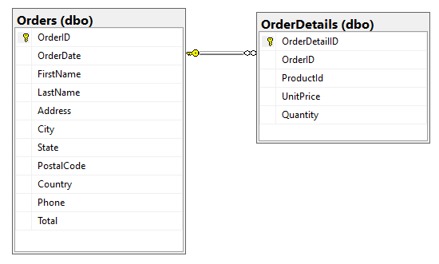
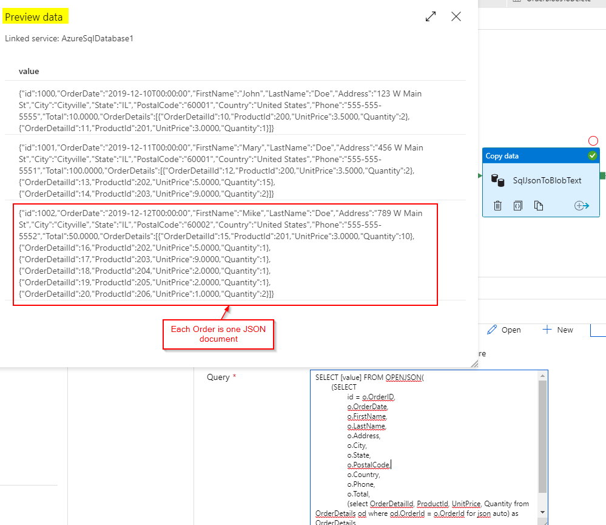
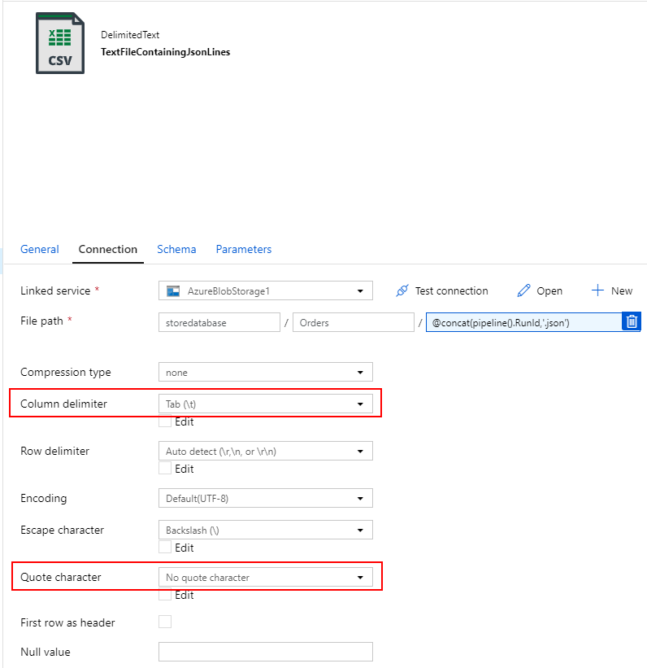
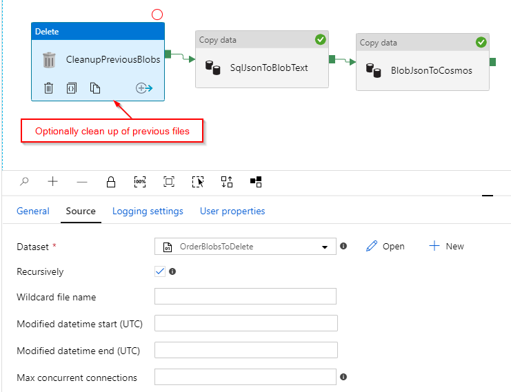
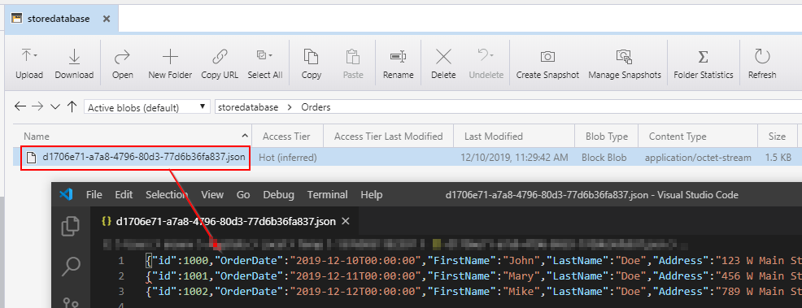
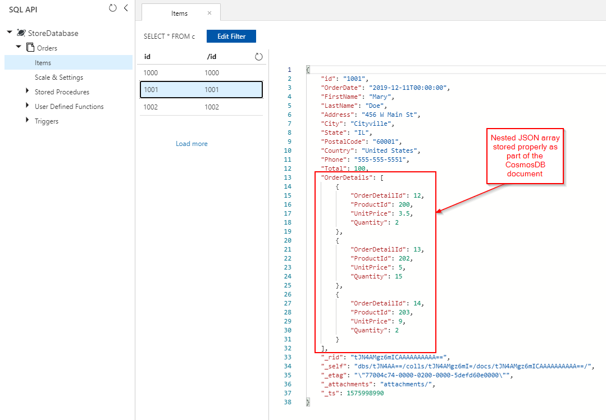
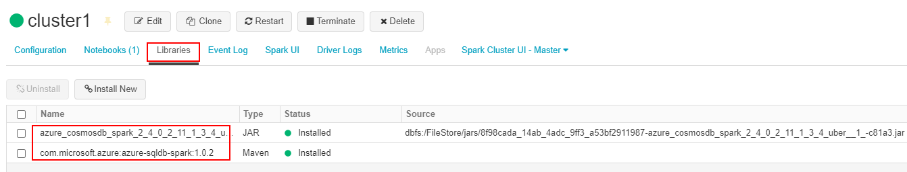
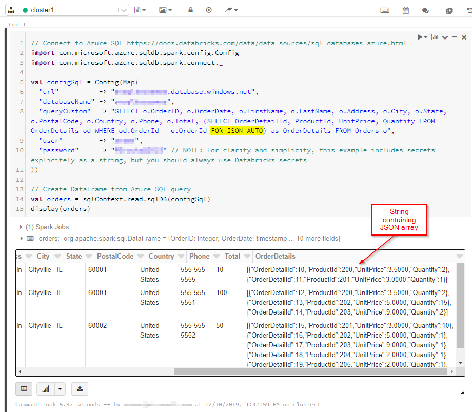
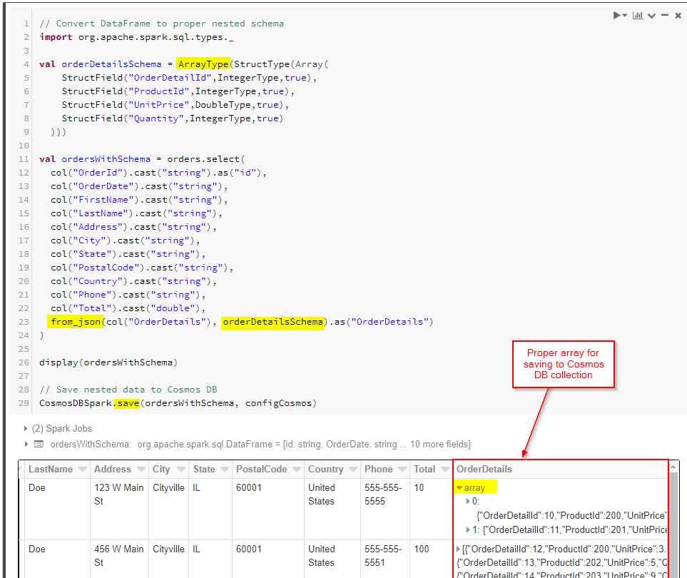
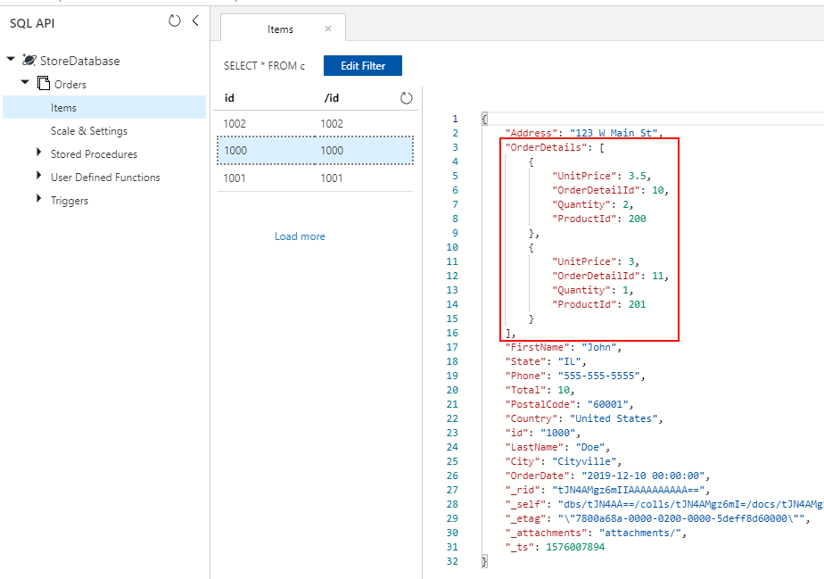

# Migrate one-to-few relational data into Azure Cosmos DB SQL API account

In order to migrate from a relational database to Azure Cosmos DB SQL API, it can be necessary to make changes to the data model for optimization.

One common transformation is denormalizing data by embedding related subitems within one JSON document. Here we look at a few options for this using Azure Data Factory or Azure Databricks. For general guidance on data modeling for Cosmos DB, please review [Data modeling in Azure Cosmos DB](modeling-data.md).  

## Example Scenario

Assume we have the following two tables in our SQL database, Orders and OrderDetails.




We want to combine this one-to-few relationship into one JSON document during migration. To do this, we can create a T-SQL query using "FOR JSON" as below:

```sql
SELECT
  o.OrderID,
  o.OrderDate,
  o.FirstName,
  o.LastName,
  o.Address,
  o.City,
  o.State,
  o.PostalCode,
  o.Country,
  o.Phone,
  o.Total,
  (select OrderDetailId, ProductId, UnitPrice, Quantity from OrderDetails od where od.OrderId = o.OrderId for json auto) as OrderDetails
FROM Orders o;
```

The results of this query would look as below: 


Ideally, you want to use a single Azure Data Factory (ADF) copy activity to query SQL data as the source and write the output directly to Azure Cosmos DB sink as proper JSON objects. Currently, it is not possible to perform the needed JSON transformation in one copy activity. If we try to copy the results of the above query into an Azure Cosmos DB SQL API container, we will see the OrderDetails field as a string property of our document, instead of the expected JSON array.

We can work around this current limitation in one of the following ways:

* **Use Azure Data Factory with two copy activities**: 
  1. Get JSON-formatted data from SQL to a text file in an intermediary blob storage location, and 
  2. Load data from the JSON text file to a container in Azure Cosmos DB.

* **Use Azure Databricks to read from SQL and write to Azure Cosmos DB** - we will present two options here.


Let’s look at these approaches in more detail:

## Azure Data Factory

Although we cannot embed OrderDetails as a JSON-array in the destination Cosmos DB document, we can work around the issue by using two separate Copy Activities.

### Copy Activity #1: SqlJsonToBlobText

For the source data, we use a SQL query to get the result set as a single column with one JSON object (representing the Order) per row using the SQL Server OPENJSON and FOR JSON PATH capabilities:

```sql
SELECT [value] FROM OPENJSON(
  (SELECT
    id = o.OrderID,
    o.OrderDate,
    o.FirstName,
    o.LastName,
    o.Address,
    o.City,
    o.State,
    o.PostalCode,
    o.Country,
    o.Phone,
    o.Total,
    (select OrderDetailId, ProductId, UnitPrice, Quantity from OrderDetails od where od.OrderId = o.OrderId for json auto) as OrderDetails
   FROM Orders o FOR JSON PATH)
)
```




For the sink of the SqlJsonToBlobText copy activity, we choose "Delimited Text" and point it to a specific folder in Azure Blob Storage with a dynamically generated unique file name (for example, '@concat(pipeline().RunId,'.json').
Since our text file is not really "delimited" and we do not want it to be parsed into separate columns using commas and want to preserve the double-quotes ("), we set "Column delimiter" to a Tab ("\t") - or another character not occurring in the data - and "Quote character" to "No quote character".



### Copy Activity #2: BlobJsonToCosmos

Next, we modify our ADF pipeline by adding the second Copy Activity that looks in Azure Blob Storage for the text file that was created by the first activity. It processes it as "JSON" source to insert to Cosmos DB sink as one document per JSON-row found in the text file.


Optionally, we also add a "Delete" activity to the pipeline so that it deletes all of the previous files remaining in the /Orders/ folder prior to each run. Our ADF pipeline now looks something like this:



After we trigger the pipeline above, we see a file created in our intermediary Azure Blob Storage location containing one JSON-object per row:



We also see Orders documents with properly embedded OrderDetails inserted into our Cosmos DB collection:




## Azure Databricks

We can also use Spark in [Azure Databricks](https://azure.microsoft.com/services/databricks/) to copy the data from our SQL Database source to the Azure Cosmos DB destination without creating the intermediary text/JSON files in Azure Blob Storage. 

> [!NOTE]
> For clarity and simplicity, the code snippets below include dummy database passwords explicitly inline, but you should always use Azure Databricks secrets.
>

First, we create and attach the required [SQL connector](https://docs.databricks.com/data/data-sources/sql-databases-azure.html) and [Azure Cosmos DB connector](https://docs.databricks.com/data/data-sources/azure/cosmosdb-connector.html) libraries to our Azure Databricks cluster. Restart the cluster to make sure libraries are loaded.



Next, we present two samples, for Scala and Python. 

### Scala
Here, we get the results of the SQL query with “FOR JSON” output into a DataFrame:

```scala
// Connect to Azure SQL https://docs.databricks.com/data/data-sources/sql-databases-azure.html
import com.microsoft.azure.sqldb.spark.config.Config
import com.microsoft.azure.sqldb.spark.connect._
val configSql = Config(Map(
  "url"          -> "xxxx.database.windows.net",
  "databaseName" -> "xxxx",
  "queryCustom"  -> "SELECT o.OrderID, o.OrderDate, o.FirstName, o.LastName, o.Address, o.City, o.State, o.PostalCode, o.Country, o.Phone, o.Total, (SELECT OrderDetailId, ProductId, UnitPrice, Quantity FROM OrderDetails od WHERE od.OrderId = o.OrderId FOR JSON AUTO) as OrderDetails FROM Orders o",
  "user"         -> "xxxx", 
  "password"     -> "xxxx" // NOTE: For clarity and simplicity, this example includes secrets explicitely as a string, but you should always use Databricks secrets
))
// Create DataFrame from Azure SQL query
val orders = sqlContext.read.sqlDB(configSql)
display(orders)
```



Next, we connect to our Cosmos DB database and collection:

```scala
// Connect to Cosmos DB https://docs.databricks.com/data/data-sources/azure/cosmosdb-connector.html
import org.joda.time._
import org.joda.time.format._
import com.microsoft.azure.cosmosdb.spark.schema._
import com.microsoft.azure.cosmosdb.spark.CosmosDBSpark
import com.microsoft.azure.cosmosdb.spark.config.Config
import org.apache.spark.sql.functions._
import org.joda.time._
import org.joda.time.format._
import com.microsoft.azure.cosmosdb.spark.schema._
import com.microsoft.azure.cosmosdb.spark.CosmosDBSpark
import com.microsoft.azure.cosmosdb.spark.config.Config
import org.apache.spark.sql.functions._
val configMap = Map(
  "Endpoint" -> "https://xxxx.documents.azure.com:443/",
  // NOTE: For clarity and simplicity, this example includes secrets explicitely as a string, but you should always use Databricks secrets
  "Masterkey" -> "xxxx",
  "Database" -> "StoreDatabase",
  "Collection" -> "Orders")
val configCosmos = Config(configMap)
```

Finally, we define our schema and use from_json to apply the DataFrame prior to saving it to the CosmosDB collection.

```scala
// Convert DataFrame to proper nested schema
import org.apache.spark.sql.types._
val orderDetailsSchema = ArrayType(StructType(Array(
    StructField("OrderDetailId",IntegerType,true),
    StructField("ProductId",IntegerType,true),
    StructField("UnitPrice",DoubleType,true),
    StructField("Quantity",IntegerType,true)
  )))
val ordersWithSchema = orders.select(
  col("OrderId").cast("string").as("id"),
  col("OrderDate").cast("string"),
  col("FirstName").cast("string"),
  col("LastName").cast("string"),
  col("Address").cast("string"),
  col("City").cast("string"),
  col("State").cast("string"),
  col("PostalCode").cast("string"),
  col("Country").cast("string"),
  col("Phone").cast("string"),
  col("Total").cast("double"),
  from_json(col("OrderDetails"), orderDetailsSchema).as("OrderDetails")
)
display(ordersWithSchema)
// Save nested data to Cosmos DB
CosmosDBSpark.save(ordersWithSchema, configCosmos)
```




### Python

As an alternative approach, you may need to execute JSON transformations in Spark (if the source database does not support "FOR JSON" or a similar operation), or you may wish to use parallel operations for a very large data set. Here we present a PySpark sample. Start by configuring the source and target database connections in the first cell:

```python
import uuid
import pyspark.sql.functions as F
from pyspark.sql.functions import col
from pyspark.sql.types import StringType,DateType,LongType,IntegerType,TimestampType
 
#JDBC connect details for SQL Server database
jdbcHostname = "jdbcHostname"
jdbcDatabase = "OrdersDB"
jdbcUsername = "jdbcUsername"
jdbcPassword = "jdbcPassword"
jdbcPort = "1433"
 
connectionProperties = {
  "user" : jdbcUsername,
  "password" : jdbcPassword,
  "driver" : "com.microsoft.sqlserver.jdbc.SQLServerDriver"
}
jdbcUrl = "jdbc:sqlserver://{0}:{1};database={2};user={3};password={4}".format(jdbcHostname, jdbcPort, jdbcDatabase, jdbcUsername, jdbcPassword)
 
#Connect details for Target Azure Cosmos DB SQL API account
writeConfig = {
    "Endpoint": "Endpoint",
    "Masterkey": "Masterkey",
    "Database": "OrdersDB",
    "Collection": "Orders",
    "Upsert": "true"
}
```

Then, we will query the source Database (in this case SQL Server) for both the order and order detail records, putting the results into Spark Dataframes. We will also create a list containing all the order IDs, and a Thread pool for parallel operations:

```python
import json
import ast
import pyspark.sql.functions as F
import uuid
import numpy as np
import pandas as pd
from functools import reduce
from pyspark.sql import SQLContext
from pyspark.sql.types import *
from pyspark.sql import *
from pyspark.sql.functions import exp
from pyspark.sql.functions import col
from pyspark.sql.functions import lit
from pyspark.sql.functions import array
from pyspark.sql.types import *
from multiprocessing.pool import ThreadPool
 
#get all orders
orders = sqlContext.read.jdbc(url=jdbcUrl, table="orders", properties=connectionProperties)
 
#get all order details
orderdetails = sqlContext.read.jdbc(url=jdbcUrl, table="orderdetails", properties=connectionProperties)
 
#get all OrderId values to pass to map function 
orderids = orders.select('OrderId').collect()
 
#create thread pool big enough to process merge of details to orders in parallel
pool = ThreadPool(10)
```

Then, create a function for writing Orders into the target SQL API collection. This function will filter all order details for the given order ID, convert them into a JSON array, and insert the array into a JSON document that we will write into the target SQL API Collection for that order:

```python
def writeOrder(orderid):
  #filter the order on current value passed from map function
  order = orders.filter(orders['OrderId'] == orderid[0])
  
  #set id to be a uuid
  order = order.withColumn("id", lit(str(uuid.uuid1())))
  
  #add details field to order dataframe
  order = order.withColumn("details", lit(''))
  
  #filter order details dataframe to get details we want to merge into the order document
  orderdetailsgroup = orderdetails.filter(orderdetails['OrderId'] == orderid[0])
  
  #convert dataframe to pandas
  orderpandas = order.toPandas()
  
  #convert the order dataframe to json and remove enclosing brackets
  orderjson = orderpandas.to_json(orient='records', force_ascii=False)
  orderjson = orderjson[1:-1] 
  
  #convert orderjson to a dictionaory so we can set the details element with order details later
  orderjsondata = json.loads(orderjson)
  
  
  #convert orderdetailsgroup dataframe to json, but only if details were returned from the earlier filter
  if (orderdetailsgroup.count() !=0):
    #convert orderdetailsgroup to pandas dataframe to work better with json
    orderdetailsgroup = orderdetailsgroup.toPandas()
    
    #convert orderdetailsgroup to json string
    jsonstring = orderdetailsgroup.to_json(orient='records', force_ascii=False)
    
    #convert jsonstring to dictionary to ensure correct encoding and no corrupt records
    jsonstring = json.loads(jsonstring)
    
    #set details json element in orderjsondata to jsonstring which contains orderdetailsgroup - this merges order details into the order 
    orderjsondata['details'] = jsonstring
 
  #convert dictionary to json
  orderjsondata = json.dumps(orderjsondata)
 
  #read the json into spark dataframe
  df = spark.read.json(sc.parallelize([orderjsondata]))
  
  #write the dataframe (this will be a single order record with merged many-to-one order details) to cosmos db using spark the connector
  #https://docs.microsoft.com/azure/cosmos-db/spark-connector
  df.write.format("com.microsoft.azure.cosmosdb.spark").mode("append").options(**writeConfig).save()
```

Finally, we will call the above using a map function on the thread pool, to execute in parallel, passing in the list of order IDs we created earlier:

```python
#map order details to orders in parallel using the above function
pool.map(writeOrder, orderids)
```
In either approach, at the end, we should get properly saved embedded OrderDetails within each Order document in Cosmos DB collection:



## Next steps
* Learn about [data modeling in Azure Cosmos DB](https://docs.microsoft.com/azure/cosmos-db/modeling-data)
* Learn [how to model and partition data on Azure Cosmos DB](https://docs.microsoft.com/azure/cosmos-db/how-to-model-partition-example)
