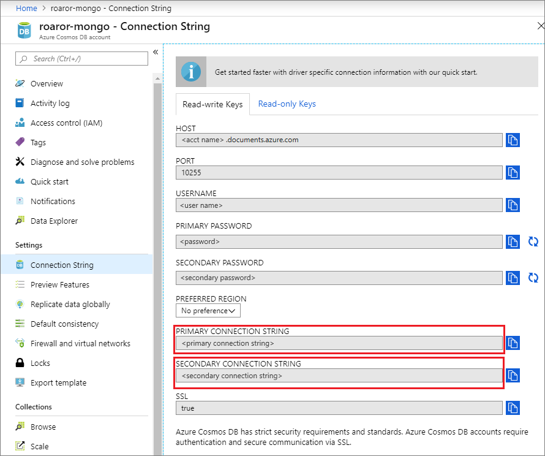
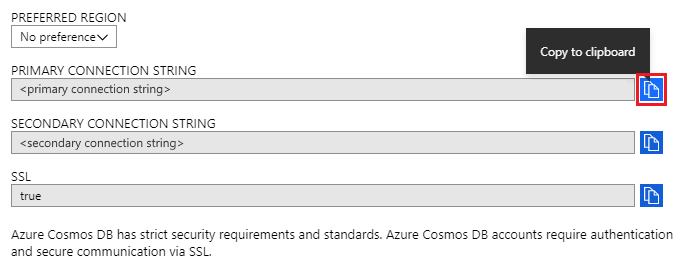
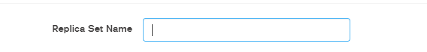

# Use MongoDB Compass to connect to Azure Cosmos DB's API for MongoDB 

This tutorial demonstrates how to use [MongoDB Compass](https://www.mongodb.com/products/compass) when storing and/or managing data in Cosmos DB. We use the Azure Cosmos DB's API for MongoDB for this walk-through. For those of you unfamiliar, Compass is a GUI for MongoDB. It is commonly used to visualize your data, run ad-hoc queries, along with managing your data. 

Cosmos DB is Microsoft's globally distributed multi-model database service. You can quickly create and query document, key/value, and graph databases, all of which benefit from the global distribution and horizontal scale capabilities at the core of Cosmos DB.

## Pre-requisites 
To connect to your Cosmos DB account using Robo 3T, you must:

* Download and install [Compass](https://www.mongodb.com/download-center/compass?jmp=hero)
* Have your Cosmos DB [connection string](connect-mongodb-account.md) information

## Connect to Cosmos DB's API for MongoDB 
To connect your Cosmos DB account to Compass, you can follow the below steps:

1. Retrieve the connection information for your Cosmos account configured with Azure Cosmos DB's API MongoDB using the instructions [here](connect-mongodb-account.md).

    

2. Click on the button that says **Copy to clipboard** next to your **Primary/Secondary connection string** in Cosmos DB. Clicking this button will copy your entire connection string to your clipboard. 

    

3. Open Compass on your desktop/machine and click on **Connect** and then **Connect to...**. 

4. Compass will automatically detect a connection string in the clipboard, and will prompt to ask whether you wish to use that to connect. Click on **Yes** as shown in the screenshot below.

    

5. Upon clicking **Yes** in the above step, your details from the connection string will be automatically populated. Remove the value automatically populated in the **Replica Set Name** field to ensure that is left blank. 

    

6. Click on **Connect** at the bottom of the page. Your Cosmos DB account and databases should now be visible within MongoDB Compass.

## Next steps

- Learn how to [use Studio 3T](mongodb-mongochef.md) with Azure Cosmos DB's API for MongoDB.
- Explore MongoDB [samples](mongodb-samples.md) with Azure Cosmos DB's API for MongoDB.