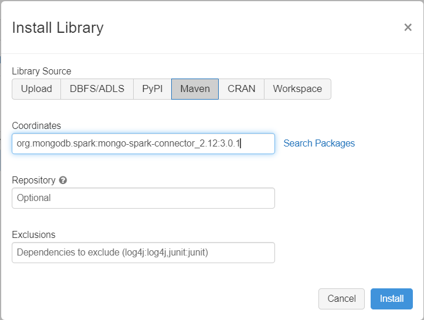

# Migrate data from MongoDB to an Azure Cosmos DB API for MongoDB account by using Azure Databricks
[!INCLUDE[appliesto-mongodb-api](includes/appliesto-mongodb-api.md)]

This MongoDB migration guide is part of series on MongoDB migration. The critical MongoDB migration steps are [pre-migration](mongodb-pre-migration.md), migration, and [post-migration](mongodb-post-migration.md), as shown below.


## Overview of data migration using Azure Databricks

[Azure Databricks](https://azure.microsoft.com/services/databricks/) is a platform as a service (PaaS) offering for [Apache Spark](https://spark.apache.org/) that offers a way to perform offline migrations on a large scale. You can use Azure Databricks to perform an offline migration of databases from an on-premises or cloud instance of MongoDB to Azure Cosmos DB's API for MongoDB.

In this tutorial, you learn how to:

- Provision an Azure Databricks cluster

- Add dependencies

- Create and run Scala or Python Notebook to perform the migration

- Optimize the migration performance

- Troubleshoot rate-limiting errors that may be observed during migration

## Prerequisites

To complete this tutorial, you need to:

- [Complete the pre-migration](mongodb-pre-migration.md) steps such as estimating throughput and choosing a partition key.
- [Create an Azure Cosmos DB API for MongoDB account](https://ms.portal.azure.com/#create/Microsoft.DocumentDB).

## Provision an Azure Databricks cluster

You can follow instructions to [provision an Azure Databricks cluster](https://docs.microsoft.com/en-us/azure/databricks/scenarios/quickstart-create-databricks-workspace-portal). We recommend selecting Databricks runtime version 7.6, which supports Spark 3.0.


## Add dependencies

You need to add the Mongo Spark Connector library to your cluster to connect to both native MongoDB and Azure Cosmos DB API for Mongo endpoints. In your cluster, select **Libraries** > **Install New** > **Maven**, and then add `org.mongodb.spark:mongo-spark-connector_2.12:3.0.1` in Maven coordinates.




Select **Install**, and then restart the cluster when installation is complete.

> [!NOTE]
> Make sure that you restart the Databricks cluster after the Mongo Spark Connector library has been installed.

Post that, you may create a Scala or Python notebook for migration.


## Create Scala Notebook for migration

Create a Scala Notebook in Databricks. Fill in the right values for the source and target configuration variables in the following code, and then run the code:


```scala
import com.mongodb.spark._
import com.mongodb.spark.config._
import org.apache.spark._
import org.apache.spark.sql._

var sourceConnectionString = ""
var sourceDb = ""
var sourceCollection =  ""
var targetConnectionString = ""
var targetDb = ""
var targetCollection =  ""

val readConfig = ReadConfig(Map(
  "spark.mongodb.input.uri" -> sourceConnectionString,
  "spark.mongodb.input.database" -> sourceDb,
  "spark.mongodb.input.collection" -> sourceCollection,
))

val writeConfig = WriteConfig(Map(
  "spark.mongodb.output.uri" -> targetConnectionString,
  "spark.mongodb.output.database" -> targetDb,
  "spark.mongodb.output.collection" -> targetCollection,
  "spark.mongodb.output.maxBatchSize" -> "8000"  
))

val sparkSession = SparkSession
  .builder()
  .appName("Data transfer using spark")
  .getOrCreate()

val customRdd = MongoSpark.load(sparkSession, readConfig)

MongoSpark.save(customRdd, writeConfig)
```

## Create Python Notebook for migration

Create a Python Notebook in Databricks. Fill in the right values for the source and target configuration variables in the following code, and then run the code::


```python
from pyspark.sql import SparkSession

sourceConnectionString = ""
sourceDb = ""
sourceCollection =  ""
targetConnectionString = ""
targetDb = ""
targetCollection =  ""

my_spark = SparkSession \
    .builder \
    .appName("myApp") \
    .getOrCreate()

df = my_spark.read.format("com.mongodb.spark.sql.DefaultSource").option("uri", sourceConnectionString).option("database", sourceDb).option("collection", sourceCollection).load()

df.write.format("mongo").mode("append").option("uri", targetConnectionString).option("maxBatchSize",2500).option("database", targetDb).option("collection", targetCollection).save()
```