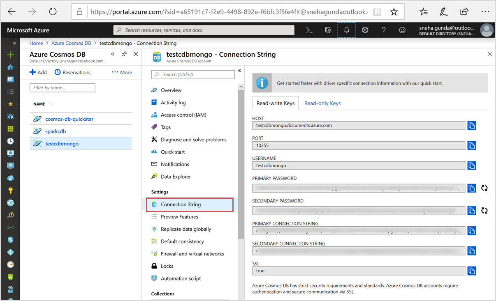

# Migrate your data to Azure Cosmos DB MongoDB API account

To migrate data from MongoDB to an Azure Cosmos DB account for use with the API for MongoDB, you must:

* Download the community server from the [MongoDB Download Center](https://www.mongodb.com/download-center) and install it.
* Use the mongoimport.exe or mongorestore.exe file that are installed in the "installation folder/bin" directory. 
* Get your [API for MongoDB connection string](connect-mongodb-account.md).

If you are importing data from MongoDB and plan to use it with the Azure Cosmos DB SQL API, you should use the [Data Migration tool](import-data.md) to import data.

This tutorial covers the following tasks:

> [!div class="checklist"]
> * Retrieving your connection string
> * Importing MongoDB data by using mongoimport
> * Importing MongoDB data by using mongorestore

## Prerequisites

* **Increase throughput:** The duration of your data migration depends on the amount of throughput you set up for an individual collection or a set of collections. Be sure to increase the throughput for larger data migrations. After you've completed the migration, decrease the throughput to save costs. For more information about increasing throughput in the [Azure portal](https://portal.azure.com), see [Performance levels and pricing tiers in Azure Cosmos DB](performance-levels.md).

* **Enable SSL:** Azure Cosmos DB has strict security requirements and standards. Be sure to enable SSL when you interact with your account. The procedures in the rest of the article include how to enable SSL for mongoimport and mongorestore.

* **Create Azure Cosmos DB resources:** Before you start the migrating data, pre-create all your collections from the Azure portal. If you are migrating to an Azure Cosmos DB account that has database level throughput, make sure to provide a partition key when creating the Azure Cosmos DB collections.

## Get your connection string 

1. In the [Azure portal](https://portal.azure.com), in the left pane, click the **Azure Cosmos DB** entry.
1. In the **Subscriptions** pane, select your account name.
1. In the **Connection String** blade, click **Connection String**.

   The right pane contains all the information that you need to successfully connect to your account.

   

## Migrate data by using mongoimport

To import data to your Azure Cosmos DB account, use the following template. Fill in *host*, *username*, and *password* with the values that are specific to your account.  

Template:

```bash
    mongoimport.exe --host <your_hostname>:10255 -u <your_username> -p <your_password> --db <your_database> --collection <your_collection> --ssl --sslAllowInvalidCertificates --type json --file "C:\sample.json"
```

Example:  

```bash
    mongoimport.exe --host cosmosdb-mongodb-account.documents.azure.com:10255 -u cosmosdb-mongodb-account -p tkvaVkp4Nnaoirnouenrgisuner2435qwefBH0z256Na24frio34LNQasfaefarfernoimczciqisAXw== --ssl --sslAllowInvalidCertificates --db sampleDB --collection sampleColl --type json --file "C:\Users\admin\Desktop\*.json"
```

## Migrate data by using mongorestore

To restore data to your API for MongoDB account, use the following template to execute the import. Fill in *host*, *username*, and *password* with the values that are specific to your account.

Template:

```bash
    mongorestore.exe --host <your_hostname>:10255 -u <your_username> -p <your_password> --db <your_database> --collection <your_collection> --ssl --sslAllowInvalidCertificates <path_to_backup>
```

Example:

```bash
    mongorestore.exe --host cosmosdb-mongodb-account.documents.azure.com:10255 -u cosmosdb-mongodb-account -p tkvaVkp4Nnaoirnouenrgisuner2435qwefBH0z256Na24frio34LNQasfaefarfernoimczciqisAXw== --ssl --sslAllowInvalidCertificates ./dumps/dump-2016-12-07
```
    
## Steps for a successful migration

1. Pre-create and scale your collections:
        
    * By default, Azure Cosmos DB provisions a new MongoDB collection with 1,000 request units per second (RU/sec). Before you start the migration by using mongoimport, mongorestore, pre-create all your collections from the [Azure portal](https://portal.azure.com) or from MongoDB drivers and tools. If the data size is greater than 10 GB, make sure to create a [sharded/partitioned collection](partition-data.md) with an appropriate shard key.

    * From the [Azure portal](https://portal.azure.com), increase your collections throughput from 1000 RUs/sec for a single partition collection and 2,500 RUs/sec for a sharded collection just for the migration. With the higher throughput, you can avoid rate limiting and migrate in less time. You can reduce the throughput immediately after the migration to save costs.

    * In addition to provisioning RUs/sec at the collection level, you may also provision RU/sec for a set of collections at the parent database level. This requires pre-creating the database and collections, as well as defining a shard key for each collection.

    * You can create sharded collections through your favorite tool, driver, or SDK. In this example, we use the Mongo Shell to create a sharded collection:

        ```bash
        db.runCommand( { shardCollection: "admin.people", key: { region: "hashed" } } )
        ```
    
        Results:

        ```JSON
        {
            "_t" : "ShardCollectionResponse",
            "ok" : 1,
            "collectionsharded" : "admin.people"
        }
        ```

1. Calculate the approximate RU charge for a single document write:

   a. Connect to your Azure Cosmos DB MongoDB API account from the MongoDB Shell. You can find instructions in [Connect a MongoDB application to Azure Cosmos DB](connect-mongodb-account.md).
    
   b. Run a sample insert command by using one of your sample documents from the MongoDB Shell:
   
      ```bash
      db.coll.insert({ "playerId": "a067ff", "hashedid": "bb0091", "countryCode": "hk" })
      ```
        
   c. Run ```db.runCommand({getLastRequestStatistics: 1})``` and you'll receive a response like the following:
     
      ```bash
        globaldb:PRIMARY> db.runCommand({getLastRequestStatistics: 1})
        {
            "_t": "GetRequestStatisticsResponse",
            "ok": 1,
            "CommandName": "insert",
            "RequestCharge": 10,
            "RequestDurationInMilliSeconds": NumberLong(50)
        }
      ```
        
    d. Take note of the request charge.
    
1. Determine the latency from your machine to the Azure Cosmos DB cloud service:
    
    a. Enable verbose logging from the MongoDB Shell by using this command: ```setVerboseShell(true)```
    
    b. Run a simple query against the database: ```db.coll.find().limit(1)```. You'll receive a response like the following:

        ```
        Fetched 1 record(s) in 100(ms)
        ```
        
1. Remove the inserted document before the migration to ensure that there are no duplicate documents. You can remove documents by using this command: ```db.coll.remove({})```

1. Calculate the approximate *batchSize* and *numInsertionWorkers* values:

    * For *batchSize*, divide the total provisioned RUs by the RUs consumed from your single document write in step 3.
    
    * If the calculated *batchSize* <= 24, use that number as your *batchSize* value.
    
    * If the calculated *batchSize* > 24, set the *batchSize* value to 24.
    
    * For *numInsertionWorkers*, use this equation:
        *numInsertionWorkers =  (provisioned throughput * latency in seconds) / (batch size * consumed RUs for a single write)*.
        
    |Property|Value|
    |--------|-----|
    |batchSize| 24 |
    |RUs provisioned | 10000 |
    |Latency | 0.100 s |
    |RU charged for 1 doc write | 10 RUs |
    |numInsertionWorkers | ? |
    
    *numInsertionWorkers = (10000 RUs x 0.1 s) / (24 x 10 RUs) = 4.1666*

1. Run the final migration command:

   ```bash
   mongoimport.exe --host cosmosdb-mongodb-account.documents.azure.com:10255 -u cosmosdb-mongodb-account -p wzRJCyjtLPNuhm53yTwaefawuiefhbauwebhfuabweifbiauweb2YVdl2ZFNZNv8IU89LqFVm5U0bw== --ssl --sslAllowInvalidCertificates --jsonArray --db dabasename --collection collectionName --file "C:\sample.json" --numInsertionWorkers 4 --batchSize 24
   ```
   Or with mongorestore (make sure all collections have the throughput set at or above the amount of RUs used in previous calculations):
   
   ```bash
   mongorestore.exe --host cosmosdb-mongodb-account.documents.azure.com:10255 -u cosmosdb-mongodb-account -p wzRJCyjtLPNuhm53yTwaefawuiefhbauwebhfuabweifbiauweb2YVdl2ZFNZNv8IU89LqFVm5U0bw== --ssl --sslAllowInvalidCertificates ./dumps/dump-2016-12-07 --numInsertionWorkersPerCollection 4 --batchSize 24
   ```

## Next steps

You can proceed to the next tutorial and learn how to query MongoDB data by using Azure Cosmos DB. 

> [!div class="nextstepaction"]
>[How to query MongoDB data?](../cosmos-db/tutorial-query-mongodb.md)
