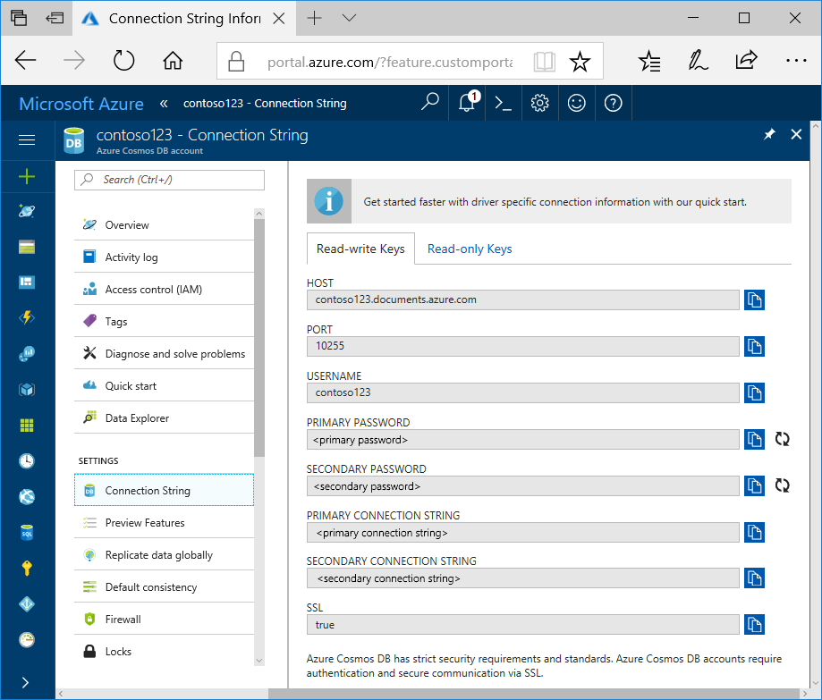
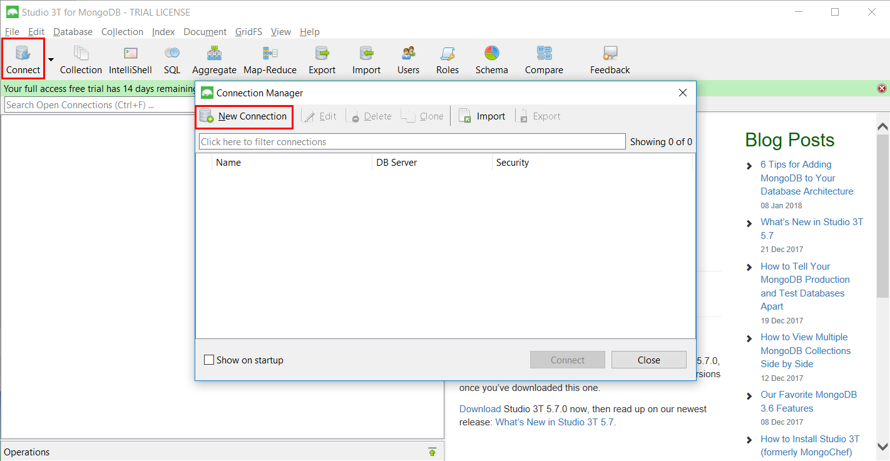
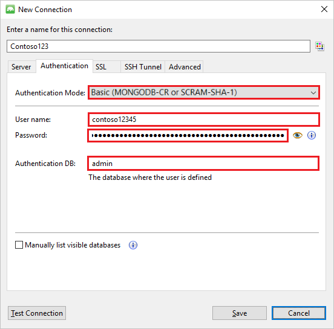
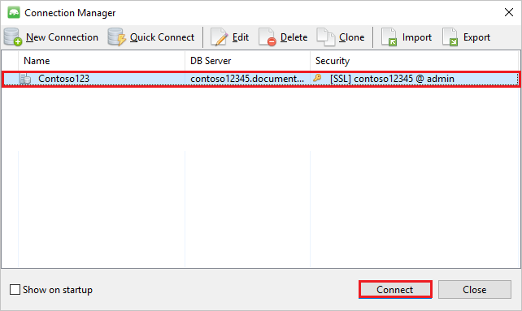
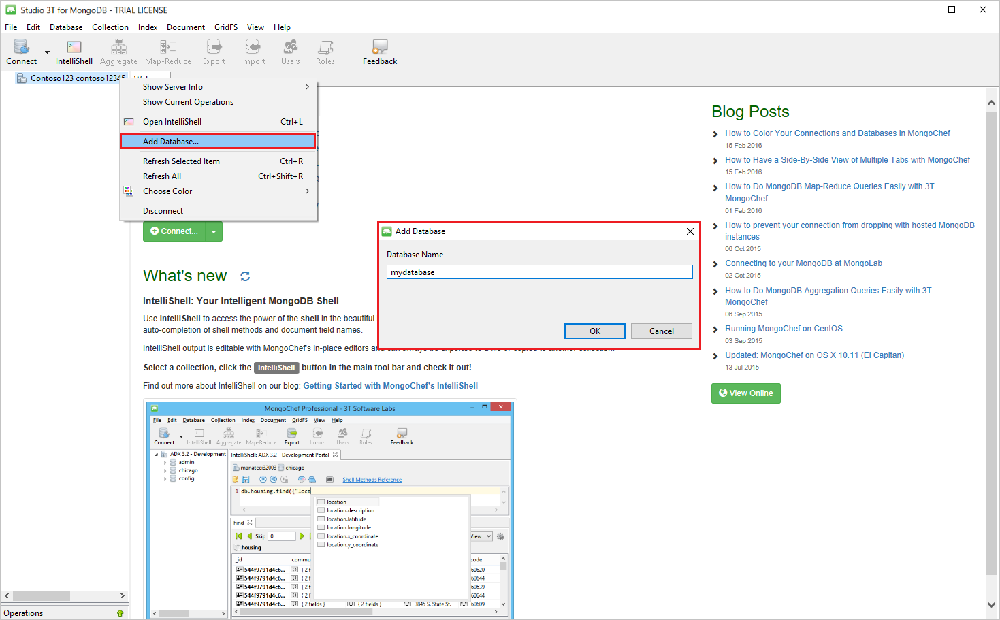
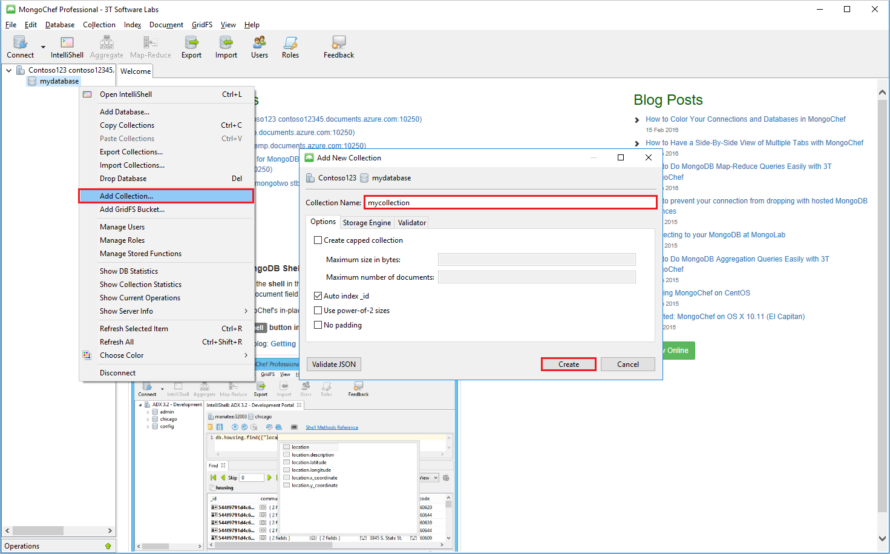
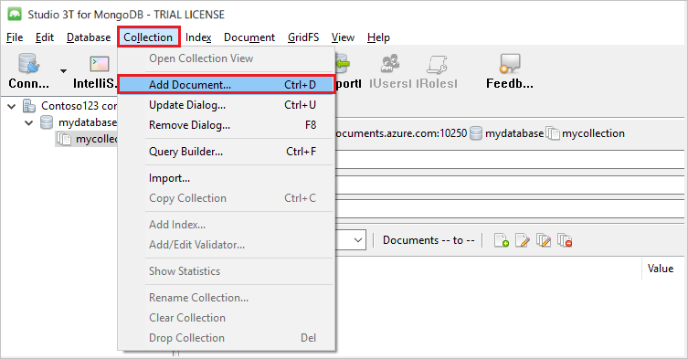
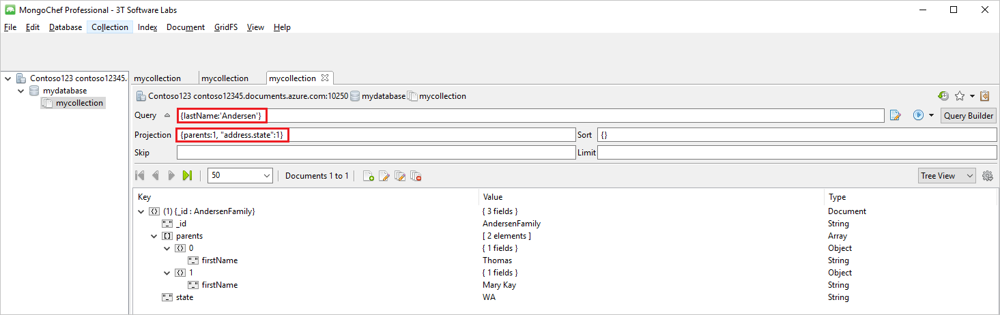

# Azure Cosmos DB: Use Studio 3T with a MongoDB API account

To connect to an Azure Cosmos DB MongoDB API account, you must:

* Download and install [Studio 3T](https://studio3t.com/) (formerly known as MongoChef)
* Have your Azure Cosmos DB [connection string](connect-mongodb-account.md) information for your MongoDB account

## Create the connection in Studio 3T
To add your Azure Cosmos DB account to the Studio 3T connection manager, perform the following steps:

1. Retrieve the Azure Cosmos DB connection information for your MongoDB API account using the instructions in the [Connect a MongoDB application to Azure Cosmos DB](connect-mongodb-account.md) article.

    
2. Click **Connect** to open the Connection Manager, then click **New Connection**

    
3. In the **New Connection** window, on the **Server** tab, enter the HOST (FQDN) of the Azure Cosmos DB account and the PORT.

    
4. In the **New Connection** window, on the **Authentication** tab, choose Authentication Mode **Basic (MONGODB-CR or SCARM-SHA-1)** and enter the USERNAME and PASSWORD.  Accept the default authentication db (admin) or provide your own value.

    
5. In the **New Connection** window, on the **SSL** tab, check the **Use SSL protocol to connect** check box and the **Accept server self-signed SSL certificates** radio button.

    
6. Click the **Test Connection** button to validate the connection information, click **OK** to return to the New Connection window, and then click **Save**.

    

## Use Studio 3T to create a database, collection, and documents
To create a database, collection, and documents using Studio 3T, perform the following steps:

1. In **Connection Manager**, highlight the connection and click **Connect**.

    
2. Right-click the host and choose **Add Database**.  Provide a database name and click **OK**.

    
3. Right-click the database and choose **Add Collection**.  Provide a collection name and click **Create**.

    
4. Click the **Collection** menu item, then click **Add Document**.

    
5. In the Add Document dialog, paste the following and then click **Add Document**.

        {
        "_id": "AndersenFamily",
        "lastName": "Andersen",
        "parents": [
               { "firstName": "Thomas" },
               { "firstName": "Mary Kay"}
        ],
        "children": [
           {
               "firstName": "Henriette Thaulow", "gender": "female", "grade": 5,
               "pets": [{ "givenName": "Fluffy" }]
           }
        ],
        "address": { "state": "WA", "county": "King", "city": "seattle" },
        "isRegistered": true
        }
6. Add another document, this time with the following content:

        {
        "_id": "WakefieldFamily",
        "parents": [
            { "familyName": "Wakefield", "givenName": "Robin" },
            { "familyName": "Miller", "givenName": "Ben" }
        ],
        "children": [
            {
                "familyName": "Merriam",
                 "givenName": "Jesse",
                "gender": "female", "grade": 1,
                "pets": [
                    { "givenName": "Goofy" },
                    { "givenName": "Shadow" }
                ]
            },
            {
                "familyName": "Miller",
                 "givenName": "Lisa",
                 "gender": "female",
                 "grade": 8 }
        ],
        "address": { "state": "NY", "county": "Manhattan", "city": "NY" },
        "isRegistered": false
        }
7. Execute a sample query. For example, search for families with the last name 'Andersen' and return the parents and state fields.

    

## Next steps
* Explore Azure Cosmos DB MongoDB API [samples](mongodb-samples.md).
