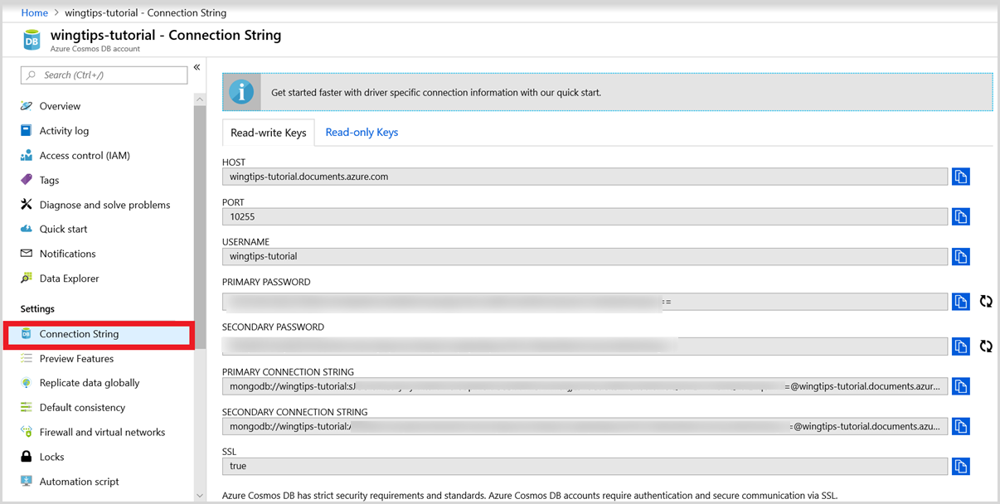

# Post-migration optimization steps when using Azure Cosmos DB's API for MongoDB

After you migrate the data stored in MongoDB database to Azure Cosmos DB's API for MongoDB, you can connect to Azure Cosmos DB and manage the data. This guide provides the steps you should consider after the migration. See the [Migrate MongoDB to Azure Cosmos DB's API for MongoDB tutorial](../dms/tutorial-mongodb-cosmos-db.md) for the migration steps.

In this guide, you will learn how to:

- [Connect your application](#connect-your-application)
- [Optimize the indexing policy](#optimize-the-indexing-policy)
- [Configure global distribution for Azure Cosmos DB's API for MongoDB](#globally-distribute-your-data)
- [Set consistency level](#set-consistency-level)

> [!NOTE]
> The only mandatory post-migration step on your application level is changing the connection string in your application to point to your new Azure Cosmos DB account. All other migration steps are recommended optimizations.
>

## Connect your application

1. In a new window sign into the [Azure portal](https://www.portal.azure.com/)
2. From the [Azure portal](https://www.portal.azure.com/), in the left pane open the **All resources** menu and find  the Azure Cosmos DB account to which you have migrated your data.
3. Open the **Connection String** blade. The right pane contains all the information that you need to successfully connect to your account.
4. Use the connection information in your application's configuration (or other relevant places) to reflect the Azure Cosmos DB's API for MongoDB connection in your app.

For more details, please see the [Connect a MongoDB application to Azure Cosmos DB](connect-mongodb-account.md) page.

## Optimize the indexing policy

All data fields are automatically indexed, by default, during the migration of data to Azure Cosmos DB. In many cases, this default indexing policy is acceptable. In general, removing indexes optimizes write requests and having the default indexing policy (i.e., automatic indexing) optimizes read requests.

For more information on indexing, see [Data indexing in Azure Cosmos DB's API for MongoDB](mongodb-indexing.md) as well as the [Indexing in Azure Cosmos DB](index-overview.md) articles.

## Globally distribute your data

Azure Cosmos DB is available in all [Azure regions](https://azure.microsoft.com/regions/#services) worldwide. After selecting the default consistency level for your Azure Cosmos DB account, you can associate one or more Azure regions (depending on your global distribution needs). For high availability and business continuity, we always recommend running in at least 2 regions. You can review the tips for [optimizing cost of multi-region deployments in Azure Cosmos DB](optimize-cost-regions.md).

To globally distribute your data, please see [Distribute data globally on Azure Cosmos DB's API for MongoDB](tutorial-global-distribution-mongodb.md).

## Set consistency level

Azure Cosmos DB offers 5 well-defined [consistency levels](consistency-levels.md). To read about the mapping between MongoDB and Azure Cosmos DB consistency levels, read [Consistency levels and Azure Cosmos DB APIs](consistency-levels-across-apis.md). The default consistency level is the session consistency level. Changing the consistency level is optional and you can optimize it for your app. To change consistency level using Azure portal:

1. Go to the **Default Consistency** blade under Settings.
2. Select your [consistency level](consistency-levels.md)

Most users leave their consistency level at the default session consistency setting. However, there are [availability and performance tradeoffs for various consistency levels](consistency-levels-tradeoffs.md).

## Next steps

* [Connect a MongoDB application to Azure Cosmos DB](connect-mongodb-account.md)
* [Connect to Azure Cosmos DB account using Studio 3T](mongodb-mongochef.md)
* [How to globally distribute reads using Azure Cosmos DB's API for MongoDB](mongodb-readpreference.md)
* [Expire data with Azure Cosmos DB's API for MongoDB](mongodb-time-to-live.md)
* [Consistency Levels in Azure Cosmos DB](consistency-levels.md)
* [Indexing in Azure Cosmos DB](index-overview.md)
* [Request Units in Azure Cosmos DB](request-units.md)