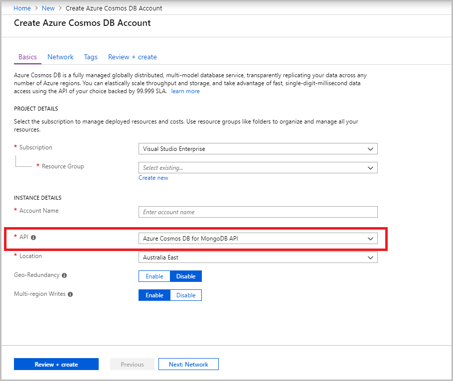

# Pre-migration steps for data migrations from MongoDB to Azure Cosmos DB's API for MongoDB

Before you migrate your data from MongoDB (either on-premises or in the cloud (IaaS)) to Azure Cosmos DB’s API for MongoDB, you should:

1. [Create an Azure Cosmos DB account](#create-account)
2. [Estimate the throughput needed for your workloads](#estimate-throughput)
3. [Pick an optimal partition key for your data](#partitioning)
4. [Understand the indexing policy that you can set on your data](#indexing)

If you have already completed the above pre-requisites for migration, see the [Migrate MongoDB data to Azure Cosmos DB's API for MongoDB](../dms/tutorial-mongodb-cosmos-db.md) for the actual data migration instructions. If not, this document provides instructions to handle these pre-requisites. 

## <a id="create-account"></a> Create an Azure Cosmos DB account 

Before starting the migration, you need to [create an Azure Cosmos account using Azure Cosmos DB’s API for MongoDB](create-mongodb-dotnet.md). 

At the account creation, you can choose settings to [globally distribute](distribute-data-globally.md) your data. You also have the option to enable multi-region writes (or multi-master configuration), that allows each of your regions to be both a write and read region.



## <a id="estimate-throughput"></a> Estimate the throughput need for your workloads

Before starting the migration by using the [Database Migration Service (DMS)](../dms/dms-overview.md), you should estimate the amount of throughput to provision for your Azure Cosmos databases and collections.

Throughput can be provisioned on either:

- Collection

- Database

> [!NOTE]
> You can also have a combination of the above, where some collections in a database may have dedicated provisioned throughput and others may share the throughput. For details, please see the [set throughput on a database and a container](set-throughput.md) page.
>

You should first decide whether you want to provision database or collection level throughput, or a combination of both. In general, it is recommended to configure a dedicated throughput at the collection level. Provisioning throughput at the database-level enables collections in your database to share the provisioned throughput . With shared throughput, however, there is no guarantee for a specific throughput on each individual collection, and you don’t get predictable performance on any specific collection.

If you are not sure about how much throughput should be dedicated to each individual collection, you can choose database-level throughput. You can think of the provisioned throughput configured on your Azure Cosmos database as a logical equivalent to that of the compute capacity of a MongoDB VM or a physical server, but more cost-effective with the ability to elastically scale. For more information, see [Provision throughput on Azure Cosmos containers and databases](set-throughput.md).

If you provision throughput at the database level, all collections created within that database must be created with a partition/shard key. For more information on partitioning, see [Partitioning and horizontal scaling in Azure Cosmos DB](partition-data.md). If you do not specify a partition/shard key during the migration, the Azure Database Migration Service automatically populates the shard key field with an *_id* attribute that is automatically generated for each document.

### Optimal number of Request Units (RUs) to provision

In Azure Cosmos DB, the throughput is provisioned in advance and is measured in Request Units (RU's) per second. If you have workloads that run MongoDB on a VM or on-premises, think of RU's as a simple abstraction for physical resources, such as for the size of a VM or on-an premises server and the resources they possess, e.g., memory, CPU, IOPs. 

Unlike VMs or on-premises servers, RUs are easy to scale up and down at any time. You can change the number of provisioned RUs within seconds, and you are billed only for the maximum number of RUs that you provision for a given one-hour period. For more information, see [Request units in Azure Cosmos DB](request-units.md).

The following are key factors that affect the number of required RUs:
- **Item (i.e., document) size**: As the size of an item/document increases, the number of RUs consumed to read or write the item/document also increases.
- **Item property count**: Assuming the [default indexing](index-overview.md) on all properties, the number of RUs consumed to write an item increases as the item property count increases. You can reduce the request unit consumption for write operations by [limiting the number of indexed properties](index-policy.md).
- **Concurrent operations**: Request units consumed also depends on the frequency with which different CRUD operations (like writes, reads, updates, deletes) and more complex queries are executed. You can use [mongostat](https://docs.mongodb.com/manual/reference/program/mongostat/) to output the concurrency needs of your current MongoDB data.
- **Query patterns**: The complexity of a query affects how many request units are consumed by the query.

If you export JSON files using [mongoexport](https://docs.mongodb.com/manual/reference/program/mongoexport/) and understand how many writes, reads, updates, and deletes that take place per second, you can use the [Azure Cosmos DB capacity planner](https://www.documentdb.com/capacityplanner) to estimate the initial number of RUs to provision. The capacity planner does not factor in the cost of more complex queries. So, if you have complex queries on your data, additional RUs will be consumed. The calculator also assumes that all fields are indexed, and session consistency is used. The best way to understand the cost of queries is to migrate your data (or sample data) to Azure Cosmos DB, [connect to the Cosmos DB’s endpoint](connect-mongodb-account.md) and run a sample query from the MongoDB Shell using the `getLastRequestStastistics` command to get the request charge, which will output the number of RUs consumed:

`db.runCommand({getLastRequestStatistics: 1})`

This command will output a JSON document similar to the following:

```{  "_t": "GetRequestStatisticsResponse",  "ok": 1,  "CommandName": "find",  "RequestCharge": 10.1,  "RequestDurationInMilliSeconds": 7.2}```

After you understand the number of RUs consumed by a query and the concurrency needs for that query, you can adjust the number of provisioned RUs. Optimizing RUs is not a one-time event - you should continually optimize or scale up the RUs provisioned, depending on whether you are not expecting a heavy traffic, as opposed to a heavy workload or importing data.

## <a id="partitioning"></a>Choose your partition key
Partitioning is a key point of consideration before migrating to a globally distributed Database like Azure Cosmos DB. Azure Cosmos DB uses partitioning to scale individual containers in a database to meet the scalability and performance needs of your application. In partitioning, the items in a container are divided into distinct subsets called logical partitions. For details and recommendations on choosing the right partition key for your data, please see the [Choosing a Partition Key section](https://docs.microsoft.com/azure/cosmos-db/partitioning-overview#choose-partitionkey). 

## <a id="indexing"></a>Index your data
By default, Azure Cosmos DB indexes all your data fields upon ingestion. You can modify the [indexing policy](index-policy.md) in Azure Cosmos DB at any time. In fact, it is often recommended to turn off indexing when migrating data, and then turn it back on when the data is already in Cosmos DB. For more details on indexing, you can read more about it in the [Indexing in Azure Cosmos DB](index-overview.md) section. 

[Azure Database Migration Service](../dms/tutorial-mongodb-cosmos-db.md) automatically migrates MongoDB collections with unique indexes. However, the unique indexes must be created before the migration. Azure Cosmos DB does not support the creation of unique indexes, when there is already data in your collections. For more information, see [Unique keys in Azure Cosmos DB](unique-keys.md).

## Next steps
* [Migrate your MongoDB data to Cosmos DB using the Database Migration Service.](../dms/tutorial-mongodb-cosmos-db.md) 
* [Provision throughput on Azure Cosmos containers and databases](set-throughput.md)
* [Partitioning in Azure Cosmos DB](partition-data.md)
* [Global Distribution in Azure Cosmos DB](distribute-data-globally.md)
* [Indexing in Azure Cosmos DB](index-overview.md)
* [Request Units in Azure Cosmos DB](request-units.md)
