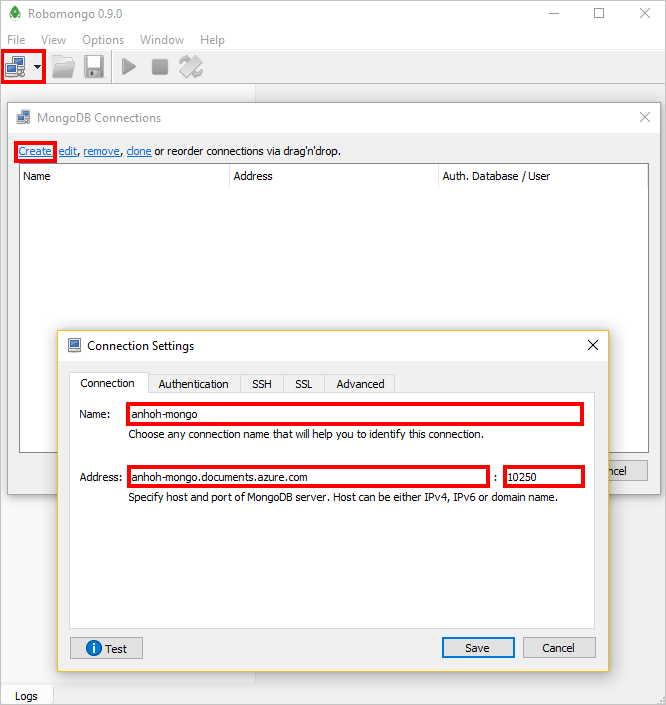
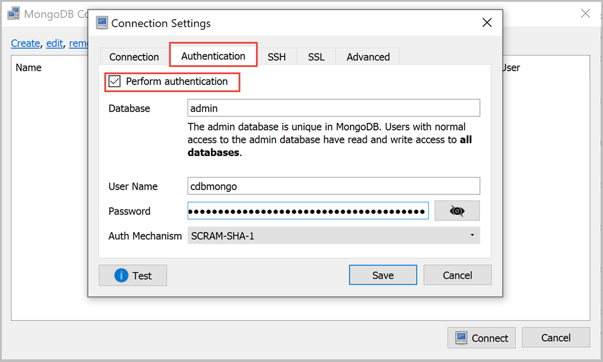

# Use Robo 3T with Azure Cosmos DB's API for MongoDB

To connect to Cosmos account using Robo 3T, you must:

* Download and install [Robo 3T](https://robomongo.org/)
* Have your Cosmos DB [connection string](connect-mongodb-account.md) information

> [!NOTE]
> Currently, Robo 3T v1.2 and lower versions are supported with Cosmos DB's API for MongoDB.

## Connect using Robo 3T

To add your Cosmos account to the Robo 3T connection manager, perform the following steps:

1. Retrieve the connection information for your Cosmos account configured with Azure Cosmos DB's API MongoDB using the instructions [here](connect-mongodb-account.md).

    
2. Run the *Robomongo* application.

3. Click the connection button under **File** to manage your connections. Then, click **Create** in the **MongoDB Connections** window, which will open up the **Connection Settings** window.

4. In the **Connection Settings** window, choose a name. Then, find the **Host** and **Port** from your connection information in Step 1 and enter them into **Address** and **Port**, respectively.

    
5. On the **Authentication** tab, click **Perform authentication**. Then, enter your Database (default is *Admin*), **User Name** and **Password**.
Both **User Name** and **Password** can be found in your connection information in Step 1.

    
6. On the **SSL** tab, check **Use SSL protocol**, then change the **Authentication Method** to **Self-signed Certificate**.

    
7. Finally, click **Test** to verify that you are able to connect, then **Save**.

## Next steps

- Learn how to [use Studio 3T](mongodb-mongochef.md) with Azure Cosmos DB's API for MongoDB.
- Explore MongoDB [samples](mongodb-samples.md) with Azure Cosmos DB's API for MongoDB.
