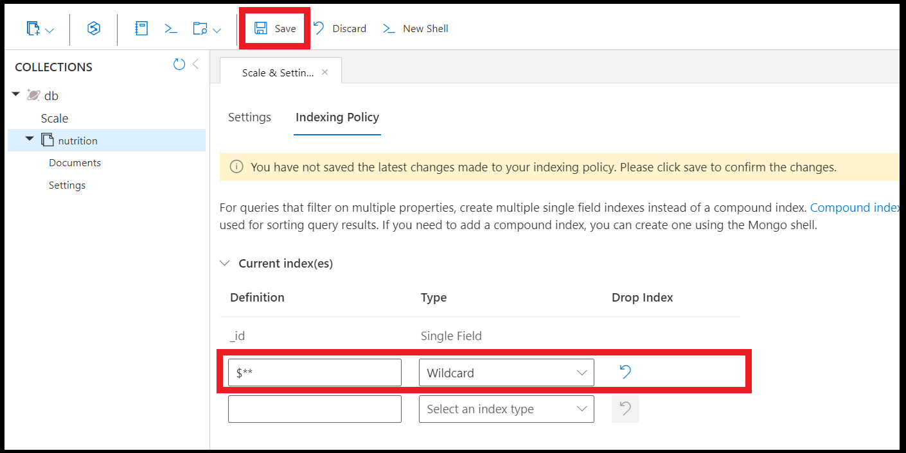

# Manage indexing in Azure Cosmos DB for MongoDB
[!INCLUDE[MongoDB](../includes/appliesto-mongodb.md)]

Azure Cosmos DB for MongoDB takes advantage of the core index-management capabilities of Azure Cosmos DB. This article focuses on how to add indexes using Azure Cosmos DB for MongoDB. Indexes are specialized data structures that make querying your data roughly an order of magnitude faster.

>
> [!VIDEO https://aka.ms/docs.mongo-indexing]

## Indexing for MongoDB server version 3.6 and higher

Azure Cosmos DB for MongoDB server version 3.6+ automatically indexes the `_id` field and the shard key (only in sharded collections). The API automatically enforces the uniqueness of the `_id` field per shard key. 

The API for MongoDB behaves differently from the Azure Cosmos DB for NoSQL, which indexes all fields by default.

### Editing indexing policy

We recommend editing your indexing policy in the Data Explorer within the Azure portal. You can add single field and wildcard indexes from the indexing policy editor in the Data Explorer:

:::image type="content" source="media/indexing/indexing-policy-editor.png" alt-text="Indexing policy editor":::

> [!NOTE]
> You can't create compound indexes using the indexing policy editor in the Data Explorer.

## Index types

### Single field

You can create indexes on any single field. The sort order of the single field index does not matter. The following command creates an index on the field `name`:

`db.coll.createIndex({name:1})`

You could create the same single field index on `name` in the Azure portal:

:::image type="content" source="media/indexing/add-index.png" alt-text="Add name index in indexing policy editor":::

One query uses multiple single field indexes where available. You can create up to 500 single field indexes per collection.

### Compound indexes (MongoDB server version 3.6+)

In the API for MongoDB, compound indexes are **required** if your query needs the ability to sort on multiple fields at once. For queries with multiple filters that don't need to sort, create multiple single field indexes instead of a compound index to save on indexing costs.

A compound index or single field indexes for each field in the compound index results in the same performance for filtering in queries.

Compounded indexes on nested fields aren't supported by default due to limitations with arrays. If your nested field doesn't contain an array, the index works as intended. If your nested field contains an array (anywhere on the path), that value is ignored in the index.

As an example, a compound index containing `people.dylan.age` works in this case since there's no array on the path:

```json
{
  "people": {
    "dylan": {
      "name": "Dylan",
      "age": "25"
    },
    "reed": {
      "name": "Reed",
      "age": "30"
    }
  }
}
```

This same compound index doesn't work in this case since there's an array in the path:

```json
{
  "people": [
    {
      "name": "Dylan",
      "age": "25"
    },
    {
      "name": "Reed",
      "age": "30"
    }
  ]
}
```

This feature can be enabled for your database account by [enabling the 'EnableUniqueCompoundNestedDocs' capability](how-to-configure-capabilities.md).


> [!NOTE]
> You can't create compound indexes on arrays.

The following command creates a compound index on the fields `name` and `age`:

`db.coll.createIndex({name:1,age:1})`

You can use compound indexes to sort efficiently on multiple fields at once, as shown in the following example:

`db.coll.find().sort({name:1,age:1})`

You can also use the preceding compound index to efficiently sort on a query with the opposite sort order on all fields. Here's an example:

`db.coll.find().sort({name:-1,age:-1})`

However, the sequence of the paths in the compound index must exactly match the query. Here's an example of a query that would require an additional compound index:

`db.coll.find().sort({age:1,name:1})`

### Multikey indexes

Azure Cosmos DB creates multikey indexes to index content stored in arrays. If you index a field with an array value, Azure Cosmos DB automatically indexes every element in the array.

### Geospatial indexes

Many geospatial operators will benefit from geospatial indexes. Currently, Azure Cosmos DB for MongoDB supports `2dsphere` indexes. The API does not yet support `2d` indexes.

Here's an example of creating a geospatial index on the `location` field:

`db.coll.createIndex({ location : "2dsphere" })`

### Text indexes

Azure Cosmos DB for MongoDB does not currently support text indexes. For text search queries on strings, you should use [Azure AI Search](../../search/search-howto-index-cosmosdb.md) integration with Azure Cosmos DB. 

## Wildcard indexes

You can use wildcard indexes to support queries against unknown fields. Let's imagine you have a collection that holds data about families.

Here is part of an example document in that collection:

```json
"children": [
   {
     "firstName": "Henriette Thaulow",
     "grade": "5"
   }
]
```

Here's another example, this time with a slightly different set of properties in `children`:

```json
"children": [
    {
     "familyName": "Merriam",
     "givenName": "Jesse",
     "pets": [
         { "givenName": "Goofy" },
         { "givenName": "Shadow" }
         ]
   },
   {
     "familyName": "Merriam",
     "givenName": "John",
   }
]
```

In this collection, documents can have many different possible properties. If you wanted to index all the data in the `children` array, you have two options: create separate indexes for each individual property or create one wildcard index for the entire `children` array.

### Create a wildcard index

The following command creates a wildcard index on any properties within `children`:

`db.coll.createIndex({"children.$**" : 1})`

**Unlike in MongoDB, wildcard indexes can support multiple fields in query predicates**. There will not be a difference in query performance if you use one single wildcard index instead of creating a separate index for each property.

You can create the following index types using wildcard syntax:

* Single field
* Geospatial

### Indexing all properties

Here's how you can create a wildcard index on all fields:

`db.coll.createIndex( { "$**" : 1 } )`

You can also create wildcard indexes using the Data Explorer in the Azure portal:



> [!NOTE]
> If you are just starting development, we **strongly** recommend starting off with a wildcard index on all fields. This can simplify development and make it easier to optimize queries.

Documents with many fields may have a high Request Unit (RU) charge for writes and updates. Therefore, if you have a write-heavy workload, you should opt to individually index paths as opposed to using wildcard indexes.

> [!NOTE]
> Support for unique index on existing collections with data is available in preview. This feature can be enabled for your database account by enabling the ['EnableUniqueIndexReIndex' capability](./how-to-configure-capabilities.md#available-capabilities).

### Limitations

Wildcard indexes do not support any of the following index types or properties:

* Compound
* TTL
* Unique

**Unlike in MongoDB**, in Azure Cosmos DB for MongoDB you **can't** use wildcard indexes for:

* Creating a wildcard index that includes multiple specific fields

  ```json
  db.coll.createIndex(
      { "$**" : 1 },
      { "wildcardProjection " :
          {
             "children.givenName" : 1,
             "children.grade" : 1
          }
      }
  )
  ```

* Creating a wildcard index that excludes multiple specific fields

  ```json
  db.coll.createIndex(
      { "$**" : 1 },
      { "wildcardProjection" :
          {
             "children.givenName" : 0,
             "children.grade" : 0
          }
      }
  )
  ```

As an alternative, you could create multiple wildcard indexes.

## Index properties

The following operations are common for accounts serving wire protocol version 4.0 and accounts serving earlier versions. You can learn more about [supported indexes and indexed properties](feature-support-40.md#indexes-and-index-properties).

### Unique indexes

[Unique indexes](../unique-keys.md) are useful for enforcing that two or more documents do not contain the same value for indexed fields.

The following command creates a unique index on the field `student_id`:

```shell
globaldb:PRIMARY> db.coll.createIndex( { "student_id" : 1 }, {unique:true} )
{
    "_t" : "CreateIndexesResponse",
    "ok" : 1,
    "createdCollectionAutomatically" : false,
    "numIndexesBefore" : 1,
    "numIndexesAfter" : 4
}
```

For sharded collections, you must provide the shard (partition) key  to create a unique index. In other words, all unique indexes on a sharded collection are compound indexes where one of the fields is the shard key. The first field in the order should be the shard key.

The following commands create a sharded collection ```coll``` (the shard key is ```university```) with a unique index on the fields `student_id` and `university`:

```shell
globaldb:PRIMARY> db.runCommand({shardCollection: db.coll._fullName, key: { university: "hashed"}});
{
    "_t" : "ShardCollectionResponse",
    "ok" : 1,
    "collectionsharded" : "test.coll"
}
globaldb:PRIMARY> db.coll.createIndex( { "university" : 1, "student_id" : 1 }, {unique:true});
{
    "_t" : "CreateIndexesResponse",
    "ok" : 1,
    "createdCollectionAutomatically" : false,
    "numIndexesBefore" : 3,
    "numIndexesAfter" : 4
}
```

In the preceding example, omitting the ```"university":1``` clause returns an error with the following message:

`cannot create unique index over {student_id : 1.0} with shard key pattern { university : 1.0 }`

#### Limitations

Unique indexes need to be created while the collection is empty. 

Unique indexes on nested fields are not supported by default due to limitations with arrays. If your nested field does not contain an array, the index will work as intended. If your nested field contains an array (anywhere on the path), that value will be ignored in the unique index and uniqueness will not be preserved for that value. 

For example a unique index on people.tom.age will work in this case since there's no array on the path:
```javascript
{ "people": { "tom": { "age": "25" }, "mark": { "age": "30" } } }
```
but won't work in this case since there's an array in the path:
```javascript
{ "people": { "tom": [ { "age": "25" } ], "mark": [ { "age": "30" } ] } }
```

This feature can be enabled for your database account by [enabling the 'EnableUniqueCompoundNestedDocs' capability](how-to-configure-capabilities.md).


### TTL indexes

To enable document expiration in a particular collection, you need to create a [time-to-live (TTL) index](../time-to-live.md). A TTL index is an index on the `_ts` field with an `expireAfterSeconds` value.

Example:

```JavaScript
globaldb:PRIMARY> db.coll.createIndex({"_ts":1}, {expireAfterSeconds: 10})
```

The preceding command deletes any documents in the ```db.coll``` collection that have not been modified in the last 10 seconds.

> [!NOTE]
> The **_ts** field is specific to Azure Cosmos DB and is not accessible from MongoDB clients. It is a reserved (system) property that contains the time stamp of the document's last modification.

## Track index progress

Version 3.6+ of Azure Cosmos DB for MongoDB support the `currentOp()` command to track index progress on a database instance. This command returns a document that contains information about in-progress operations on a database instance. You use the `currentOp` command to track all in-progress operations in native MongoDB. In Azure Cosmos DB for MongoDB, this command only supports tracking the index operation.

Here are some examples that show how to use the `currentOp` command to track index progress:

* Get the index progress for a collection:

   ```shell
   db.currentOp({"command.createIndexes": <collectionName>, "command.$db": <databaseName>})
   ```

* Get the index progress for all collections in a database:

  ```shell
  db.currentOp({"command.$db": <databaseName>})
  ```

* Get the index progress for all databases and collections in an Azure Cosmos DB account:

  ```shell
  db.currentOp({"command.createIndexes": { $exists : true } })
  ```

### Examples of index progress output

The index progress details show the percentage of progress for the current index operation. Here's an example that shows the output document format for different stages of index progress:

* An index operation on a "foo" collection and "bar" database that is 60 percent complete will have the following output document. The `Inprog[0].progress.total` field shows 100 as the target completion percentage.

   ```json
   {
        "inprog" : [
        {
                ………………...
                "command" : {
                        "createIndexes" : foo
                        "indexes" :[ ],
                        "$db" : bar
                },
                "msg" : "Index Build (background) Index Build (background): 60 %",
                "progress" : {
                        "done" : 60,
                        "total" : 100
                },
                …………..…..
        }
        ],
        "ok" : 1
   }
   ```

* If an index operation has just started on a "foo" collection and "bar" database, the output document might show 0 percent progress until it reaches a measurable level.

   ```json
   {
        "inprog" : [
        {
                ………………...
                "command" : {
                        "createIndexes" : foo
                        "indexes" :[ ],
                        "$db" : bar
                },
                "msg" : "Index Build (background) Index Build (background): 0 %",
                "progress" : {
                        "done" : 0,
                        "total" : 100
                },
                …………..…..
        }
        ],
       "ok" : 1
   }
   ```

* When the in-progress index operation finishes, the output document shows empty `inprog` operations.

   ```json
   {
      "inprog" : [],
      "ok" : 1
   }
   ```

## Background index updates

Regardless of the value specified for the **Background** index property, index updates are always done in the background. Because index updates consume Request Units (RUs) at a lower priority than other database operations, index changes won't result in any downtime for writes, updates, or deletes.

There is no impact to read availability when adding a new index. Queries will only utilize new indexes once the index transformation is complete. During the index transformation, the query engine will continue to use existing indexes, so you'll observe similar read performance during the indexing transformation to what you had observed before initiating the indexing change. When adding new indexes, there is also no risk of incomplete or inconsistent query results.

When removing indexes and immediately running queries that have filters on the dropped indexes, results might be inconsistent and incomplete until the index transformation finishes. If you remove indexes, the query engine does not provide consistent or complete results when queries filter on these newly removed indexes. Most developers do not drop indexes and then immediately try to query them so, in practice, this situation is unlikely.

> [!NOTE]
> You can [track index progress](#track-index-progress).

## ReIndex command

The `reIndex` command will recreate all indexes on a collection. In some rare cases, query performance or other index issues in your collection may be solved by running the `reIndex` command. If you're experiencing issues with indexing, recreating the indexes with the `reIndex` command is a recommended approach. 

You can run the `reIndex` command using the following syntax:

`db.runCommand({ reIndex: <collection> })`

You can use the below syntax to check if running the `reIndex` command would improve query performance in your collection:

`db.runCommand({"customAction":"GetCollection",collection:<collection>, showIndexes:true})`

Sample output:

```
{
        "database" : "myDB",
        "collection" : "myCollection",
        "provisionedThroughput" : 400,
        "indexes" : [
                {
                        "v" : 1,
                        "key" : {
                                "_id" : 1
                        },
                        "name" : "_id_",
                        "ns" : "myDB.myCollection",
                        "requiresReIndex" : true
                },
                {
                        "v" : 1,
                        "key" : {
                                "b.$**" : 1
                        },
                        "name" : "b.$**_1",
                        "ns" : "myDB.myCollection",
                        "requiresReIndex" : true
                }
        ],
        "ok" : 1
}
```

If `reIndex` will improve query performance, **requiresReIndex** will be true. If `reIndex` won't improve query performance, this property will be omitted.

## Migrate collections with indexes

Currently, you can only create unique indexes when the collection contains no documents. Popular MongoDB migration tools try to create the unique indexes after importing the data. To circumvent this issue, you can manually create the corresponding collections and unique indexes instead of allowing the migration tool to try. (You can achieve this behavior for ```mongorestore``` by using the `--noIndexRestore` flag in the command line.)

## Indexing for MongoDB version 3.2

Available indexing features and defaults are different for Azure Cosmos DB accounts that are compatible with version 3.2 of the MongoDB wire protocol. You can [check your account's version](feature-support-36.md#protocol-support) and [upgrade to version 3.6](upgrade-version.md).

If you're using version 3.2, this section outlines key differences with versions 3.6+.

### Dropping default indexes (version 3.2)

Unlike the 3.6+ versions of Azure Cosmos DB for MongoDB, version 3.2 indexes every property by default. You can use the following command to drop these default indexes for a collection (```coll```):

```JavaScript
> db.coll.dropIndexes()
{ "_t" : "DropIndexesResponse", "ok" : 1, "nIndexesWas" : 3 }
```

After dropping the default indexes, you can add more indexes as you would in version 3.6+.

### Compound indexes (version 3.2)

Compound indexes hold references to multiple fields of a document. If you want to create a compound index, [upgrade to version 3.6 or 4.0](upgrade-version.md).

### Wildcard indexes (version 3.2)

If you want to create a wildcard index, [upgrade to version 4.0 or 3.6](upgrade-version.md).

## Next steps

* [Indexing in Azure Cosmos DB](../index-policy.md)
* [Expire data in Azure Cosmos DB automatically with time to live](../time-to-live.md)
* To learn about the relationship between partitioning and indexing, see how to [Query an Azure Cosmos DB container](../how-to-query-container.md) article.
* Trying to do capacity planning for a migration to Azure Cosmos DB? You can use information about your existing database cluster for capacity planning.
    * If all you know is the number of vCores and servers in your existing database cluster, read about [estimating request units using vCores or vCPUs](../convert-vcore-to-request-unit.md) 
    * If you know typical request rates for your current database workload, read about [estimating request units using Azure Cosmos DB capacity planner](estimate-ru-capacity-planner.md)
