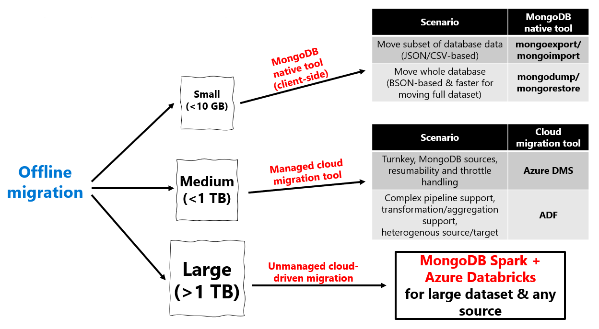
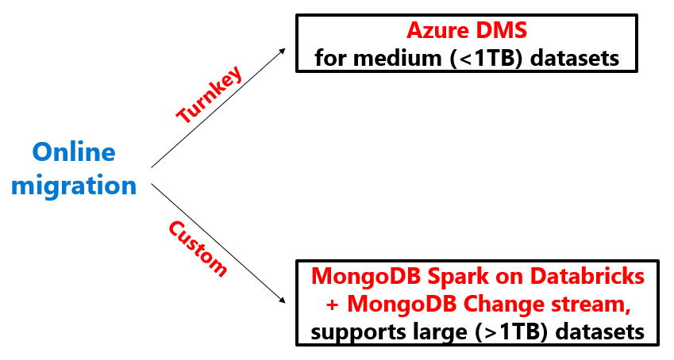

# Premigration steps for data migrations from MongoDB to Azure Cosmos DB for MongoDB

[!INCLUDE[MongoDB](../includes/appliesto-mongodb.md)]

> [!IMPORTANT]  
> Please read this entire guide before carrying out your pre-migration steps.
>

This MongoDB pre-migration guide is part of series on MongoDB migration. The critical MongoDB migration steps are pre-migration, migration, and [post-migration](post-migration-optimization.md), as shown in this guide.


## Overview of pre-migration

It's critical to carry out certain up-front planning and decision-making about your migration before you actually move any data. This initial decision-making process is the "pre-migration".

Your goal in pre-migration is to:

1. Ensure that you set up Azure Cosmos DB to fulfill your application's requirements, and
2. Plan out how you execute the migration.

Follow these steps to perform a thorough pre-migration

1. [Discover your existing MongoDB resources and Assess the readiness of your existing MongoDB resources for data migration](#pre-migration-assessment)
2. [Map your existing MongoDB resources to new Azure Cosmos DB resources](#pre-migration-mapping)
3. [Plan the logistics of migration process end-to-end, before you kick off the full-scale data migration](#execution-logistics)

Then, execute your migration in accordance with your pre-migration plan.

Finally, perform the critical [post-migration steps of cut-over and optimization](post-migration-optimization.md).

All of the above steps are critical for ensuring a successful migration.

When you plan a migration, we recommend that whenever possible you plan at the per-resource level.

## Pre-migration assessment

The first pre-migration step is to discover your existing MongoDB resources and assess the readiness of your resources for migration.

Discovery involves creating a comprehensive list of the existing resources (databases or collections) in your MongoDB data estate.

Assessment involves finding out whether you're using the [features and syntax that are supported](./feature-support-42.md). It also includes making sure you're adhering to the [limits and quotas](../concepts-limits.md#per-account-limits). The aim of this stage is to create a list of incompatibilities and warnings, if any. After you have the assessment results, you can try to address the findings during rest of the migration planning.

There are 3 ways to complete the pre-migration assessment, we recommend you to use the [Azure Cosmos DB Migration for MongoDB extension](#azure-cosmos-db-migration-for-mongodb-extension).

### Azure Cosmos DB Migration for MongoDB extension

The [Azure Cosmos DB Migration for MongoDB extension](/azure-data-studio/extensions/database-migration-for-mongo-extension) in Azure Data Studio helps you assess a MongoDB workload for migrating to Azure Cosmos DB for MongoDB. You can use this extension to run an end-to-end assessment on your workload and find out the actions that you may need to take to seamlessly migrate your workloads on Azure Cosmos DB. During  the assessment of a MongoDB endpoint, the extension reports all the discovered resources.


> [!NOTE]
> We recommend you to go through [the supported features and syntax](./feature-support-42.md), [Azure Cosmos DB limits and quotas](../concepts-limits.md#per-account-limits) in detail, as well as perform a proof-of-concept prior to the actual migration.

### Manual discovery (legacy) 

Alternatively, you could create a **data estate migration spreadsheet**. The purpose of this spreadsheet is to enhance your productivity and help you to plan migration from end-to-end and use it as a tracking document throughout the migration process.

* This sheet contains a comprehensive list of the existing resources (databases or collections) in your MongoDB data estate.
* The spreadsheet should be structured as a record of your data estate resources, in list form.
* Each row corresponds to a resource (database or collection).
* Each column corresponds to a property of the resource; start with at least *name* and *data size (GB)* as columns.
* As you progress through this guide, you build this spreadsheet into a tracking document for your end-to-end migration planning, adding columns as needed.

Here are some tools you can use for discovering resources:

* [MongoDB Shell](https://www.mongodb.com/try/download/shell)
* [MongoDB Compass](https://www.mongodb.com/try/download/compass)

Go through the spreadsheet and verify each collection against the [supported features and syntax](./feature-support-42.md), and [Azure Cosmos DB limits and quotas](../concepts-limits.md#per-account-limits) in detail.

### Database Migration Assistant utility (legacy) 

> [!NOTE]
> Database Migration Assistant is a legacy utility meant to assist you with the pre-migration steps. We recommend you to use the [Azure Cosmos DB Migration for MongoDB extension](#azure-cosmos-db-migration-for-mongodb-extension) for all pre-migration steps.

You may use the [Database Migration Assistant](programmatic-database-migration-assistant-legacy.md) (DMA) utility to assist you with pre-migration steps.

## Pre-migration mapping

With the discovery and assessment steps complete, you're done with the MongoDB side of the equation. Now it's time to plan the Azure Cosmos DB side of the equation. How are you planning to set up and configure your production Azure Cosmos DB resources? Do your planning at a *per-resource* level – that means you should add the following columns to your planning spreadsheet:

* Azure Cosmos DB mapping
* Shard key
* Data model
* Dedicated vs shared throughput

More detail is provided in the following sections.

### Capacity planning

Trying to do capacity planning for a migration to Azure Cosmos DB?

* If all you know is the number of vCores and servers in your existing database cluster, read about [estimating request units using vCores or vCPUs](../convert-vcore-to-request-unit.md)
* If you know typical request rates for your current database workload, read about [estimating request units using Azure Cosmos DB capacity planner](estimate-ru-capacity-planner.md)

### Considerations when using Azure Cosmos DB's API for MongoDB

Before you plan your Azure Cosmos DB data estate, make sure you understand the following Azure Cosmos DB concepts:

* **Capacity model**: Database capacity on Azure Cosmos DB is based on a throughput-based model. This model is based on [Request Units per second](../request-units.md), which is a unit that represents the number of database operations that can be executed against a collection on a per-second basis. This capacity can be allocated at [a database or collection level](../set-throughput.md), and it can be provisioned on an allocation model, or using the [autoscale provisioned throughput](../provision-throughput-autoscale.md).
* **Request Units**: Every database operation has an associated Request Units (RUs) cost in Azure Cosmos DB. When executed, the request units are subtracted from the available request units level on a given second. If a request requires more RUs than the currently allocated RU/s there are two options to solve the issue - increase the number of RUs, or wait until the next second starts, and then retry the operation.
* **Elastic capacity**: The capacity for a given collection or database can change at any time. This flexibility allows for the database to elastically adapt to the throughput requirements of your workload.
* **Automatic sharding**: Azure Cosmos DB provides an automatic partitioning system that only requires a shard (or a partition key). The [automatic partitioning mechanism](../partitioning-overview.md) is shared across all the Azure Cosmos DB APIs and it allows for seamless data and throughout scaling through horizontal distribution.

### Plan the Azure Cosmos DB data estate

Figure out what Azure Cosmos DB resources you create. This process requires stepping through your data estate migration spreadsheet and mapping each existing MongoDB resource to a new Azure Cosmos DB resource.

* Anticipate that each MongoDB database becomes an Azure Cosmos DB database.
* Anticipate that each MongoDB collection becomes an Azure Cosmos DB collection.
* Choose a naming convention for your Azure Cosmos DB resources. Keeping the same resource names is usually a fine choice, unless there are any changes in the structure of databases and collections.
* Determine whether you're using sharded or unsharded collections in Azure Cosmos DB. The unsharded collection limit is 20 GB. Sharding, on the other hand, helps achieve horizontal scale that is critical to the performance of many workloads.
* If using sharded collections, *don't assume that your MongoDB collection shard key becomes your Azure Cosmos DB container partition key*. Don't assume that your existing MongoDB data model document structure should be the same model you employ on Azure Cosmos DB.
  * Shard key is the single most important setting for optimizing the scalability and performance of Azure Cosmos DB, and data modeling is the second most important. Both of these settings are immutable and can't be changed once they're set; therefore it's highly important to optimize them in the planning phase. Follow the guidance in the [Immutable decisions](#immutable-decisions) section for more information.
* Azure Cosmos DB doesn't recognize certain MongoDB collection types such as capped collections. For these resources, just create normal Azure Cosmos DB collections.
* Azure Cosmos DB has two collection types of its own – shared and dedicated throughput. Shared vs dedicated throughput is another critical, immutable decision, which it's vital to make in the planning phase. Follow the guidance in the [Immutable decisions](#immutable-decisions) section for more information.

### Immutable decisions

The following Azure Cosmos DB configuration choices can't be modified or undone once you've created an Azure Cosmos DB resource; therefore it's important to get these configuration choices right during pre-migration planning, before you kick off any migrations:

* Refer to [Partitioning and horizontal scaling in Azure Cosmos DB](../partitioning-overview.md) to choose the best shard key. Partitioning, also known as Sharding, is a key point of consideration before migrating data. Azure Cosmos DB uses fully managed partitioning to increase the capacity in a database to meet the storage and throughput requirements. This feature doesn't need the hosting or configuration of routing servers.
  * In a similar way, the partitioning capability automatically adds capacity and rebalances the data accordingly. For more information on choosing the right partition key for your data, see [choosing a partition key](../partitioning-overview.md#choose-partitionkey).
* Follow the guide for [Data modeling in Azure Cosmos DB](../modeling-data.md) to choose a data model.
* Follow [Optimize provisioned throughput cost in Azure Cosmos DB](../optimize-cost-throughput.md#optimize-by-provisioning-throughput-at-different-levels) to choose between dedicated and shared throughput for each resource that you migrate
* [How to model and partition data on Azure Cosmos DB using a real-world example](../nosql/model-partition-example.md) is a real-world example of sharding and data modeling to aid you in your decision-making process

### Cost of ownership

* Estimate cost of ownership of your new Azure Cosmos DB resources using the [Azure Cosmos DB capacity calculator](https://cosmos.azure.com/capacitycalculator/).

### Estimating throughput

* In Azure Cosmos DB, the throughput is provisioned in advance and is measured in Request Units (RUs) per second. Unlike VMs or on-premises servers, RUs are easy to scale up and down at any time. You can change the number of provisioned RUs instantly. For more information, see [Request units in Azure Cosmos DB](../request-units.md).

* You can use the [Azure Cosmos DB capacity calculator](https://cosmos.azure.com/capacitycalculator/) to determine the number of Request Units you should use. This number is based on your database account configuration, amount of data, document size, and required reads and writes per second.

* The following are key factors that affect the number of required RUs:
  * **Document size**: As the size of an item/document increase, the number of RUs consumed to read or write the item/document also increases.

  * **Document property count**:The number of RUs consumed to create or update a document is related to the number, complexity and length of its properties. You can reduce the request unit consumption for write operations by [limiting the number of indexed properties](indexing.md).

  * **Query patterns**: The complexity of a query affects how many request units the query consumes.

* The best way to understand the cost of queries is to use sample data in Azure Cosmos DB, [and run sample queries from the MongoDB Shell](connect-account.md) using the `getLastRequestStastistics` command to get the request charge, which outputs the number of RUs consumed:

  ```bash
  db.runCommand({getLastRequestStatistics: 1})
  ```

  *This command outputs a JSON document similar to the following example:

  ```json
  {
    "_t": "GetRequestStatisticsResponse",
    "ok": 1,
    "CommandName": "find",
    "RequestCharge": 10.1,
    "RequestDurationInMilliSeconds": 7.2
  }
  ```

* You can also use [the diagnostic settings](../monitor-resource-logs.md) to understand the frequency and patterns of the queries executed against Azure Cosmos DB. The results from the diagnostic logs can be sent to a storage account, an Event Hubs instance or [Azure Log Analytics](../../azure-monitor/logs/log-analytics-tutorial.md).  

## Pre-migration logistics planning

Finally, now that you have a view of your existing data estate and a design for your new Azure Cosmos DB data estate, you're ready to plan how to execute your migration process end-to-end. Once again, do your planning at a *per-resource* level, adding columns to your spreadsheet to capture the logistic dimensions included in this section.

### Execution logistics

* Assign responsibility for migrating each existing resource from MongoDB to Azure Cosmos DB. How you apply your team resources in order to shepherd your migration to completion is up to you. For small migrations, you can have one team kick off the entire migration and monitor its progress. For larger migrations, you could assign responsibility to team-members on a per-resource basis for migrating and monitoring that resource.
* Once you have assigned responsibility for migrating your resources, now you should choose the right migration tool(s) for migration. For small migrations, you might be able to use one migration tool such as a MongoDB native tool or Azure DMS to migrate all of your resources in one shot. For larger migrations or migrations with special requirements, you may want to choose migration tooling at a per-resource granularity.
  * Before you plan which migration tools to use, we recommend acquainting yourself with the options that are available. The [Azure Database Migration Service for Azure Cosmos DB's API for MongoDB](../../dms/tutorial-mongodb-cosmos-db.md) provides a mechanism that simplifies data migration by providing a fully managed hosting platform, migration monitoring options and automatic throttling handling. Here's a full list of options:

    |**Migration type**|**Solution**|**Considerations**|
    |---------|---------|---------|
    |Online|[Azure Database Migration Service](../../dms/tutorial-mongodb-cosmos-db-online.md)|&bull; Uses the [bulk executor library](../bulk-executor-overview.md) for Azure Cosmos DB <br />&bull; Suitable for large datasets and takes care of replicating live changes <br/>&bull; Works only with other MongoDB sources|
    |Offline|[Azure Database Migration Service](../../dms/tutorial-mongodb-cosmos-db-online.md)|&bull; Uses the [bulk executor library](../bulk-executor-overview.md) for Azure Cosmos DB <br/>&bull; Suitable for large datasets and takes care of replicating live changes <br/>&bull; Works only with other MongoDB sources|
    |Offline|[Azure Data Factory](../../data-factory/connector-azure-cosmos-db.md)|&bull; Uses the [bulk executor library](../bulk-executor-overview.md) for Azure Cosmos DB <br/>&bull; Suitable for large datasets <br/> &bull; Easy to set up and supports multiple sources <br/> &bull; Lack of checkpointing means that any issue during migration would require a restart of the whole migration process<br/>&bull; Lack of a dead letter queue would mean that a few erroneous files could stop the entire migration process <br/>&bull; Needs custom code to increase read throughput for certain data sources|
    |Offline|[Existing Mongo Tools (mongodump, mongorestore, Studio3T)](tutorial-mongotools-cosmos-db.md)|&bull; Easy to set up and integration <br/>&bull; Needs custom handling for throttles|
    *|Offline/online|[Azure Databricks and Spark](migrate-databricks.md)|&bull; Full control of migration rate and data transformation <br/>&bull; Requires custom coding|
  
  * If your resource can tolerate an offline migration, use this diagram to choose the appropriate migration tool:

    

  * If your resource requires an online migration, use this diagram to choose the appropriate migration tool:

    

  * Watch an [overview and demo of the migration solutions](https://www.youtube.com/watch?v=WN9h80P4QJM) video.

* Once you have chosen migration tools for each resource, the next step is to prioritize the resources you'll migrate. Good prioritization can help keep your migration on schedule. A good practice is to prioritize migrating those resources, which need the most time to be moved; migrating these resources first bring the greatest progress toward completion. Furthermore, since these time-consuming migrations typically involve more data, they're more resource-intensive for the migration tool and therefore are more likely to expose any problems with your migration pipeline early on. This practice minimizes the chance that your schedule slips due to any difficulties with your migration pipeline.
* Plan how you monitor the progress of migration once it has started. If you're coordinating your data migration effort among a team, plan a regular cadence of team syncs too, so that you have a comprehensive view of how the high-priority migrations are going.

### Supported migration scenarios

The best choice of MongoDB migration tool depends on your migration scenario.

#### Types of migrations

Here's a list of compatible tools for each migration scenario:

| Source | Destination | Process recommendation |
| --- | --- | --- |
| &bull; MongoDB on-premises cluster <br /> &bull; MongoDB on IaaS VM cluster <br /> &bull; MongoDB Atlas cluster - **Offline** | Azure Cosmos DB Mongo API | &bull; <10-GB data: MongoDB native tools <br /> &bull; <1-TB data: Azure DMS <br /> &bull; >1-TB data: Spark |
| &bull; MongoDB on-premises cluster <br /> &bull; MongoDB on IaaS VM cluster <br /> &bull; MongoDB Atlas cluster - **Online** | Azure Cosmos DB Mongo API | &bull; <1-TB data: Azure DMS <br /> &bull; >1-TB data: Spark + Mongo Changestream |
| &bull; Need to change schema during migration <br /> Need more flexibility than aforementioned tools | Azure Cosmos DB Mongo API | &bull; ADF is more flexible than DMS, it supports schema modifications during migration and supports the most source/destination combinations <br /> &bull; DMS is better in terms of scale (ex. faster migration) |
| &bull; JSON file | Azure Cosmos DB Mongo API | &bull; MongoDB native tools specifically **mongoimport** |
| &bull; CSV file | Azure Cosmos DB Mongo API | &bull; MongoDB native tools specifically **mongoimport** |
| &bull; BSON file | Azure Cosmos DB Mongo API | &bull; MongoDB native tools specifically **mongorestore** |

#### Tooling support for MongoDB versions

Given that you're migrating from a particular MongoDB version, the supported tools for each version are included here:

| MongoDB source version | Azure Cosmos DB for MongoDB destination version | Supported tools | Unsupported tools |
| --- | --- | --- | --- |
| <2.x, >4.0 | 3.2, 3.6, 4.0 | MongoDB native tools, Spark | DMS, ADF |
| 3.2, 3.6, 4.0 | 3.2, 3.6, 4.0 | MongoDB native tools, DMS, ADF, Spark | None |

### Post-migration

In the pre-migration phase, spend some time to plan what steps you take toward app migration and optimization post-migration.

* In the post-migration phase, you execute a cutover of your application to use Azure Cosmos DB instead of your existing MongoDB data estate.
* Make your best effort to plan out indexing, global distribution, consistency, and other *mutable* Azure Cosmos DB properties at a per resource level. However, these Azure Cosmos DB configuration settings *can* be modified later, so expect to make adjustments to these settings later. You apply these mutable configurations post-migration.
* For a post-migration guide, see [Post-migration optimization steps when using Azure Cosmos DB's API for MongoDB](post-migration-optimization.md).

## Next steps

* Migrate to Azure Cosmos DB for MongoDB
  * [Offline migration using MongoDB native tools](tutorial-mongotools-cosmos-db.md)
  * [Offline migration using Azure database migration service (DMS)](../../dms/tutorial-mongodb-cosmos-db.md)
  * [Online migration using Azure database migration service (DMS)](../../dms/tutorial-mongodb-cosmos-db-online.md)
