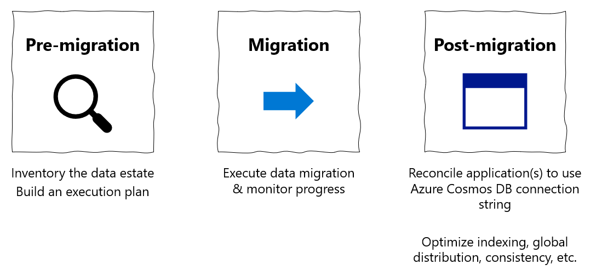
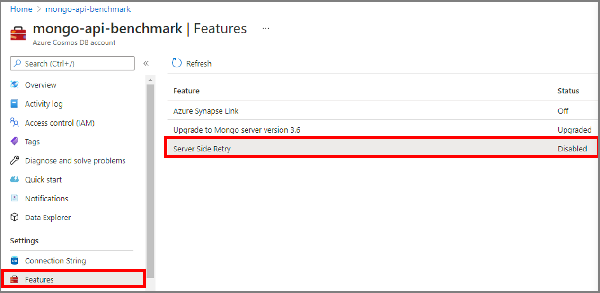
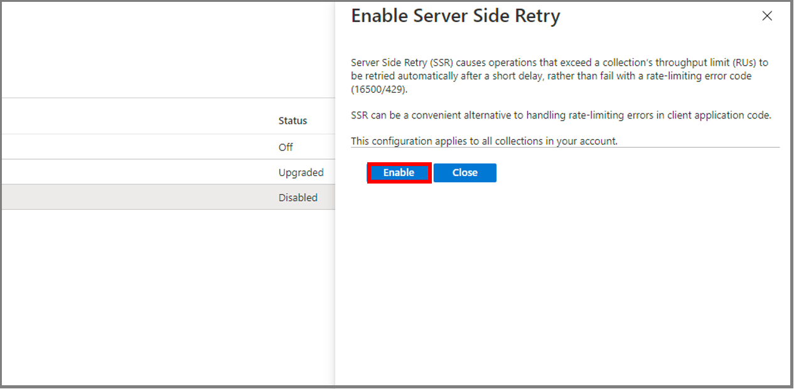
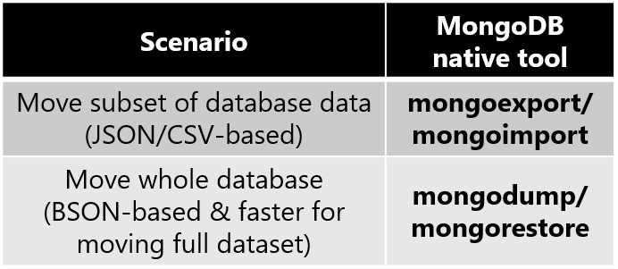
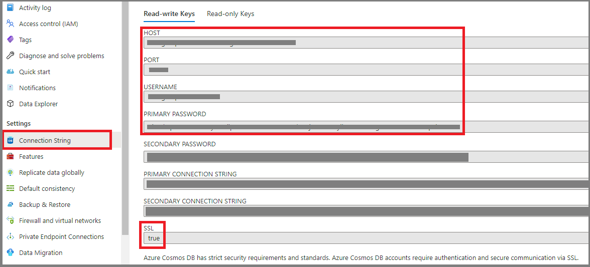
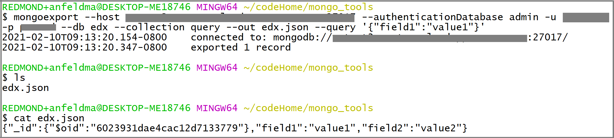
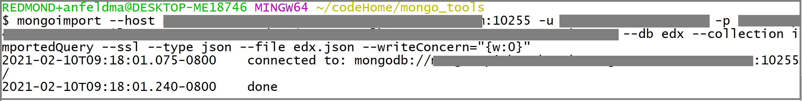
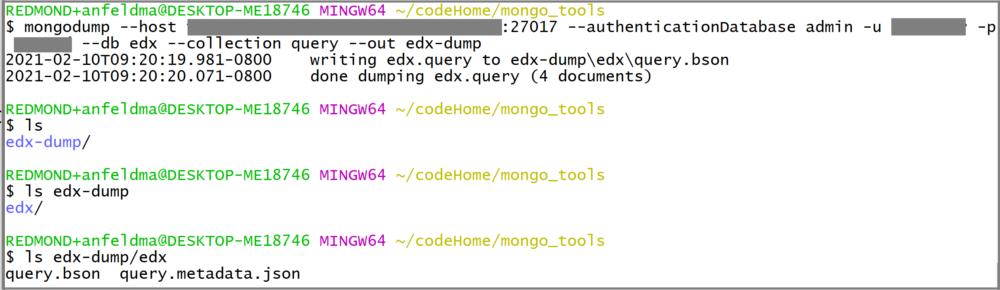
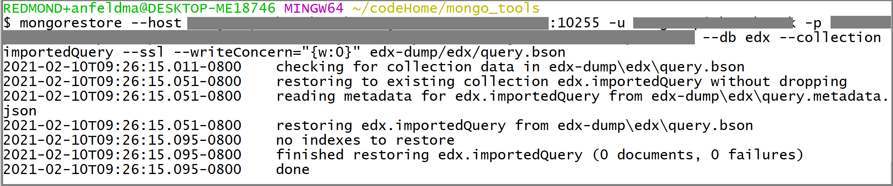

# Tutorial: Migrate MongoDB to Azure Cosmos DB's API for MongoDB offline using MongoDB native tools
[!INCLUDE[MongoDB](../includes/appliesto-mongodb.md)]

> [!IMPORTANT]  
> Please read this entire guide before carrying out your migration steps.
>

This MongoDB migration guide is part of series on MongoDB migration. The critical MongoDB migration steps are [pre-migration](pre-migration-steps.md), migration, and [post-migration](post-migration-optimization.md), as shown below.



## Overview of data migration using MongoDB native tools

You can use MongoDB native tools to perform an offline (one-time) migration of databases from an on-premises or cloud instance of MongoDB to Azure Cosmos DB's API for MongoDB.

In this tutorial, you learn how to:
> [!div class="checklist"]
>
> * Choose the appropriate MongoDB native tool for your use-case
> * Run the migration.
> * Monitor the migration.
> * Verify that migration was successful.

In this tutorial, you migrate a dataset in MongoDB hosted in an Azure Virtual Machine to Azure Cosmos DB's API for MongoDB by using MongoDB native tools. The MongoDB native tools are a set of binaries that facilitate data manipulation on an existing MongoDB instance. Since Azure Cosmos DB exposes an API for MongoDB, the MongoDB native tools are able to insert data into Azure Cosmos DB. The focus of this doc is on migrating data out of a MongoDB instance using *mongoexport/mongoimport* or *mongodump/mongorestore*. Since the native tools connect to MongoDB using connection strings, you can run the tools anywhere, however we recommend running these tools within the same network as the MongoDB instance to avoid firewall issues. 

The MongoDB native tools can move data only as fast as the host hardware allows; the native tools can be the simplest solution for small datasets where total migration time is not a concern. [MongoDB Spark connector](https://docs.mongodb.com/spark-connector/current/), [Azure Data Migration Service (DMS)](../../dms/tutorial-mongodb-cosmos-db.md), or [Azure Data Factory (ADF)](../../data-factory/connector-azure-cosmos-db-mongodb-api.md) can be better alternatives if you need a scalable migration pipeline.

If you don't have a MongoDB source set up already, see the article [Install and configure MongoDB on a Windows VM in Azure](/previous-versions/azure/virtual-machines/windows/install-mongodb).

## Prerequisites

To complete this tutorial, you need to:

* [Complete the pre-migration](pre-migration-steps.md) steps such as estimating throughput, choosing a partition key, and the indexing policy.
* [Create an Azure Cosmos DB for MongoDB account](https://portal.azure.com/#create/Microsoft.DocumentDB).
* Log into your MongoDB instance
    * [Download and install the MongoDB native tools from this link](https://www.mongodb.com/try/download/database-tools).
        * **Ensure that your MongoDB native tools version matches your existing MongoDB instance.**
        * If your MongoDB instance has a different version than Azure Cosmos DB for MongoDB, then **install both MongoDB native tool versions and use the appropriate tool version for MongoDB and Azure Cosmos DB for MongoDB, respectively.**
    * Add a user with `readWrite` permissions, unless one already exists. Later in this tutorial, provide this username/password to the *mongoexport* and *mongodump* tools.

## Configure Azure Cosmos DB Server Side Retries

Customers migrating from MongoDB to Azure Cosmos DB benefit from resource governance capabilities, which guarantee the ability to fully utilize your provisioned RU/s of throughput. Azure Cosmos DB may throttle a given request in the course of migration if that request exceeds the container provisioned RU/s; then that request needs to be retried. The round-trip time involved in the network hop between the migration tool and Azure Cosmos DB impacts the overall response time of that request; furthermore MongoDB native tools may not handle retries. The *Server Side Retry* feature of Azure Cosmos DB allows the service to intercept throttle error codes and retry with much lower round-trip time, dramatically improving request response times. From the perspective of MongoDB native tools, the need to handle retries is minimized, which will positively impact your experience during migration.

You can find the Server Side Retry capability in the *Features* blade of the Azure Cosmos DB portal



And if it is *Disabled*, then we recommend you enable it as shown below



## Choose the proper MongoDB native tool



* *mongoexport/mongoimport* is the best pair of migration tools for migrating a subset of your MongoDB database.
    * *mongoexport* exports your existing data to a human-readable JSON or CSV file. *mongoexport* takes an argument specifying the subset of your existing data to export. 
    * *mongoimport* opens a JSON or CSV file and inserts the content into the target database instance (Azure Cosmos DB in this case.). 
    * Note that JSON and CSV are not a compact formats; you may incur excess network charges as *mongoimport* sends data to Azure Cosmos DB.
* *mongodump/mongorestore* is the best pair of migration tools for migrating your entire MongoDB database. The compact BSON format will make more efficient use of network resources as the data is inserted into Azure Cosmos DB.
    * *mongodump* exports your existing data as a BSON file.
    * *mongorestore* imports your BSON file dump into Azure Cosmos DB.
* As an aside - if you simply have a small JSON file that you want to import into Azure Cosmos DB for MongoDB, the *mongoimport* tool is a quick solution for ingesting the data.

## Collect the Azure Cosmos DB for MongoDB credentials

Azure Cosmos DB for MongoDB provides compatible access credentials which MongoDB native tools can utilize. You will need to have these access credentials on-hand in order to migrate data into Azure Cosmos DB for MongoDB. To find these credentials:

1. Open the Azure portal
1. Navigate to your Azure Cosmos DB for MongoDB account
1. In the left nav, select the *Connection String* blade, and you should see a display similar to the below:

    

    * *HOST* - the Azure Cosmos DB endpoint functions as a MongoDB hostname
    * *PORT* - when MongoDB native tools connect to Azure Cosmos DB, you must specify this port explicitly
    * *USERNAME* - the prefix of the Azure Cosmos DB endpoint domain name functions as the MongoDB username
    * *PASSWORD* - the Azure Cosmos DB master key functions as the MongoDB password
    * Additionally, note the *SSL* field which is `true` - the MongoDB native tool **must** enable SSL when writing data into Azure Cosmos DB

## Perform the migration

1. Choose which database(s) and collection(s) you would like to migrate. In this example, we are migrating the *query* collection in the *edx* database from MongoDB to Azure Cosmos DB.

The rest of this section will guide you through using the pair of tools you selected in the previous section.

### *mongoexport/mongoimport*

1. To export the data from the source MongoDB instance, open a terminal on the MongoDB instance machine. If it is a Linux machine, type

    ```bash
    mongoexport --host HOST:PORT --authenticationDatabase admin -u USERNAME -p PASSWORD --db edx --collection query --out edx.json
    ```

    On windows, the executable will be `mongoexport.exe`. *HOST*, *PORT*, *USERNAME*, and *PASSWORD* should be filled in based on the properties of your existing MongoDB database instance. 
    
    You may also choose to export only a subset of the MongoDB dataset. One way to do this is by adding an additional filter argument:
    
    ```bash
    mongoexport --host HOST:PORT --authenticationDatabase admin -u USERNAME -p PASSWORD --db edx --collection query --out edx.json --query '{"field1":"value1"}'
    ```

    Only documents which match the filter `{"field1":"value1"}` will be exported.

    Once you execute the call, you should see that an `edx.json` file is produced:

    
1. You can use the same terminal to import `edx.json` into Azure Cosmos DB. If you are running `mongoimport` on a Linux machine, type

    ```bash
    mongoimport --host HOST:PORT -u USERNAME -p PASSWORD --db edx --collection importedQuery --ssl --type json --writeConcern="{w:0}" --file edx.json
    ```

    On Windows, the executable will be `mongoimport.exe`. *HOST*, *PORT*, *USERNAME*, and *PASSWORD* should be filled in based on the Azure Cosmos DB credentials you collected earlier. 
1. **Monitor** the terminal output from *mongoimport*. You should see that it prints lines of text to the terminal containing updates on the migration status:

        

1. Finally, examine Azure Cosmos DB to **validate** that migration was successful. Open the Azure Cosmos DB portal and navigate to Data Explorer. You should see (1) that an *edx* database with an *importedQuery* collection has been created, and (2) if you exported only a subset of data, *importedQuery* should contain *only* docs matching the desired subset of the data. In the example below, only one doc matched the filter `{"field1":"value1"}`:

        

### *mongodump/mongorestore*

1. To create a BSON data dump of your MongoDB instance, open a terminal on the MongoDB instance machine. If it is a Linux machine, type

    ```bash
    mongodump --host HOST:PORT --authenticationDatabase admin -u USERNAME -p PASSWORD --db edx --collection query --ssl --out edx-dump
    ```

    *HOST*, *PORT*, *USERNAME*, and *PASSWORD* should be filled in based on the properties of your existing MongoDB database instance. You should see that an `edx-dump` directory is produced and that the directory structure of `edx-dump` reproduces the resource hierarchy (database and collection structure) of your source MongoDB instance. Each collection is represented by a BSON file:

    
1. You can use the same terminal to restore the contents of `edx-dump` into Azure Cosmos DB. If you are running `mongorestore` on a Linux machine, type

    ```bash
    mongorestore --host HOST:PORT --authenticationDatabase admin -u USERNAME -p PASSWORD --db edx --collection importedQuery --writeConcern="{w:0}" --ssl edx-dump/edx/query.bson
    ```

    On Windows, the executable will be `mongorestore.exe`. *HOST*, *PORT*, *USERNAME*, and *PASSWORD* should be filled in based on the Azure Cosmos DB credentials you collected earlier. 
1. **Monitor** the terminal output from *mongorestore*. You should see that it prints lines to the terminal updating on the migration status:

        

1. Finally, examine Azure Cosmos DB to **validate** that migration was successful. Open the Azure Cosmos DB portal and navigate to Data Explorer. You should see (1) that an *edx* database with an *importedQuery* collection has been created, and (2) *importedQuery* should contain the *entire* dataset from the source collection:

        

## Post-migration optimization

After you migrate the data stored in MongoDB database to Azure Cosmos DB’s API for MongoDB, you can connect to Azure Cosmos DB and manage the data. You can also perform other post-migration optimization steps such as optimizing the indexing policy, update the default consistency level, or configure global distribution for your Azure Cosmos DB account. For more information, see the [Post-migration optimization](post-migration-optimization.md) article.

## Additional resources

* [Azure Cosmos DB service information](https://azure.microsoft.com/services/cosmos-db/)
* [MongoDB database tools documentation](https://docs.mongodb.com/database-tools/)
* Trying to do capacity planning for a migration to Azure Cosmos DB?
    * If all you know is the number of vcores and servers in your existing database cluster, read about [estimating request units using vCores or vCPUs](../convert-vcore-to-request-unit.md) 
    * If you know typical request rates for your current database workload, read about [estimating request units using Azure Cosmos DB capacity planner](estimate-ru-capacity-planner.md)

## Next steps

* Review  migration guidance for additional scenarios in the Microsoft [Database Migration Guide](/data-migration/).
