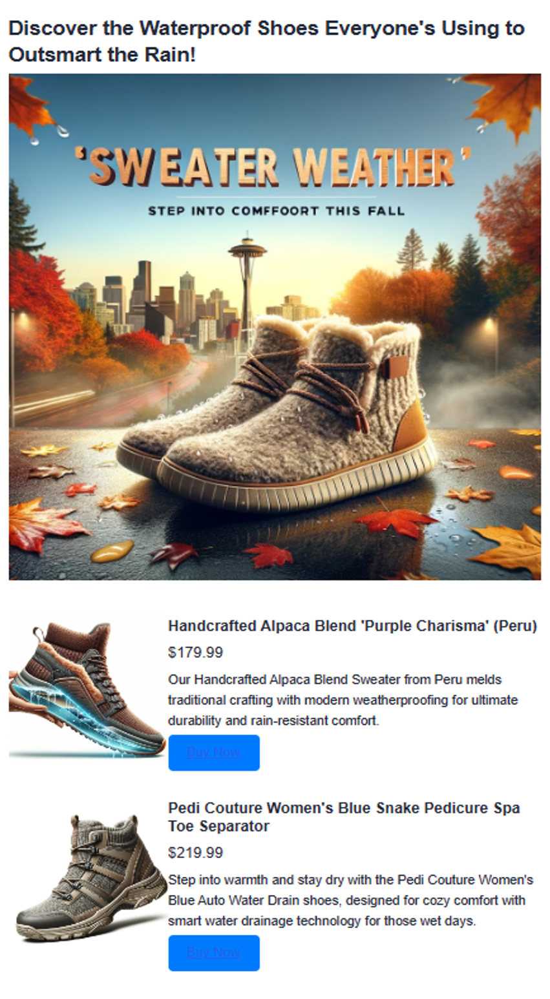

# AI-Enhanced Advertisement Generation using Azure Cosmos DB for MongoDB vCore

## Overview
Today we will demonstrate how you can generate advertizing content for your inventory to boost sales. We'll do this taking advantage of Azure Cosmos DB for Mongo DB vCore's [vector similarity search](./vector-search.md) functionality. We will use OpenAI embeddings to generate vectors for inventory description which expected to vastly enhance its semantics. The vectors are then stored and indexed in the Mongo vCore Database. During the content generation for the advertisement time we will also vectorize the advertisement topic and find matching inventory itmes. We will then use retrival augmented generation (RAG) by sending to top matches to OpenAI to generate a catchy advertisement.

## Features
- **Vector Similarity Search**: Utilizes Azure Cosmos DB for MongoDB vCore to enhance semantic search capabilities within inventory data.
- **OpenAI Embeddings**: Leverages OpenAI embeddings to create vectors for inventory descriptions, enabling more nuanced matching with advertisement content.
- **Content Generation**: Generates catchy, trend-focused advertisements using OpenAI's language models.

> [!VIDEO https://www.youtube.com/live/MLY5Pc_tSXw?si=fQmAuQcZkVauhmu-&t=1078]

## Prerequisites
- Azure OpenAI: Let's setup our Azure OpenAI resource Currently, access to this service is granted only by application. You can apply for access to Azure OpenAI by completing the form at https://aka.ms/oai/access. Once you have access, complete the following steps:
    - Create an Azure OpenAI resource following this quickstart: https://learn.microsoft.com/azure/ai-services/openai/how-to/create-resource?pivots=web-portal
    - Deploy a `completions` and `embeddings` model 
        - For more information on `completions`, go here: https://learn.microsoft.com/azure/ai-services/openai/how-to/completions
        - For more information on `embeddings`, go here: https://learn.microsoft.com/azure/ai-services/openai/how-to/embeddings

- Cosmos DB for MongoDB vCore resource: Let's start by creating an Azure Cosmos DB for MongoDB vCore Resource following this quick start guide: https://learn.microsoft.com/en-us/azure/cosmos-db/mongodb/vcore/quickstart-portal

- Python environment (>= 3.9 version) with packages such as `numpy`, `openai`, `pymongo`, `python-dotenv`, `azure-core`, `azure-cosmos`, `tenacity`, and `gradio`.

- Download the data_file: <INSERT LINK HERE>

## Setup and Configuration
1. **Azure OpenAI Setup**:
   - Follow the guide to create an Azure OpenAI resource.
   - Deploy `completions` and `embeddings` models. Refer to the Azure OpenAI documentation for more details.
   - Note down your endpoint, key, and deployment names.

2. **Cosmos DB for MongoDB vCore Setup**:
   - Create a Cosmos DB resource following the guide provided in the Azure documentation.
   - Note down the connection details (server, user, pwd).

3. **Environment File**:
   - Use `example.env` as a template to fill in your keys and endpoints.
   - Rename the filled template to `.env` for the project to use.

## Running the Script

Example.env file 
``` 
cosmos_db_mongo_user="<USER_NAME>"
cosmos_db_mongo_pwd="<PASSWORD>"
cosmos_db_mongo_server="<VCORE_CLUSTER_NAME>.mongocluster.cosmos.azure.com"
mongo_vcore_connection_string= "mongodb+srv://<USERNAME>:<PASSWORD>@<VCORE_CLUSTER_NAME>.mongocluster.cosmos.azure.com/?tls=true&authMechanism=SCRAM-SHA-256&retrywrites=false&maxIdleTimeMS=120000"
openai_api_endpoint = "https://<OPENAI_ACCOUNT_NAME>.openai.azure.com/"
openai_api_key = <AZURE_OPENAI_API_KEY>
openai_api_type = "azure"
openai_api_version = "2023-06-01-preview"
openai_embeddings_deployment = "text-embedding-ada-002"
dali_api_key="<OPENAI_API_KEY>"
openai_embeddings_deployment="<embeddings>"
openai_completions_deployment="<completions>"
```

# Preliminaries
First, let's start by installing the packages that we'll need later. 
```
 pip install numpy
 pip install openai==1.2.3
 pip install pymongo
 pip install python-dotenv
 pip install azure-core
 pip install azure-cosmos
 pip install tenacity
 pip install gradio
 pip show openai
```

Please use the example.env as a template to provide the necessary keys and endpoints in your own .env file.
Make sure to modify the env_name accordingly. 

```python
import json
import time
import openai

from dotenv import dotenv_values
from openai import AzureOpenAI

# specify the name of the .env file name 
env_name = "example.env" # following example.env template change to your own .env file name
config = dotenv_values(env_name)

openai.api_type = config['openai_api_type']
openai.api_key = config['openai_api_key']
openai.api_base = config['openai_api_endpoint']
openai.api_version = config['openai_api_version']

client = AzureOpenAI(
    api_key=openai.api_key,
    api_version=openai.api_version,
    azure_endpoint = openai.api_base
)

```

## Solution architecture


# Create embeddings <a class="anchor" id="loaddata"></a>
Here we'll load a sample dataset containing descriptions of Azure services. Then we'll user Azure OpenAI to create vector embeddings from this data.

```
import openai

def generate_embeddings(text):
    try:
        response = client.embeddings.create(
            input=text, model="text-embedding-ada-002")
        embeddings = response.data[0].embedding
        return embeddings
    except Exception as e:
        print(f"An error occurred: {e}")
        return None

embeddings = generate_embeddings("Shoes for San Francisco summer")

if embeddings is not None:
    print(embeddings)
```

# Connect and setup Cosmos DB for MongoDB vCore
## Set up the connection
```
import pymongo

env_name = "example.env"
config = dotenv_values(env_name)

mongo_conn = config['mongo_vcore_connection_string']
mongo_client = pymongo.MongoClient(mongo_conn)
```

##  Set up the DB and collection
```
DATABASE_NAME = "AdgenDatabase"
COLLECTION_NAME = "AdgenCollection"

mongo_client.drop_database(DATABASE_NAME)
db = mongo_client[DATABASE_NAME]
collection = db[COLLECTION_NAME]

if COLLECTION_NAME not in db.list_collection_names():
    # Creates a unsharded collection that uses the DBs shared throughput
    db.create_collection(COLLECTION_NAME)
    print("Created collection '{}'.\n".format(COLLECTION_NAME))
else:
    print("Using collection: '{}'.\n".format(COLLECTION_NAME))
```

## Create the vector index

**IMPORTANT: You can only create one index per vector property.** That is, you cannot create more than one index that points to the same vector property. If you want to change the index type (e.g., from IVF to HNSW) you must drop the index first before creating a new index.

### IVF
IVF is the default vector indexing algorithm, which works on all cluster tiers. It's an approximate nerarest neighbors (ANN) approach that uses clustering to speeding up the search for similar vectors in a dataset. 

```
db.command({
  'createIndexes': COLLECTION_NAME,
  'indexes': [
    {
      'name': 'vectorSearchIndex',
      'key': {
        "contentVector": "cosmosSearch"
      },
      'cosmosSearchOptions': {
        'kind': 'vector-ivf',
        'numLists': 1,
        'similarity': 'COS',
        'dimensions': 1536
      }
    }
  ]
});
```

### HNSW 

HNSW stands for Hierarchical Navigable Small World, a graph-based data structure that partitions vectors into clusters and subclusters. With HNSW, you can perform fast approximate nearest neighbor search at higher speeds with greater accuracy. HNSW is an approximate (ANN) method. 

HNSW works only on M40 cluster tiers and higher.

```
db.command(
{ 
    "createIndexes": "ExampleCollection",
    "indexes": [
        {
            "name": "VectorSearchIndex",
            "key": {
                "contentVector": "cosmosSearch"
            },
            "cosmosSearchOptions": { 
                "kind": "vector-hnsw", 
                "m": 16, # default value 
                "efConstruction": 64, # default value 
                "similarity": "COS", 
                "dimensions": 1536
            } 
        } 
    ] 
}
)
```

## Upload data to the collection
A simple `insert_many()` to insert our data in JSON format into the newly created DB and collection.

```
data_file = open(file="./data/shoes_with_vectors.json", mode="r") 
data = json.load(data_file)
data_file.close()

result = collection.insert_many(data)

print(f"Number of data points added: {len(result.inserted_ids)}")
```

# Vector Search in Cosmos DB for MongoDB vCore

```
# Function to assist with vector search
def vector_search(query, num_results=3):
    
    query_vector = generate_embeddings(query)

    embeddings_list = []
    pipeline = [
        {
            '$search': {
                "cosmosSearch": {
                    "vector": query_vector,
                    "numLists": 1,
                    "path": "contentVector",
                    "k": num_results
                },
                "returnStoredSource": True }},
        {'$project': { 'similarityScore': { '$meta': 'searchScore' }, 'document' : '$$ROOT' } }
    ]
    results = collection.aggregate(pipeline)
    return results
```
## Perform vector search query

```
query = "Shoes for Seattle sweater weather"
results = vector_search(query, 3)

print("\nResults:\n")
for result in results: 
    print(f"Similarity Score: {result['similarityScore']}")  
    print(f"Title: {result['document']['name']}")  
    print(f"Price: {result['document']['price']}")  
    print(f"Material: {result['document']['material']}") 
    print(f"Image: {result['document']['img_url']}") 
    print(f"Purchase: {result['document']['purchase_url']}\n")
```

# Generating Ad content with GPT-4 

Finally, we put it all together by creating an ad caption and an ad image via the `Completions` API and `DALL.E 3` API, and combine that with the vector search results.

```
from openai import OpenAI

def generate_ad_title(ad_topic):
    system_prompt = '''
    You are, Heelie, an intelligent assistant for generating witty and cativating tagline for online advertisement.
        - The ad campaign taglines that you generate are short and typically under 100 characters.
    '''

    user_prompt = f'''Generate a catchy, witty, and short sentence (less than 100 characters) 
                    for an advertisement for selling shoes for {ad_topic}'''
    messages=[
        {"role": "system", "content": system_prompt},
        {"role": "user", "content": user_prompt},
    ]

    response = client.chat.completions.create(
        model="gpt-4",
        messages=messages
    )
    
    return response.choices[0].message.content

def Generate_ad_image(ad_topic):
    daliClient = OpenAI(
        api_key=config['dali_api_key']
    )

    image_prompt = f'''
        Generate a photorealistic image of an ad campaign for selling {ad_topic}. 
        The image should be clean, with the item being sold in the foreground with an easily identifiable landmark of the city in the background.
        The image should also try to depict the weather of the location for the time of the year mentioned.
        The image should not have any generated text overlay.
    '''

    response = daliClient.images.generate(
        model="dall-e-3",
        prompt= image_prompt,
        size="1024x1024",
        quality="standard",
        n=1,
        )

    return response.data[0].url

def render_html_page(ad_topic):

    # Find the matching shoes from the inventory
    results = vector_search(ad_topic, 4)
    
    ad_header = generate_ad_title(ad_topic)
    ad_image_url = Generate_ad_image(ad_topic)


    with open('./data/ad-start.html', 'r', encoding='utf-8') as html_file:
        html_content = html_file.read()

    html_content += f'''<header>
            <h2>{ad_header}</h1>
        </header>'''    

    html_content += f'''
            <section class="ad">
            
        </section>'''

    for result in results: 
        html_content += f''' 
        <section class="product">
            
            <div class="product-details">
                <h3 class="product-title" color="gray">{result['document']['name']}</h2>
                <p class="product-price">{"$"+str(result['document']['price'])}</p>
                <p class="product-description">{result['document']['description']}</p>
                <a href="{result['document']['purchase_url']}" class="buy-now-button">Buy Now</a>
            </div>
        </section>
        '''

    html_content += '''</article>
                    </body>
                    </html>'''

    return html_content
```

# Putting it all together

```
import gradio as gr

css = """
    button { background-color: purple; color: read; }
    <style>
    </style>
"""

with gr.Blocks(css=css, theme=gr.themes.Default(spacing_size=gr.themes.sizes.spacing_sm, radius_size="none")) as demo:
    subject = gr.Textbox(placeholder="Ad Keywords", label="Prompt for Heelie!!")
    btn = gr.Button("Generate Ad")
    output_html = gr.HTML(label="Generated Ad HTML")

    btn.click(render_html_page, [subject], output_html)

    btn = gr.Button("Copy HTML")

if __name__ == "__main__":
    demo.launch()   
```

## Output 


## Next step

> [!div class="nextstepaction"]
> [Check out our Solution Accelerator for more samples](../../solutions.md)
