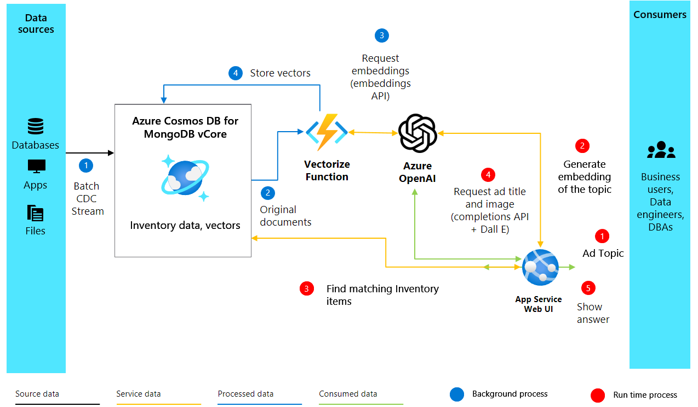

# AI-Enhanced Advertisement Generation using Azure Cosmos DB for MongoDB vCore
In this guide, we demonstrate how to create dynamic advertising content that resonates with your audience, using our personalized AI assistant, Heelie. Utilizing Azure Cosmos DB for MongoDB vCore, we harness the [vector similarity search](./vector-search.md) functionality to semantically analyze and match inventory descriptions with advertisement topics. The process is made possible by generating vectors for inventory descriptions using OpenAI embeddings, which significantly enhance their semantic depth. These vectors are then stored and indexed within the Cosmos DB for MongoDB vCore resource. When generating content for advertisements, we vectorize the advertisement topic to find the best-matching inventory items. This is followed by a retrieval augmented generation (RAG) process, where the top matches are sent to OpenAI to craft a compelling advertisement. The entire codebase for the application is available in a [GitHub repository](https://aka.ms/adgen) for your reference.

## Features
- **Vector Similarity Search**: Uses Azure Cosmos DB for MongoDB vCore's powerful vector similarity search to improve semantic search capabilities, making it easier to find relevant inventory items based on the content of advertisements.
- **OpenAI Embeddings**: Utilizes the cutting-edge embeddings from OpenAI to generate vectors for inventory descriptions. This approach allows for more nuanced and semantically rich matches between the inventory and the advertisement content.
- **Content Generation**: Employs OpenAI's advanced language models to generate engaging, trend-focused advertisements. This method ensures that the content is not only relevant but also captivating to the target audience.

<!-- > [!VIDEO https://www.youtube.com/live/MLY5Pc_tSXw?si=fQmAuQcZkVauhmu-&t=1078] -->

## Prerequisites
- Azure OpenAI: Let's setup the Azure OpenAI resource. Access to this service is currently available by application only. You can apply for access to Azure OpenAI by completing the form at https://aka.ms/oai/access. Once you have access, complete the following steps:
    - Create an Azure OpenAI resource following this [quickstart](../../../ai-services/openai/how-to/create-resource.md?pivots=web-portal).
    - Deploy a `completions` and an `embeddings` model 
        - For more information on `completions`, go [here](../../../ai-services/openai/how-to/completions.md).
        - For more information on `embeddings`, go [here](../../../ai-services/openai/how-to/embeddings.md).
    - Note down your endpoint, key, and deployment names.

- Cosmos DB for MongoDB vCore resource: Let's start by creating an Azure Cosmos DB for MongoDB vCore resource for free following this [quick start](./quickstart-portal.md) guide.
    - Note down the connection details (connection string).

- Python environment (>= 3.9 version) with packages such as `numpy`, `openai`, `pymongo`, `python-dotenv`, `azure-core`, `azure-cosmos`, `tenacity`, and `gradio`.

- Download the [data file](https://github.com/jayanta-mondal/ignite-demo/blob/main/data/shoes_with_vectors.json) and save it in a designated data folder.

## Running the Script
Before we dive into the exciting part of generating AI-enhanced advertisements, we need to set up our environment. This setup involves installing the necessary packages to ensure our script runs smoothly. Here’s a step-by-step guide to get everything ready.

### 1.1 Install Necessary Packages

Firstly, we need to install a few Python packages. Open your terminal and run the following commands:

```bash
 pip install numpy
 pip install openai==1.2.3
 pip install pymongo
 pip install python-dotenv
 pip install azure-core
 pip install azure-cosmos
 pip install tenacity
 pip install gradio
 pip show openai
```

### 1.2 Setting Up the OpenAI and Azure Client
After installing the necessary packages, the next step involves setting up our OpenAI and Azure clients for the script, which is crucial for authenticating our requests to the OpenAI API and Azure services. 

```python
import json
import time
import openai

from dotenv import dotenv_values
from openai import AzureOpenAI

# Configure the API to use Azure as the provider
openai.api_type = "azure"
openai.api_key = "<AZURE_OPENAI_API_KEY>"  # Replace with your actual Azure OpenAI API key
openai.api_base = "https://<OPENAI_ACCOUNT_NAME>.openai.azure.com/"  # Replace with your OpenAI account name
openai.api_version = "2023-06-01-preview"

# Initialize the AzureOpenAI client with your API key, version, and endpoint
client = AzureOpenAI(
    api_key=openai.api_key,
    api_version=openai.api_version,
    azure_endpoint=openai.api_base
)
```

## Solution architecture


## 2. Creating Embeddings and Setting up Cosmos DB

After setting up our environment and OpenAI client, we move to the core part of our AI-enhanced advertisement generation project. The following code creates vector embeddings from text descriptions of products and sets up our database in Azure Cosmos DB for MongoDB vCore to store and search these embeddings.

### 2.1 Create Embeddings

To generate compelling advertisements, we first need to understand the items in our inventory. We do this by creating vector embeddings from descriptions of our items, which allows us to capture their semantic meaning in a form that machines can understand and process. Here's how you can create vector embeddings for an item description using Azure OpenAI:

```python
import openai

def generate_embeddings(text):
    try:
        response = client.embeddings.create(
            input=text, model="text-embedding-ada-002")
        embeddings = response.data[0].embedding
        return embeddings
    except Exception as e:
        print(f"An error occurred: {e}")
        return None

embeddings = generate_embeddings("Shoes for San Francisco summer")

if embeddings is not None:
    print(embeddings)
```

The function takes a text input — like a product description — and uses the `client.embeddings.create` method from the OpenAI API to generate a vector embedding for that text. We're using the `text-embedding-ada-002` model here, but you can choose other models based on your requirements. If the process is successful, it prints the generated embeddings; otherwise, it handles exceptions by printing an error message.

## 3. Connect and set up Cosmos DB for MongoDB vCore
With our embeddings ready, the next step is to store and index them in a database that supports vector similarity search. Azure Cosmos DB for MongoDB vCore is a perfect fit for this task because it's purpose built to store your transactional data and perform vector search all in one place. 

### 3.1 Set up the connection
To connect to Cosmos DB, we use the pymongo library, which allows us to interact with MongoDB easily. The following code snippet establishes a connection with our Cosmos DB for MongoDB vCore instance:
```python
import pymongo

# Replace <USERNAME>, <PASSWORD>, and <VCORE_CLUSTER_NAME> with your actual credentials and cluster name
mongo_conn = "mongodb+srv://<USERNAME>:<PASSWORD>@<VCORE_CLUSTER_NAME>.mongocluster.cosmos.azure.com/?tls=true&authMechanism=SCRAM-SHA-256&retrywrites=false&maxIdleTimeMS=120000"
mongo_client = pymongo.MongoClient(mongo_conn)
```

Replace `<USERNAME>`, `<PASSWORD>`, and `<VCORE_CLUSTER_NAME>` with your actual MongoDB username, password, and vCore cluster name, respectively.

## 4. Setting Up the Database and Vector Index in Cosmos DB

Once you've established a connection to Azure Cosmos DB, the next steps involve setting up your database and collection, and then creating a vector index to enable efficient vector similarity searches. Let's walk through these steps.

### 4.1 Set Up the Database and Collection

First, we create a database and a collection within our Cosmos DB instance. Here’s how:
```python
DATABASE_NAME = "AdgenDatabase"
COLLECTION_NAME = "AdgenCollection"

mongo_client.drop_database(DATABASE_NAME)
db = mongo_client[DATABASE_NAME]
collection = db[COLLECTION_NAME]

if COLLECTION_NAME not in db.list_collection_names():
    # Creates a unsharded collection that uses the DBs shared throughput
    db.create_collection(COLLECTION_NAME)
    print("Created collection '{}'.\n".format(COLLECTION_NAME))
else:
    print("Using collection: '{}'.\n".format(COLLECTION_NAME))
```

### 4.2 Create the vector index
To perform efficient vector similarity searches within our collection, we need to create a vector index. Cosmos DB supports different types of [vector indexes](./vector-search.md), and here we discuss two: IVF and HNSW.

### IVF
IVF stands for Inverted File Index, is the default vector indexing algorithm, which works on all cluster tiers. It's an approximate nearest neighbors (ANN) approach that uses clustering to speeding up the search for similar vectors in a dataset. To create an IVF index, use the following command:

```javascript
db.command({
  'createIndexes': COLLECTION_NAME,
  'indexes': [
    {
      'name': 'vectorSearchIndex',
      'key': {
        "contentVector": "cosmosSearch"
      },
      'cosmosSearchOptions': {
        'kind': 'vector-ivf',
        'numLists': 1,
        'similarity': 'COS',
        'dimensions': 1536
      }
    }
  ]
});
```

> [!IMPORTANT] 
> **You can only create one index per vector property.** That is, you cannot create more than one index that points to the same vector property. If you want to change the index type (e.g., from IVF to HNSW) you must drop the index first before creating a new index.

### HNSW 

HNSW stands for Hierarchical Navigable Small World, a graph-based data structure that partitions vectors into clusters and subclusters. With HNSW, you can perform fast approximate nearest neighbor search at higher speeds with greater accuracy. HNSW is an approximate (ANN) method. Here's how to set it up:

```javascript
db.command(
{ 
    "createIndexes": "ExampleCollection",
    "indexes": [
        {
            "name": "VectorSearchIndex",
            "key": {
                "contentVector": "cosmosSearch"
            },
            "cosmosSearchOptions": { 
                "kind": "vector-hnsw", 
                "m": 16, # default value 
                "efConstruction": 64, # default value 
                "similarity": "COS", 
                "dimensions": 1536
            } 
        } 
    ] 
}
)
```
> [!NOTE]
> HNSW indexing is only available on M40 cluster tiers and higher. 

## 5. Insert data to the collection
Now insert the inventory data, which includes descriptions and their corresponding vector embeddings, into the newly created collection. To insert data into our collection, we use the `insert_many()` method provided by the `pymongo` library. The method allows us to insert multiple documents into the collection at once. Our data is stored in a JSON file, which we'll load and then insert into the database.

Download the [shoes_with_vectors.json](https://github.com/jayanta-mondal/ignite-demo/blob/main/data/shoes_with_vectors.json) file from the GitHub repository and store it in a `data` directory within your project folder.

```python
data_file = open(file="./data/shoes_with_vectors.json", mode="r") 
data = json.load(data_file)
data_file.close()

result = collection.insert_many(data)

print(f"Number of data points added: {len(result.inserted_ids)}")
```

## 6. Vector Search in Cosmos DB for MongoDB vCore
With our data successfully uploaded, we can now apply the power of vector search to find the most relevant items based on a query. The vector index we created earlier enables us to perform semantic searches within our dataset.

### 6.1 Conducting a Vector Search
To perform a vector search, we define a function `vector_search` that takes a query and the number of results to return. The function generates a vector for the query using the `generate_embeddings` function we defined earlier, then uses Cosmos DB's `$search` functionality to find the closest matching items based on their vector embeddings.

```python
# Function to assist with vector search
def vector_search(query, num_results=3):
    
    query_vector = generate_embeddings(query)

    embeddings_list = []
    pipeline = [
        {
            '$search': {
                "cosmosSearch": {
                    "vector": query_vector,
                    "numLists": 1,
                    "path": "contentVector",
                    "k": num_results
                },
                "returnStoredSource": True }},
        {'$project': { 'similarityScore': { '$meta': 'searchScore' }, 'document' : '$$ROOT' } }
    ]
    results = collection.aggregate(pipeline)
    return results
```
## 6.2 Perform vector search query
Finally, we execute our vector search function with a specific query and process the results to display them:

```python
query = "Shoes for Seattle sweater weather"
results = vector_search(query, 3)

print("\nResults:\n")
for result in results: 
    print(f"Similarity Score: {result['similarityScore']}")  
    print(f"Title: {result['document']['name']}")  
    print(f"Price: {result['document']['price']}")  
    print(f"Material: {result['document']['material']}") 
    print(f"Image: {result['document']['img_url']}") 
    print(f"Purchase: {result['document']['purchase_url']}\n")
```

## 7. Generating Ad content with GPT-4 and DALL.E

We combine all developed components to craft compelling ads, employing OpenAI's GPT-4 for text and DALL·E 3 for images. Together with vector search results, they form a complete ad. We also introduce Heelie, our intelligent assistant, tasked with creating engaging ad taglines. Through the upcoming code, you see Heelie in action, enhancing our ad creation process.

```python
from openai import OpenAI

def generate_ad_title(ad_topic):
    system_prompt = '''
    You are Heelie, an intelligent assistant for generating witty and cativating tagline for online advertisement.
        - The ad campaign taglines that you generate are short and typically under 100 characters.
    '''

    user_prompt = f'''Generate a catchy, witty, and short sentence (less than 100 characters) 
                    for an advertisement for selling shoes for {ad_topic}'''
    messages=[
        {"role": "system", "content": system_prompt},
        {"role": "user", "content": user_prompt},
    ]

    response = client.chat.completions.create(
        model="gpt-4",
        messages=messages
    )
    
    return response.choices[0].message.content

def generate_ad_image(ad_topic):
    daliClient = OpenAI(
        api_key="<DALI_API_KEY>"
    )

    image_prompt = f'''
        Generate a photorealistic image of an ad campaign for selling {ad_topic}. 
        The image should be clean, with the item being sold in the foreground with an easily identifiable landmark of the city in the background.
        The image should also try to depict the weather of the location for the time of the year mentioned.
        The image should not have any generated text overlay.
    '''

    response = daliClient.images.generate(
        model="dall-e-3",
        prompt= image_prompt,
        size="1024x1024",
        quality="standard",
        n=1,
        )

    return response.data[0].url

def render_html_page(ad_topic):

    # Find the matching shoes from the inventory
    results = vector_search(ad_topic, 4)
    
    ad_header = generate_ad_title(ad_topic)
    ad_image_url = generate_ad_image(ad_topic)


    with open('./data/ad-start.html', 'r', encoding='utf-8') as html_file:
        html_content = html_file.read()

    html_content += f'''<header>
            <h1>{ad_header}</h1>
        </header>'''    

    html_content += f'''
            <section class="ad">
            
        </section>'''

    for result in results: 
        html_content += f''' 
        <section class="product">
            
            <div class="product-details">
                <h3 class="product-title" color="gray">{result['document']['name']}</h2>
                <p class="product-price">{"$"+str(result['document']['price'])}</p>
                <p class="product-description">{result['document']['description']}</p>
                <a href="{result['document']['purchase_url']}" class="buy-now-button">Buy Now</a>
            </div>
        </section>
        '''

    html_content += '''</article>
                    </body>
                    </html>'''

    return html_content
```

## 8. Putting it all together
To make our advertisement generation interactive, we employ Gradio, a Python library for creating simple web UIs. We define a UI that allows users to input ad topics and then dynamically generates and displays the resulting advertisement.

```python
import gradio as gr

css = """
    button { background-color: purple; color: red; }
    <style>
    </style>
"""

with gr.Blocks(css=css, theme=gr.themes.Default(spacing_size=gr.themes.sizes.spacing_sm, radius_size="none")) as demo:
    subject = gr.Textbox(placeholder="Ad Keywords", label="Prompt for Heelie!!")
    btn = gr.Button("Generate Ad")
    output_html = gr.HTML(label="Generated Ad HTML")

    btn.click(render_html_page, [subject], output_html)

    btn = gr.Button("Copy HTML")

if __name__ == "__main__":
    demo.launch()   
```

## Output 


## Next step

> [!div class="nextstepaction"]
> [Check out our Solution Accelerator for more samples](../../solutions.md)
