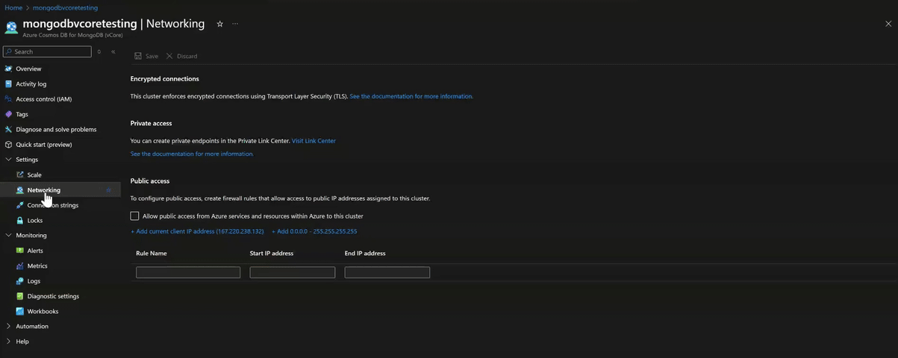
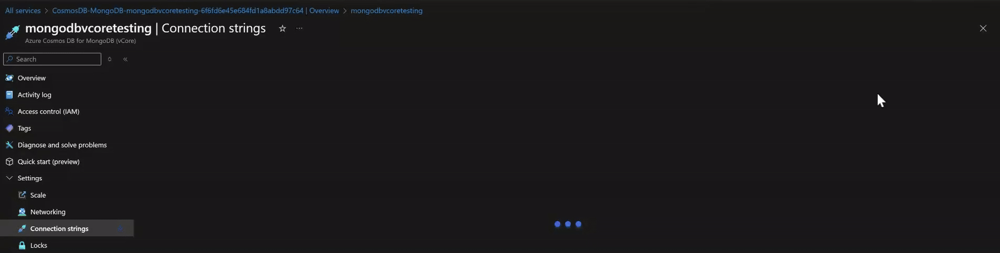
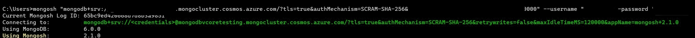

# Use MongoDB Shell (Mongosh) to connect to Azure Cosmos DB for MongoDB vCore

[!INCLUDE[MongoDB vCore](../../includes/appliesto-mongodb-vcore.md)]

MongoDB Shell (Mongosh), is a JavaScript and Node.js environment for interacting with MongoDB deployments. It's a popular community tool to test queries and interact with the data in your Azure Cosmos DB for MongoDB database.

## Prerequisites
Here are some prerequisites. 
- An existing Azure Cosmos DB for MongoDB vCore cluster.
- An installed version of the MongoShell from the community site.
- Ensure you're setting up the necessary environment variables post installation for your operating system
- Ensure the firewall settings to allow the machine to connect. Follow the guidelines for [configuring the firewall for Azure Cosmos DB](../../../cosmos-db/how-to-configure-firewall.md)
    - You can choose to allow requests from your current IP, requests from cloud services or requests from virtual machines - specific IP Ranges
    


If you accidentally open all the ports, you're warned before saving the changes.

## Connect using Mongo Shell (Mongosh)

To add your Azure Cosmos DB cluster to Mongo shell, perform the following steps:
1. Retrieve the connection information for your Azure Cosmos DB for MongoDB vCore using the instructions [here](quickstart-portal.md#get-cluster-credentials).


Once you have the connection string, you can either 
- Have the shell prompt you to enter the password or
- Provide the password as a part of the connection string 

2. Connect using Mongo Shell

**A. By entering the password in the MongoShell Prompt**


Your connection string would look like this:
    ```
    "mongodb+srv://<username>@<servername>.mongocluster.cosmos.azure.com/?tls=true&authMechanism=SCRAM-SHA-256&retrywrites=false&maxIdleTimeMS=120000"
    ```
Here's an example of how the command looks like: 
    ```
    mongosh "mongodb+srv://testuser@mongodbvcoretesting.mongocluster.cosmos.azure.com/?tls=true&authMechanism=SCRAM-SHA-256&retrywrites=false&maxIdleTimeMS=120000
    ```


Once you provide the password and are successfully authenticated, you notice some warning. It states *"This server or service appears to be an emulation of MongoDB"*. 
The warning can be ignored. It's the shell's way of notifying that you aren't connection to an emulation of MongoDB. When, it's an Azure as a platform as a service offering it's expected. 

**B. By providing the password as a part of the connection string**

Alternately you can also use a connection string with the password in which case the format looks something like this.
```
mongosh "mongodb+srv://<SERVERNAME>.mongocluster.cosmos.azure.com/?tls=true&authMechanism=SCRAM-SHA-256&retrywrites=false&maxIdleTimeMS=120000" --username "<USER>" -password "<PASSWORD>"
```

Here's an example of how the command looks like: 
```
 mongosh "mongodb+srv://mongodbvcoretesting.mongocluster.cosmos.azure.com/?tls=true&authMechanism=SCRAM-SHA-256&retrywrites=false&maxIdleTimeMS=120000" --username "testuser" -password "******"
```


## Next step

> [!div class="nextstepaction"]
> [Migration options](migration-options.md)
