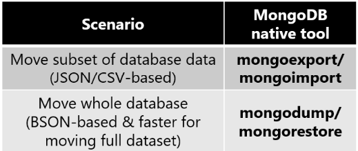

# Migrate MongoDB to Azure Cosmos DB for MongoDB vCore offline using MongoDB native tools
[!INCLUDE[MongoDB vCore](../../includes/appliesto-mongodb-vcore.md)]


You can use MongoDB native tools to perform an offline (one-time) migration of databases from an on-premises or cloud instance of MongoDB to Azure Cosmos DB for MongoDB vCore.

In this guide, you migrate a dataset in MongoDB hosted in an Azure Virtual Machine to Azure Cosmos DB for MongoDB vCore by using MongoDB native tools. The MongoDB native tools are a set of binaries that facilitate data manipulation on an existing MongoDB instance. The focus of this doc is on migrating data out of a MongoDB instance using *mongoexport/mongoimport* or *mongodump/mongorestore*. Since the native tools connect to MongoDB using connection strings, you can run the tools anywhere, however we recommend running these tools within the same network as the MongoDB instance to avoid firewall issues. 

The MongoDB native tools can move data only as fast as the host hardware allows; the native tools can be the simplest solution for small datasets where total migration time isn't a concern. [MongoDB Spark connector](https://docs.mongodb.com/spark-connector/current/), or [Azure Data Factory (ADF)](../../../data-factory/connector-azure-cosmos-db-mongodb-api.md) can be better alternatives if you need a scalable migration pipeline.


## Prerequisites

To complete this tutorial, you need to:

* [Complete the pre-migration](../pre-migration-steps.md) to create a list of incompatibilities and warnings, if any.
* [Create an Azure Cosmos DB for MongoDB vCore account](./quickstart-portal.md#create-a-cluster).
    * [Collect the Azure Cosmos DB for MongoDB vCore credentials](./quickstart-portal.md#get-cluster-credentials)
    * [Configure Firewall Settings on Azure Cosmos DB for MongoDB vCore](./security.md#network-security-options)
* Log in to your MongoDB instance    
    * **Ensure that your MongoDB native tools version matches your existing MongoDB instance.**
    * If your MongoDB instance has a different version than Azure Cosmos DB for MongoDB vCore, then **install both MongoDB native tool versions and use the appropriate tool version for MongoDB and Azure Cosmos DB for MongoDB vCore, respectively.**
    * Add a user with `readWrite` permissions, unless one already exists. Later in this tutorial, provide this username/password to the *mongoexport* and *mongodump* tools.
* [Download and install the MongoDB native tools from this link](https://www.mongodb.com/try/download/database-tools).

## Choose the proper MongoDB native tool



* *mongoexport/mongoimport* is the best pair of migration tools for migrating a subset of your MongoDB database.
    * *mongoexport* exports your existing data to a human-readable JSON or CSV file. *mongoexport* takes an argument specifying the subset of your existing data to export. 
    * *mongoimport* opens a JSON or CSV file and inserts the content into the target database instance (Azure Cosmos DB for MongoDB vCore in this case.). 
    * JSON and CSV aren't a compact format; you may incur excess network charges as *mongoimport* sends data to Azure Cosmos DB for MongoDB vCore.
* *mongodump/mongorestore* is the best pair of migration tools for migrating your entire MongoDB database. The compact BSON format makes more efficient use of network resources as the data is inserted into Azure Cosmos DB for MongoDB vCore.
    * *mongodump* exports your existing data as a BSON file.
    * *mongorestore* imports your BSON file dump into Azure Cosmos DB for MongoDB vCore.
* As an aside - if you simply have a small JSON file that you want to import into Azure Cosmos DB for MongoDB vCore, the *mongoimport* tool is a quick solution for ingesting the data.


## Perform the migration

Choose which database(s) and collection(s) you would like to migrate. In this example, we're migrating the *samples_friends* collection in the *Samples* database from MongoDB to Azure Cosmos DB for MongoDB vCore.

The rest of this section guides you through using the pair of tools you selected in the previous section.

### *mongoexport/mongoimport*

1. To export the data from the source MongoDB instance, open a terminal on the MongoDB instance machine. If it's a Linux machine, type

    ```bash
    mongoexport --host HOST:PORT --authenticationDatabase admin -u USERNAME -p PASSWORD --db Samples --collection samples_friends --out Samples.json
    ```

    On windows, the executable is `mongoexport.exe`. *HOST*, *PORT*, *USERNAME*, and *PASSWORD* should be filled in based on the properties of your existing MongoDB database instance. 
    
    You may also choose to export only a subset of the MongoDB dataset by adding an additional filter argument:
    
    ```bash
    mongoexport --host HOST:PORT --authenticationDatabase admin -u USERNAME -p PASSWORD --db Samples --collection samples_friends --out Samples.json --query '{"field1":"value1"}'
    ```

    Only documents that match the filter `{"field1":"value1"}` are exported.

    Once you execute the call, you should see that an `Samples.json` file is produced:


1. You can use the same terminal to import `Samples.json` into Azure Cosmos DB for MongoDB vCore. If you're running `mongoimport` on a Linux machine, type

    ```bash
    mongoimport --host HOST:PORT -u USERNAME -p PASSWORD --db Samples --collection importedQuery --ssl --type json --writeConcern="{w:0}" --file Samples.json
    ```

    On Windows, the executable is `mongoimport.exe`. *HOST*, *PORT*, *USERNAME*, and *PASSWORD* should be filled in based on the Azure Cosmos DB for MongoDB vCore credentials you collected earlier. 
1. **Monitor** the terminal output from *mongoimport*. You should see that it prints lines of text to the terminal containing updates on the import status:


### *mongodump/mongorestore*

1. To create a BSON data dump of your MongoDB instance, open a terminal on the MongoDB instance machine. If it's a Linux machine, type

    ```bash
    mongodump --host HOST:PORT --authenticationDatabase admin -u USERNAME -p PASSWORD --db Samples --collection samples_friends --out Samples-dump
    ```

    *HOST*, *PORT*, *USERNAME*, and *PASSWORD* should be filled in based on the properties of your existing MongoDB database instance. You should see that an `Samples-dump` directory is produced and that the directory structure of `Samples-dump` reproduces the resource hierarchy (database and collection structure) of your source MongoDB instance. Each collection is represented by a BSON file:

1. You can use the same terminal to restore the contents of `Samples-dump` into Azure Cosmos DB for MongoDB vCore. If you're running `mongorestore` on a Linux machine, type

    ```bash
    mongorestore --host HOST:PORT --authenticationDatabase admin -u USERNAME -p PASSWORD --db Samples --collection importedQuery --writeConcern="{w:0}" --ssl Samples-dump/Samples/samples_friends.bson
    ```

    On Windows, the executable is `mongorestore.exe`. *HOST*, *PORT*, *USERNAME*, and *PASSWORD* should be filled in based on the Azure Cosmos DB for MongoDB vCore credentials you collected earlier. 
1. **Monitor** the terminal output from *mongorestore*. You should see that it prints lines to the terminal updating on the migration status:


## Next steps

- Read more about [feature compatibility with MongoDB](compatibility.md).
- Get started by [creating an account](quickstart-portal.md).

