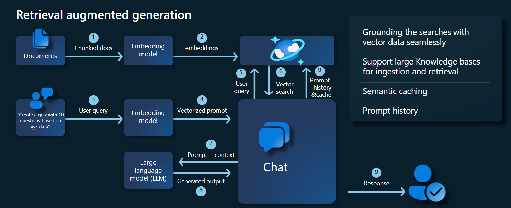

# RAG with vCore-based Azure Cosmos DB for MongoDB
In the fast-evolving realm of generative AI, Large Language Models (LLMs) like GPT-3.5 have transformed natural language processing. However, an emerging trend in AI is the use of vector stores, which play a pivotal role in enhancing AI applications. 

This tutorial explores how to use Azure Cosmos DB for MongoDB (vCore), LangChain, and OpenAI to implement Retrieval-Augmented Generation (RAG) for superior AI performance alongside discussing LLMs and their limitations. We explore the rapidly adopted paradigm of "retrieval-augmented generation" (RAG), and briefly discuss the LangChain framework, Azure OpenAI models. Finally, we integrate these concepts into a real-world application. By the end, readers will have a solid understanding of these concepts.

## Understand Large Language Models (LLMs) and their limitations

Large Language Models (LLMs) are advanced deep neural network models trained on extensive text datasets, enabling them to understand and generate human-like text. While revolutionary in natural language processing, LLMs have inherent limitations:

- **Hallucinations**: LLMs sometimes generate factually incorrect or ungrounded information, known as "hallucinations."
- **Stale Data**: LLMs are trained on static datasets that might not include the most recent information, limiting their current relevance.
- **No Access to User’s Local Data**: LLMs don't have direct access to personal or localized data, restricting their ability to provide personalized responses.
- **Token Limits**: LLMs have a maximum token limit per interaction, constraining the amount of text they can process at once. For example, OpenAI’s gpt-3.5-turbo has a token limit of 4096.

## Leverage Retrieval-Augmented Generation (RAG)

Retrieval-augmented generation (RAG) is an architecture designed to overcome LLM limitations. RAG uses vector search to retrieve relevant documents based on an input query, providing these documents as context to the LLM for generating more accurate responses. Instead of relying solely on pretrained patterns, RAG enhances responses by incorporating up-to-date, relevant information. This approach helps to:

- **Minimize Hallucinations**: Grounding responses in factual information.
- **Ensure Current Information**: Retrieving the most recent data to ensure up-to-date responses.
- **Utilize External Databases**: Though it doesn't grant direct access to personal data, RAG allows integration with external, user-specific knowledge bases.
- **Optimize Token Usage**: By focusing on the most relevant documents, RAG makes token usage more efficient.

This tutorial demonstrates how RAG can be implemented using Azure Cosmos DB for MongoDB (vCore) to build a question-answering application tailored to your data.

## Application architecture overview

The architecture diagram below illustrates the key components of our RAG implementation:



## Key components and frameworks 

We'll now discuss the various frameworks, models, and components used in this tutorial, emphasizing their roles and nuances.

### Azure Cosmos DB for MongoDB (vCore)

Azure Cosmos DB for MongoDB (vCore) supports semantic similarity searches, essential for AI-powered applications. It allows data in various formats to be represented as vector embeddings, which can be stored alongside source data and metadata. Using an approximate nearest neighbors algorithm, like Hierarchical navigable small world (HNSW), these embeddings can be queried for fast semantic similarity searches.

### LangChain framework

LangChain simplifies the creation of LLM applications by providing a standard interface for chains, multiple tool integrations, and end-to-end chains for common tasks. It enables AI developers to build LLM applications that leverage external data sources.

Key aspects of LangChain:

- **Chains**: Sequences of components solving specific tasks.
- **Components**: Modules like LLM wrappers, vector store wrappers, prompt templates, data loaders, text splitters, and retrievers.
- **Modularity**: Simplifies development, debugging, and maintenance.
- **Popularity**: An open-source project rapidly gaining adoption and evolving to meet user needs.

### Azure App Services interface

App services provide a robust platform for building user-friendly web interfaces for Gen-AI applications. This tutorial uses Azure App services to create an interactive web interface for the application.

### OpenAI models

OpenAI is a leader in AI research, providing various models for language generation, text vectorization, image creation, and audio-to-text conversion. For this tutorial, we'll use OpenAI’s embedding and language models, crucial for understanding and generating language-based applications.

### Embedding models vs. Language generation models

| **Category**              | **Text Embedding Model**      | **Language Model**                                                                                                            |
|---------------------------|----------------------------------------------------------------------------------------------------------------------|------------------------------------------------------------------------------------------------------------------------------|
| **Purpose**               | Converting text into vector embeddings.                                                                               | Understanding and generating natural language.                                                                                |
| **Function**              | Transforms textual data into high-dimensional arrays of numbers, capturing the semantic meaning of the text.          | Comprehends and produces human-like text based on given input.                                                                |
| **Output**                | Array of numbers (vector embeddings).                                                                                 | Text, answers, translations, code, etc.                                                                                       |
| **Example Output**        | Each embedding represents the semantic meaning of the text in numerical form, with a dimensionality determined by the model. For example, `text-embedding-ada-002` generates vectors with 1536 dimensions. | Contextually relevant and coherent text generated based on the input provided. For example, `gpt-3.5-turbo` can generate responses to questions, translate text, write code, and more. |
| **Typical Use Cases**     | - Semantic search                                                                                                     | - Chatbots                                                                                                                    |
|                           | - Recommendation systems                                                                                              | - Automated content creation                                                                                                  |
|                           | - Clustering and classification of text data                                                                          | - Language translation                                                                                                        |
|                           | - Information retrieval                                                                                               | - Summarization                                                                                                               |
| **Data Representation**   | Numerical representation (embeddings)                                                                                 | Natural language text                                                                                                         |
| **Dimensionality**        | The length of the array corresponds to the number of dimensions in the embedding space, for example, 1536 dimensions.        | Typically represented as a sequence of tokens, with the context determining the length.                                       |


### Main components of the application

- **Azure Cosmos DB for MongoDB vCore**: Storing and querying vector embeddings.
- **LangChain**: Constructing the application’s LLM workflow. Utilizes tools such as:
  - **Document Loader**: For loading and processing documents from a directory.
  - **Vector Store Integration**: For storing and querying vector embeddings in Azure Cosmos DB.
  - **AzureCosmosDBVectorSearch**: Wrapper around Cosmos DB Vector search
- **Azure App Services**: Building the user interface for Cosmic Food app. 
- **Azure OpenAI**: For providing LLM and embedding models, including:
  - **text-embedding-ada-002**: A text embedding model that converts text into vector embeddings with 1536 dimensions.
  - **gpt-3.5-turbo**: A language model for understanding and generating natural language.

### Set up the environment

To get started with optimizing retrieval-augmented generation (RAG) using Azure Cosmos DB for MongoDB (vCore), follow these steps:

- **Create the following resources on Microsoft Azure:**
    - **Azure Cosmos DB for MongoDB vCore cluster**: See the [Quick Start guide here](https://aka.ms/tryvcore).
    - **Azure OpenAI resource with:**
        - **Embedding model deployment** (for example, `text-embedding-ada-002`).
        - **Chat model deployment** (for example, `gpt-35-turbo`).

### Sample documents 
In this tutorial, we will be loading a single text file using [Document](https://python.langchain.com/v0.1/docs/modules/data_connection/document_loaders/). These files should be saved in a directory named **data** in the **src** folder. The contents of the are as follows: 
```food_items.json
    {
        "category": "Cold Dishes",
        "name": "Hamachi Fig",
        "description": "Hamachi sashimi lightly tossed in a fig sauce with rum raisins, and serrano peppers then topped with fried lotus root.",
        "price": "16.0 USD"
    },
```

### Load documents 
1. Set the Cosmos DB for MongoDB (vCore) connection string, Database Name, Collection Name, and Index:
```python
mongo_client = MongoClient(mongo_connection_string)
database_name = "Contoso"
db = mongo_client[database_name]
collection_name = "ContosoCollection"
index_name = "ContosoIndex"
collection = db[collection_name]
```

2. Initialize the Embedding Client.
```python
from langchain_openai import AzureOpenAIEmbeddings

openai_embeddings_model = os.getenv("AZURE_OPENAI_EMBEDDINGS_MODEL_NAME", "text-embedding-ada-002")
openai_embeddings_deployment = os.getenv("AZURE_OPENAI_EMBEDDINGS_DEPLOYMENT_NAME", "text-embedding")

azure_openai_embeddings: AzureOpenAIEmbeddings = AzureOpenAIEmbeddings(
    model=openai_embeddings_model,
    azure_deployment=openai_embeddings_deployment,
)
```

3. Create embeddings from the data, save to the database and return a connection to your vector store, Cosmos DB for MongoDB (vCore).
```python
vector_store: AzureCosmosDBVectorSearch = AzureCosmosDBVectorSearch.from_documents(
    json_data,
    azure_openai_embeddings,
    collection=collection,
    index_name=index_name,
)
```

4. Create the following [HNSW vector Index](./vector-search.md) on the collection (Note the name of the index is same as above).
```python
num_lists = 100
dimensions = 1536
similarity_algorithm = CosmosDBSimilarityType.COS
kind = CosmosDBVectorSearchType.VECTOR_HNSW
m = 16
ef_construction = 64

vector_store.create_index(
    num_lists, dimensions, similarity_algorithm, kind, m, ef_construction
)
```

### Perform Vector search using Cosmos DB for MongoDB (vCore)

1. Connect to your vector store.
```python
vector_store: AzureCosmosDBVectorSearch =  AzureCosmosDBVectorSearch.from_connection_string(
    connection_string=mongo_connection_string,
    namespace=f"{database_name}.{collection_name}",
    embedding=azure_openai_embeddings,
)
```

2. Define a function that performs semantic similarity search using Cosmos DB Vector Search on a query (note this code snippet is just a test function).
```python
query = "beef dishes"
docs = vector_store.similarity_search(query)
print(docs[0].page_content)
```

3. Initialize the Chat Client to implement a RAG function.
```python
azure_openai_chat: AzureChatOpenAI = AzureChatOpenAI(
    model=openai_chat_model,
    azure_deployment=openai_chat_deployment,
)
```

4. Create a RAG function.
```python
history_prompt = ChatPromptTemplate.from_messages(
    [
        MessagesPlaceholder(variable_name="chat_history"),
        ("user", "{input}"),
        (
            "user",
            """Given the above conversation,
            generate a search query to look up to get information relevant to the conversation""",
        ),
    ]
)

context_prompt = ChatPromptTemplate.from_messages(
    [
        ("system", "Answer the user's questions based on the below context:\n\n{context}"),
        MessagesPlaceholder(variable_name="chat_history"),
        ("user", "{input}"),
    ]
)
```

5. Converts the vector store into a retriever, which can search for relevant documents based on specified parameters.
```python
vector_store_retriever = vector_store.as_retriever(
    search_type=search_type, search_kwargs={"k": limit, "score_threshold": score_threshold}
)
```

6. Create a retriever chain that is aware of the conversation history, ensuring contextually relevant document retrieval using the **azure_openai_chat** model and **vector_store_retriever**.
```python
retriever_chain = create_history_aware_retriever(azure_openai_chat, vector_store_retriever, history_prompt)
```

7. Create a chain that combines retrieved documents into a coherent response using the language model (**azure_openai_chat**) and a specified prompt (**context_prompt**).
```python
context_chain = create_stuff_documents_chain(llm=azure_openai_chat, prompt=context_prompt)
```

8. Create a chain that handles the entire retrieval process, integrating the history-aware retriever chain and the document combination chain. This RAG chain can be executed to retrieve and generate contextually accurate responses.
```python
rag_chain: Runnable = create_retrieval_chain(
    retriever=retriever_chain,
    combine_docs_chain=context_chain,
)
```

### Sample outputs 
The screenshot below illustrates the outputs for various questions. A purely semantic-similarity search returns the raw text from the source documents, while the question-answering app using the RAG architecture generates precise and personalized answers by combining retrieved document contents with the language model.


### Conclusion
In this tutorial, we explored how to build a question-answering app that interacts with your private data using Cosmos DB as a vector store. By leveraging the retrieval-augmented generation (RAG) architecture with LangChain and Azure OpenAI, we demonstrated how vector stores are essential for LLM applications. 

RAG is a significant advancement in AI, particularly in natural language processing, and combining these technologies allows for the creation of powerful AI-driven applications for various use cases.

## Next steps

For a detailed, hands-on experience and to see how RAG can be implemented using Azure Cosmos DB for MongoDB (vCore), LangChain, and OpenAI models, visit our GitHub repository.

> [!div class="nextstepaction"]
> [Check out RAG sample on GitHub](https://github.com/Azure-Samples/Cosmic-Food-RAG-app)

