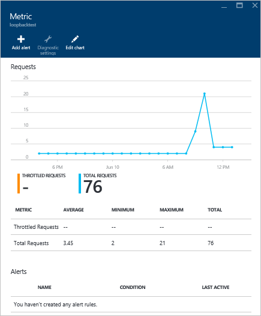
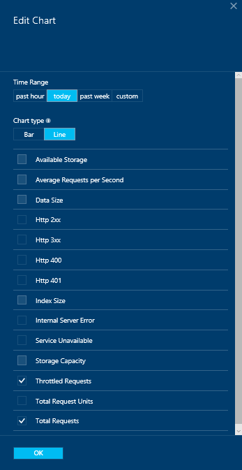
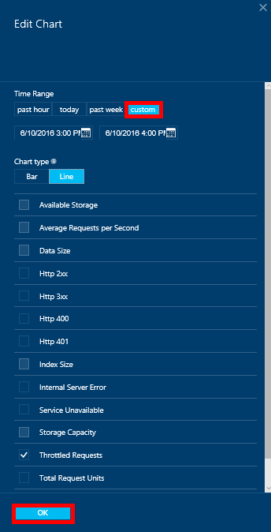
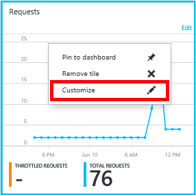
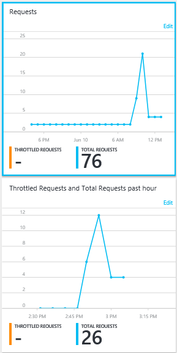
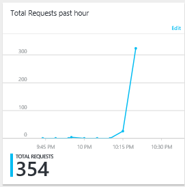

# Monitor Azure Cosmos DB requests, usage, and storage
You can monitor your Azure Cosmos DB accounts in the [Azure portal](https://portal.azure.com/). For each Azure Cosmos DB account, both performance metrics, such as requests and server errors, and usage metrics, such as storage consumption, are available.

Metrics can be reviewed on the Account blade, the new Metrics blade, or in Azure Monitor.

## View performance metrics on the Metrics blade
1. In the [Azure portal](https://portal.azure.com/), click **More Services**, scroll to **Databases**, click **Azure Cosmos DB**, and then click the name of the Azure Cosmos DB account for which you would like to view performance metrics.
2. In the resource menu, under **Monitoring**, click **Metrics**.

The Metrics blade opens, and you can select the collection to review. You can review Availability, Requests, Throughput, and Storage metrics and compare them to the Azure Cosmos DB SLAs.

## View performance metrics by using Azure Monitoring
1. In the [Azure portal](https://portal.azure.com/), click **Monitor** on the Jumpbar.
2. In the resource menu, click **Metrics**.
3. In the **Monitor - Metrics** window, in the **esource group** drop-down menu, select the resource group associated with the Azure Cosmos DB account that you'd like to monitor. 
4. In the **Resource** drop-down menu, select the database account to monitor.
5. In the list of **Available metrics**, select the metrics to display. Use the CTRL button to multi-select. 

    Your metrics are displayed on in the **Plot** window. 

## View performance metrics on the account blade
1. In the [Azure portal](https://portal.azure.com/), click **More Services**, scroll to **Databases**, click **Azure Cosmos DB**, and then click the name of the Azure Cosmos DB account for which you would like to view performance metrics.
2. The **Monitoring** lens displays the following tiles by default:
   
   * Total requests for the current day.
   * Storage used.
   
   If your table displays **No data available** and you believe there is data in your database, see the [Troubleshooting](#troubleshooting) section.
   
   
3. Clicking on the **Requests** or **Usage Quota** tile opens a detailed **Metric** blade.
4. The **Metric** blade shows you details about the metrics you have selected.  At the top of the blade is a graph of requests charted hourly, and below that is table that shows aggregation values for throttled and total requests.  The metric blade also shows the list of alerts which have been defined, filtered to the metrics that appear on the current metric blade (this way, if you have a number of alerts, you'll only see the relevant ones presented here).   
   
   

## Customize performance metric views in the portal
1. To customize the metrics that display in a particular chart, click the chart to open it in the **Metric** blade, and then click **Edit chart**.  
   
2. On the **Edit Chart** blade, there are options to modify the metrics that display in the chart, as well as their time range.  
   
3. To change the metrics displayed in the part, simply select or clear the available performance metrics, and then click **OK** at the bottom of the blade.  
4. To change the time range, choose a different range (for example, **Custom**), and then click **OK** at the bottom of the blade.  
   
   

## Create side-by-side charts in the portal
The Azure Portal allows you to create side-by-side metric charts.  

1. First, right-click on the chart you want to copy and select **Customize**.
   
   
2. Click **Clone** on the menu to copy the part and then click **Done customizing**.
   
     

You may now treat this part as any other metric part, customizing the metrics and time range displayed in the part.  By doing this, you can see two different metrics chart side-by-side at the same time.  
      

## Set up alerts in the portal
1. In the [Azure portal](https://portal.azure.com/), click **More Services**, click **Azure Cosmos DB**, and then click the name of the Azure Cosmos DB account for which you would like to setup performance metric alerts.
2. In the resource menu, click **Alert Rules** to open the Alert rules blade.  
   
3. In the **Alert rules** blade, click **Add alert**.  
   
4. In the **Add an alert rule** blade, specify:
   
   * The name of the alert rule you are setting up.
   * A description of the new alert rule.
   * The metric for the alert rule.
   * The condition, threshold, and period that determine when the alert activates. For example, a server error count greater than 5 over the last 15 minutes.
   * Whether the service administrator and coadministrators are emailed when the alert fires.
   * Additional email addresses for alert notifications.  
     

## Monitor Azure Cosmos DB programatically
The account level metrics available in the portal, such as account storage usage and total requests, are not available via the DocumentDB APIs. However, you can retrieve usage data at the collection level by using the DocumentDB APIs. To retrieve collection level data, do the following:

* To use the REST API, [perform a GET on the collection](https://msdn.microsoft.com/library/mt489073.aspx). The quota and usage information for the collection is returned in the x-ms-resource-quota and x-ms-resource-usage headers in the response.
* To use the .NET SDK, use the [DocumentClient.ReadDocumentCollectionAsync](https://msdn.microsoft.com/library/microsoft.azure.documents.client.documentclient.readdocumentcollectionasync.aspx) method, which returns a [ResourceResponse](https://msdn.microsoft.com/library/dn799209.aspx) that contains a number of usage properties such as **CollectionSizeUsage**, **DatabaseUsage**, **DocumentUsage**, and more.

To access additional metrics, use the [Azure Monitor SDK](https://www.nuget.org/packages/Microsoft.Azure.Insights). Available metric definitions can be retrieved by calling:

    https://management.azure.com/subscriptions/{SubscriptionId}/resourceGroups/{ResourceGroup}/providers/Microsoft.DocumentDb/databaseAccounts/{DocumentDBAccountName}/metricDefinitions?api-version=2015-04-08

Queries to retrieve individual metrics use the following format:

    https://management.azure.com/subscriptions/{SubecriptionId}/resourceGroups/{ResourceGroup}/providers/Microsoft.DocumentDb/databaseAccounts/{DocumentDBAccountName}/metrics?api-version=2015-04-08&$filter=%28name.value%20eq%20%27Total%20Requests%27%29%20and%20timeGrain%20eq%20duration%27PT5M%27%20and%20startTime%20eq%202016-06-03T03%3A26%3A00.0000000Z%20and%20endTime%20eq%202016-06-10T03%3A26%3A00.0000000Z

For more information, see [Retrieving Resource Metrics via the Azure Monitor REST API](https://blogs.msdn.microsoft.com/cloud_solution_architect/2016/02/23/retrieving-resource-metrics-via-the-azure-insights-api/). Note that "Azure Inights" was renamed "Azure Monitor".  This blog entry refers to the older name.

## Troubleshooting
If your monitoring tiles display the **No data available** message, and you recently made requests or added data to the database, you can edit the tile to reflect the recent usage.

### Edit a tile to refresh current data
1. To customize the metrics that display in a particular part, click the chart to open the **Metric** blade, and then click **Edit Chart**.  
   
2. On the **Edit Chart** blade, in the **Time Range** section, click **past hour**, and then click **OK**.  
   
3. Your tile should now refresh showing your current data and usage.  
   

## Next steps
To learn more about Azure Cosmos DB capacity planning, see the [Azure Cosmos DB capacity planner calculator](https://www.documentdb.com/capacityplanner).

