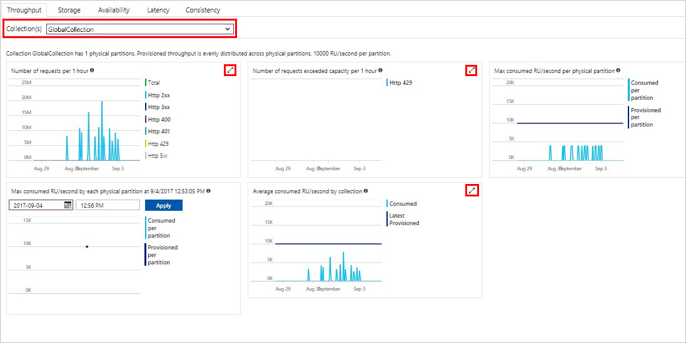
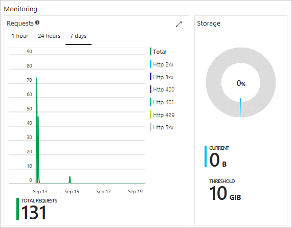
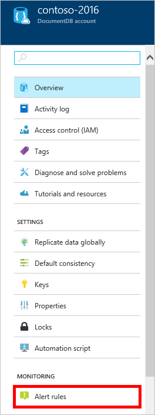
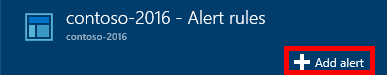
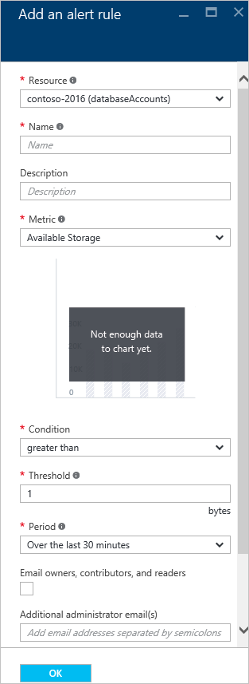

# Monitor Azure Cosmos DB
You can monitor your Azure Cosmos DB accounts in the [Azure portal](https://portal.azure.com/). For each Azure Cosmos DB account, a full suite of metrics is available to monitor throughput, storage, availability, latency, and consistency.

Metrics can be reviewed on the Account page, the new Metrics page, or in Azure Monitor.

## View performance metrics on the Metrics page
1. In the [Azure portal](https://portal.azure.com/), click **All services**, scroll to **Databases**, click **Azure Cosmos DB**, and then click the name of the Azure Cosmos DB account for which you would like to view performance metrics.
2. When the new page loads, in the resource menu, under **Monitoring**, click **Metrics**.
3. When the Metrics page opens, select the collection to review from the **Collection(s)** drop-down.

   The Azure portal displays the suite of collection metrics available. Note that throughput, storage, availability, latency, and consistency metrics are provided on separate tabs. To get additional detail on the metrics provided, click on the double-arrow in the top right of each metrics pane.

   

## View performance metrics by using Azure Monitoring
1. In the [Azure portal](https://portal.azure.com/), click **Monitor** on the left bar.
2. In the resource menu, click **Metrics**.
3. In the **Monitor - Metrics** window, in the **Resource group** drop-down menu, select the resource group associated with the Azure Cosmos DB account that you'd like to monitor. 
4. In the **Resource** drop-down menu, select the database account to monitor.
5. In the list of **Available metrics**, select the metrics to display. Use the CTRL button to multi-select. 

## View performance metrics on the account page
1. In the [Azure portal](https://portal.azure.com/), click **All services**, scroll to **Databases**, click **Azure Cosmos DB**, and then click the name of the Azure Cosmos DB account for which you would like to view performance metrics.
2. The **Monitoring** lens displays the following tiles by default:
   
   * Total requests for the current day.
   * Storage used.
   
   
3. Clicking on the double-arrow in the top-right of the **Requests** tile opens a detailed **Metric** page.
4. The **Metric** page shows you details about the total requests. 

## Set up alerts in the portal
1. In the [Azure portal](https://portal.azure.com/), click **All services**, click **Azure Cosmos DB**, and then click the name of the Azure Cosmos DB account for which you would like to set up performance metric alerts.
2. In the resource menu, click **Alert Rules** to open the Alert rules page.  
   
3. In the **Alert rules** page, click **Add alert**.  
   
4. In the **Add an alert rule** page, specify:
   
   * The name of the alert rule you are setting up.
   * A description of the new alert rule.
   * The metric for the alert rule.
   * The condition, threshold, and period that determine when the alert activates. For example, a server error count greater than 5 over the last 15 minutes.
   * Whether the service administrator and coadministrators are emailed when the alert fires.
   * Additional email addresses for alert notifications.  
     

## Monitor Azure Cosmos DB programmatically
The account level metrics available in the portal, such as account storage usage and total requests, are not available via the SQL APIs. However, you can retrieve usage data at the collection level by using the SQL APIs. To retrieve collection level data, do the following:

* To use the REST API, [perform a GET on the collection](https://msdn.microsoft.com/library/mt489073.aspx). The quota and usage information for the collection is returned in the x-ms-resource-quota and x-ms-resource-usage headers in the response.
* To use the .NET SDK, use the [DocumentClient.ReadDocumentCollectionAsync](https://msdn.microsoft.com/library/microsoft.azure.documents.client.documentclient.readdocumentcollectionasync.aspx) method, which returns a [ResourceResponse](https://msdn.microsoft.com/library/dn799209.aspx) that contains a number of usage properties such as **CollectionSizeUsage**, **DatabaseUsage**, **DocumentUsage**, and more.

To access additional metrics, use the [Azure Monitor SDK](https://www.nuget.org/packages/Microsoft.Azure.Insights). Available metric definitions can be retrieved by calling:

    https://management.azure.com/subscriptions/{SubscriptionId}/resourceGroups/{ResourceGroup}/providers/Microsoft.DocumentDb/databaseAccounts/{DocumentDBAccountName}/metricDefinitions?api-version=2015-04-08

Queries to retrieve individual metrics use the following format:

    https://management.azure.com/subscriptions/{SubscriptionId}/resourceGroups/{ResourceGroup}/providers/Microsoft.DocumentDb/databaseAccounts/{DocumentDBAccountName}/metrics?api-version=2015-04-08&$filter=%28name.value%20eq%20%27Total%20Requests%27%29%20and%20timeGrain%20eq%20duration%27PT5M%27%20and%20startTime%20eq%202016-06-03T03%3A26%3A00.0000000Z%20and%20endTime%20eq%202016-06-10T03%3A26%3A00.0000000Z

For more information, see [Retrieving Resource Metrics via the Azure Monitor REST API](https://blogs.msdn.microsoft.com/cloud_solution_architect/2016/02/23/retrieving-resource-metrics-via-the-azure-insights-api/). Note that "Azure Insights" was renamed "Azure Monitor".  This blog entry refers to the older name.

## Next steps
To learn more about Azure Cosmos DB capacity planning, see the [Azure Cosmos DB capacity planner calculator](https://www.documentdb.com/capacityplanner).

