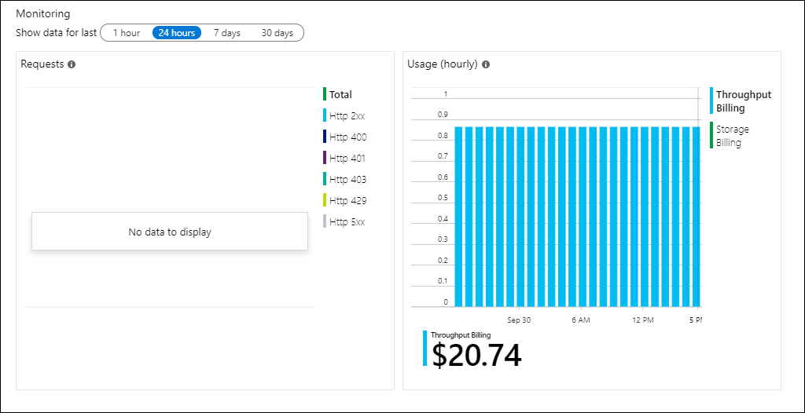

# Monitoring Azure Cosmos DB
When you have critical applications and business processes relying on Azure resources, you want to monitor those resources for their availability, performance, and operation. This article describes the monitoring data generated by Azure Cosmos databases and how you can use the features of Azure Monitor to analyze and alert on this data.

## Azure Monitor
Azure Cosmos DB creates monitoring data using [Azure Monitor](../azure-monitor/overview.md) which is a full stack monitoring service in Azure that provides a complete set of features to monitor your Azure resources in addition to resources in other clouds and on-premises. 

If you're not already familiar with monitoring Azure services, start with the article [Monitoring Azure resources with Azure Monitor](../azure-monitor/insights/monitor-azure-resource.md) which describes the following:

- What is Azure Monitor?
- Costs associated with monitoring
- Monitoring data collected in Azure
- Configuring data collection
- Standard tools in Azure for analyzing and alerting on monitoring data

The following sections build on this article by describing the specific data gathered from Azure Cosmos DB and providing examples for configuring data collection and analyzing this data with Azure tools.

## Overview
The **Overview** page in the Azure portal for each Azure Cosmos database includes a brief view of the database usage including its request and hourly billing usage. This is useful information but only a small amount of the monitoring data available. Some of this data is collected automatically and available for analysis as soon as you create the database while you can enable additional data collection with some configuration.




## Monitoring data from Azure Cosmos DB
Azure Cosmos DB collects the same kinds of monitoring data as other Azure resources which are described in [Monitoring data from Azure resources](../azure-monitor/insights/monitor-azure-resource.md#monitoring-data). See [Azure Cosmos DB monitoring data reference](monitor-cosmos-db-reference.md) for a detailed reference of the logs and metrics created by Azure Cosmos DB.
 
## Configuration
Platform metrics and the Activity log are collected automatically, but you must create a diagnostic setting to collect resource logs or forward them outside of Azure Monitor. See [Create diagnostic setting to collect platform logs and metrics in Azure](../azure-monitor/platform/diagnostic-settings.md) for the detailed process for creating a diagnostic setting using the Azure portal, CLI, or PowerShell.

When you create a diagnostic setting, you specify which categories of logs to collect. The categories for Azure Cosmos DB are listed in the following table:

| Category | Description |
|:---|:---|
| DataPlaneRequests | Back-end requests to all APIs which includes SQL, Graph, MongoDB, Cassandra, and Table API accounts in Azure Cosmos DB.  |
| MongoRequests | User-initiated requests from the front end to serve requests to Azure Cosmos DB's API for MongoDB. |
| QueryRuntimeStatistics | Query text that was executed. |


## Analyzing metric data
Azure Cosmos DB provides a custom experience for working with metrics. See [Monitor and debug Azure Cosmos DB metrics from Azure Monitor](cosmos-db-azure-monitor-metrics.md) for details on using this experience and for analyzing different Azure Cosmos DB scenarios.

You can analyze metrics for Azure Cosmos DB with metrics from other Azure services using Metrics explorer by opening **Metrics** from the **Azure Monitor** menu. See [Getting started with Azure Metrics Explorer](../azure-monitor/platform/metrics-getting-started.md) for details on using this tool. All metrics for Azure Cosmos DB are in the namespace **Cosmos DB standard metrics**, and you can use the following filters:

- CollectionName
- DatabaseName
- OperationType
- Region
- StatusCode


## Analyzing log data
Data in Azure Monitor Logs is stored in tables which each table having its own set of unique properties. Azure Cosmos DB stores data in the following tables.

| Table | Description |
|:---|:---|
| AzureDiagnostics | Common table used by multiple services to store Resource logs. Resource logs from Azure Cosmos DB can be identified with `MICROSOFT.DOCUMENTDB`.   |
| AzureActivity    | Common table that stores all records from the Activity log. 


> [!IMPORTANT]
> When you select **Logs** from the Azure Cosmos DB menu, Log Analytics is opened with the query scope set to the current Azure Cosmos database. This means that log queries will only include data from that resource. If you want to run a query that includes data from other databases or data from other Azure services, select **Logs** from the **Azure Monitor** menu. See [Log query scope and time range in Azure Monitor Log Analytics](../azure-monitor/log-query/scope.md) for details.

### Sample queries
Following are queries that you can use to help you monitor your Azure Cosmos databases.

* To query for all of the diagnostic logs from Azure Cosmos DB for a specified time period:

    ```Kusto
    AzureDiagnostics | where ResourceProvider=="MICROSOFT.DOCUMENTDB" and Category=="DataPlaneRequests"
    ```

* To query for the 10 most recently logged events:

    ```Kusto
    AzureDiagnostics | where ResourceProvider=="MICROSOFT.DOCUMENTDB" and Category=="DataPlaneRequests" | take 10
    ```

* To query for all operations, grouped by operation type:

    ``````Kusto
    AzureDiagnostics | where ResourceProvider=="MICROSOFT.DOCUMENTDB" and Category=="DataPlaneRequests" | summarize count() by OperationName
    ```

* To query for all operations, grouped by **Resource**:

    ```Kusto
    AzureActivity | where ResourceProvider=="MICROSOFT.DOCUMENTDB" and Category=="DataPlaneRequests" | summarize count() by Resource
    ```

* To query for all user activity, grouped by resource:

    ```Kusto
    AzureActivity | where Caller == "test@company.com" and ResourceProvider=="MICROSOFT.DOCUMENTDB" and Category=="DataPlaneRequests" | summarize count() by Resource
    ```

* To query for which operations take longer than 3 milliseconds:

    ```Kusto
    AzureDiagnostics | where toint(duration_s) > 3 and ResourceProvider=="MICROSOFT.DOCUMENTDB" and Category=="DataPlaneRequests" | summarize count() by clientIpAddress_s, TimeGenerated
    ```

* To query for which agent is running the operations:

    ```Kusto
    AzureDiagnostics | where ResourceProvider=="MICROSOFT.DOCUMENTDB" and Category=="DataPlaneRequests" | summarize count() by OperationName, userAgent_s
    ```

* To query for when the long running operations were performed:

    ```Kusto
    AzureDiagnostics | where ResourceProvider=="MICROSOFT.DOCUMENTDB" and Category=="DataPlaneRequests" | project TimeGenerated , duration_s | render timechart
    ```


## Alerts
The following table lists common and recommended alert rules for Azure Cosmos DB.

| Alert type | Condition | Description |
|:---|:---|:---|
| | | |
| | | |


## Next steps

- See [Azure Cosmos DB monitoring data reference](monitor-cosmos-db-reference.md) for a reference of the logs and metrics created by Azure Cosmos DB.
- See [Monitoring Azure resources with Azure Monitor](../azure-monitor/insights/monitor-azure-resource.md) for details on monitoring Azure resources.
