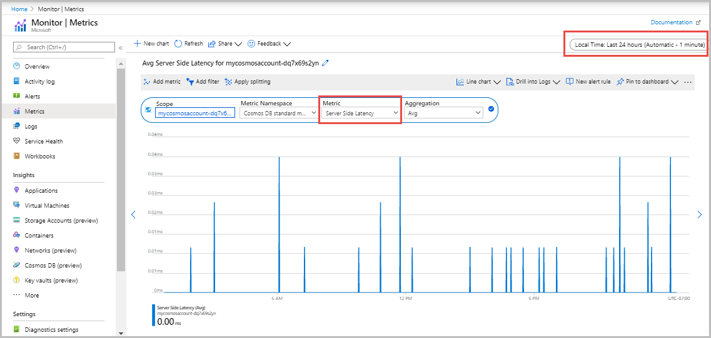
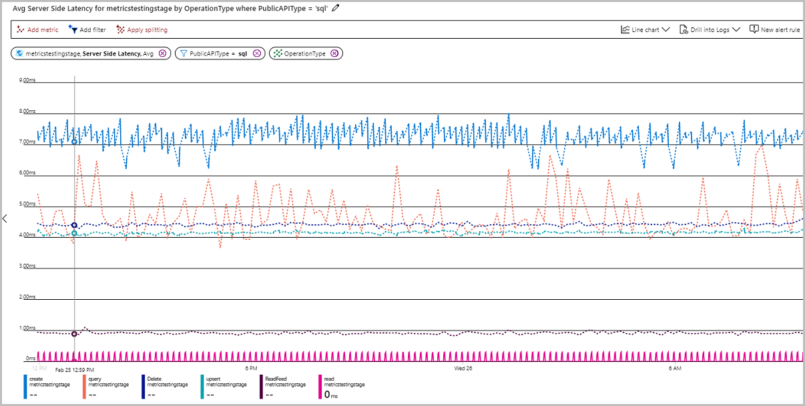

# How to monitor the server-side latency for operations in an Azure Cosmos DB container or account

Azure Monitor for Azure Cosmos DB provides a metrics view to monitor your account and create dashboards. The Azure Cosmos DB metrics are collected by default, this feature does not require you to enable or configure anything explicitly. The server-side latency metric is used to view the server-side latency of an operation. Azure Cosmos DB provides SLA of less than 10 ms for point read/write operations with direct connectivity. For point read and write operations, the SLAs are calculated as detailed in the [SLA document](https://azure.microsoft.com/support/legal/sla/cosmos-db/v1_3/).

If you see unusually large latency for point operations such as:

* A get or set operation with partition key and ID in direct mode
* A read or write operation or
* A query

You can look up the diagnostic log to see the size of data returned. If you see a sustained high latency for query operations, you can look up the diagnostic log for size of data returned, [throughput or RU/s](cosmosdb-monitor-resource-logs.md#diagnostic-queries) used, or the number of such operations in a given period. This way, you can debug the server-side latency issues.

## View the server-side latency metric

1. Sign in to the [Azure portal](https://portal.azure.com/).

1. Select **Monitor** from the left-hand navigation bar and select **Metrics**.

   

1. From the **Metrics** pane > **Select a resource** > choose the required **subscription**, and **resource group**. For the **Resource type**, select **Azure Cosmos DB accounts**, choose one of your existing Azure Cosmos accounts, and select **Apply**.
   
   

1. Next select the **Server Side Latency**  metric from the list of available metrics. To learn in detail about all the available metrics in this list, see the [Metrics by category](monitor-cosmos-db-reference.md) article. In this example, let's select **Server Side Latency** and **Avg** as the aggregation value. In addition to these details, you can also select the **Time range** and **Time granularity** of the metrics. At max, you can view metrics for the past 30 days.  After you apply the filter, a chart is displayed based on your filter. You can see the server-side latency per minute for the selected period.  

   

## Filters for server-side latency

You can also filter metrics and get the charts displayed by a specific **CollectionName**, **ConnectionMode**, **DatabaseName**, **OperationType**, **Region**, and **PublicAPIType**. 

To filter the metrics, select **Add filter** and choose the required property such as **PublicAPIType** and select the value **sql**. Add another filter for **OperationType**. The graph then displays the server-side latency for different operations during the selected period. The operations executed via Stored procedure are not logged so they are not available under the OperationType metric.

The **Server Side Latency** metrics for each operation are displayed as shown in the following image:

You can also group the metrics by using the **Apply splitting** option.  

## Next steps

* Monitor Azure Cosmos DB data by using [diagnostic settings](cosmosdb-monitor-resource-logs.md) in Azure.
* [Audit Azure Cosmos DB control plane operations](audit-control-plane-logs.md)