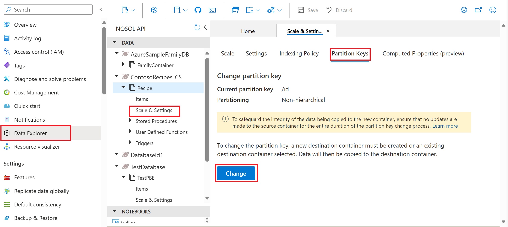

# Changing the Partition Key in Azure Cosmos DB (Preview)

[!INCLUDE[NoSQL](../includes/appliesto-nosql.md)]

In the realm of database management, it isn't uncommon for the initially chosen partition key for a container to become inadequate as applications evolve. It can result in suboptimal performance and increased costs for the container. Several factors contributing to this situation include:

- [Cross partition queries](how-to-query-container.md#avoid-cross-partition-queries)
- [Hot partitions](troubleshoot-request-rate-too-large.md?tabs=resource-specific#how-to-identify-the-hot-partition)

To address these issues, Azure Cosmos DB offers the ability to seamlessly change the partition key using the Azure portal.

## Getting Started

To change the partition key of a container in Azure Cosmos DB for the NoSQL API using the Azure portal, follow these steps:

1. Navigate to the **Data Explorer** in the Azure Cosmos DB portal and select the container for which you need to change the partition key.
2. Proceed to the **Scale & Settings** option and choose the **Partition Keys** tab.
3. Select the **Change** button to initiate the partition key change process.

## How the Change Partition Key Works

Changing the partition key entails creating a new destination container or selecting an existing destination container within the same database.

If creating a new container using the Azure portal while changing the partition key, all configurations except for the partition key and unique keys are replicated to the destination container.

Then, data is copied from the source container to the destination container in an offline manner utilizing the [Intra-account container copy](../container-copy.md#how-does-container-copy-work) job.

>[!Note]
> It is recommended to stop all updates on the source container before proceeding to change the partition key of the container for entire duration of copy process to maintain data integrity.

Once the copy is complete, you can start using the new container with desired partition key and optionally delete the old container.

## Next Steps

- Explore more about [container copy jobs](../container-copy.md).
- Learn further about [how to choose a partition key](../partitioning-overview.md#choose-partitionkey).
