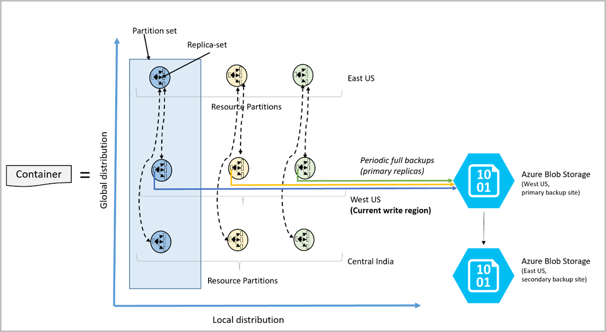

# Online backup and on-demand data restore in Azure Cosmos DB

Azure Cosmos DB automatically takes backups of your data at regular intervals. The automatic backups are taken without affecting the performance or availability of the database operations. All the backups are stored separately in a storage service, and those backups are globally replicated for resiliency against regional disasters. The automatic backups are helpful in scenarios when you accidentally delete or update your Azure Cosmos account, database, or container and later require the data recovery.

## Automatic and online backups

With Azure Cosmos DB, not only your data, but also the backups of your data are highly redundant and resilient to regional disasters. The following steps show how Azure Cosmos DB performs data backup:

* Azure Cosmos DB automatically takes a backup of your database every 4 hours and at any point of time, only the latest 2 backups are stored. However, if the container or database is deleted, Azure Cosmos DB retains the existing snapshots of a given container or database for 30 days.

* Azure Cosmos DB stores these backups in Azure Blob storage whereas the actual data resides locally within Azure Cosmos DB.

*  To guarantee low latency, the snapshot of your backup is stored in Azure Blob storage in the same region as the current write region (or one of the write regions, in case you have a multi-master configuration) of your Azure Cosmos database account. For resiliency against regional disaster, each snapshot of the backup data in Azure Blob storage is again replicated to another region through geo-redundant storage (GRS). The region to which the backup is replicated is based on your source region and the regional pair associated with the source region. To learn more, see the [list of geo-redundant pairs of Azure regions](../best-practices-availability-paired-regions.md) article. You cannot access this backup directly. Azure Cosmos DB will use this backup only if a backup restore is initiated.

* The backups are taken without affecting the performance or availability of your application. Azure Cosmos DB performs data backup in the background without consuming any additional provisioned throughput (RUs) or affecting the performance and availability of your database.

* If you have accidentally deleted or corrupted your data, you should contact [Azure support](https://azure.microsoft.com/support/options/) within 8 hours so that the Azure Cosmos DB team can help you restore the data from the backups.

The following image shows how an Azure Cosmos container with all the three primary physical partitions in West US is backed up in a remote Azure Blob Storage account in West US and then replicated to East US:

## Options to manage your own backups

With Azure Cosmos DB SQL API accounts, you can also maintain your own backups by using one of the following approaches:

* Use [Azure Data Factory](../data-factory/connector-azure-cosmos-db.md) to move data periodically to a storage of your choice.

* Use Azure Cosmos DB [change feed](change-feed.md) to read data periodically for full backups, as well as for incremental changes, and store it in your own storage.

## Backup retention period

Azure Cosmos DB takes snapshots of your data every four hours. At any given time, only the last two snapshots are retained. However, if the container or database is deleted, Azure Cosmos DB retains the existing snapshots of a given container or database for 30 days.

## Restoring data from online backups

Accidental deletion or modification of data can happen in one of the following scenarios:  

* The entire Azure Cosmos account is deleted

* One or more Azure Cosmos databases are deleted

* One or more Azure Cosmos containers are deleted

* Azure Cosmos items (for example, documents) within a container are deleted or modified. This specific case is typically referred to as "data corruption".

* A shared offer database or containers within a shared offer database are deleted or corrupted

Azure Cosmos DB can restore data in all the above scenarios. The restore process always creates a new Azure Cosmos account to hold the restored data. The name of the new account, if not specified, will have the format `<Azure_Cosmos_account_original_name>-restored1`. The last digit is incremented, if multiple restores are attempted. You can't restore data to a pre-created Azure Cosmos account.

When an Azure Cosmos account is deleted, we can restore the data into an account with the same name, provided that the account name is not in use. In such cases, it's recommended to not re-create the account after deletion, because it not only prevents the restored data to use the same name, but also makes discovering the right account to restore from more difficult. 

When an Azure Cosmos database is deleted, it is possible to restore the whole database or a subset of the containers within that database. It is also possible to select containers across databases and restore them and all the restored data is placed in a new Azure Cosmos account.

When one or more items within a container are accidentally deleted or changed (the data corruption case), you will need to specify the time to restore to. Time is of essence for this case. Since the container is live, the backup is still running, so if you wait beyond the retention period (the default is eight hours) the backups would be overwritten. In the case of deletes, your data is no longer stored because they won't be overwritten by the backup cycle. Backups for deleted databases or containers are saved for 30 days.

If you provision throughput at the database level (that is, where a set of containers shares the provisioned throughput), the backup and restore process in this case happen at the entire database level, and not at the individual containers level. In such cases, selecting a subset of containers to restore is not an option.

## Migrating data to the original account

The primary goal of the data restore is to provide a way to recover any data that you delete or modify accidentally. So, we recommend that you first inspect the content of the recovered data to ensure it contains what you are expecting. Then work on migrating the data back to the primary account. Although it is possible to use the restored account as the live account, it's not a recommended option if you have production workloads.  

The following are different ways to migrate data back to the original Azure Cosmos account:

* Using [Cosmos DB Data Migration Tool](import-data.md)
* Using [Azure Data Factory]( ../data-factory/connector-azure-cosmos-db.md)
* Using [change feed](change-feed.md) in Azure Cosmos DB 
* Write custom code

Delete the restored accounts as soon as you are done migrating, because they will incur ongoing charges.

## Next steps

Next you can learn about how to restore data from an Azure Cosmos account or learn how to migrate data to an Azure Cosmos account

* To make a restore request, contact Azure Support, [file a ticket from the Azure portal](https://portal.azure.com/?#blade/Microsoft_Azure_Support/HelpAndSupportBlade)
* [How to restore data from an Azure Cosmos account](how-to-backup-and-restore.md)
* [Use Cosmos DB change feed](change-feed.md) to move data to Azure Cosmos DB.
* [Use Azure Data Factory](../data-factory/connector-azure-cosmos-db.md) to move data to Azure Cosmos DB.

