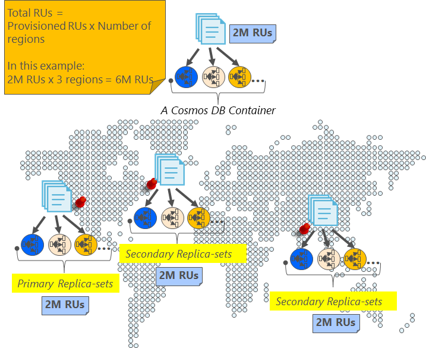
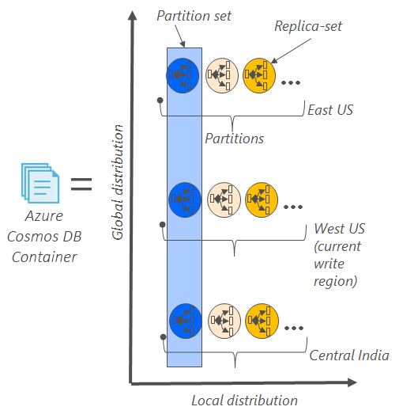
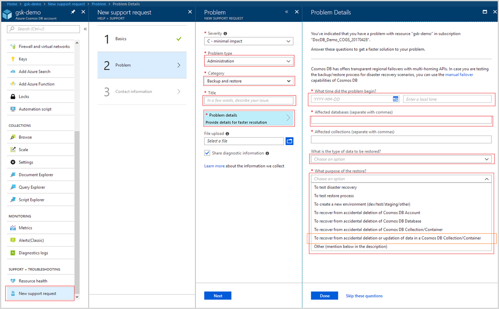

# Automatic online backup and restore with Azure Cosmos DB
Azure Cosmos DB automatically takes backups of all your data at regular intervals. The automatic backups are taken without affecting the performance or availability of your database operations. All your backups are stored separately in another storage service, and those backups are globally replicated for resiliency against regional disasters. The automatic backups are intended for scenarios when you accidentally delete your Cosmos DB container and later require data recovery.  

This article starts with a quick recap of the data redundancy and availability in Cosmos DB, and then discusses backups. 

## High availability with Cosmos DB - a recap
Cosmos DB is designed to be [globally distributed](distribute-data-globally.md) – it allows you to scale throughput across multiple Azure regions along with policy driven failover and transparent multi-homing APIs. Azure Cosmos DB offers [99.99% availability SLAs](https://azure.microsoft.com/support/legal/sla/cosmos-db) for all single region accounts and all multi-region accounts with relaxed consistency, and 99.999% read availability on all multi-region database accounts. All the writes in Azure Cosmos DB are durably committed to local disks by a quorum of replicas within a local data center before acknowledging to the client. The high availability of Cosmos DB relies on local storage and does not depend on any external storage technologies. Additionally, if your database account is associated with more than one Azure region, your writes are replicated across other regions as well. To scale your throughput and access data at low latencies, you can have as many read regions associated with your database account as you like. In each read region, the (replicated) data is durably persisted across a replica set.  

As illustrated in the following diagram, a single Cosmos DB container is [horizontally partitioned](partition-data.md). A "partition" is denoted by a circle in the following diagram, and each partition is made highly available via a replica set. This is the local distribution within a single Azure region (denoted by the X axis). Further, each partition (with its corresponding replica set) is then globally distributed across multiple regions associated with your database account (for example, in this illustration the three regions – East US, West US and Central India). The "partition set" is a globally distributed entity comprising of multiple copies of your data in each region (denoted by the Y axis). You can assign priority to the regions associated with your database account and Cosmos DB will transparently fail over to the next region in case of disaster. You can also manually simulate failover to test the end-to-end availability of your application.  

The following image illustrates the high degree of redundancy with Cosmos DB.

## Full, automatic, online backups
Oops, I deleted my container or database! With Cosmos DB, not only your data, but the backups of your data are also made highly redundant and resilient to regional disasters. These automated backups are currently taken approximately every four hours and latest two backups are stored at all times. If the data is accidentally dropped or corrupted, contact [Azure support](https://azure.microsoft.com/support/options/) within eight hours. 

The backups are taken without affecting the performance or availability of your database operations. Cosmos DB takes the backup in the background without consuming your provisioned RUs or affecting the performance and without affecting the availability of your database. 

Unlike your data that is stored inside Cosmos DB, the automatic backups are stored in Azure Blob Storage service. To guarantee the low latency/efficient upload, the snapshot of your backup is uploaded to an instance of Azure Blob storage in the same region as the current write region of your Cosmos DB database account. For resiliency against regional disaster, each snapshot of your backup data in Azure Blob Storage is again replicated via geo-redundant storage (GRS) to another region. The following diagram shows that the entire Cosmos DB container (with all three primary partitions in West US, in this example) is backed up in a remote Azure Blob Storage account in West US and then GRS replicated to East US. 

The following image illustrates periodic full backups of all Cosmos DB entities in GRS Azure Storage.

## Backup retention period
As described above, Azure Cosmos DB takes snapshots of your data every four hours at the partition level. At any given time, only the last two snapshots are retained. However, if the container/database is deleted, Azure Cosmos DB retains the existing snapshots for all of the deleted partitions within the given container/database for 30 days.

For SQL API, If you want to maintain your own snapshots, you can do so by using the following options:

* Use the export to JSON option in the Azure Cosmos DB [Data Migration tool](import-data.md#export-to-json-file) to schedule additional backups.

* Use [Azure Data Factory](../data-factory/connector-azure-cosmos-db.md) to move data periodically.

* Use Azure Cosmos DB [change feed](change-feed.md) to read data periodically for full backup and separately for incremental change and move to your blob destination. 

* For managing warm backups, it is possible to read data periodically from change feed and delay its writing to another collection. This will ensure you do not have to restore the data and you can immediately look at the data for issue. 

> [!NOTE]
> If you "Provision throughput for a set of containers at Database level" – Please remember the restore happens at full Database account level. You also need to ensure to reach out within 8 hours to the support team if you accidentally delete your container. Data can't be restored if you don't contact the support team within 8 hours.

## Restoring a database from an online backup

If you accidentally delete your database or container, you can [file a support ticket](https://portal.azure.com/?#blade/Microsoft_Azure_Support/HelpAndSupportBlade) or [call Azure support](https://azure.microsoft.com/support/options/) to restore the data from the last automatic backup. Azure support is available for selected plans only such as Standard, Developer, support isn't available with Basic plan. To learn about different support plans, see [Azure support plans](https://azure.microsoft.com/support/plans/) page. 

If you need to restore your database because of data corruption issue (includes cases where documents within a container are deleted), see [Handling data corruption](#handling-data-corruption) as you need to take additional steps to prevent the corrupted data from overwriting the existing backups. For a specific snapshot of your backup to be restored, Cosmos DB requires that the data was available for the duration of the backup cycle for that snapshot.

> [!NOTE]
> Collections or databases can be restored only on explicit customer requests. It is the customer's responsibility to delete the container or database immediately after reconciling the data. If you don't delete the restored databases or collections, they will incur cost for request units, storage and egress.

## Handling data corruption

Azure Cosmos DB retains the last two backups of every partition in the database account. This model works well when a container (collection of documents, graph, table) or a database is accidentally deleted since one of the last versions can be restored. However, in the case when users may introduce a data corruption issue, Azure Cosmos DB may be unaware of the data corruption, and it is possible that the corruption may have overwritten the existing backups. 

As soon as corruption is detected, the user should delete the corrupted container (collection/graph/table) so that backups are protected from being overwritten with corrupted data. And most importantly reach out to Microsoft Support and raise a ticket with specific request of Severity 2. 

The following image illustrates the support request creation for container(collection/graph/table) restore via Azure portal for accidental deletion or updating of data within a container

When restore is done for this kind of scenarios - data is restored to another account(with suffix of "-restored") and container. This restore is not done in place to provide a chance to customer to do validation of data and move the data as required. The restored container is in same region with same RUs and indexing policies. User who is subscription admin or coadmin can see this restored account.

> [!NOTE]
> If you restore the data for fixing corruption issue or just for testing, please plan to remove them soon as your task is done as restored containers or a database will cost extra - based on provisioned throughput. 
## Next steps

To replicate your database in multiple data centers, see [distribute your data globally with Cosmos DB](distribute-data-globally.md). 

To file contact Azure Support, [file a ticket from the Azure portal](https://portal.azure.com/?#blade/Microsoft_Azure_Support/HelpAndSupportBlade).

