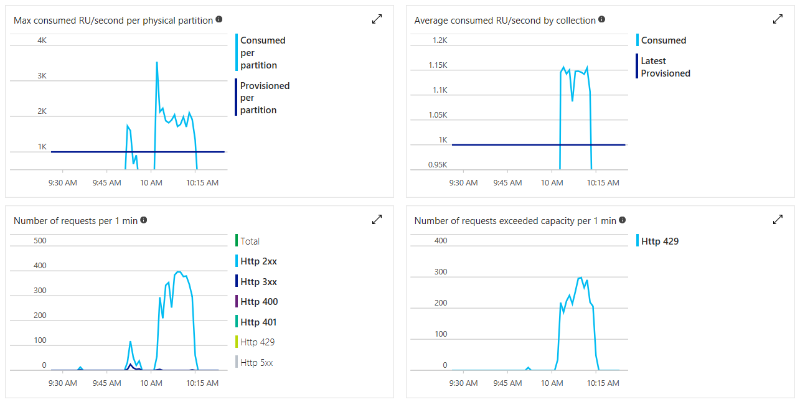

# Optimizing throughput cost

By offering provisioned throughput model, Azure Cosmos DB offers predictable performance at any scale. Reserving or provisioning throughput ahead of time eliminates the “noisy neighbor effect” on your performance by provisioning throughput ahead of time. You specify the exact amount of throughput you need - and the service guarantees that amount of throughput for you, backed by SLA.

You can start with as low as 400 RU/sec and scale up to tens of millions of requests per second or even more. Each request you issue against your Cosmos container or database, for example, reads, writes, queries, stored procedures - all have a corresponding cost that will be deducted from your provisioned throughput per second (RU/sec). If you provision 400 RU/s and issue a query that costs 40 RUs, you will be able to issue 10 such queries per second. Any request beyond that will get rate-limited and must be retried ([the client drivers retry for you automatically](performance-tips.md)).

You can provision throughput on databases or containers and each strategy can help you save on costs depending on the scenario.

## Provisioning throughput at different granularities

* If you provision throughput on a database, then all the containers (collections/tables/graphs) within that database will be able to share (albeit unevenly) the throughput based on the load. That is, throughput reserved at the database level can be “shared” unevenly, depending on the workload on a specific set of containers.

* If you provision throughput on a container, the throughput is guaranteed for that container, backed by the SLA. The choice of a logical partition key is crucial for even distribution of load across all the logical partitions of a container. See [Partitioning](partitioning-overview.md) and [horizontal scaling](partition-data.md).

Below are some simple rules of thumb to decide on a provisioned throughput strategy:

Consider provisioning throughput on a Cosmos DB database (containing a set of containers) if:

1. You have a few dozen Cosmos containers (for example, collections/tables/graphs) and want to share throughput across some or all of them. 

2. You are migrating from a (single-tenant) database designed to run on IaaS-hosted VMs or on-premises (for example, NoSQL or relational databases) to Cosmos DB and have many collections/tables/graphs and you do not want to make any changes to your data model. Note, you might forego some benefits of Cosmos DB by not adapting your data model when migrating from an on-prem database to Cosmos DB. Our recommendation is to always reaccess your data model to get the most in terms of performance and also to optimize for costs. 

3. You want to absorb unplanned spikes in workloads by virtue of pooled throughput at the database level, shared across containers subjected to unexpected spike in workload. 

4. Instead of setting specific throughput on individual containers, you care about getting the aggregate throughput across a set of containers within the database - all sharing the throughput within the database.

Consider provisioning throughput on an individual container if:

1. You have a few Cosmos containers. Because Cosmos DB is schema-agnostic - a Cosmos container (for example, a collection) can contain items of heterogeneous schemas and does not require customers to create multiple container types, one for each entity. It is always an option to consider if grouping separate say 10-20 containers into a single container makes sense. With a 400 RUs minimum for containers, pooling all 10-20 containers into one could be more cost effective. 

2. You want to control the throughput on a specific container and get the guaranteed throughput on a given container backed by SLA.

Consider a hybrid of the above two strategies:

1. As mentioned earlier, Cosmos DB allows you to mix and match the above two strategies, so you can now have a few containers within your Cosmos database, which may share the overall throughput provisioned on the database as well as, a few containers (within the same database), which may have dedicated amounts of provisioned throughput. 

2. You can apply the above strategies to come up with a hybrid configuration, where you have both database level provisioned throughput with some containers having dedicated throughput.

As shown in the following table, depending on the choice of API, you can provision throughput at different granularities.

|API|For **shared** throughput, configure a:|For **dedicated** throughput, configure a:|
|----|----|----|
|SQL API|Database|Container|
|MongoDB API|Database|Collection|
|Cassandra API|Keyspace|Table|
|Gremlin API|Database account|Graph|
|Table API|Database account|Table|

By provisioning throughput at different granularities, you can better optimize your costs based on your workloads’ characteristics. As mentioned earlier, you can programmatically and at any time increase (scale-up) or decrease (scale-down) your provisioned throughput for either individual container(s) or collectively across a set of containers to elastically scale as your workload changes and only pay for the throughput you have configured. If your container or a set of containers is distributed across multiple regions, then the throughput you configure on the container or a set of containers is guaranteed to be made available across all regions.

### Cosmos DB rate-limits your requests

When a client attempts to exceed the provisioned throughput, there is no performance degradation at the server and no use of throughput capacity beyond the reserved level. The server will preemptively end the request with RequestRateTooLarge (HTTP status code 429) and return the x-ms-retry-after-ms header indicating the amount of time, in milliseconds, that the user must wait before reattempting the request. 

```html
HTTP Status 429, 
 Status Line: RequestRateTooLarge 
 x-ms-retry-after-ms :100
```

### Native SDKs intelligently retry

The native SDKs (.NET/.NET Core, Java, Node.js and Python) all implicitly catch this response, respect the server-specified retry-after header, and retry the request. Unless your account is being accessed concurrently by multiple clients, the next retry will succeed.

If you have more than one client cumulatively operating consistently above the request rate, the default retry count currently set to 9 internally by the client may not suffice; in this case, the client throws a DocumentClientException with status code 429 to the application. The default retry count can be changed by setting the RetryOptions on the ConnectionPolicy instance. By default, the DocumentClientException with status code 429 is returned after a cumulative wait time of 30 seconds if the request continues to operate above the request rate. This occurs even when the current retry count is less than the max retry count, be it the default of 9 or a user-defined value. 

[MaxRetryAttemptsOnThrottledRequests](https://docs.microsoft.com/en-us/dotnet/api/microsoft.azure.documents.client.retryoptions.maxretryattemptsonthrottledrequests?view=azure-dotnet#Microsoft_Azure_Documents_Client_RetryOptions_MaxRetryAtte) is set to 3, so in this case, if a request operation is rate limited by exceeding the reserved throughput for the collection, the request operation retries three times before throwing the exception to the application. [MaxRetryWaitTimeInSeconds](https://docs.microsoft.com/en-us/dotnet/api/microsoft.azure.documents.client.retryoptions.maxretrywaittimeinseconds?view=azure-dotnet#Microsoft_Azure_Documents_Client_RetryOptions_MaxRetryWaitTimeInSeconds) is set to 60, so in this case if the cumulative retry wait time in seconds since the first request exceeds 60 seconds, the exception is thrown.

```csharp
ConnectionPolicy connectionPolicy = new ConnectionPolicy(); 

connectionPolicy.RetryOptions.MaxRetryAttemptsOnThrottledRequests = 3; 

connectionPolicy.RetryOptions.MaxRetryWaitTimeInSeconds = 60;
```

### Partitioning strategy impacts throughput costs

Good partitioning strategy is vital for optimizing costs in Cosmos DB. Ensure there is no skew of partitions (exposed via storage metrics). Ensure there is no skew of usage of throughput for a partition (exposed via throughput metrics). Ensure there is no skew towards particular partition keys (dominant keys in storage are exposed via metrics but the temperature of the key will be dependent on your application access pattern). The right thing to do is to think about the right logical partition key. A good partition key is expected to have the following characteristics:

* Choose a partition key that spreads workload evenly across all partitions and evenly over time. In other words, you don’t want to have a select few keys to have the majority of the data. 

* Choose a partition key that enables access patterns to be evenly spread across logical partitions. The workload is reasonably even across all the keys. In other words, you don’t want the (majority of the) workload to be focused on a few specific keys. 

* Choose a partition key that has a wide range of values. 

The basic idea is to spread the data and the activity in your container across the set of logical partitions, so that resources for data storage and throughput can be distributed across the logical partitions. Candidates for partition keys may include the properties that appear frequently as a filter in your queries. Queries can be efficiently routed by including the partition key in the filter predicate. With such a partitioning strategy, optimizing provisioned throughput will be a lot easier. 

### Design for smaller items for higher throughput 

The request charge (that is, request processing cost) of a given operation is directly correlated to the size of the item. Operations on large items will cost more than operations on smaller items. 

### Data access patterns 

It is always a good practice to logically separate your data into logical categories based on how frequently you access the data. By categorizing it as hot, medium, or cold data you could fine-tune the storage that will be consumed and the throughput that is required. Depending on the frequency of access, you may want to place the data into separate Cosmos containers (for example, tables, graphs, and collections) and fine-tune the provisioned throughput (RU/s) on them to accommodate to the needs of that segment of data. Furthermore, if you're using Cosmos DB, and you know you are not going to search by certain data values or will rarely access them you store those attributes and value compressed. Thus, you are going to save on storage space, index space, and provisioned throughput (RUs) and as a result lower costs. For multi-hundred terabyte and 1 petabyte+ sized workloads, we are working on a high-storage offer, which is even further optimized for storage-heavy workloads on Cosmos DB. 

### Indexing Policy 

By default, Azure Cosmos DB automatically indexes every property of every record. This is intended to ease development and ensure excellent performance across many different types of ad-hoc queries. If you have large records with thousands of properties, you may find that paying the RU cost for indexing every single one of those properties may be wasteful, especially if you only query against 10 or 20 of those properties. As you get closer to getting a handle on your specific workload, our guidance is to tune your index policy. Full details on Cosmos DB indexing policy can be found [here](indexing-policies.md). 

### Monitoring provisioned and consumed throughput 

You can monitor the number of rate-limited requests (requests returned with return code 429) as well as how many RUs you’ve consumed vs. how many you have provisioned in the Azure portal. 



You can also set alerts for when the number of rate-limited requests exceeds a specific threshold. See [How to monitor Cosmos DB](use-metrics.md). These alerts can dispatch an email to the account administrators or call a custom HTTP webhook or an Azure Function to automatically increase provisioned throughput. 

### Scale your throughput elastically and on-demand 

Since you are billed for all throughput provisioned, matching the provisioned throughput to your needs can help you avoid the charges for unused throughput. You can scale your provisioned throughput up or down any time, as needed.  

* Monitoring the consumption of your RUs and the ratio of rate-limited requests may reveal that you do not need to keep provisioned throughout constant throughout the day or the week. You may receive less traffic at night or during the weekend. Using either Azure portal or Cosmos DB native SDKs or REST API, you can scale up/down your provisioned throughput at any time. Cosmos DB’s REST API provides endpoints to programmatically update the performance level of your containers (the same endpoints are also exposed through the SDKs), making it straightforward to adjust the throughput from your code depending on the time of the day or the day of the week. The operation is performed without any downtime, and typically takes effect in less than a minute. 

* One of the areas we encourage scaling throughput up is when you ingest data into Cosmos DB, for example, during data migration. Once you have completed the migration, you can scale provisioned throughput down to handle the solution’s’ steady state.  

* Remember, the billing is at the granularity of one hour, so you will not save any money if you change your provisioned throughput more often than one hour at a time.

### How to determine the amount of provisioned throughput (RU/sec) needed for a new workload 

To determine the provisioned throughput for a new workload,  you can follow the following steps: 

1. Perform an initial, rough evaluation using the capacity planner and adjust your estimates with the help of the Cosmos Explorer/Data Explorer in the Azure portal. 

2. We usually recommend creating the containers with RUs higher than expected and then scaling down as needed. 

3. We highly recommend using one of the native Cosmos DB SDKs to benefit from automatic retries when requests get rate-limited. If you’re working on a platform that is not supported and use Cosmos DB’s REST API, implement your own retry policy using the x-ms-retry-after-ms header. 

4. Make sure that your application code gracefully supports the case when all retries fail. 

5. You can configure alerts from the Azure portal  to react to being rate-limited. You can start with conservative limits like 10 rate-limited requests over the last 15 minutes and switch to more eager rules once you figure out your actual consumption (occasional rate-limits are fine, they show that you’re playing with the limits you’ve set and that’s exactly what you want to do). 

6. Use monitoring to understand your traffic pattern, so you can consider the need to dynamically adjust your throughput provisioning over the day/week. 

7. Monitor regularly your provisioned vs. consumed RU ratio to make sure you have not overprovisioned your containers and databases. Being a little overprovisioned is a good safety net.  

### Best practices for provisioned throughput cost optimizations 

Following the steps below will help make your solutions highly scalable and cost-effective with Cosmos DB.  

1. If there is a significant overprovisioning of Cosmos DB throughput across containers and databases, you should review RUs provisioned vs. consumed and fine-tune the workloads.  

2. One method for estimating the amount of reserved throughput required by your application is to record the request unit RU charge associated with running typical operations against a representative Cosmos container or database used by your application and then estimate the number of operations you anticipate to perform each second. Be sure to measure and include typical queries and Cosmos DB script usage as well. To learn how to estimate RU costs of queries programmatically or using portal see Optimizing the cost of queries. 

3. Another way to get operations and their costs in RUs is by enabling Log Analytics, which will give you the breakdown of operation/duration and the request charge. Cosmos DB provides request charge for every operation, so every operation charge can be stored back from the response and then used for analysis. 

4. You can elastically scale up and down provisioned throughput as you need to accommodate your workload needs. 

5. You can add and remove regions associated with your Cosmos account as you need and control costs in that manner. 

6. Make sure you have even distribution of data and workloads across logical partitions of  your Cosmos containers. If you have uneven partition distribution, this may cause to provision higher amount of throughput than is actually needed. If you identify that you have a skewed distribution, we recommend redistributing the workload evenly across the partitions or repartition the data. 

7. If you have many containers and these containers do not require SLAs, you can use the database-based offer for the cases where the per container throughput SLAs do not apply. You should identify which of the Cosmos containers you want to migrate to the database level throughput offer and then migrate it (for example, using a change feed-based solution for migration). 

8. Consider using the “Cosmos DB Free Tier” (free for one year), Try Cosmos DB (up to three regions) or downloadable Cosmos DB emulator for dev/test scenarios. By using these options for test-dev, you can substantially lower your costs.  

9. You can further perform workload-specific cost optimizations – for example, increasing batch-size, load-balancing reads across multiple regions, and de-duplicating data, if applicable.  

10. With Cosmos DB reserved capacity, you can get significant discounts for up to 65% for three years. Cosmos DB reserved capacity model is an upfront commitment on requests units needed over time. The discounts are tiered such that the more request units you use over a longer period, the more your discount will be. These discounts are applied immediately. Any RUs used above your provisioned values are charged based on the non-reserved capacity cost. See [Cosmos DB reserved capacity](cosmos-db-reserved-capacity.md)) for more details. Consider purchasing reserved capacity to further lower your provisioned throughput costs.  

## Next steps

* Learn more about [How Cosmos pricing works](how-pricing-works.md)
* Learn more about [Request Units](request-units.md) in Azure Cosmos DB
* Learn to [provision throughput on a database or a container](set-throughput.md)
* Learn more about [logical partitions](partition-data.md)
* Learn [how to provision throughput on a Cosmos container](how-to-provision-container-throughput.md)
* Learn [how to provision throughput on a Cosmos database](how-to-provision-database-throughput.md)
* Learn more about [How Cosmos DB pricing model is cost-effective for customers](total-cost-of-ownership.md)
* Learn more about [Optimizing for development and testing](optimize-dev-test.md)
* Learn more about [Understanding your Cosmos DB bill](understand-your-bill.md)
* Learn more about [Optimizing storage cost](optimize-cost-storage.md)
* Learn more about [Optimizing the cost of reads and writes](optimize-cost-reads-writes.md)
* Learn more about [Optimizing the cost of queries](optimize-cost-queries)
* Learn more about [Optimizing the cost of multi-region Cosmos accounts](optimize-cost-regions.md)
* Learn more about [Cosmos DB reserved capacity](cosmos-db-reserved-capacity.md)
* Learn more about [Cosmos DB pricing page](https://azure.microsoft.com/en-us/pricing/details/cosmos-db/)
* Learn more about [Cosmos DB Emulator](local-emulator.md)
* Learn more about [Azure Free account](https://azure.microsoft.com/free/)
* Learn more about [Try Cosmos DB for free](https://azure.microsoft.com/en-us/try/cosmosdb/)
