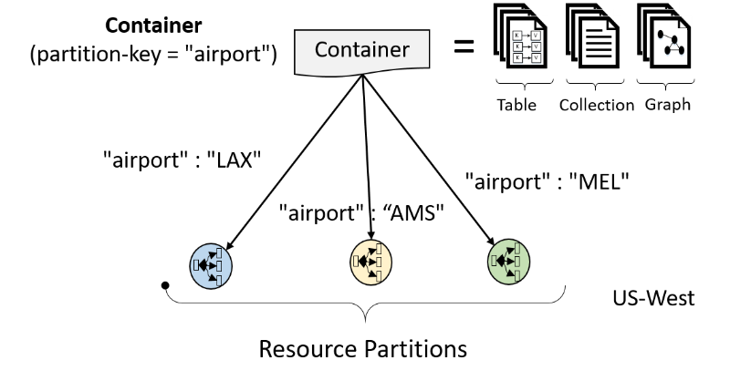
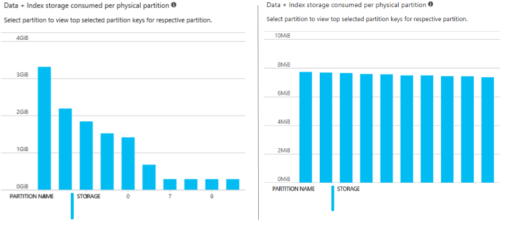

# Partition and scale in Azure Cosmos DB

[Azure Cosmos DB](https://azure.microsoft.com/services/cosmos-db/) is a globally distributed, multi-model database service designed to help you achieve fast, predictable performance. It scales seamlessly along with your application. This article provides an overview of how partitioning works for all the data models in Azure Cosmos DB. It also describes how to configure Azure Cosmos DB containers to effectively scale your applications.

Azure Cosmos DB supports the following types of containers across all APIs:

- **Fixed container**: These containers can store a graph database up to 10 GB in size with a maximum of 10,000 request units per second allocated to it. To create a fixed container it isn't necessary to specify a partition key property in the data.

- **Unlimited container**: These containers can automatically scale to store a graph beyond the 10-GB limit through horizontal partitioning. Each partition will store 10 GB and the data will be automatically balanced based on the **specified partition key**, which will be a required parameter when using an unlimited container. This type of container can store a virtually unlimited data size and can allow up to 100,000 request units per second, or more [by contacting support](https://aka.ms/cosmosdbfeedback?subject=Cosmos%20DB%20More%20Throughput%20Request).

## Partitioning in Azure Cosmos DB
Azure Cosmos DB provides containers for storing data called collections (for documents), graphs, or tables. Containers are logical resources and can span one or more physical partitions or servers. The number of partitions is determined by Azure Cosmos DB based on the storage size and throughput provisioned for a container or a set of containers. 

### Physical partition

A *physical* partition is a fixed amount of reserved SSD-backed storage combined with variable amount of compute resources (CPU and memory). Each physical partition is replicated for high availability. Each set of containers may share one or more physical partitions. Physical partition management is fully managed by Azure Cosmos DB, and you don't have to write complex code or manage your partitions. Azure Cosmos DB containers are unlimited in terms of storage and throughput. Physical partitions are an internal concept of Azure Cosmos DB and are transient. Azure Cosmos DB will automatically scale the number of physical partitions based on your workload. So you shouldn’t corelate your database design based on the number of physical partitions instead you should make sure to choose the right partition key which determines the logical partitions. 

### Logical partition

A *logical* partition is a partition within a physical partition that stores all the data associated with a single partition key value. Multiple logical partitions can end up in the same physical partition. In the following diagram, a single container has three logical partitions. Each logical partition stores the data for one partition key, LAX, AMS, and MEL respectively. Each of the LAX, AMS, and MEL logical partitions cannot grow beyond the maximum logical partition limit of 10 GB. 

 

When a container meets the [partitioning prerequisites](#prerequisites), partitioning is completely transparent to your application. Azure Cosmos DB handles distributing data across physical and logical partitions and routing of query requests to the right partition. 

## How does partitioning work

Each document must have a *partition key* and a *row key*, which uniquely identify it. Your partition key acts as a logical partition for your data and provides Azure Cosmos DB with a natural boundary for distributing data across physical partitions. **The data for a single logical partition must reside inside a single physical partition and physical partition management is managed by Azure Cosmos DB**. 

In brief, here's how partitioning works in Azure Cosmos DB:

* You provision a set of Azure Cosmos DB containers with **T** RU/s (requests per second) throughput.  
* Behind the scenes, Azure Cosmos DB provisions physical partitions needed to serve **T** requests per second. If **T** is higher than the maximum throughput per physical partition **t**, then Azure Cosmos DB provisions **N = T/t** physical partitions. The value of maximum throughput per partition(t) is configured by Azure Cosmos DB, this value is assigned based on total provisioned throughput and the hardware configuration used.  
* Azure Cosmos DB allocates the key space of partition key hashes evenly across the **N** physical partitions. So, the number of logical partitions each physical partition hosts is **1/N** * number of partition key values.  
* When a physical partition **p** reaches its storage limit, Azure Cosmos DB seamlessly splits **p** into two new physical partitions, **p1** and **p2**. It distributes values corresponding to roughly half of the keys to each of the new physical partitions. This split operation is completely invisible to your application. If a physical partition reaches its storage limit and all of the data in the physical partition belongs to the same logical partition key, the split operation does not occur. This is because all the data for a single logical partition key must reside in the same physical partition. In this case, a different partition key strategy should be employed.  
* When you provision throughput higher than **t*N**, Azure Cosmos DB splits one or more of your physical partitions to support the higher throughput.

The semantics for partition keys are slightly different to match the semantics of each API, as shown in the following table:

| API | Partition key | Row key |
| --- | --- | --- |
| SQL | Custom partition key path | Fixed `id` | 
| MongoDB | Custom shard key  | Fixed `_id` | 
| Gremlin | Custom partition key property | Fixed `id` | 
| Table | Fixed `PartitionKey` | Fixed `RowKey` | 

Azure Cosmos DB uses hash-based partitioning. When you write an item, Azure Cosmos DB hashes the partition key value and uses the hashed result to determine which partition to store the item in. 

> [!NOTE]
> Azure Cosmos DB stores all items with the same partition key in the same physical partition. 

## Best practices when choosing a partition key

The choice of the partition key is an important decision that you have to make at design time. Pick a property name that has a wide range of values and has even access patterns. It's a best practice to have a partition key with a large number of distinct values (e.g., hundreds or thousands). It lets you distribute your workload evenly across these values. An ideal partition key is one that appears frequently as a filter in your queries and has sufficient cardinality to ensure your solution is scalable.

If a physical partition reaches its storage limit and the data in the partition has the same partition key, Azure Cosmos DB returns the *"Partition key reached maximum size of 10 GB"* message, and the partition is not split. Choosing a good partition key is a very important decision. 

Choose a partition key such that:

* The storage distribution is even across all the keys.  
* Choose a partition key that will evenly distribute data across partitions.

  It is a good idea to check how your data is distributed across partitions. To check the data distribution in the portal, go to your Azure Cosmos DB account and click on **Metrics** in **Monitoring** section and then click on **storage** tab to see how your data is partitioned across different physical partitions.

  

  The left image above shows the result of a bad partition key and the right image above shows the result when a good partition key was chosen. In the left image, you can see that the data is not evenly distributed across the partitions. You should strive to choose a partition key that distributes your data so it looks similar to the right image.

* Optimize queries to obtain data within the boundaries of a partition when possible. An optimal partitioning strategy would be aligned to the querying patterns. Queries that obtain data from a single partition provide the best possible performance. Queries that are invoked with high concurrency can be efficiently routed by including the partition key in the filter predicate.  

* Choosing a partition key with higher cardinality is generally preferred – becaue it typically yields better distribution and scalability. For example, a synthetic key can be formed by concatenating values from multiple properties to increase the cardinality.  

When you choose a partition key with above considerations, you don’t have to worry about the number of partitions or how much throughput is allocated per physical partition, as Azure Cosmos DB scales out the number of physical partitions, and it can also scale the individual partitions as needed.

## <a name="prerequisites"></a>Prerequisites for partitioning

Azure Cosmos DB containers can be created as fixed or unlimited. Fixed-size containers have a maximum limit of 10 GB and 10,000 RU/s throughput. To create a container as unlimited, you must specify a partition key and a minimum throughput of 1,000 RU/s. You can also create Azure Cosmos DB containers such that they share throughput. In such cases, each container must specificy a partition key and it can grow unlimited. 

Following are the prerequisites to consider for partitioning and scaling:

* When creating a container (e.g., a collection, a graph or a table) in the Azure portal, select the **Unlimited** storage capacity option to take advantage of unlimited scaling. To auto-split physical partitions into **p1** and **p2** as described in [How does partitioning work](#how-does-partitioning-work) article, the container must be created with a throughput of 1,000 RU/s or more (or share throughput across a set of containers), and a partition key must be provided. 

* If you create a container with the initial throughput greater than or equal to 1,000 RU/s and provide a partition key, then you can take advantage of unlimited scaling without any changes to your container. Which means even though you create a **Fixed** container, if the initial container is created with a throughput of at least 1,000 RU/s and if a partition key is specified, the container acts as an unlimited container.

* All containers configured to share throughput as part of a set of containers are treated as **Unlimited** containers.

If you created a **Fixed** container with no partition key or throughput less than 1,000 RU/s, the container will not auto-scale. To migrate the data from a fixed container to an unlimited container, you need to use the [Data Migration tool](import-data.md) or the [Change Feed library](change-feed.md). 

## <a name="designing-for-partitioning"></a> Create a partition key 
You can use the Azure portal or Azure CLI to create containers and scale them at any time. This section shows how to create containers and specify the provisioned throughput and partition key using each API.


### SQL API
The following sample shows how to create a container (a collection) using SQL API. 

```csharp
DocumentClient client = new DocumentClient(new Uri(endpoint), authKey);
await client.CreateDatabaseAsync(new Database { Id = "db" });

DocumentCollection myCollection = new DocumentCollection();
myCollection.Id = "coll";
myCollection.PartitionKey.Paths.Add("/deviceId");

await client.CreateDocumentCollectionAsync(
    UriFactory.CreateDatabaseUri("db"),
    myCollection,
    new RequestOptions { OfferThroughput = 20000 });
```

You can read an item (document) using the `GET` method in the REST API or using `ReadDocumentAsync` in one of the SDKs.

```csharp
// Read document. Needs the partition key and the ID to be specified
DeviceReading document = await client.ReadDocumentAsync<DeviceReading>(
  UriFactory.CreateDocumentUri("db", "coll", "XMS-001-FE24C"), 
  new RequestOptions { PartitionKey = new PartitionKey("XMS-0001") });
```

For more information, see [Partitioning in Azure Cosmos DB using the SQL API](sql-api-partition-data.md).

### MongoDB API
With the MongoDB API, you can create a sharded collection through your favorite tool, driver, or SDK. In this example, we use the Mongo Shell to create a collection.

In the Mongo Shell:

```
db.runCommand( { shardCollection: "admin.people", key: { region: "hashed" } } )
```
    
Results:

```JSON
{
    "_t" : "ShardCollectionResponse",
    "ok" : 1,
    "collectionsharded" : "admin.people"
}
```

### Table API

To create a table using the Table API, use the `CreateIfNotExists` method. 

```csharp
CloudTableClient tableClient = storageAccount.CreateCloudTableClient();

CloudTable table = tableClient.GetTableReference("people");
table.CreateIfNotExists(throughput: 800);
```

Provisioned throughput is set as an argument of `CreateIfNotExists`. The partition key is implicitly created as the `PartitionKey` value. 

You can retrieve a single entity by using the following code:

```csharp
// Create a retrieve operation that takes a customer entity.
TableOperation retrieveOperation = TableOperation.Retrieve<CustomerEntity>("Smith", "Ben");

// Execute the retrieve operation.
TableResult retrievedResult = table.Execute(retrieveOperation);
```
For more information, see [Develop with the Table API](tutorial-develop-table-dotnet.md).

### Gremlin API

With the Gremlin API, you can use the Azure portal or Azure CLI to create a container that represents a graph. Alternatively, because Azure Cosmos DB is multi-model, you can use one of the other APIs to create and scale your graph container.

> [!NOTE]
> `/id` and `/label` are not supported as partition keys for a container in Gremlin API.

You can read any vertex or edge by using the partition key and ID in Gremlin. For example, for a graph with region ("USA") as the partition key and "Seattle" as the row key, you can find a vertex by using the following syntax:

```
g.V(['USA', 'Seattle'])
```

You can reference an edge by using the partition key and the row key.

```
g.E(['USA', 'I5'])
```

For more information, see [Using a partitioned graph in Azure Cosmos DB](graph-partitioning.md).

## Form partition key by concatenating multiple fields

You can also form a partition key by concatenating and padding multiple property values into a single artificial "partitionKey" property of the item. These keys are referred as synthetic keys.

For example, you have a document that looks like:

```json
{
"deviceId": "abc-123",
"date": 2018
}
```

One option is to set partitionKey on /deviceId or /date. If want to form a partition key on device id and date. Concatenate these two values in to an artificial "partitionKey" property, and set the partition key to /partitionKey.

```json
{
"deviceId": "abc-123",
"date": 2018,
"partitionKey": "abc-123-2018"
}
```

In real time scenarios you can have thousands of documents so you should define client side logic to concatenate values into a synthetic key, insert the synthetic key into the documents and then use it to specify partition key.

## <a name="designing-for-scale"></a> Design for scale
To scale effectively with Azure Cosmos DB, you need to pick a good partition key when you create your container. There are two main considerations for choosing a good partition key:

* **Query boundary and transactions**. Your choice of partition key should balance the need to use transactions against the requirement to distribute your entities across multiple partition keys to ensure a scalable solution. At one extreme, you can set the same partition key for all your items, but this option might limit the scalability of your solution. At the other extreme, you can assign a unique partition key for each item. This choice is highly scalable, but it prevents you from using cross-document transactions via stored procedures and triggers. An ideal partition key enables you to use efficient queries and has sufficient cardinality to ensure your solution is scalable. 
* **No storage and performance bottlenecks**. It's important to pick a property that allows writes to be distributed across various distinct values. Requests to the same partition key can't exceed the provisioned throughput allocated to a partition and will be rate-limited. So it's important to pick a partition key that doesn't result in "hot spots" within your application. Because all the data for a single partition key must be stored within a partition, you should avoid partition keys that have high volumes of data for the same value. 

Let's look at a few real-world scenarios and good partition keys for each:
* If you're implementing a user profile backend, the *user ID* is a good choice for a partition key.
* If you're storing IoT data, for example, device state, a *device ID* is a good choice for a partition key.
* If you're using Azure Cosmos DB for logging time-series data, the *hostname* or *process ID* is a good choice for a partition key.
* If you have a multitenant architecture, the *tenant ID* is a good choice for a partition key.

In some use cases, like IoT and user profiles, the partition key might be the same as your *ID* (document key). In others, like the time-series data, you might have a partition key that's different from the *ID*.

### Partitioning and logging/time-series data
One of the common use cases in Azure Cosmos DB is logging and telemetry. It's important to pick a good partition key in this scenario, because you might need to read/write vast volumes of data. The choice for a partition key depends on your read-and-write rates and the kinds of queries you expect to run. Here are some tips on how to choose a good partition key:

* If your use case involves a small rate of writes that accumulate over a long time and you need to query by ranges of timestamps with other filters, use a rollup of the timestamp. For example, a good approach is to use date as a partition key. With this approach, you can query over all the data for a given date from a single partition. 
* If your workload is write-heavy, which is very common in this scenario, use a partition key that is not based on the timestamp. As such, Azure Cosmos DB can distribute and scale writes evenly across various partitions. Here a *hostname*, *process ID*, *activity ID*, or another property with high cardinality is a good choice. 
* Another approach is a hybrid approach, where you have multiple containers, one for each day/month, and the partition key is a more granular property like *hostname*. This approach has the benefit that you can set different throughput for each container or a set of containers based on the time window and the scale and performance needs. For example, a container for the current month may be provisioned with a higher throughput, because it serves reads and writes. Previous months may be provisioned with a lower throughput, because they only serve reads.

### Partitioning and multitenancy
If you are implementing a multitenant application using Azure Cosmos DB, there are two popular designs to consider: *one partition key per tenant* and *one container per tenant*. Here are the pros and cons for each:

* **One partition key per tenant**. In this model, tenants are colocated within a single container. Queries and inserts for a single tenant can be performed against a single partition. You can also implement transactional logic across all items belonging to a tenant. Because multiple tenants share a container, you can better utilize storage and provisioned throughput by pooling resources for all tenants within a single container rather than provisioning for each tenant. The drawback is that you don't have performance isolation per tenant. Increasing throughput to guarantee performance will apply to the entire container with all the tenants versus targeted increases for an individual tenant.
* **One container per tenant**. In this model, each tenant has its own container, and you can reserve throughput with guaranteed performance per tenant. This model is more cost-effective for multitenant applications with a few tenants.

You can also use a hybrid approach that colocates small tenants together and isolates larger tenants to their own containers.

## Next steps
In this article, we provided an overview of concepts and best practices for scaling and partitioning in Azure Cosmos DB. 

* Learn about [provisioned throughput in Azure Cosmos DB](request-units.md).
* Learn about [global distribution in Azure Cosmos DB](distribute-data-globally.md).


