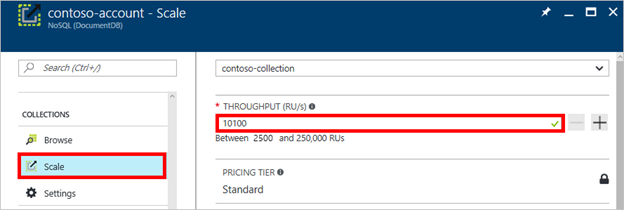
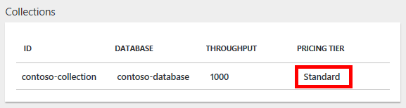

# Retiring the S1, S2, and S3 performance levels

> [!IMPORTANT] 
> The S1, S2, and S3 performance levels discussed in this article are being retired and are no longer available for new DocumentDB API accounts.
>

This article provides an overview of S1, S2, and S3 performance levels, and discusses how the collections that use these performance levels will be migrated to single partition collections on August 1st, 2017. After reading this article, you'll be able to answer the following questions:

- [Why are the S1, S2, and S3 performance levels being retired?](#why-retired)
- [How do single partition collections and partitioned collections compare to the S1, S2, S3 performance levels?](#compare)
- [What do I need to do to ensure uninterrupted access to my data?](#uninterrupted-access)
- [How will my collection change after the migration?](#collection-change)
- [How will my billing change after I’m migrated to single partition collections?](#billing-change)
- [What if I need more than 10 GB of storage?](#more-storage-needed)
- [Can I change between the S1, S2, and S3 performance levels before August 1, 2017?](#change-before)
- [How will I know when my collection has migrated?](#when-migrated)
- [How do I migrate from the S1, S2, S3 performance levels to single partition collections on my own?](#migrate-diy)
- [How am I impacted if I'm an EA customer?](#ea-customer)

<a name="why-retired"></a>

## Why are the S1, S2, and S3 performance levels being retired?

The S1, S2, and S3 performance levels do not offer the flexibility that DocumentDB API collections offers. With the S1, S2, S3 performance levels, both the throughput and storage capacity were pre-set and did not offer elasticity. Azure Cosmos DB now offers the ability to customize your throughput and storage, offering you much more flexibility in your ability to scale as your needs change.

<a name="compare"></a>

## How do single partition collections and partitioned collections compare to the S1, S2, S3 performance levels?

The following table compares the throughput and storage options available in single partition collections, partitioned collections, and S1, S2, S3 performance levels. Here is an example for US East 2 region:

|   |Partitioned collection|Single partition collection|S1|S2|S3|
|---|---|---|---|---|---|
|Maximum throughput|Unlimited|10K RU/s|250 RU/s|1 K RU/s|2.5 K RU/s|
|Minimum throughput|2.5K RU/s|400 RU/s|250 RU/s|1 K RU/s|2.5 K RU/s|
|Maximum storage|Unlimited|10 GB|10 GB|10 GB|10 GB|
|Price|Throughput: $6 / 100 RU/s<br><br>Storage: $0.25/GB|Throughput: $6 / 100 RU/s<br><br>Storage: $0.25/GB|$25 USD|$50 USD|$100 USD|

Are you an EA customer? If so, see [How am I impacted if I'm an EA customer?](#ea-customer)

<a name="uninterrupted-access"></a>

## What do I need to do to ensure uninterrupted access to my data?

Nothing, Cosmos DB handles the migration for you. If you have an S1, S2, or S3 collection, your current collection will be migrated to a single partition collection on July 31, 2017. 

<a name="collection-change"></a>

## How will my collection change after the migration?

If you have an S1 collection, you will be migrated to a single partition collection with 400 RU/s throughput. 400 RU/s is the lowest throughput available with single partition collections. However, the cost for 400 RU/s in the a single partition collection is approximately the same as you were paying with your S1 collection and 250 RU/s – so you are not paying for the extra 150 RU/s available to you.

If you have an S2 collection, you will be migrated to a single partition collection with 1 K RU/s. You will see no change to your throughput level.

If you have an S3 collection, you will be migrated to a single partition collection with 2.5 K RU/s. You will see no change to your throughput level.

In each of these cases, after your collection is migrated, you will be able to customize your throughput level, or scale it up and down as needed to provide low-latency access to your users. To change the throughput level after your collection has migrated, simply open your Cosmos DB account in the Azure portal, click Scale, choose your collection, and then adjust the throughput level, as shown in the following screenshot:



<a name="billing-change"></a>

## How will my billing change after I’m migrated to the single partition collections?

Assuming you have 10 S1 collections, 1 GB of storage for each, in the US East region, and you migrate these 10 S1 collections to 10 single partition collections at 400 RU/sec (the minimum level). Your bill will look as follows if you keep the 10 single partition collections for a full month:


<a name="more-storage-needed"></a>

## What if I need more than 10 GB of storage?

Whether you have a collection with an S1, S2, or S3 performance level, or have a single partition collection, all of which have 10 GB of storage available, you can use the Cosmos DB Data Migration tool to migrate your data to a partitioned collection with virtually unlimited storage. For information about the benefits of a partitioned collection, see [Partitioning and scaling in Azure Cosmos DB](documentdb-partition-data.md). For information about how to migrate your S1, S2, S3, or single partition collection to a partitioned collection, see [Migrating from single-partition to partitioned collections](documentdb-partition-data.md#migrating-from-single-partition). 

<a name="change-before"></a>

## Can I change between the S1, S2, and S3 performance levels before August 1, 2017?

Only existing accounts with S1, S2, and S3 performance will be able to change and alter performance level tiers through the portal or programmatically. By August 1, 2017, the S1, S2, and S3 performance levels will no longer be available. If you change from S1, S3, or S3 to a single partition collection, you cannot return to the S1, S2, or S3 performance levels.

<a name="when-migrated"></a>

## How will I know when my collection has migrated?

The migration will occur on July 31, 2017. If you have a collection that uses the S1, S2 or S3 performance levels, the Cosmos DB team will contact you by email before the migration takes place. Once the migration is complete, on August 1, 2017, the Azure portal will show that your collection uses Standard pricing.



<a name="migrate-diy"></a>

## How do I migrate from the S1, S2, S3 performance levels to single partition collections on my own?

You can migrate from the S1, S2, and S3 performance levels to single partition collections using the Azure portal or programmatically. You can do this on your own before August 1 to benefit from the flexible throughput options available with single partition collections, or we will migrate your collections for you on July 31, 2017.

**To migrate to single partition collections using the Azure portal**

1. In the [**Azure portal**](https://portal.azure.com), click **Azure Cosmos DB**, then select the Cosmos DB account to modify. 
 
    If **Azure Cosmos DB** is not on the Jumpbar, click >, scroll to **Databases**, select **Azure Cosmos DB**, and then select the DocumentDB account.  

2. On the resource menu, under **Containers**, click **Scale**, select the collection to modify from the drop-down list, and then click **Pricing Tier**. Accounts using pre-defined throughput have a pricing tier of S1, S2, or S3.  In the **Choose your pricing tier** blade, click **Standard** to change to user-defined throughput, and then click **Select** to save your change.

    

3. Back in the **Scale** blade, the **Pricing Tier** is changed to **Standard** and the **Throughput (RU/s)** box is displayed with a default value of 400. Set the throughput between 400 and 10,000 [Request units](request-units.md)/second (RU/s). The **Estimated Monthly Bill** at the bottom of the page updates automatically to provide an estimate of the monthly cost. 

    >[!IMPORTANT] 
    > Once you save your changes and move to the Standard pricing tier, you cannot roll back to the S1, S2, or S3 performance levels.

4. Click **Save** to save your changes.

    If you determine that you need more throughput (greater than 10,000 RU/s) or more storage (greater than 10GB) you can create a partitioned collection. To migrate a single partition collection to a partitioned collection, see [Migrating from single-partition to partitioned collections](documentdb-partition-data.md#migrating-from-single-partition).

    > [!NOTE]
    > Changing from S1, S2, or S3 to Standard may take up to 2 minutes.
    > 
    > 

**To migrate to single partition collections using the .NET SDK**

Another option for changing your collections' performance levels is through our SDKs. This section only covers changing a collection's performance level using our [DocumentDB .NET API](documentdb-sdk-dotnet.md), but the process is similar for our other SDKs.

Here is a code snippet for changing the collection throughput to 5,000 request units per second:
    
```C#
    //Fetch the resource to be updated
    Offer offer = client.CreateOfferQuery()
                      .Where(r => r.ResourceLink == collection.SelfLink)    
                      .AsEnumerable()
                      .SingleOrDefault();

    // Set the throughput to 5000 request units per second
    offer = new OfferV2(offer, 5000);

    //Now persist these changes to the database by replacing the original resource
    await client.ReplaceOfferAsync(offer);
```

Visit [MSDN](https://msdn.microsoft.com/library/azure/microsoft.azure.documents.client.documentclient.aspx) to view additional examples and learn more about our offer methods:

* [**ReadOfferAsync**](https://msdn.microsoft.com/library/azure/microsoft.azure.documents.client.documentclient.readofferasync.aspx)
* [**ReadOffersFeedAsync**](https://msdn.microsoft.com/library/azure/microsoft.azure.documents.client.documentclient.readoffersfeedasync.aspx)
* [**ReplaceOfferAsync**](https://msdn.microsoft.com/library/azure/microsoft.azure.documents.client.documentclient.replaceofferasync.aspx)
* [**CreateOfferQuery**](https://msdn.microsoft.com/library/azure/microsoft.azure.documents.linq.documentqueryable.createofferquery.aspx)

<a name="ea-customer"></a>

## How am I impacted if I'm an EA customer?

EA customers will be price protected until the end of their current contract.

## Next steps
To learn more about pricing and managing data with Azure Cosmos DB, explore these resources:

1.	[Partitioning data in Cosmos DB](documentdb-partition-data.md). Understand the difference between single partition container and partitioned containers, as well as tips on implementing a partitioning strategy to scale seamlessly.
2.	[Cosmos DB pricing](https://azure.microsoft.com/pricing/details/cosmos-db/). Learn about the cost of provisioning throughput and consuming storage.
3.	[Request units](request-units.md). Understand the consumption of throughput for different operation types, for example Read, Write, Query.
